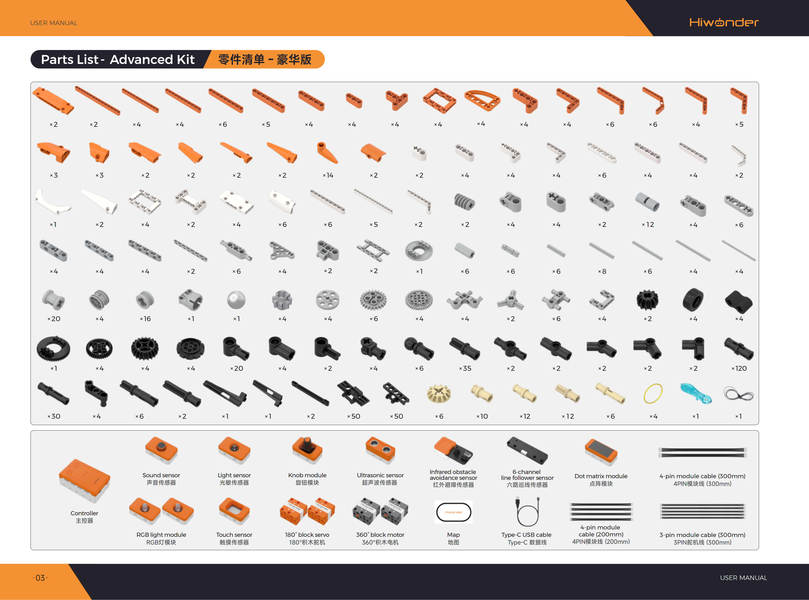

# 1. Kit Introduction

## 1.1 Kit Overview

This kit is specifically designed for elementary students aged 7 to 12. The AiBlock TechPower Advanced Kit features an integrated intelligent controller at its core, accompanied by multiple sensor modules, motorized block motors, block servos, and a comprehensive set of mechanical building blocks. It supports dual learning modes consisting of purely mechanical assembly and intelligent programming.

The kit comes with 48 creative build projects and the WonderLab graphical programming platform. It constructs a systematic learning path step by step, transitioning from mechanical transmission principles to intelligent sensor interactions, and from fundamental programming logic to multi-module coordinated control. The extensive block components allow assembling diverse models, such as hand-cranked fans, bionic robots, mecha warriors, smart vehicles, and amusement rides. These projects cover interdisciplinary fields including mechanical engineering, bionic design, intelligent sensing, and automated control. Through hands-on practice, this kit cultivates spatial thinking, logical reasoning, and engineering innovation abilities, providing a systematic enlightenment in scientific innovation.

## 1.2 Product Features

1. **Tiered Dual Learning Modes**: The kit supports two distinct learning pathways, including non-controller mechanical assembly and controller-based intelligent programming. Beginners can start with hands-on building and progressively advance to coding, which significantly lowers the barrier to entry for STEAM education while catering to both classroom instruction and home practice.

2. **Multi-Functional Integrated Controller**: Equipped with an integrated smart controller featuring 4 block servo and block motor ports, 4 long motor ports, 4 sensor ports, 2 programmable buttons, and an onboard buzzer. Each port zone is clearly labeled, and power output remains stable, enabling precise and straightforward hardware control.

3. **Comprehensive Mechanical Block Accessories**: Packed with an ample supply of transmission and structural building blocks, covering more than ten types of mechanical components such as gear drives, worm gears, crank linkages, rack and pinion mechanisms, fixed pulleys, and track transmissions. Diverse parts support open-ended creative builds while exercising hands-on practical skills and logical thinking.

4. **Dedicated Graphical Programming Software**: The WonderLab drag-and-drop visual programming platform operates simply without complex code, supporting real-time debugging in online mode alongside program uploading. It seamlessly matches course project programs, reducing the entry threshold for coding and fostering computational thinking and logical control skills.

5. **Multi-Sensor Fusion and Interaction**: Equipped with multiple sensor types, including sound, light, touch, knob, infrared obstacle avoidance, ultrasonic, and 6-channel line follower sensors. It supports diverse interactive methods such as sound control, light sensing, touch response, distance measurement, and line tracking, progressing from single-sensor control to multi-sensor coordinated decision-making to establish a comprehensive cognitive framework for intelligent systems.

6. **Multi-Actuator Coordinated Control**: Incorporates multiple output modules, including block motors, servos, RGB lights, dot matrix displays, and buzzers. It supports multi-dimensional feedback such as speed control, angular positioning, color rendering, graphic animations, and sound effects. This synergy achieves simultaneous coordination between mechanical motion and audiovisual effects, enriching model expressiveness and interactive engagement.

## 1.3 Product Specifications

| Item | Specification |
| :--- | :--- |
| Brand | Hiwonder |
| Model | AiBlock TechPower Advanced Kit |
| Programming software | WonderLab Graphical Programming / Hiwonder Python Editor |
| Recommended age | 6+ |
| Electronic modules | Ultrasonic sensor, light sensor, sound sensor, knob module, infrared obstacle avoidance sensor, touch sensor, 6-channel line follower sensor, 180° block servo, 360° block motor, dot matrix module, RGB light module |
| Communication port | USB port |
| Block count | 750+ |
| Material | ABS |
| Weight including packaging | 2.3 kg |
| Package dimensions | 365 × 270 × 120 mm |

## 1.4 Packing List

