# 2. Quick Start

## 2.1 Hardware Preparation

### 2.1.1 Powering On

Toggle the power switch to **ON**. The power indicator on the controller illuminates, indicating that the device has powered on successfully.

### 2.1.2 Charging

1. Ensure that the controller power switch is set to **OFF**. Connect one end of the Type-C cable to the charging port on the controller and connect the other end to the charger.

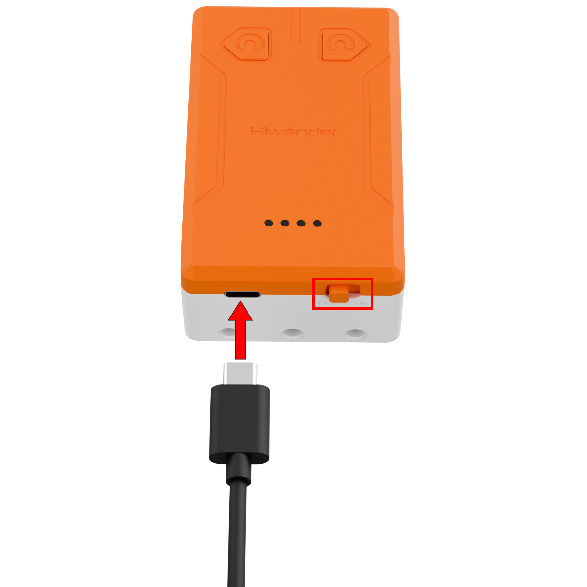

2. The indicator lights on the controller display current charging status during charging. All 4 white indicator lights illuminate steadily once charging is complete. Disconnect the power cable promptly after charging to avoid overcharging.

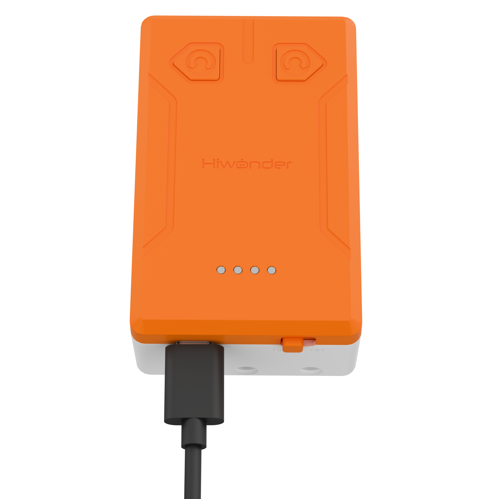

> [!NOTE]
>
> **The power switch must be set to OFF during charging, otherwise the battery may not be fully charged. Disconnect the charger and power cable promptly after charging completes to prevent overcharging from damaging the battery.**

## 2.2 Software Preparation

### 2.2.1 Downloading Graphical Programming Software

[WonderLab Programming Platform Download for Windows](https://k12.hiwonder.com.cn/download/pcSoftware?get_pc=1&os=windows)

### 2.2.2 Installing WonderLab Programming Software

1. Open the **WonderLab setup.exe** software installation package.

2. Select the preferred language, then click **OK** to confirm.

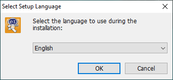

3. Choose the installation destination folder, then click **Next** to continue.

4. Click **Next** to proceed.

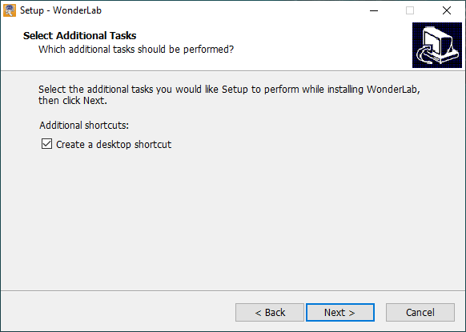

5. Click **Install** to start the installation process.

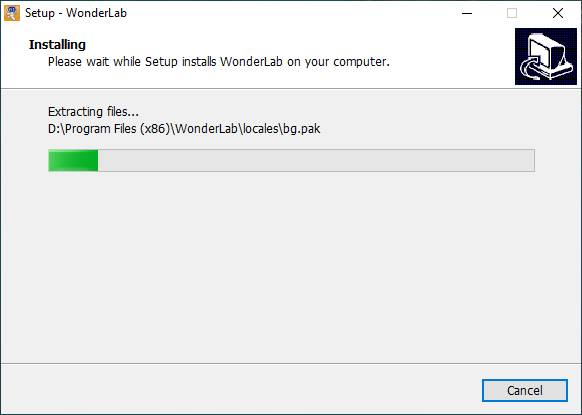

6. Once the installation completes successfully, click **Finish** to exit the setup wizard.

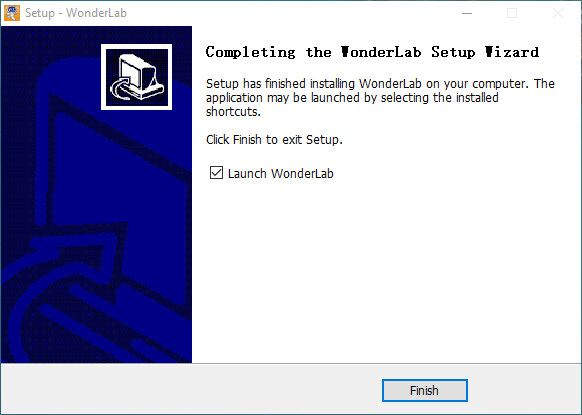

## 2.3 Introductory Projects

### 2.3.1 Buzzer Alarm

#### (1) Learning Objectives

1. **Knowledge Objectives**: Master basic operations in the WonderLab programming platform. Understand the functions and acoustic principles of the buzzer module on the AiBlock controller, including volume, pitch, and beat parameters. Grasp fundamental programming logic involving main loops and button event triggers.

2. **Skill Objectives**: Proficiently create new projects and add controller extensions in the programming software. Independently construct graphical programs for buzzer sound emission and volume adjustment. Master the complete workflow of device connection, program uploading, and debugging.

3. **Literacy Objectives**: Establish programming thinking centered on hardware-software interaction. Understand the mechanism and utility of event triggers. Develop foundational program debugging skills and hands-on practical abilities.

#### (2) Adding Extensions

1. Open the programming software and create a new project.

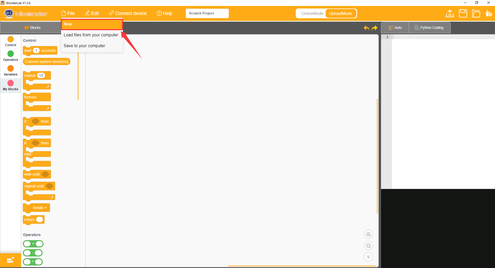

2. Click the Extensions button in the lower-left corner to open the extension library.

3. Select **AI Blocks Board** under the **Controller** category.

#### (3) Core Blocks

| Command Block | Category | Description |
| :---: | :---: | :--- |
|  |  | Acts as the main program loop container, continuously executing nested code after power-on initialization. |
|  |  | Drives the buzzer to play notes with specified pitch and beat in the background without blocking subsequent program execution. |
|  |  | Adjusts buzzer volume within a range of 0 to 100, where higher values produce louder volume. |
|  |  | Functions as an event trigger block that executes nested code when a short press on the specified button is detected. |

#### (4) Program Description and Upload

* Program Description

  After power-on, the main loop runs continuously to play prompt sound effects without interruption. The buttons operate through an event trigger mechanism. Short-pressing the left button or right button adjusts buzzer volume in real time, demonstrating the programming concept of dynamically adjusting output module parameters.

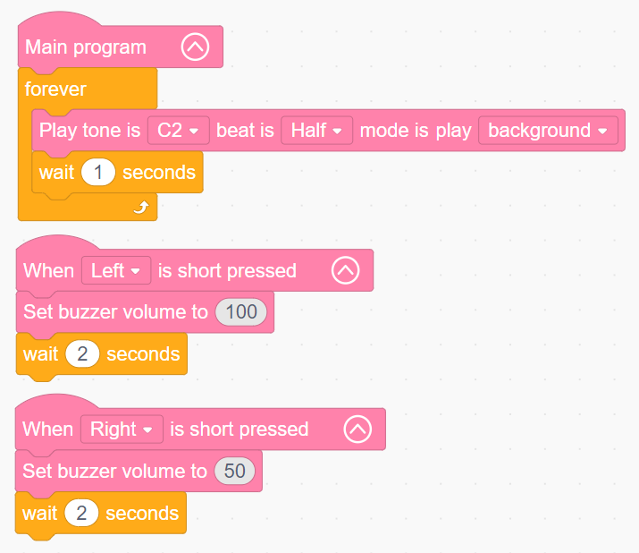

> [!NOTE]
>
> **The source files are available for download under [Program Files](https://drive.google.com/drive/folders/1A5l6AE3r9erZaJWEheTczLZ1lPg7rwGt?usp=sharing).**

* Program Upload

  Click **Connect device**, select the serial port, then click the upload button to upload the program to the controller and test the execution results.

### 2.3.2 Multi-Sensor Power Output Control

#### (1) Learning Objectives

1. **Knowledge Objectives**: Identify four types of input sensors, including ultrasonic, light, sound, and knob sensors, as well as two power modules, including the 360° block motor and 180° block servo. Understand the execution sequence between power-on initialization and the main loop. Master the fundamental logic of sensor value reading, conditional branching, and power actuator driving.

2. **Skill Objectives**: Master hybrid wiring for multi-channel sensors and power modules. Proficiently add multiple module extensions in batches. Construct comprehensive programs that acquire sensor data and control power mechanisms accordingly.

3. **Literacy Objectives**: Establish the robotic control mindset of sensor perception leading to program judgment and actuator motion. Practice multi-hardware collaborative debugging. Develop the habit of step-by-step troubleshooting in complex projects.

#### (2) Wiring Diagram

1. Connect the 360° block motor to the **S1** port of the controller using a 3-pin servo wire.

2. Connect the 180° block servo to the **S2** port of the controller using a 3-pin servo wire.

3. Connect the ultrasonic sensor to the **A** port of the controller using a 4-pin module wire.

4. Connect the light sensor to the **B** port of the controller using a 4-pin module wire.

5. Connect the sound sensor to the **C** port of the controller using a 4-pin module wire.

6. Connect the knob module to the **D** port of the controller using a 4-pin module wire.

#### (3) Adding Extensions

1. Select **Ultrasonic sensor**, **Knob module**, **Light sensor**, and **Sound sensor** under the **Input Module** category.

2. Select **180° servo** and **360° Motor** under the **Motion module** category.

#### (4) Core Blocks

| Command Block | Category | Description |
| :---: | :---: | :--- |
|  |  | Acts as the main program loop container, continuously executing nested code after power-on initialization. |
|  |  | Executes only once upon device startup, used for hardware initialization and parameter configuration. |
|  |  | Reads the rotational position value of the potentiometer knob on the specified port within a range of 0 to 100. The value changes as the knob rotates, frequently used for parameter adjustment. |
|  |  | Reads the sound volume detected by the sound sensor on the specified port within a range of 0 to 100, where louder sounds yield higher values. |
|  |  | Reads the light intensity value of the light sensor on the specified port within a range of 0 to 100, where brighter environments yield higher values. |
|  |  | Initializes the connection port for the ultrasonic sensor. |
| 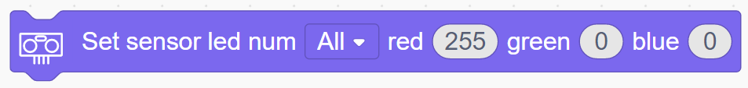 |  | Sets the color of onboard RGB lights on the ultrasonic sensor, with options for specific lights or all lights. |
|  |  | Turns off the onboard RGB lights on the ultrasonic sensor. |
|  |  | Controls the 360° block motor on the specified port to run continuously at a custom speed in the forward or reverse direction. |
|  |  | Controls the 180° block servo on the specified port to rotate at a custom speed for a specified duration. In non-delayed mode, the program continues executing subsequent blocks immediately without waiting for rotation to finish. |
|  |  | Cuts off power to the 180° block servo on the specified port, stopping rotation immediately. |

#### (5) Program Description and Upload

* Program Description

  Upon startup, the device initializes the ultrasonic sensor port to **A** and resets the **S2** servo to 0°, then continuously checks sensor data in the main loop. When the light sensor analog reading is less than 70, indicating dim lighting, the ultrasonic RGB lights glow blue and the **S1** motor rotates forward at a speed dictated by the real-time knob value. When ambient lighting is sufficient, the program evaluates the sound volume. If the volume exceeds 30, the RGB lights turn green and the servo alternates between 0° and 180°, pausing for 2 s at each position. When lighting is sufficient and sound volume is low, the ultrasonic RGB lights turn off and the servo stops rotating. By integrating light, sound, and knob signals, the program controls lighting, motors, and servos through conditional branches, fully demonstrating the robotic control logic of environment perception driving mechanical actuators.

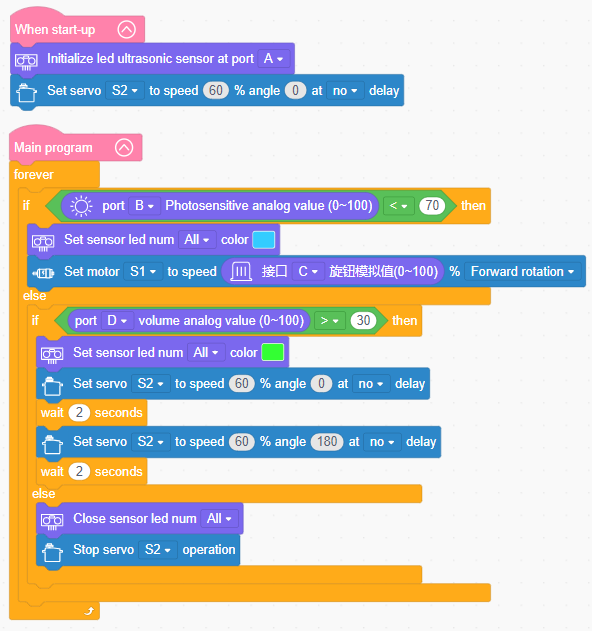

> [!NOTE]
>
> **The source files are available for download under [Program Files](https://drive.google.com/drive/folders/1A5l6AE3r9erZaJWEheTczLZ1lPg7rwGt?usp=sharing).**

* Program Upload

  Click **Connect device**, select the serial port, then click the upload button to upload the program to the controller and test the execution results.

### 2.3.3 Button-Controlled Dot Matrix and RGB Lights

#### (1) Learning Objectives

1. **Knowledge Objectives**: Understand the display principles of the dot matrix module and RGB light module. Master button electrical level detection logic and understand conditional branching program structures. Distinguish the usage among on-screen text display, light illumination, and light extinction blocks.

2. **Skill Objectives**: Master text display and scrolling configurations on the dot matrix screen. Build interactive lighting and display programs utilizing button states. Proficiently debug simultaneous operation across two output modules.

3. **Literacy Objectives**: Understand human-robot interaction design concepts. Present device status using display screens. Cultivate aesthetic awareness when creating audiovisual effects.

#### (2) Wiring Diagram

1. Connect the dot matrix module to the **A** port of the controller using a 4-pin module wire.

2. Connect the RGB light module to the **B** port of the controller using a 4-pin module wire.

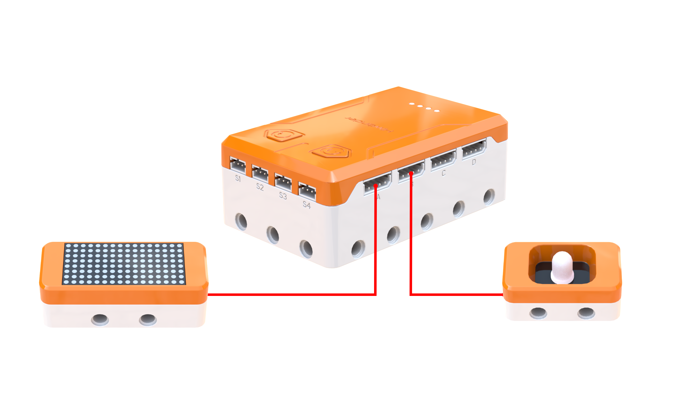

#### (3) Adding Extensions

Select **Dot matrix module** and **RGB module** under the **Output module** category.

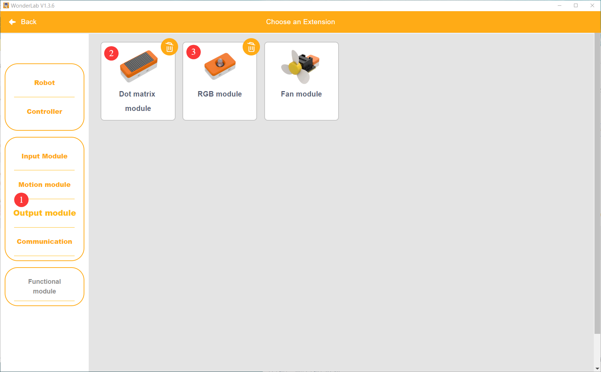

#### (4) Core Blocks

| Command Block | Category | Description |
| :---: | :---: | :--- |
|  |  | Acts as the main program loop container, continuously executing nested code after power-on initialization. |
|  |  | Detects the real-time electrical level of the specified button and returns a boolean value to determine whether the button is pressed. |
|  |  | Outputs specified text on the dot matrix display of the specified port starting from coordinates (x, y), supporting static or scrolling mode to refresh screen content. |
|  |  | Controls the RGB light module on the specified port to illuminate using preset colors. |
|  |  | Extinguishes the RGB light module on the specified port, cutting off light output. |

#### (5) Program Description and Upload

* Program Description

  The program continuously scans button states, refreshing detection every 0.1 s. When the left button is pressed, the dot matrix screen scrolls the text Hello starting at coordinates (0, 0). If the left button is not pressed, the program checks the right button. When the right button is pressed, the RGB module illuminates red for 3 s and then turns off automatically. When no button is pressed, the audiovisual modules maintain their prior states. This program utilizes buttons to achieve human-robot interaction, combining matrix text display, RGB color control, and delay blocks to demonstrate the fundamental logic of input signals triggering audiovisual outputs.

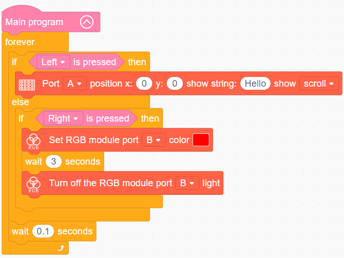

> [!NOTE]
>
> **The source files are available for download under [Program Files](https://drive.google.com/drive/folders/1A5l6AE3r9erZaJWEheTczLZ1lPg7rwGt?usp=sharing).**

* Program Upload

  Click **Connect device**, select the serial port, then click the upload button to upload the program to the controller and test the execution results.

### 2.3.4 Multi-Channel Sensor Comprehensive Detection

#### (1) Learning Objectives

1. **Knowledge Objectives**: Master the detection principles of touch sensors, 6-channel line follower sensors, and infrared obstacle avoidance sensors. Familiarize with state-reading methods for boolean sensors. Learn serial debugging information output methods.

2. **Skill Objectives**: Master simultaneous operation across multi-channel digital sensors. Construct data acquisition programs for line tracking, obstacle avoidance, and touch signals. Monitor real-time sensor states via the serial port and use the buzzer for status notifications.

3. **Literacy Objectives**: Grasp the basic architecture of robotic sensing systems. Distinguish between line tracking and obstacle detection application scenarios. Develop the habit of using serial debugging to troubleshoot sensor issues.

#### (2) Wiring Diagram

1. Connect the touch sensor to the **A** port of the controller using a 4-pin module wire.

2. Connect the 6-channel line follower sensor to the **B** port of the controller using a 4-pin module wire.

3. Connect the infrared obstacle avoidance sensor to the **C** port of the controller using a 4-pin module wire.

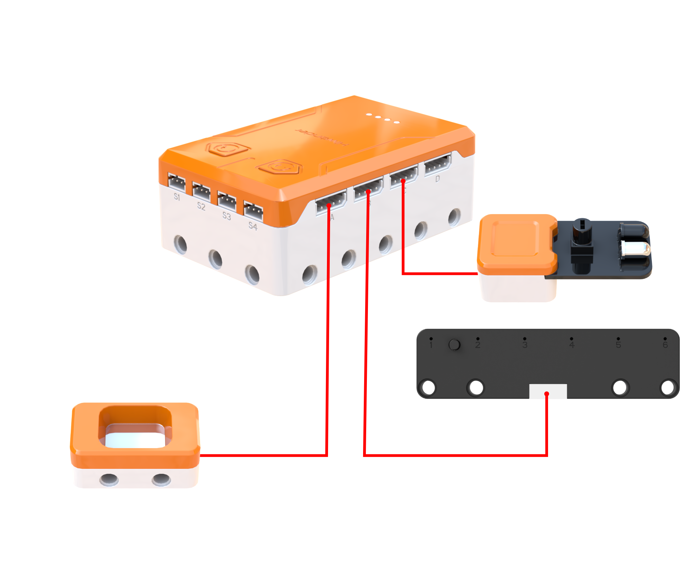

#### (3) Adding Extensions

Select **6 Line follow sensor**, **Avoid obstacle sensor**, and **Touch sensor** under the **Input Module** category.

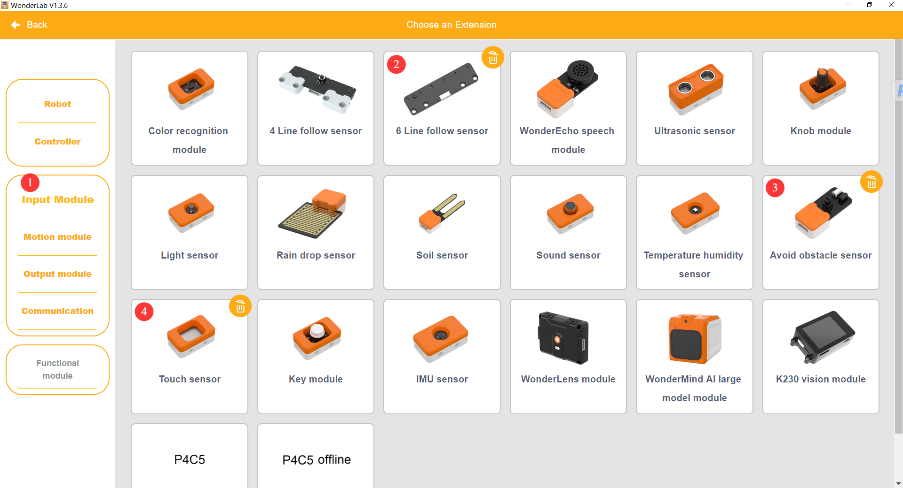

#### (4) Core Blocks

| Command Block | Category | Description |
| :---: | :---: | :--- |
|  |  | Acts as the main program loop container, continuously executing nested code after power-on initialization. |
|  |  | Executes only once upon device startup, used for hardware initialization and parameter configuration. |
| 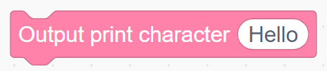 |  | Prints custom text strings to the computer through the serial port for debugging and information monitoring. |
|  |  | Drives the buzzer to play notes with specified pitch and beat in the background without blocking subsequent program execution. |
|  |  | Stops buzzer sound immediately, terminating current audio playback. |
|  |  | Initializes the connection port for the 6-channel line follower sensor. |
|  |  | Reads detection states across the six channels of the 6-channel line follower sensor, returning a boolean value to determine whether each channel detects a black line or a white background for line-tracking logic. |
|  |  | Reads the state of the touch sensor on the specified port, returning a boolean value to determine whether human touch is detected. |
|  |  | Reads the state of the infrared obstacle avoidance sensor on the specified port, returning a boolean value to determine whether an obstacle is detected ahead. |

#### (5) Program Description and Upload

* Program Description

  Upon power-up, the device initializes the connection port of the 6-channel line follower sensor to port **B**. The main loop samples sensor signals every 0.1 s. When the touch sensor is touched and the infrared obstacle avoidance sensor simultaneously detects an obstacle, the serial port outputs the string Hello. When this dual condition is not met, the program evaluates the line follower sensor state. If a black line is detected, the buzzer plays a designated tone in the background. If no black line is detected, the buzzer is silenced. By employing nested conditional logic, this program integrates touch, infrared obstacle avoidance, and line follower sensors alongside serial printing and buzzer feedback to realize coordinated multi-sensor decision-making, serving as a foundational perception program for obstacle avoidance and line-tracking robots.

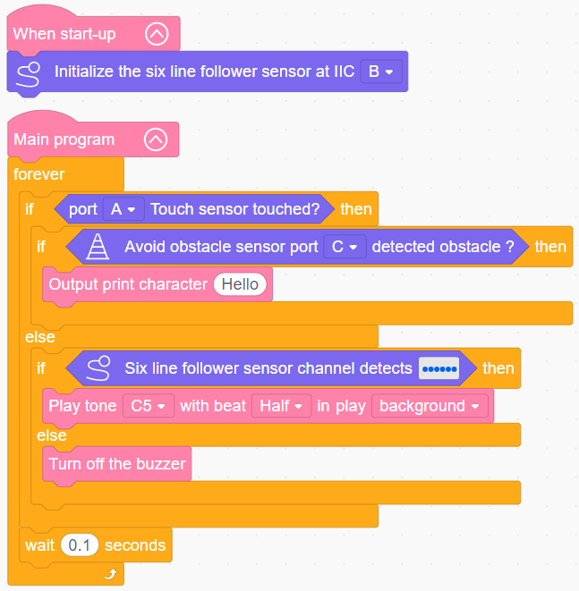

> [!NOTE]
>
> **The source files are available for download under [Program Files](https://drive.google.com/drive/folders/1A5l6AE3r9erZaJWEheTczLZ1lPg7rwGt?usp=sharing).**

* Program Upload

  Click **Connect device**, select the serial port, then click the upload button to upload the program to the controller and test the execution results.

