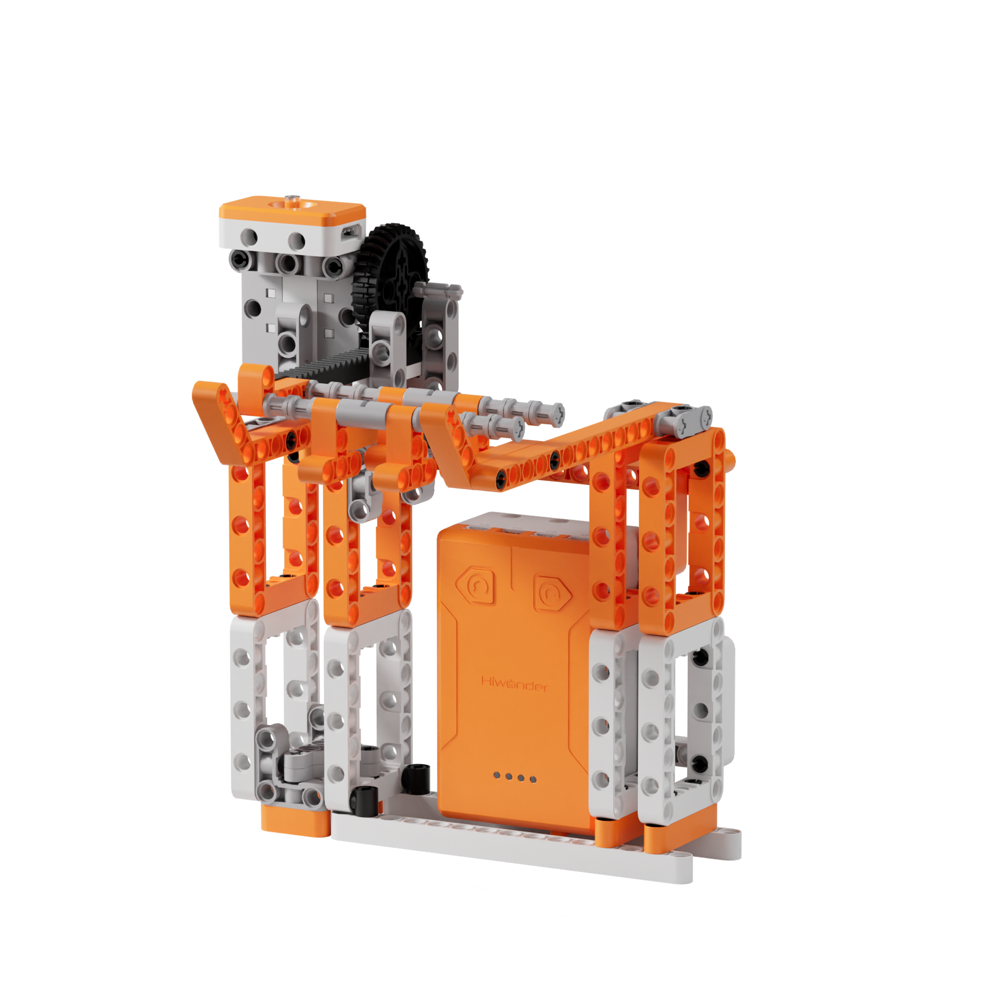
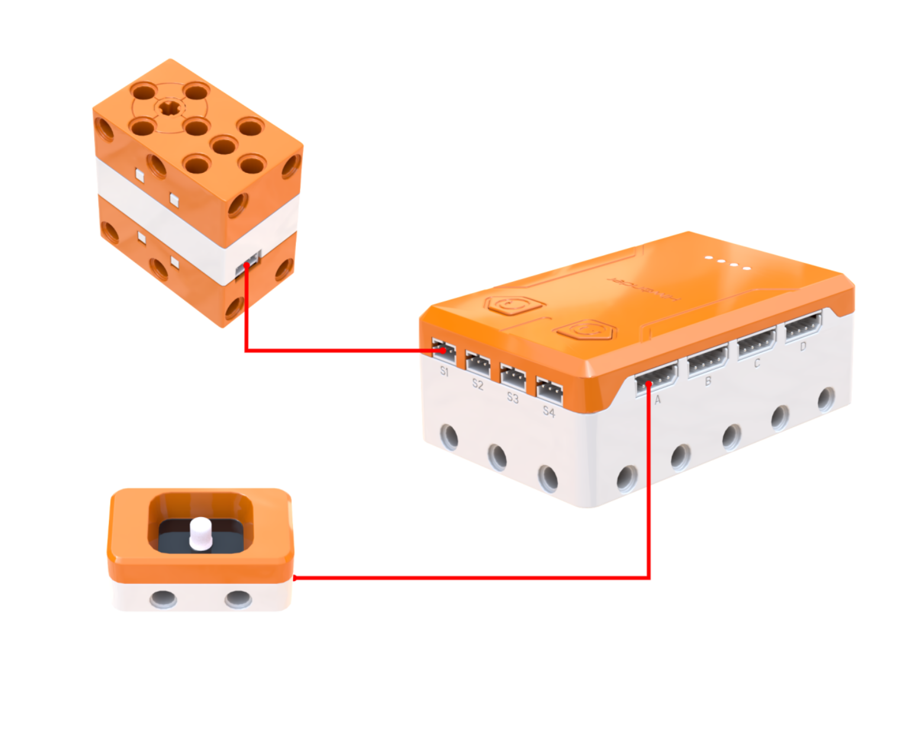
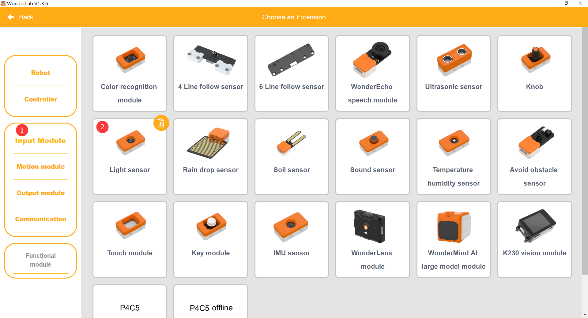
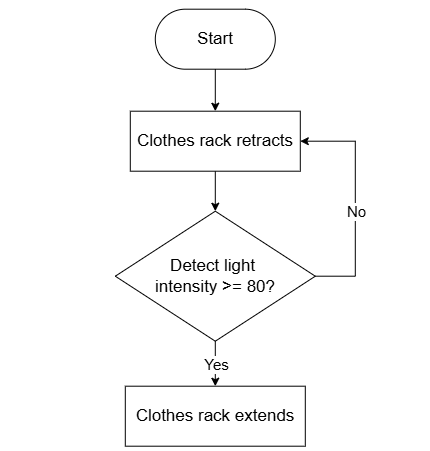
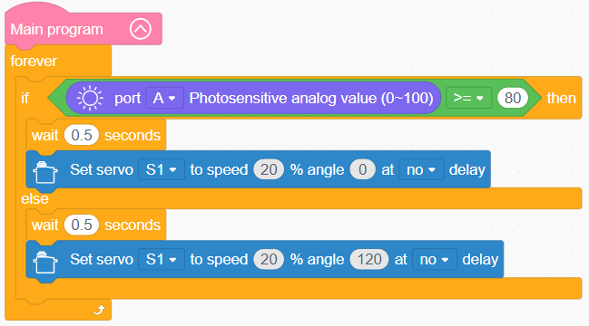

# 3.13 Smart Clothes Rack

## 3.13.1 Lesson Introduction

Taking inspiration from modern smart home environments, this lesson guides the assembly of a light-responsive automated clothes rack. The lesson explains the operating principles of the light sensor along with threshold evaluation logic, introduces sensor-driven programming patterns, and coordinates servo angles to extend the rack in bright sunlight and retract it when ambient light dims. This lesson establishes an introduction to sensory hardware, masters the sense-think-act intelligent control loop, and builds a conceptual foundation for advanced sensor-driven automation.

## 3.13.2 Learning Objectives

1. **Knowledge Objectives**: Understand the operating principles of the light sensor and the meaning of light intensity values ranging from 0 to 100. Master the correlation between ambient brightness and rack extension or retraction. Comprehend threshold evaluation and software debouncing delays. Consolidate servo angle positioning and conditional branching logic.

2. **Skill Objectives**: Assemble the clothes rack and gear-rack linear extension mechanism independently. Add the light sensor extension library. Program threshold-based automated control routines. Master delay debouncing and threshold calibration techniques.

3. **Thinking Objectives**: Build an intelligent sense-think-act engineering logic. Develop engineering thinking centered on threshold calibration. Understand anti-interference and system stability design. Strengthen algorithmic decision-making skills.

4. **Application Objectives**: Connect concepts to automated streetlights, smartphone auto-brightness adjustments, and smart window curtains. Recognize the practical value of light sensors across smart home and smart city systems. Stimulate interest in intelligent perception technologies.

## 3.13.3 Preparation

### (1) Hardware Preparation

- AiBlock controller

- 180° block servo

- Light sensor

- Building block parts pack

- Type-C data cable

- Assembly manual

- Computer

### (2) Software Preparation

- WonderLab Graphical Programming Platform

## 3.13.4 Hands-On Project

### (1) Project Analysis

The core project of this lesson is the light-responsive automated clothes rack, designed to extend under direct sunlight and retract under overcast conditions. The system operates on a sense-think-act loop: the sensor measures ambient brightness, the software evaluates readings against a defined threshold to distinguish light from dark, and the actuator extends the rack when bright and retracts it when dim. Mechanically, a rack-and-pinion gear mechanism converts rotational servo motion into smooth linear travel. In the program, a debouncing delay prevents erratic jitter caused by passing cloud shadows, while setting the threshold to 80 ensures extension occurs only under genuine sunlight. This project illustrates a complete closed-loop automated architecture, highlighting the coordination among sensing, logic evaluation, and mechanical actuation.

### (2) Assembly Guide

<Pdf src="../../_static/shared/pdf/chapter_3/13.pdf" />

### (3) Hardware Wiring

- Connect the 180° block servo to port **S1** of the controller using a 3-pin servo cable.

- Connect the light sensor to port **A** of the controller using a 4-pin module cable.

### (4) Adding Extensions

- Select **Light sensor** under the **Input Module** category.

- Select **180° servo** under the **Motion module** category.

### (5) Core Blocks

| Block | Category | Description |
| :---: | :---: | :--- |
|  |  | Compares two values and returns a true or false result |
|  |  | Controls the designated servo to rotate to a target angle at a specified speed |
|  |  | Reads the light intensity value from the light sensor on the designated port, with a range of 0 to 100 |

### (6) Program Description and Upload

- Program Schematic

- Complete Program

  Upon entering the main program after power-on, an infinite loop begins to continuously read the light intensity from port A. If the light reading is greater than or equal to 80, the system waits for 0.5 s and directs servo S1 to rotate to 0° at 20% speed without delay. If the light reading is less than 80, the system waits for 0.5 s and directs servo S1 to rotate to 120° at 20% speed without delay. This monitoring and actuation process repeats continuously.

- Program Upload

  Following the animation, click **Connect device**, select the serial port, then click the upload button to upload the program to the controller and test the execution results.

> [!NOTE]
>
> **The source files are available for download under [Program Files](https://drive.google.com/drive/folders/1xyD_-3msc3KcaGQHLqkcPOZNSNXFIirT?usp=sharing).**

## 3.13.5 Expansion and Challenge

**Project 1: Dual-Threshold Hysteresis Clothes Rack**

Optimize the control logic by implementing two distinct thresholds: extend the rack only when light intensity rises above 80, and retract it only when light intensity drops below 30, maintaining the existing mechanical state in the intermediate zone. This hysteresis control scheme provides superior stability compared to single-threshold systems, eliminating erratic toggling near critical cutoff values. Practice dual-threshold evaluation and state-holding logic to learn widely utilized engineering hysteresis principles.

**Project 2: Dual Sound-and-Light Smart Clothes Rack**

Incorporate a sound sensor to create a dual-mode clothes rack that toggles between manual and automated operation via clapping sounds. In automatic mode, ambient brightness dictates rack extension. In manual mode, button presses control extension and retraction directly, using a variable to record the active mode. Practice integrating multiple sensors with mode-switching routines to develop a comprehensive smart home appliance.

## 3.13.6 Q&A

**Question 1: What does a threshold signify, and why is the light threshold adjusted from 50 to 80?**

Answer: A threshold functions as a boundary value or dividing line, categorizing incoming data into distinct states based on whether values fall above or below the set limit. The light sensor outputs a continuous numerical range from 0 to 100, necessitating a numerical standard to distinguish brightness from darkness. A threshold of 50 implies that any ambient lighting exceeding half maximum brightness is classified as bright. This standard is relatively low, as standard indoor ambient illumination often exceeds 50, causing the clothes rack to extend indoors unexpectedly. Raising the threshold to 80 ensures that only intense illumination, such as direct sunlight, triggers extension, while overcast skies and indoor lights leave the rack retracted, aligning with authentic outdoor drying conditions. Threshold values are tuned based on specific operational environments through parameter calibration, which forms a vital phase of engineering development.

**Question 2: Why does the optimized program incorporate a 0.5 s delay before actuation rather than triggering immediately?**

Answer: Immediate triggering responds rapidly but suffers from high vulnerability to false positives. Environmental lighting fluctuates constantly due to transient disturbances such as pedestrians passing by, floating clouds, or swaying tree foliage outside a window. Without a debounce delay, momentary light dips cause the rack to extend and retract erratically, generating noise, consuming surplus power, and shortening servo lifespan. Incorporating a 0.5 s delay introduces software confirmation: if lighting changes temporarily and recovers within 0.5 s, the rack remains stationary. Only sustained illumination shifts lasting longer than 0.5 s initiate physical motion. This delay confirmation technique, known as debouncing or filter delay, represents an indispensable practice in sensor programming to maintain system stability.

## 3.13.7 Technical Support and Product Discussion

To share creative ideas and projects after exploring this kit, visit the [Hiwonder Community](http://forum.hiwonder.com): forum.hiwonder.com

