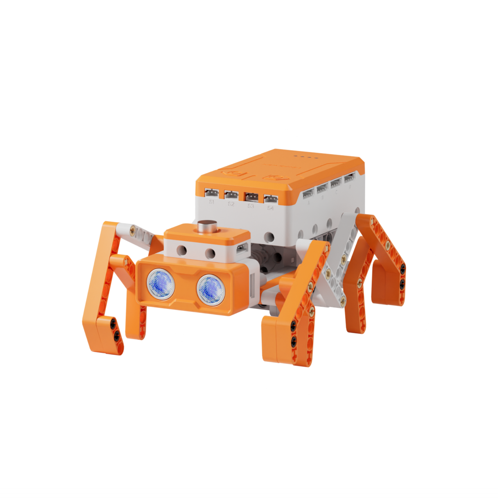
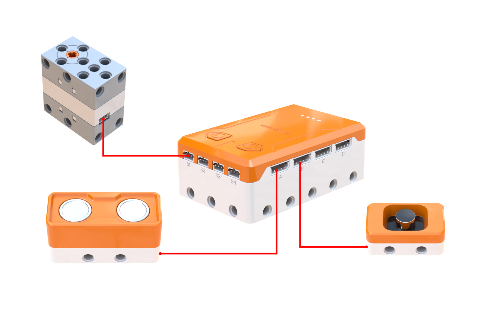
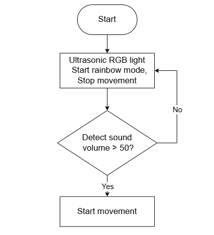
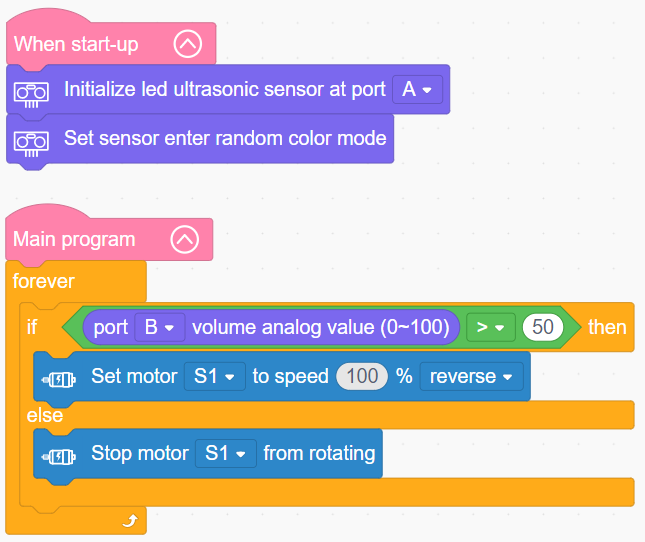

# 3.14 Sonic Spider

## 3.14.1 Lesson Introduction

Taking inspiration from bio-inspired robotics, this lesson guides the assembly of a sound-controlled, eight-legged crawling Sonic Spider. The lesson explores the operating principles of sound sensors and the acquisition of analog volume values, introduces acoustic trigger programming patterns, and examines eight-legged alternating gait mechanics driven by worm gear transmissions. This lesson consolidates sound sensor applications with multi-legged biomimetic robotics, develops interactive thinking that treats sound as an actuation signal, and builds a strong foundation for multi-sensor interactive robots.

## 3.14.2 Learning Objectives

1. **Knowledge Objectives**: Understand sound sensor operation and analog volume readings. Master sound-activated motor start-stop control. Comprehend eight-legged alternating gait mechanics and center-of-gravity balance. Learn worm gear transmission principles. Consolidate conditional branching and loop structures.

2. **Skill Objectives**: Assemble the eight-legged linkage structure and worm gear mechanism independently. Add sensor extension libraries in software. Program sound-activated start and stop routines. Master sensor calibration and multi-actuator coordination techniques.

3. **Thinking Objectives**: Establish interactive control thinking using acoustic signals. Cultivate engineering awareness of biomimicry and center-of-gravity stability. Strengthen multi-sensor cooperative logic.

4. **Application Objectives**: Connect concepts to sound-activated lights, voice assistants, and disaster relief search-and-rescue robots. Recognize the technological value of acoustic control and multi-legged mobility. Stimulate enthusiasm for bio-inspired robotics and human-robot interaction.

## 3.14.3 Preparation

### (1) Hardware Preparation

- AiBlock controller

- 360° block motor

- Sound sensor

- Ultrasonic sensor

- Building block parts pack

- Type-C data cable

- Assembly manual

- Computer

### (2) Software Preparation

- WonderLab Graphical Programming Platform

## 3.14.4 Hands-On Project

### (1) Project Analysis

The core project of this lesson is the acoustic Sonic Spider, which crawls forward when sound is detected and halts when the environment is quiet, complemented by dynamic RGB lighting. Mechanically, the motor transmits power through a worm gear set to achieve gear reduction and torque multiplication, after which a crankshaft linkage converts rotary motion into alternating strides across eight legs, ensuring multiple points of ground support and continuous stability. Functionally, the sound sensor detects ambient volume: readings exceeding the threshold activate the motor, while lower readings stop it. The ultrasonic sensor drives RGB lighting effects. The program uses a continuous loop with conditional evaluation to sample volume levels in real time and dictate start-stop behavior, forming the standard architecture for sound-activated projects.

### (2) Assembly Guide

<Pdf src="../../_static/shared/pdf/chapter_3/14.pdf" />

### (3) Hardware Wiring

- Connect the 360° block motor to port **S1** of the controller using a 3-pin servo cable.

- Connect the ultrasonic sensor to port **A** of the controller using a 4-pin module cable.

- Connect the sound sensor to port **B** of the controller using a 4-pin module cable.

### (4) Adding Extensions

- Select **Ultrasonic sensor** and **Sound sensor** under the **Input Module** category.

- Select **360° Motor** under the **Motion module** category.

### (5) Core Blocks

| Block | Category | Description |
| :---: | :---: | :--- |
|  |  | Compares two values and returns a true or false result |
|  |  | Sets the operating speed and rotation direction of the designated motor |
|  |  | Stops the motor connected to the selected port |
|  |  | Switches the onboard RGB lights of the ultrasonic sensor to dazzling color mode |
|  |  | Reads the analog sound level from the sound sensor on the selected port, with a range of 0 to 100 |

### (6) Program Description and Upload

- Program Schematic

- Complete Program

  1. Upon power-on, the program initializes the ultrasonic sensor on port A and configures its RGB lights to dazzling color mode.

  2. The main program enters a continuous loop to monitor the analog sound level on port B:
     - When the sound level exceeds 50, motor S1 engages in reverse rotation at 100% speed.
     
     - When the sound level is less than or equal to 50, motor S1 stops rotating.

- Program Upload

  Following the animation, click **Connect device**, select the serial port, then click the upload button to upload the program to the controller and test the execution results.

> [!NOTE]
>
> **The source files are available for download under [Program Files](https://drive.google.com/drive/folders/1xyD_-3msc3KcaGQHLqkcPOZNSNXFIirT?usp=sharing).**

## 3.14.5 Expansion and Challenge

**Project 1: Double-Clap Activated Sonic Spider**

Implement a dual-clap trigger sequence where the spider starts crawling only after detecting two claps. Utilize a variable to count acoustic spikes, treating each detected sound pulse above the threshold as one clap. Upon registering two claps, start forward locomotion for 3 s before halting automatically. Practice event counting and noise immunity logic to prevent accidental triggering and enrich interaction.

**Project 2: Dual Sound-and-Ultrasonic Obstacle-Avoidance Spider**

Integrate distance sensing using the ultrasonic sensor. Once activated by sound, the spider navigates forward until encountering an obstacle, whereupon it automatically stops, reverses, redirects, and continues crawling forward. Combine acoustic activation with autonomous obstacle navigation to practice multi-sensor coordination and construct an intelligent bio-inspired robot.

## 3.14.6 Q&A

**Question 1: How does the sound sensor work, and what do the analog volume values from 0 to 100 represent?**

Answer: The sound sensor contains a miniature onboard microphone that converts acoustic pressure vibrations in the air into electrical signals. Higher volume produces stronger acoustic vibrations, generating higher voltage signals that the controller reads as greater numerical values. The analog volume scale spans from 0 to 100, where 0 represents silence, 100 represents the peak volume measurable by the sensor, and intermediate values correspond to varying noise intensities. As an analog sensor, it outputs a continuously variable range rather than a binary sound/quiet flag. In the software, defining a threshold, such as 50, treats readings above this value as detected sound to trigger the motor, while readings below indicate silence to halt motion, transforming continuous audio data into start-stop commands.

**Question 2: How does the Sonic Spider maintain crawling stability, and what is the engineering principle behind eight-legged locomotion?**

Answer: The fundamental principle centers on **grouped alternating strides and center-of-gravity balance**. The eight legs are grouped into two pairs of four legs on each side, ensuring that one set of legs on both the left and right sides maintains contact with the ground at all times. Rather than lifting or stepping simultaneously, the legs advance in alternating groups. At every point in the gait cycle, a sufficient number of legs remain planted so that the center of gravity stays securely within the polygonal support base formed by the ground-contact feet, preventing tipping. A crankshaft linkage mechanism converts the rotary motion of the motor into oscillating leg strokes, allowing a single driveshaft to coordinate all eight legs in sync. Compared to bipedal or quadrupedal configurations, an eight-legged architecture provides more support points, superior stability, and enhanced terrain adaptability, explaining why search-and-rescue and exploration robots frequently employ six- or eight-legged biomimetic designs.

## 3.14.7 Technical Support and Product Discussion

To share creative ideas and projects after exploring this kit, visit the [Hiwonder Community](http://forum.hiwonder.com): forum.hiwonder.com

