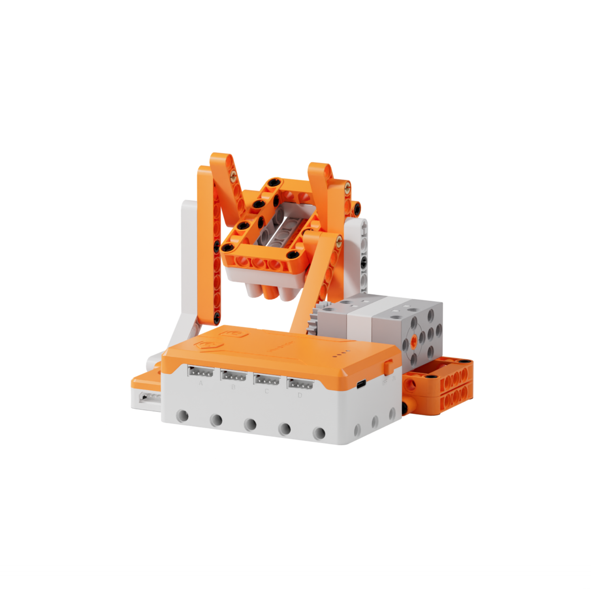
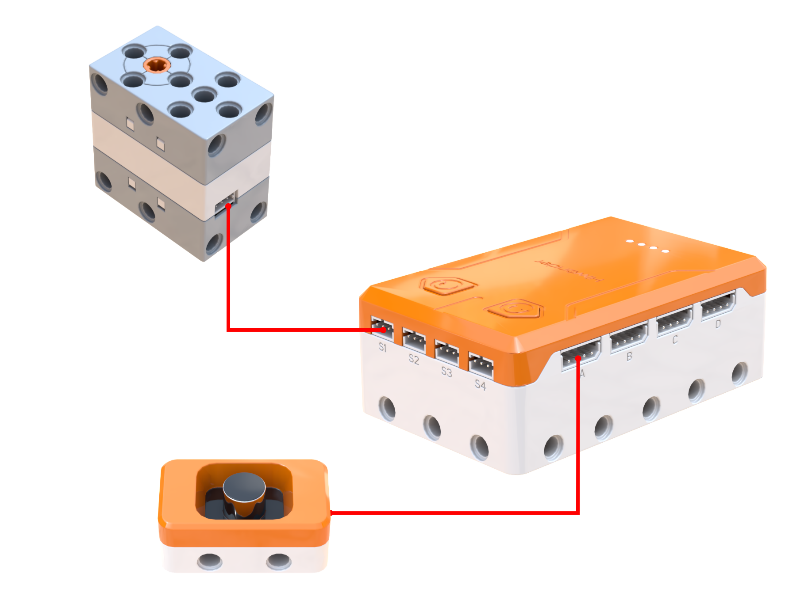
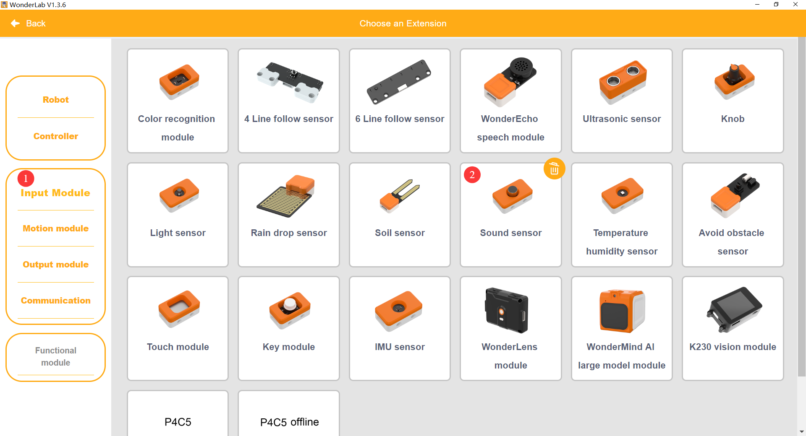
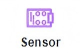
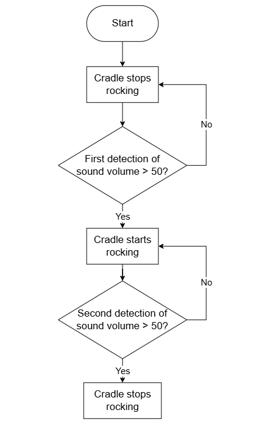
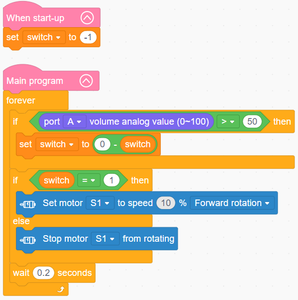

# 3.17 Sound-Activated Cradle

## 3.17.1 Lesson Introduction

Taking inspiration from an infant soothing cradle, this lesson guides the assembly of a sound-activated automated rocking mechanism. The lesson explores sequential, loop, and conditional branching program structures, teaches speed and directional control for the 360° block motor, and explains analog volume acquisition principles using the sound sensor. It accomplishes baseline homing and automated rocking when high volume is detected. This lesson combines sensory hardware with motor actuators, establishes closed-loop sensor-driven logic, and consolidates structured programming for multi-sensor intelligent devices.

## 3.17.2 Learning Objectives

1. **Knowledge Objectives**: Distinguish among sequential, loop, and conditional branching program structures. Master forward rotation, reverse rotation, braking, and speed regulation of the 360° block motor. Understand analog sound sensor volume acquisition principles. Grasp numeric comparison operations for acoustic data.

2. **Skill Objectives**: Wire the 360° block motor and sound sensor accurately. Complete cradle assembly and mechanical travel limit calibration. Program reciprocal rocking motor loops. Read and evaluate analog volume values proficiently.

3. **Thinking Objectives**: Develop structured programming logic by integrating multiple control structures. Establish a closed-loop engineering perspective of acoustic sensing, logic evaluation, and motor actuation. Cultivate engineering habits of volume threshold calibration and motor speed parameter tuning.

4. **Application Objectives**: Connect concepts to acoustic fans, sound-responsive toys, and acoustic start-stop transport carts. Understand practical applications of acoustic sensing. Encourage the independent conceptualization of multi-tiered soothing devices.

## 3.17.3 Preparation

### (1) Hardware Preparation

- AiBlock controller

- 360° block motor

- Sound sensor

- Building block parts pack

- Type-C data cable

- Assembly manual

- Computer

### (2) Software Preparation

- WonderLab Graphical Programming Platform

## 3.17.4 Hands-On Project

### (1) Project Analysis

The core project of this lesson is the Sound-Activated Cradle, designed to rock reciprocally upon detecting loud noises and remain stationary during quiet conditions. The sound sensor functions at the perception layer to sample ambient noise levels in real time. The 360° block motor, paired with a linkage transmission, drives the cradle back and forth at the actuation layer. The program utilizes a nested loop and conditional branching architecture: a continuous loop samples volume readings, while conditional branches verify whether volume levels exceed 60 to engage the motor for rocking, shutting the motor down when volume levels remain below the threshold.

### (2) Assembly Guide

<Pdf src="../../_static/shared/pdf/chapter_3/17.pdf" />

### (3) Hardware Wiring

- Connect the 360° block motor to port **S1** of the controller using a 3-pin servo cable.

- Connect the sound sensor to port **A** of the controller using a 4-pin module cable.

### (4) Adding Extensions

- Select **Sound sensor** under the **Input Module** category.

- Select **360° Motor** under the **Motion module** category.

### (5) Core Blocks

| Block | Category | Description |
| :---: | :---: | :--- |
|  |  | Compares two values and outputs a boolean true or false result |
|  |  | Sets the operating speed and rotation direction of the designated motor |
|  |  | Stops the motor connected to the selected port |
|  |  | Controls the designated servo to rotate to a target angle at a specified speed |
|  |  | Reads the analog volume value from the sound sensor on the selected port, with a range of 0 to 100 |

### (6) Program Description and Upload

- Program Schematic

- Complete Program

  1. Upon power-on initialization, the variable switch is set to -1.

  2. The main program enters an infinite loop to continuously read the analog volume value from port A. When the detected value exceeds 50, indicating sound has been detected, an arithmetic negation calculation toggles the numerical value of the switch variable. The program then evaluates the variable value: when switch equals 1, motor S1 rotates forward at a low speed of 10%. Otherwise, the motor stops rotating. A delay of 0.2 s at the conclusion of each loop iteration provides a toggle mechanism where detecting sound once starts the motor, and detecting sound again turns the motor off.

- Program Upload

  Following the animation, click **Connect device**, select the serial port, then click the upload button to upload the program to the controller and test the execution results.

> [!NOTE]
>
> **The source files are available for download under [Program Files](https://drive.google.com/drive/folders/1KQ-KBn3OmxCo6xKJkb7ZQZAuPW9brr5t?usp=sharing).**

## 3.17.5 Expansion and Challenge

**Project 1: Multi-Tiered Sound-Activated Cradle**

Design a three-tiered acoustic response system: keep the 360° block motor stopped during quiet conditions with volume less than or equal to 30, rock at low speed during moderate volume levels between 30 and 60, and accelerate rocking while transitioning RGB light gradients when volume exceeds 60. Use multi-branch conditionals to increase rocking vigor proportionally with ambient volume, practicing coordinated calibration between branch logic and motor speed settings.

**Project 2: Audio-Visual Melodic Soothing Cradle**

Incorporate a buzzer and RGB light module: when high volume levels are detected, the 360° block motor rocks the cradle while playing a gentle lullaby and cycling soft light gradients. Once ambient noise subsides into the quiet range, the motor halts, the lights extinguish, and musical playback pauses. Practice coordinating multiple actuators, including motors, lights, and buzzers, to understand how a single acoustic trigger drives multi-device cooperation.

## 3.17.6 Q&A

**Question 1: What sensor is used to detect infant crying, and how does it sample volume levels?**

Answer: The sound sensor measures ambient acoustic volume. Its onboard microphone captures acoustic wave vibrations and converts pressure signals into corresponding numerical values ranging from 0 to 100. Higher environmental volume produces greater numerical outputs, while quiet environments yield lower values. The sensor operates independently of ambient light conditions and is widely utilized in sound-activated toys, acoustic switches, and environmental monitors, with software thresholds adaptable to diverse settings.

**Question 2: What are the three fundamental programming structures, and how do they function?**

Answer: Programs are constructed from three fundamental structures that combine to generate complex computational behavior: 1. **Sequential Structure**: Instructions execute sequentially from top to bottom, exemplified by the single rocking cycle where the 360° block motor rotates forward, pauses, rotates in reverse, and pauses again. 2. **Loop Structure**: Code blocks repeat continuously, represented by the outer infinite loop that continuously samples volume and cycles rocking motions. 3. **Branching Structure**: Actions are determined based on condition evaluations, where volume exceeding the threshold triggers rocking while lower volume shuts the motor down. Nesting these three structures enables autonomous, intelligent robotics routines.

## 3.17.7 Technical Support and Product Discussion

To share creative ideas and projects after exploring this kit, visit the [Hiwonder Community](http://forum.hiwonder.com): forum.hiwonder.com

