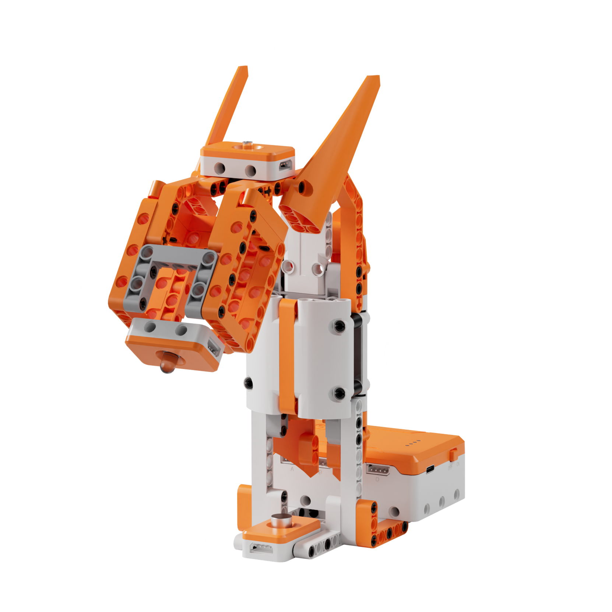
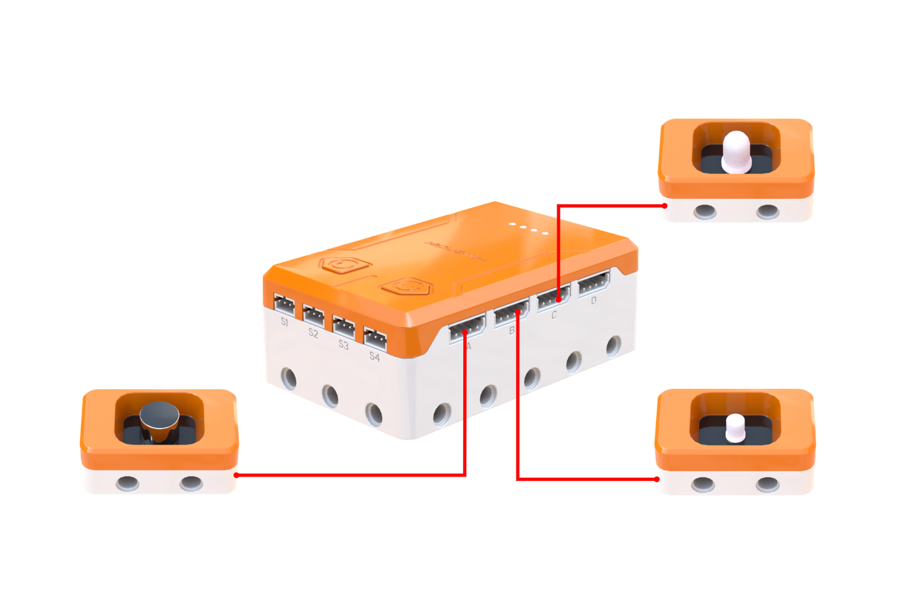
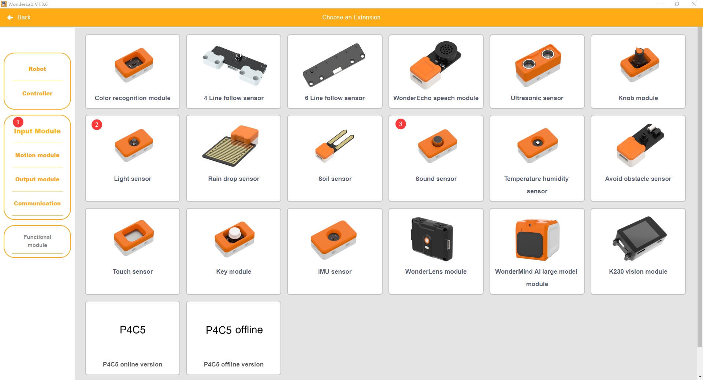
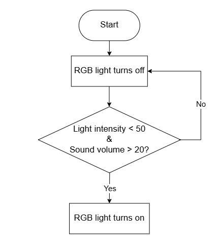
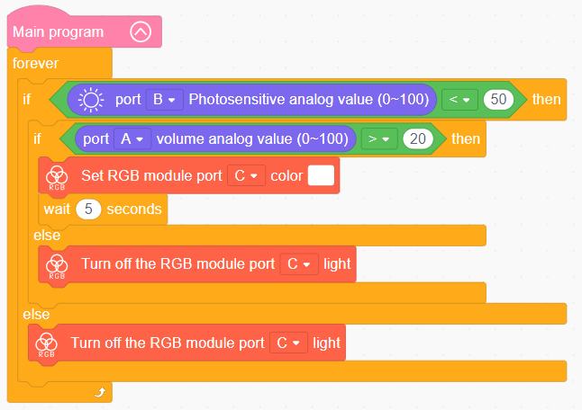

# 3.18 Sound & Light Desk Lamp

## 3.18.1 Lesson Introduction

Taking inspiration from bedside smart lighting, this lesson guides the assembly of an intelligent sound and light desk lamp. The lesson explores dual-sensor joint evaluation patterns, combining light and sound sensors to illuminate the lamp upon detecting clapping sounds in dark environments. It teaches sensor data acquisition alongside RGB color control methods, utilizes nested conditional branching, and demonstrates the core principles of multi-condition AND-logic synchronization.

## 3.18.2 Learning Objectives

1. **Knowledge Objectives**: Understand the operating principles of the light sensor and the meaning of analog light intensity readings. Master additive color mixing principles using primary red, green, and blue light. Understand the AND-logic relationship within nested conditional evaluations. Recognize the role of delay holding in software debouncing optimization.

2. **Skill Objectives**: Connect the light sensor, sound sensor, and RGB light module accurately. Program two-tier nested conditional evaluations to achieve coordinated acoustic and optical control. Calibrate light and volume thresholds to fine-tune operational sensitivity. Utilize delay blocks to prevent lighting jitter.

3. **Thinking Objectives**: Build logical reasoning skills for multi-condition joint evaluation, understanding concurrent AND-logic. Cultivate iterative optimization thinking that transitions designs from functional to refined. Strengthen structured programming methodology using tiered conditional evaluation.

4. **Application Objectives**: Connect concepts to acoustic-optical corridor lighting, automated smartphone brightness adjustments, and intelligent night lamps. Understand the value of multi-sensor data fusion in smart home automation. Stimulate curiosity regarding intelligent illumination and ergonomics.

## 3.18.3 Preparation

### (1) Hardware Preparation

- AiBlock controller

- Light sensor

- Sound sensor

- RGB light module

- Building block parts pack

- Type-C data cable

- Assembly manual

- Computer

### (2) Software Preparation

- WonderLab Graphical Programming Platform

## 3.18.4 Hands-On Project

### (1) Project Analysis

The core project of this lesson is the Sound & Light Desk Lamp, designed to illuminate upon detecting clapping sounds in dark environments while remaining inactive during daytime. The system employs a sense-think-act architecture: the light sensor measures ambient illumination, and the sound sensor monitors volume levels. The decision layer evaluates whether the surroundings are sufficiently dark before checking if sound levels surpass the trigger threshold, activating illumination only when both conditions are satisfied concurrently. The actuation layer uses the RGB light module to output white illumination and applies a 5 s delay to maintain light output, preventing rapid flashing caused by momentary acoustic fluctuations. During bright conditions, the program bypasses acoustic evaluation and keeps the light extinguished for energy conservation.

### (2) Assembly Guide

<Pdf src="../../_static/shared/pdf/chapter_3/18.pdf" />

### (3) Hardware Wiring

- Connect the sound sensor to port **A** of the controller using a 4-pin module cable.

- Connect the light sensor to port **B** of the controller using a 4-pin module cable.

- Connect the RGB light module to port **C** of the controller using a 4-pin module cable.

### (4) Adding Extensions

- Select **Light sensor** and **Sound sensor** under the **Input Module** category.

- Select **RGB module** under the **Output module** category.

### (5) Core Blocks

| Block | Category | Description |
| :---: | :---: | :--- |
|  |  | Serves as the main loop container, continuously executing internal code after power-on initialization |
|  |  | Reads the light intensity value from the light sensor on the designated port, with a range of 0 to 100 |
|  |  | Reads the volume level detected by the sound sensor on the designated port, with a range of 0 to 100 |
|  |  | Controls the RGB light module on the designated port to illuminate using a preset color |
|  |  | Extinguishes the RGB light module on the designated port to cut off light output |

### (6) Program Description and Upload

- Program Schematic

- Complete Program

  The main program executes continuously in a loop: when light intensity is less than 50 during dark conditions and the volume level exceeds 20 during clapping, the RGB light module illuminates white, activating the desk lamp. Otherwise, the lamp remains extinguished.

- Program Upload

  Following the animation, click **Connect device**, select the serial port, then click the upload button to upload the program to the controller and test the execution results.

> [!NOTE]
>
> **The source files are available for download under [Program Files](https://drive.google.com/drive/folders/1KQ-KBn3OmxCo6xKJkb7ZQZAuPW9brr5t?usp=sharing).**

## 3.18.5 Expansion and Challenge

**Project 1: Multi-Colored Ambient Mode Switching**

Configure button controls to toggle lighting themes: short-pressing the left button switches to white illumination, short-pressing the right button sets a warm yellow ambiance, and double-pressing triggers an RGB dynamic color cycle. Utilize a variable to record the active mode number and evaluate conditions to execute corresponding lighting commands. This project introduces state machine methodology where software maintains active states rather than re-evaluating from scratch, fostering smart home product design thinking.

**Project 2: Tiered Adaptive Auto-Dimming Lamp**

Utilize analog readings from the light sensor to compute proportional illumination: dimmer environments produce brighter lamp outputs, while brighter surroundings dim the light. Use arithmetic formulas to map light intensity values directly into RGB brightness levels. This project explores continuous analog regulation versus discrete threshold switching, relating concepts to smartphone auto-brightness and adaptive vehicle headlights to demonstrate the comfort and efficiency of continuous control.

## 3.18.6 Q&A

**Question 1: Why does the lamp incorporate a 5 s delay upon illuminating, and what occurs without this delay?**

Answer: Adding a 5 s delay prevents rapid light flickering and delivers a practical user experience. Acoustic signals are transient: the instantaneous sound of a handclap spikes volume above the threshold to trigger illumination, but noise levels drop immediately once clapping stops. In the subsequent loop cycle, the program would detect low volume and turn the lamp off instantly, resulting in an unusable strobe flash. Implementing a 5 s delay holds the lamp on for a fixed interval before re-evaluating conditions, ensuring a single clap provides steady illumination. Public stairwell lights similarly use 30 s to 1 min delays for friendly, practical illumination.

**Question 2: How does an RGB light module generate a wide spectrum of colors, and what is the principle of additive color mixing?**

Answer: The RGB light module incorporates red, green, and blue LED elements, mixing thousands of distinct colors by regulating the brightness ratio of each primary color. Equal parts of red and green light combine to produce yellow, green and blue combine to yield magenta, and red and blue combine to yield cyan. Setting all three colors to maximum brightness produces white light, while turning all off results in darkness. With 256 distinct brightness levels for each channel, the combination of three primary colors yields 256 × 256 × 256 ≈ 16.77 million colors. Smartphone displays, computer monitors, and televisions all utilize additive RGB color mixing to render full-color visuals, operating on the exact same physics as this RGB light module.

## 3.18.7 Technical Support and Product Discussion

To share creative ideas and projects after exploring this kit, visit the [Hiwonder Community](http://forum.hiwonder.com): forum.hiwonder.com

