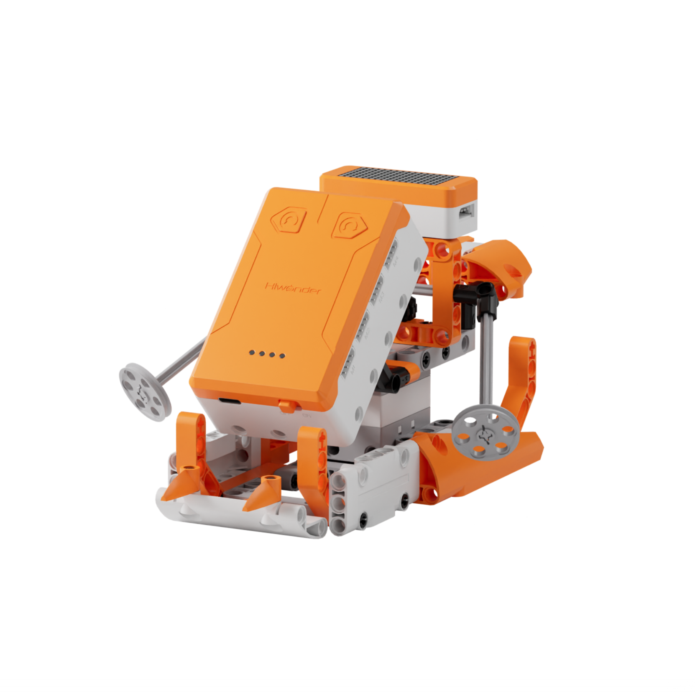
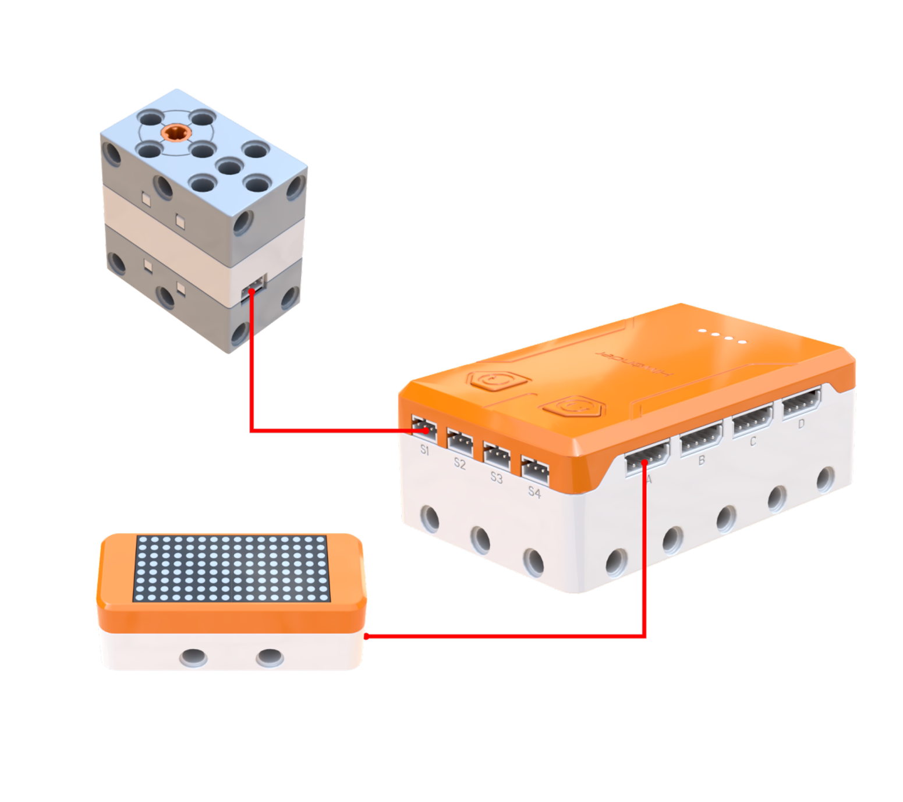
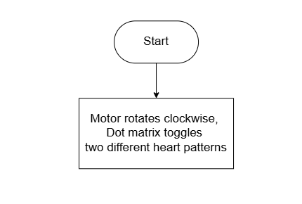
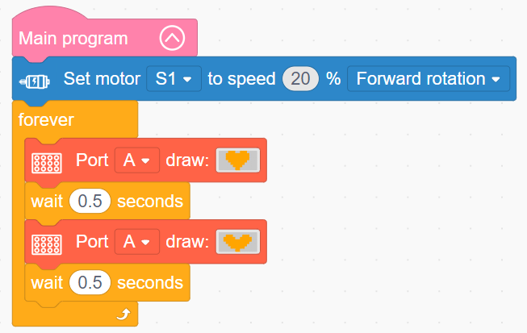

# 3.19 Dragon Boat Warrior

## 3.19.1 Lesson Introduction

Drawing inspiration from traditional Dragon Boat festival races, this lesson guides the assembly of an automated paddling Dragon Boat Warrior robot. The lesson explores how a crank-and-slider linkage mechanism transforms continuous rotary motor motion into reciprocal paddling strokes. It covers dot matrix screen animation programming to synchronize mechanical rowing with visual graphics, teaches frame-by-frame pattern transitions, and explains the correlation between motor speed and paddling frequency.

## 3.19.2 Learning Objectives

1. **Knowledge Objectives**: Understand the motion conversion principles of crank-and-slider mechanisms, mastering the transformation of rotary motion into reciprocal oscillation. Learn dot matrix pixel composition and pattern display principles. Recognize the cultural background and traditional heritage of dragon boat racing.

2. **Skill Objectives**: Assemble the dragon boat hull and paddling transmission linkage independently. Program motor drive routines to regulate paddling speed. Utilize dot matrix drawing blocks to create frame-by-frame graphical animations.

3. **Thinking Objectives**: Build system-level thinking coordinating mechanical actuation with visual display feedback. Cultivate timing control awareness in frame-by-frame animation, understanding the relationship between transition speed and animation fluidity. Strengthen innovative thinking integrating culture with robotic engineering.

4. **Application Objectives**: Connect concepts to engine pistons, sewing machines, and classic steam locomotives. Understand the widespread utilization of dot matrix displays in digital watches, billboards, and public information terminals. Stimulate curiosity regarding technological modernizations of cultural heritage.

## 3.19.3 Preparation

### (1) Hardware Preparation

- AiBlock controller

- 360° block motor

- Dot matrix module

- Building block parts pack

- Type-C data cable

- Assembly manual

- Computer

### (2) Software Preparation

- WonderLab Graphical Programming Platform

## 3.19.4 Hands-On Project

### (1) Project Analysis

The core project of this lesson is the Dragon Boat Warrior, designed to synchronize mechanical rowing motion with animated facial expressions during competitive races. The system implements a parallel architecture combining physical propulsion with visual feedback: the motor powers a crank-and-slider linkage to convert circular rotation into reciprocal paddling swings that propel the boat forward, with adjustable speed setting the rowing rhythm. Meanwhile, the dot matrix screen toggles between two graphical patterns every 0.5 s in an independent loop to produce dynamic frame animation. Operating concurrently without mutual interference, physical movement and visual animation reinforce each other to enhance lifelike engagement.

### (2) Assembly Guide

<Pdf src="../../_static/shared/pdf/chapter_3/19.pdf" />

### (3) Hardware Wiring

- Connect the 360° block motor to port **S1** of the controller using a 3-pin servo cable.

- Connect the dot matrix module to port **A** of the controller using a 4-pin module cable.

### (4) Adding Extensions

- Select **360° Motor** under the **Motion module** category.

- Select **Dot matrix module** under the **Output module** category.

### (5) Core Blocks

| Block | Category | Description |
| :---: | :---: | :--- |
|  |  | Serves as the main loop container, continuously executing internal code after power-on initialization |
|  |  | Directs the 360° block motor on the designated port to rotate continuously forward or in reverse at a custom speed |
|  |  | Directs the dot matrix screen on the designated port to load and display preset graphic patterns |

### (6) Program Description and Upload

- Program Schematic

- Complete Program

  The main program sets motor S1 to rotate forward continuously at 20% speed while concurrently executing a loop that alternates the dot matrix pattern every 0.5 s.

- Program Upload

  Following the animation, click **Connect device**, select the serial port, then click the upload button to upload the program to the controller and test the execution results.

> [!NOTE]
>
> **The source files are available for download under [Program Files](https://drive.google.com/drive/folders/1KQ-KBn3OmxCo6xKJkb7ZQZAuPW9brr5t?usp=sharing).**

## 3.19.5 Expansion and Challenge

**Project 1: Drumbeat-Synchronized Paddling System**

Integrate a buzzer to generate rhythmic drumbeats, completing one full paddling stroke per sound pulse. Regulate drumbeat intervals via a variable to achieve synchronized pacing, accelerating paddling strokes with faster drumbeats and slowing down with longer intervals. This project explores synchronizing acoustic rhythms with mechanical movement, relating concepts to dragon boat drumming cadences and industrial assembly line tact times.

**Project 2: Multi-Boat Interactive Regatta**

Deploy multiple controllers to race independent dragon boats. Utilize button presses or touch triggers to accelerate, holding the trigger for continuous acceleration and releasing to decelerate, while the dot matrix screen indicates speed tiers or race countdowns. This project introduces dynamic variable incrementation and decrementation to model acceleration and deceleration curves, discussing racing strategy and multiplayer interactive robotics.

## 3.19.6 Q&A

**Question 1: How does continuous circular motor rotation translate into reciprocal back-and-forth paddling swings, and what mechanical structure enables this?**

Answer: A **crank-and-slider linkage mechanism** converts continuous rotary motor motion into oscillating paddling strokes. The motor shaft connects to an eccentric crank, which links to a connecting rod attached to the paddle assembly. As the motor turns, the crank traces a circular path, causing the connecting rod to push and pull the paddle in a reciprocal stroke, identical to how a locomotive driving wheel powers a steam piston or how a sewing machine drives a needle. Automotive engine pistons, bicycle pedals, and automated door actuators all represent variations of the crank linkage, making it one of the most foundational motion-conversion mechanisms in mechanical engineering.

**Question 2: How does a dot matrix screen generate animated effects, and why does rapidly toggling static images produce motion?**

Answer: This effect relies on the optical principle of **persistence of vision**. When human eyes perceive an image, the visual impression lingers on the retina for roughly 0.1 s. Presenting a slightly modified succeeding image before the previous impression fades causes the brain to blend the two frames into continuous motion. Cinematography, television broadcasts, and animated cartoons all utilize this phenomenon, delivering fluid motion at 24 frames per second or higher. The dot matrix animation toggles patterns every 0.5 s, which produces perceptible dynamic motion despite the low frame rate. Shorter switching intervals yield smoother animations but demand greater processor resources, requiring a balance between visual fidelity and computational efficiency.

## 3.19.7 Technical Support and Product Discussion

To share creative ideas and projects after exploring this kit, visit the [Hiwonder Community](http://forum.hiwonder.com): forum.hiwonder.com

