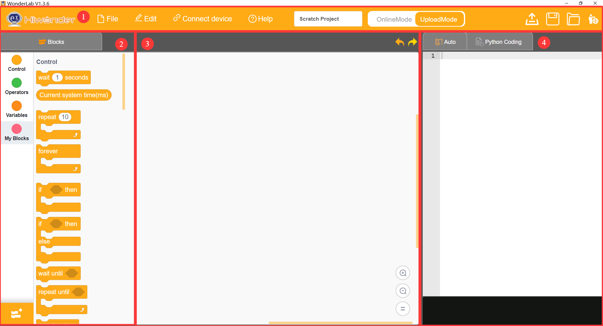
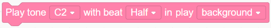
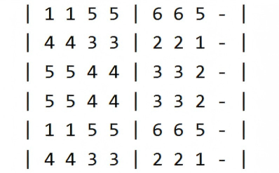
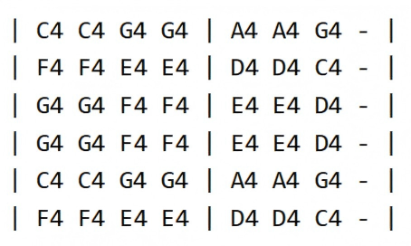
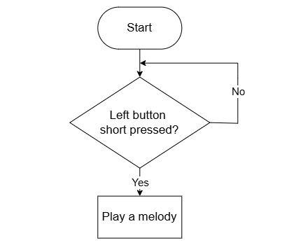
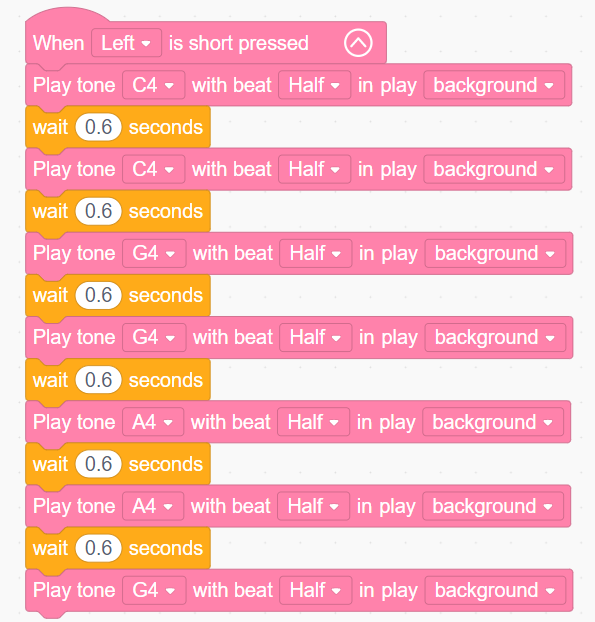

# 3.2 Music Box

## 3.2.1 Lesson Introduction

This lesson introduces the interface and functions of the WonderLab programming platform. Learners explore fundamental code blocks and the method for adding controller extension libraries, build a mechanical music box, and complete stepped hands-on tasks including button-triggered sound generation and melody programming. As an introductory programming lesson, it establishes foundational programming logic and builds solid software operation skills.

## 3.2.2 Learning Objectives

1. **Knowledge Objectives**: Master the interface layout and functions of WonderLab. Understand button-triggered event concepts. Learn buzzer pitch parameters. Grasp the program download process and port selection methods.

2. **Skill Objectives**: Create programming projects independently. Add device extension libraries proficiently. Master block snapping operations. Write, download, and run button-buzzer programs.

3. **Thinking Objectives**: Build event-driven and sequential execution programming thinking. Understand sequential program structure. Learn problem decomposition to foster computational thinking and coding confidence.

4. **Application Objectives**: Understand practical applications of buzzers in home appliances. Clarify how programming controls electronic devices. Stimulate interest in exploring smart devices.

## 3.2.3 Preparation

### (1) Hardware Preparation

- AiBlock controller

- Building block parts pack

- Type-C data cable

- Computer

### (2) Software Preparation

- WonderLab Graphical Programming Platform

## 3.2.4 Hands-On Project

### (1) Project Analysis

The core project of this lesson uses buttons to control the buzzer for playing music, adopting an "event trigger and sequential execution" structure. Pressing the left button triggers the program, which executes multiple "play note" blocks in sequence, paired with wait blocks to regulate note duration and form a complete melody. Programming the melody of "Twinkle Twinkle Little Star" provides an intuitive understanding of the step-by-step execution rule in computer programs.

### (2) Programming Software Introduction

1. WonderLab is a dedicated Scratch-based graphical programming software designed for Hiwonder products. The software supports bidirectional conversion between graphical blocks and Python code. Dragging and snapping instruction blocks allows intuitive program authoring, which suits beginners learning programming.

2. The figure below illustrates the functional areas of the WonderLab software: ① Menu bar, ② Block palette, ③ Script area, and ④ Code display and upload area.

3. The corresponding functions are detailed in the table below:

| Icon | Function |
| :---: | :--- |
|  | Creates, saves, and opens project files |
|  | Used for online mode, for informational reference only |
|  | Connects or disconnects the device and selects the communication port |
|  | Accesses help documentation, checks for updates, and installs drivers |
|  | Displays the project file name, showing "scratch project" when unsaved |
|  | Switches the workspace between **Online Mode** and **Upload Mode** |
|  | Set the interface display language to English |
|  | Undoes or redoes recent editing actions |
|  | Mode toggle button, where **Auto** transforms block programs into Python code, and **Python Coding** allows direct editing in Python |
|  | Saves the project as a Python source file |
|  | Opens an existing Python file |
|  | Interacts with hardware and uploads programs to the controller |
|  | Adds device extension packages |
|  | Zooms in, zooms out, or resets the script editing canvas zoom level |

### (3) Assembly Guide

<Pdf src="../../_static/shared/pdf/chapter_3/2.pdf"/>

### (4) Core Blocks

| Block | Category | Description |
| :---: | :---: | :--- |
|  |  | Pauses program execution for a specified duration |
|  |  | Plays notes according to the specified pitch, beat, and playback mode |
|  |  | Triggers corresponding blocks when the button is short-pressed |

### (5) Program Description and Upload

- Sheet Music to Program Pitch Conversion

| C4 | D4 | E4 | F4 | G4 | A4 | B4 |
| :---: | :---: | :---: | :---: | :---: | :---: | :---: |
| 1 | 2 | 3 | 4 | 5 | 6 | 7 |

| Standard Sheet Music | Program Sheet Music |
| :---: | :---: |
|  |  |

- Program Schematic

- Complete Program

  After powering on, short-pressing the left button serves as the startup trigger condition. Once triggered, the program plays notes C4, C4, G4, G4, A4, A4, and G4 in sequence. All notes are set to a beat of one-half with the mode set to background playback. A wait of 0.6 s follows each note playback, completing the corresponding melody.

- Program Upload

  Following the animation, click **Connect device**, select the serial port, then click the upload button to upload the program to the controller and test the execution results.

> [!NOTE]
>
> **The source files are available for download under [Program Files](https://drive.google.com/drive/folders/1xyD_-3msc3KcaGQHLqkcPOZNSNXFIirT?usp=sharing).**

## 3.2.5 Expansion and Challenge

**Project 1: Full Performance of Twinkle Twinkle Little Star**

Find the full sheet music for "Twinkle Twinkle Little Star" and add the remaining notes into the program, enabling the buzzer to play the entire song. Adjust the beat length and wait time of each note to enhance melodic rhythm. Incorporate volume changes with louder dynamics during climaxes and softer tones toward the end, practicing richer music programming techniques.

**Project 2: Dual-Button Doorbell Design**

Design a dual-tone doorbell program: pressing the left button plays a high-pitched "ding-dong" chime, while pressing the right button plays a low-pitched "dong-dong" chime. Use different pitch tones to distinguish between front and back doors, or assign the left button as a guest greeting and the right button as an alarm alert. This project exercises programming independent events and reinforces understanding of multi-event parallel structures.

## 3.2.6 Q&A

**Question 1: After opening WonderLab, what critical step must be completed before the buzzer programming blocks appear?**

Answer: The "AI Blocks Board" extension library must be added first. Hardware features such as the buzzer and buttons are specific to the AiBlock controller, meaning default block libraries do not contain these instructions. Click the Extensions button in the lower-left corner, locate and add "AI Blocks Board" under the Controller category. The onboard resources and button blocks will then appear in the left palette, enabling programs to control the buzzer and buttons. This resembles installing a printer driver before using a printer, serving as the essential first step in hardware programming.

**Question 2: What is the purpose of the block "when left button is short-pressed"? Why must programs be placed beneath it?**

Answer: This is an event-trigger block that functions as a program start switch. All blocks placed beneath it execute once only when the left button is pressed. Without an event block, programs run immediately upon power-up, causing the buzzer to sound continuously without stopping. Using button events provides control over execution timing: press to play, and release to keep silent. This demonstrates the fundamental logic of interactive programming where a trigger signal prompts a machine action.

## 3.2.7 Technical Support and Product Discussion

To share creative ideas and projects after exploring this kit, visit the [Hiwonder Community](http://forum.hiwonder.com): forum.hiwonder.com

