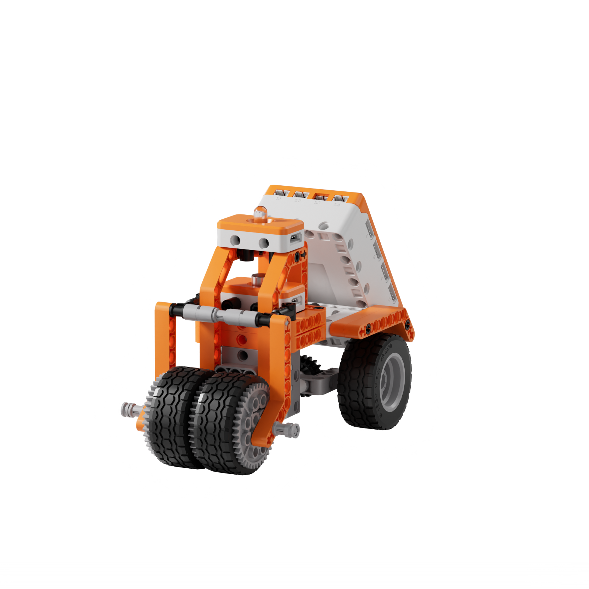
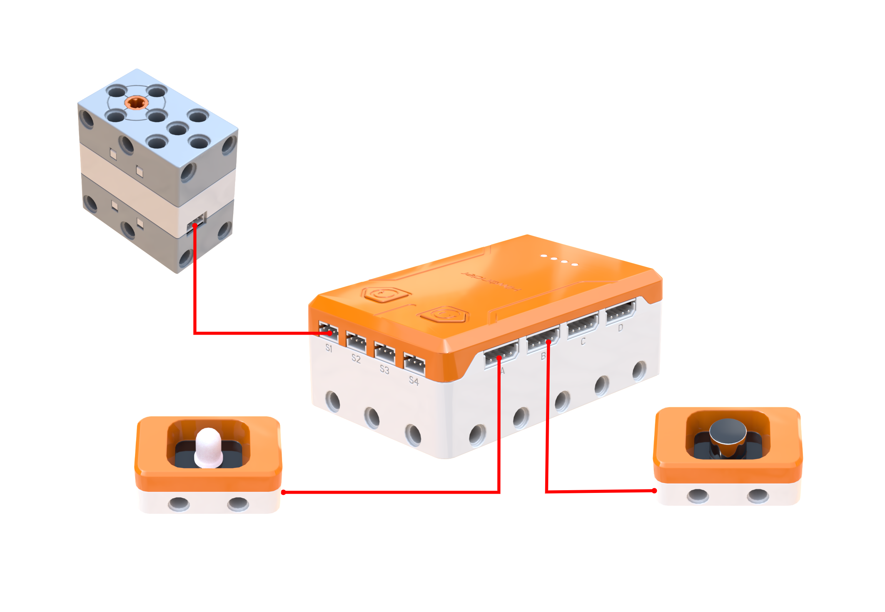
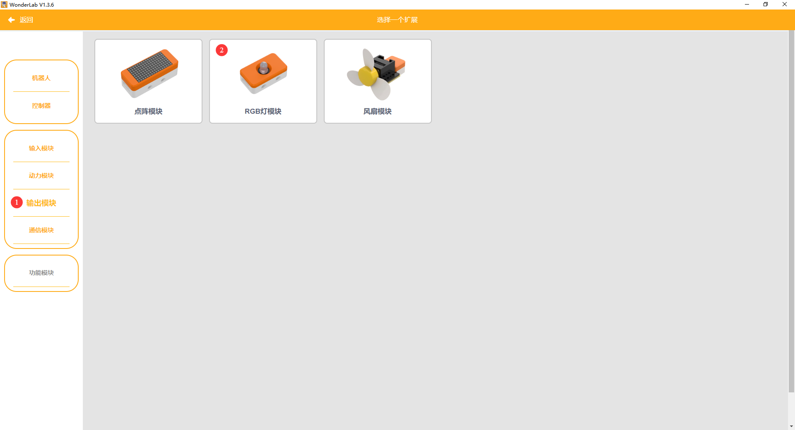
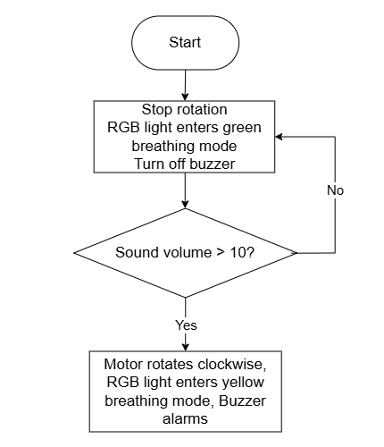
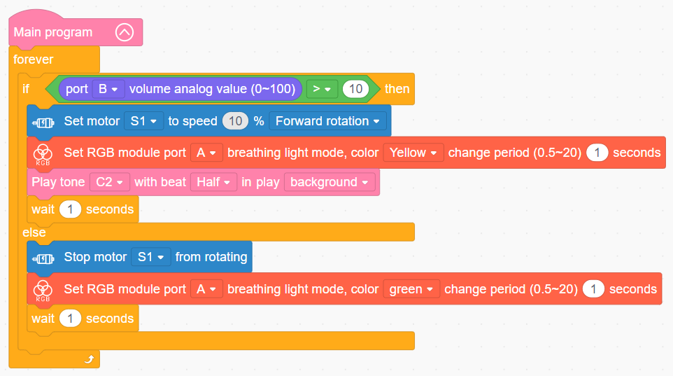

# 3.31 Drum Steamroller

## 3.31.1 Lesson Introduction

Centering on the drum steamroller model, this lesson explores coordinated programming among the sound sensor, RGB light module, and buzzer. It implements an intelligent operating routine where hand clapping initiates rolling and standby lights provide visual alerts. The content examines road compaction principles using a heavy cylindrical drum, covers acoustic threshold trigger logic, and applies multi-device state coordination. It also explores core engineering concepts of visual human-robot interaction and safety feedback.

## 3.31.2 Learning Objectives

1. **Knowledge Objectives**: Understand operating principles of drum steamrollers. Master acoustic threshold trigger logic using the sound sensor. Recognize coordinated operations among the sound sensor, RGB light module, and 360° block motor.

2. **Skill Objectives**: Complete mechanical assembly and hardware wiring for the steamroller model. Program routines in WonderLab to achieve acoustic start-stop control, motor rotation, and coordinated RGB status lighting. Master program uploading and fundamental testing procedures.

3. **Thinking Objectives**: Build closed-loop control thinking through perception, decision-making, and execution. Understand dual-state switching logic between operational and standby states. Recognize engineering optimization concepts of sensor debouncing.

4. **Application Objectives**: Connect concepts to industrial steamrollers and everyday sound-activated equipment. Appreciate the practical utility of automated control systems. Stimulate interest in exploring construction machinery and intelligent hardware.

## 3.31.3 Preparation

### (1) Hardware Preparation

- AiBlock controller

- 360° block motor

- Sound sensor

- RGB light module

- Building block parts pack

- Type-C data cable

- Assembly manual

- Computer

### (2) Software Preparation

- WonderLab Graphical Programming Platform

## 3.31.4 Hands-On Project

### (1) Project Analysis

The core project of this lesson is the Drum Steamroller, delivering an interactive engineering vehicle with acoustic start-stop control and coordinated status indicators. The system adopts an acoustic command dual-state switching architecture. When the detected volume exceeds 10, the steamroller enters the working state: the motor drives forward, the RGB light module pulses a yellow breathing alert, and the buzzer emits a low tone. When the volume remains at or below 10, the vehicle switches to standby: the motor stops and the RGB light module pulses a green breathing light to indicate a safe state. Each state transition maintains a 1 s delay for debouncing. The coordinated lighting colors visually reflect operational status, demonstrating core concepts of visual safety design.

### (2) Assembly Guide

<Pdf src="../../_static/shared/pdf/chapter_3/31.pdf" />

### (3) Hardware Wiring

- Connect the 360° block motor to port **S1** of the controller using a 3-pin servo cable.

- Connect the RGB light module to port **A** of the controller using a 4-pin module cable.

- Connect the sound sensor to port **B** of the controller using a 4-pin module cable.

### (4) Adding Extensions

- Select **Sound sensor** under the **Input Module** category.

- Select **360° Motor** under the **Motion module** category.

- Select **RGB module** under the **Output module** category.

### (5) Core Blocks

| Block | Category | Description |
| :---: | :---: | :--- |
|  |  | Serves as the main loop container, continuously executing internal code after power-on initialization |
|  |  | Drives the buzzer to play a musical note at a designated pitch and beat in the background without blocking subsequent program execution |
|  |  | Reads the volume level detected by the sound sensor on the designated port across a range of 0 to 100, where higher values indicate louder ambient sound |
|  |  | Directs the 360° block motor on the designated port to rotate continuously forward or in reverse at a custom speed |
|  |  | Disables output to the 360° block motor on the designated port, halting rotation immediately |
|  |  | Controls the RGB light module on the designated port to enable a breathing gradient effect in a selected color, supporting custom transition cycles |

### (6) Program Description and Upload

- Program Schematic

- Complete Program

  When the detected sound volume exceeds 10, the steamroller moves forward while the RGB light module pulses a yellow breathing light with a 1 s cycle, and the buzzer emits a prompt tone. When the volume remains at or below 10, the steamroller halts while the RGB light module pulses a green breathing light with a 1 s cycle.

- Program Upload

  Following the animation, click **Connect device**, select the serial port, then click the upload button to upload the program to the controller and test the execution results.

> [!NOTE]
>
> **The source files are available for download under [Program Files](https://drive.google.com/drive/folders/1KQ-KBn3OmxCo6xKJkb7ZQZAuPW9brr5t?usp=sharing).**

## 3.31.5 Expansion and Challenge

**Project 1: Single-Button Acoustic-Controlled Toggle Steamroller**

Clap once to start and clap again to halt, implementing toggle-style acoustic control. Use a variable to record the operating or standby state, toggling the state and switching outputs whenever sound exceeds the threshold following a debounce delay. Master state toggle and debouncing logic, extending discussions to voice-activated lights, sound-activated switches, and single-button toggle equipment.

**Project 2: Automated Reversing Steamroller Vehicle**

Introduce an infrared obstacle sensor or light sensor to detect ground boundaries, automatically reversing direction upon reaching an edge while changing RGB light colors to achieve reciprocal compaction. Practice directional switching and boundary detection to understand reciprocal motion control logic, extending discussions to robotic vacuums and automated path-reversing engineering vehicles.

## 3.31.6 Q&A

**Question 1: What is the purpose of the large front roller on a steamroller, and why is it designed to be so large and heavy?**

Answer: The large cylindrical roller serves as the **core operating mechanism of the steamroller, used to compact road surfaces**. During road construction, freshly laid asphalt or soil is loose and soft. If vehicles travel over it directly, ruts form and the road deteriorates rapidly. Therefore, a steamroller must compact and smooth the surface. The roller is made exceptionally large and heavy for two main reasons. First, greater mass delivers greater gravitational pressure against the ground, producing denser, more cohesive compaction that resists deformation. Second, a large-diameter cylinder contacts the ground along a continuous line. As it rolls forward, pressure distributes evenly across the surface, yielding a smooth plane without uneven ridges. Furthermore, the cylindrical shape rolls forward efficiently, requiring far less energy than flat dragging surfaces. Full-sized industrial steamrollers weigh several metric tons or even tens of metric tons, relying on gravitational ballast to compact roadbeds firmly. Certain models also integrate vibratory mechanisms where the drum vibrates while rolling to enhance compaction depth. Although this building block steamroller is much lighter, it follows the same physical principles by using the weight of the roller assembly to simulate road compaction, rolling forward steadily to flatten the simulated work surface.

**Question 2: Why does the acoustic start-stop program include a 1 s wait block, and what happens if this delay is omitted?**

Answer: Including a 1 s delay provides **debouncing and state stabilization**. Acoustic signals fluctuate naturally. During a handclap, volume does not remain above 10 continuously. Instead, it spikes momentarily and drops immediately, while ambient background noise can also cause sporadic fluctuations. Without a delay, the program loop executes rapidly dozens of times per second. A handclap triggers the working state for an instant, but during the very next loop iteration, the sampled volume drops back below the threshold. The program switches immediately back to the stop state, causing the vehicle to twitch momentarily and halt instead of sustaining continuous operation. Adding a 1 s wait block forces the system to lock into each state for a full second. During this 1 s interval, the program ignores further sound changes, ensuring operational stability. Furthermore, once triggered, the steamroller works continuously for 1 s. Sustained clapping or continuous ambient noise maintains the active state. In programming, this technique is termed delay hold or software debouncing, which is essential whenever sensor inputs fluctuate erratically. Corridor acoustic lighting operates on the identical principle, remaining illuminated for several minutes after activation rather than extinguishing the instant sound ceases.

## 3.31.7 Technical Support and Product Discussion

To share creative ideas and projects after exploring this kit, visit the [Hiwonder Community](http://forum.hiwonder.com): forum.hiwonder.com

