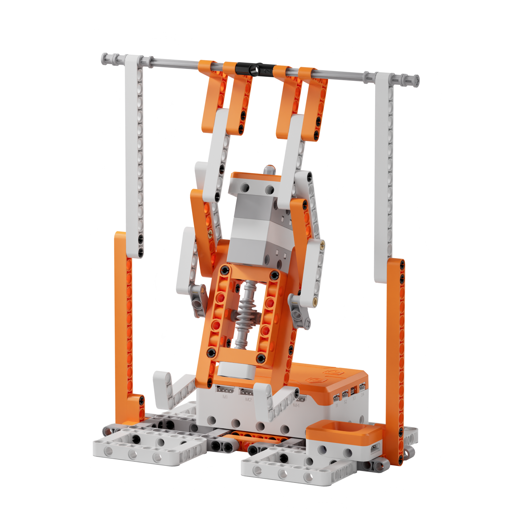
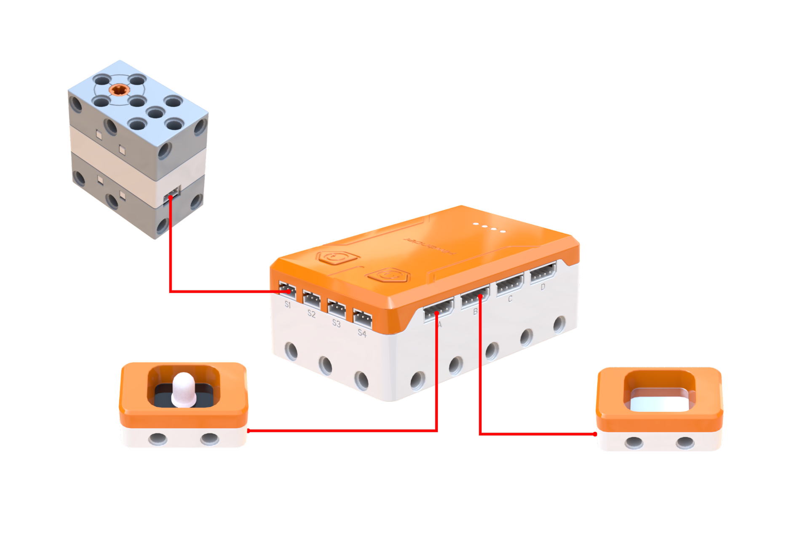
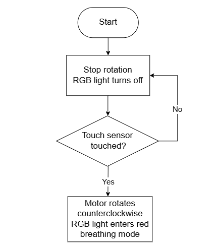
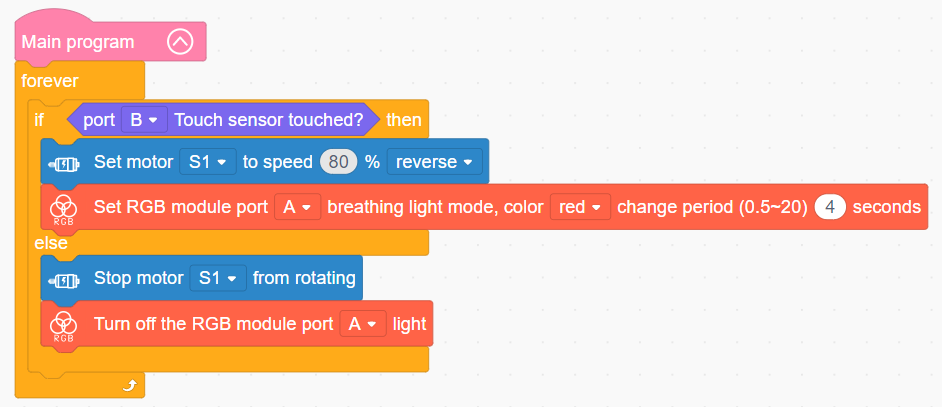

# 3.34 Horizontal Bar Hero

## 3.34.1 Lesson Introduction

Centering on the horizontal bar gymnast model, this lesson simulates athletic pull-up maneuvers. Bridging sensory inputs with structured mechanical control, the content explores lever mechanics, fulcrum locations, and effort arm relationships. It examines worm gear speed reduction, torque multiplication, and reverse self-locking characteristics, applying capacitive touch sensing to achieve responsive start-stop human-robot interaction.

## 3.34.2 Learning Objectives

1. **Knowledge Objectives**: Understand lever principles, distinguishing relationships among fulcrums, effort arms, and load forces. Master worm gear transmission characteristics including speed reduction, torque multiplication, and reverse self-locking. Understand capacitive touch sensing mechanisms. Grasp pulse width modulation principles governing RGB breathing light illumination.

2. **Skill Objectives**: Assemble the mechanical chassis of the horizontal bar hero accurately, mastering worm gear alignment techniques. Wire the 360° block motor, RGB light module, and touch sensor to designated controller ports. Program touch-triggered routines coordinating motor locomotion with breathing visual feedback.

3. **Thinking Objectives**: Establish unified systems thinking integrating mechanical structures, electronic sensing, and visual feedback. Develop structural stability awareness, recognizing the safety value of self-locking designs in mechanical engineering. Strengthen trigger-based event-driven control logic for interactive devices.

4. **Application Objectives**: Connect concepts to passenger elevators, heavy-duty winches, and robotic manipulator end-effectors. Understand the prevalence of capacitive touch interfaces in mobile devices, tablets, and smart appliances. Stimulate interest in bionic robotics and mechanical engineering design.

## 3.34.3 Preparation

### (1) Hardware Preparation

- AiBlock controller

- 360° block motor

- RGB light module

- Touch sensor

- Building block parts pack

- Type-C data cable

- Assembly manual

- Computer

### (2) Software Preparation

- WonderLab Graphical Programming Platform

## 3.34.4 Hands-On Project

### (1) Project Analysis

The core project of this lesson is the Horizontal Bar Hero, delivering an interactive bionic mechanism featuring synchronized motion and illumination triggered by touch. The system adopts an event-driven architecture combining touch triggering, motor propulsion, and coordinated lighting. The touch sensor serves as the interactive input, sending a logic signal upon contact. The decision layer continuously evaluates touch states to direct synchronized actuation. The actuation layer divides into two output pathways. The mechanical pathway drives a worm gear transmission that lifts the gymnast into a steady pull-up, where speed reduction and reverse self-locking ensure smooth motion while preventing downward slippage under gravity. The optical pathway drives the RGB light module in a red breathing light mode to simulate physical exercise cadence. Both pathways activate and halt synchronously to deliver a cohesive interactive experience.

### (2) Assembly Guide

<Pdf src="../../_static/shared/pdf/chapter_3/34.pdf" />

### (3) Hardware Wiring

- Connect the 360° block motor to port **S1** of the controller using a 3-pin servo cable.

- Connect the RGB light module to port **A** of the controller using a 4-pin module cable.

- Connect the touch sensor to port **B** of the controller using a 4-pin module cable.

### (4) Adding Extensions

- Select **Touch sensor** under the **Input Module** category.

- Select **360° Motor** under the **Motion module** category.

- Select **RGB module** under the **Output module** category.

### (5) Core Blocks

| Block | Category | Description |
| :---: | :---: | :--- |
|  |  | Serves as the main loop container, continuously executing internal code after power-on initialization |
|  |  | Reads the state of the touch sensor on the designated port, returning a boolean value indicating contact |
|  |  | Directs the 360° block motor on the designated port to rotate continuously forward or in reverse at a custom speed |
|  |  | Disables output to the 360° block motor on the designated port, halting rotation immediately |
|  |  | Controls the RGB light module on the designated port to enable a breathing gradient effect in a selected color, supporting custom transition cycles |
|  |  | Disables the RGB light module on the designated port, extinguishing all illumination output |

### (6) Program Description and Upload

- Program Schematic

- Complete Program

  In the main program, the controller continuously evaluates whether the touch sensor is touched. When contact occurs, motor S1 rotates in reverse at 80% speed while the RGB light module enables red breathing mode with a 4 s cycle. When contact ceases, all actuator outputs halt immediately.

- Program Upload

  Following the animation, click **Connect device**, select the serial port, then click the upload button to upload the program to the controller and test the execution results.

> [!NOTE]
>
> **The source files are available for download under [Program Files](https://drive.google.com/drive/folders/1adJTOnyve2MmEehrB9YFSW8echTWwoF2?usp=sharing).**

## 3.34.5 Expansion and Challenge

**Project 1: Multi-Speed Gymnastic Training Mode**

Use a variable to record training intensity tiers, switching speeds across low at 40%, medium at 60%, and high at 80% via single taps, while using a long press to start or stop motion. Assign distinct RGB colors to indicate speed tiers: red for high speed, yellow for medium speed, and green for low speed. Master differentiating single-tap and sustained-press triggering logic, extending discussions to adjustable fitness machines and industrial variable-frequency drives.

**Project 2: Cadence-Synchronized Breathing Illumination**

Calculate arm oscillation cycles based on motor rotation speeds and worm gear reduction ratios, aligning the RGB breathing period with the physical movement cycle. Coordinate color gradients so that lifting corresponds to gradual brightening while lowering corresponds to gradual dimming. Practice matching mechanical motion intervals with visual lighting cycles, developing temporal coordination thinking relevant to stage illumination and animation frame rate synchronization.

## 3.34.6 Q&A

**Question 1: Which two critical mechanical functions does the worm gear mechanism provide in the horizontal bar hero, and how do they operate?**

Answer: The worm gear mechanism delivers **speed reduction with torque multiplication** and **reverse self-locking**. Speed reduction and torque multiplication mean that high-speed motor rotation entering the worm gear yields slower output rotation with significantly magnified torque, analogous to shifting a bicycle into low gear where speed decreases while climbing power increases, allowing the mechanism to lift counterweights smoothly and effortlessly. Reverse self-locking dictates that the driving worm can rotate the driven worm gear, but the worm gear cannot drive the worm in reverse. Consequently, whenever the motor stops, the gymnast arms hold firmly at their current elevation rather than slipping downward under gravitational pull. This self-locking property is essential across heavy-duty hoisting systems such as elevators and industrial winches to prevent dropped loads during power interruptions, providing critical operational safety.

**Question 2: How is the breathing light effect generated, and how does the lamp produce smooth brightening and dimming transitions?**

Answer: The breathing light effect relies on **rapid switching combined with duty cycle modulation**, also known as pulse width modulation or PWM. Rather than continuously altering analog voltage, the LED turns fully on and fully off at frequencies far beyond human visual persistence limits. When the illuminated proportion of each cycle is large, the light appears bright, and when the dark proportion dominates, the light appears dim. By continuously shifting this on-to-off time ratio across each cycle, the perceived brightness ascends smoothly from minimum to maximum before descending back to minimum, creating a pulsating breathing pattern. This technique is applied widely across mobile device notifications, standby status indicators, and automotive ambient lighting to deliver gentle, visually comfortable signaling.

## 3.34.7 Technical Support and Product Discussion

To share creative ideas and projects after exploring this kit, visit the [Hiwonder Community](http://forum.hiwonder.com): forum.hiwonder.com

