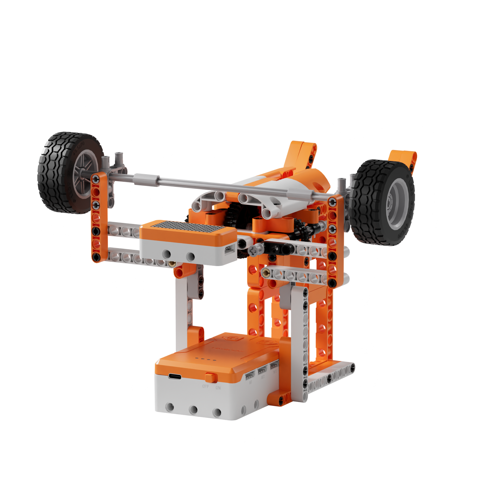
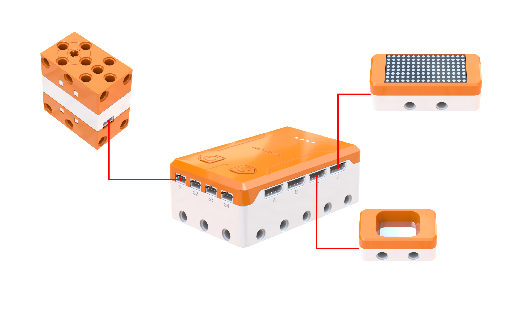
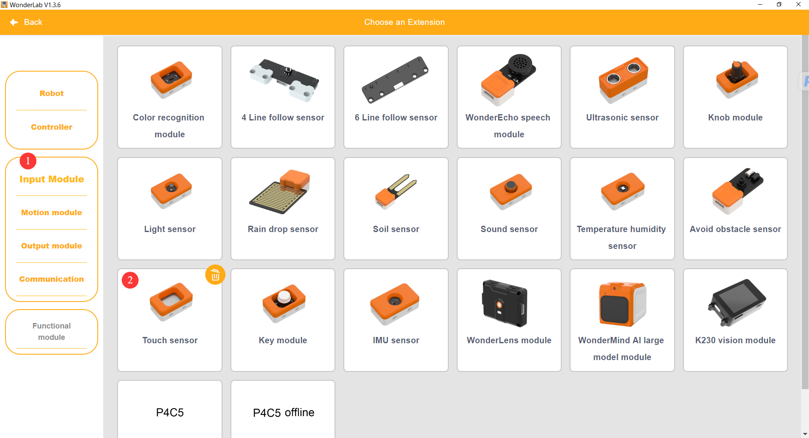
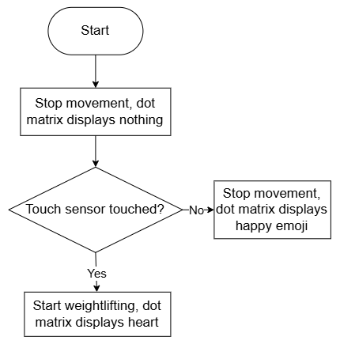
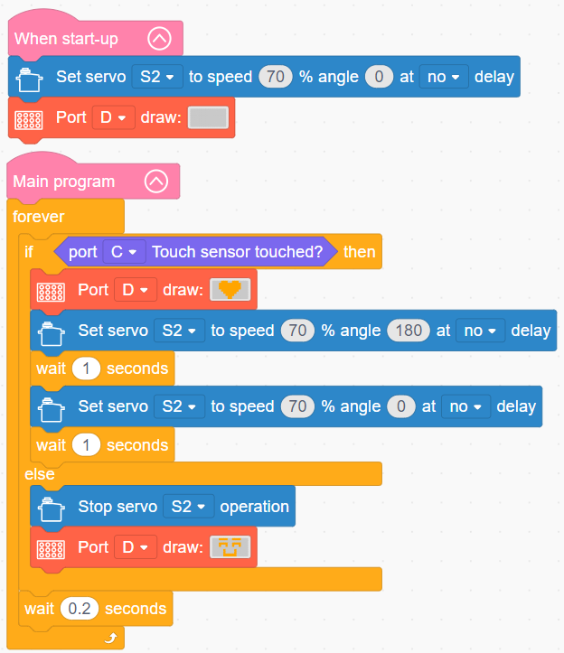

# 3.35 Little Weightlifting Hero

## 3.35.1 Lesson Introduction

Centering on the bionic weightlifting hero model, this lesson explores coordinated programming among a 180° block servo, touch sensor, and dot matrix display. It implements an interactive routine where sustained touch triggers reciprocal weightlifting motions, while releasing the touch pad halts actuation and updates facial expressions on the screen. The content examines servo swing arm and linkage reciprocal transmission mechanics, guides assembly of the reciprocating lift mechanism, and integrates sensory triggers, servo articulation, and visual screen feedback into a unified smart interactive device.

## 3.35.2 Learning Objectives

1. **Knowledge Objectives**: Understand how angular rotation of a 180° servo converts into vertical linear reciprocating motion through a mechanical linkage. Master detection logic for sustained touch input using a touch sensor. Comprehend system architectures coordinating servo actuation with synchronized dot matrix display feedback.

2. **Skill Objectives**: Assemble the mechanical structure of the little weightlifting hero independently, aligning the 180° servo swing arm, linkages, counterweights, and character figure. Program reciprocal angle-toggling routines for the servo. Test and calibrate the complete interactive system coordinating touch triggers, lifting kinematics, and facial expression switching.

3. **Thinking Objectives**: Build unified mechatronic systems thinking integrating servo angular motion, linkage transmission, reciprocal kinematics, and visual display feedback. Analyze mechanical motion logic in bionic fitness mechanisms. Develop engineering design concepts for managing multiple output peripherals through a single sensory input.

4. **Application Objectives**: Connect concepts to fitness equipment models, interactive touch toys, and bionic robotic manipulator arms. Understand the practical utility of 180° servos in reciprocating oscillation mechanisms. Inspire creative interest in servo-driven bionic interactive robotics.

## 3.35.3 Preparation

### (1) Hardware Preparation

- AiBlock controller

- 180° block servo

- Dot matrix module

- Touch sensor

- Building block parts pack

- Type-C data cable

- Assembly manual

- Computer

### (2) Software Preparation

- WonderLab Graphical Programming Platform

## 3.35.4 Hands-On Project

### (1) Project Analysis

The core project of this lesson is the Little Weightlifting Hero, delivering a bionic interactive mechanism where sustained contact activates reciprocating lifts and touch release halts motion while switching facial expressions. The system adopts an event-driven architecture combining touch triggering, 180° servo propulsion, and dot matrix coordination. The touch sensor serves as the master switch, transmitting active signals under sustained contact. The decision layer continuously samples touch states to manage synchronized system actuation. The actuation layer divides into two output pathways. The mechanical pathway relies on the servo swing arm and linkage assembly, alternating between high and low angles to lift and lower the counterweight smoothly, where servo holding torque prevents back-driving under gravity. The visual pathway directs the dot matrix module to display a heart pattern during lifting. Upon releasing the touch pad, lifting halts immediately, the servo locks at its current angle, and the dot matrix switches to a smile expression, completing a synchronized multi-peripheral interaction loop.

### (2) Assembly Guide

<Pdf src="../../_static/shared/pdf/chapter_3/35.pdf" />

### (3) Hardware Wiring

- Connect the 180° block servo to port **S1** of the controller using a 3-pin servo cable.

- Connect the touch sensor to port **C** of the controller using a 4-pin module cable.

- Connect the dot matrix module to port **D** of the controller using a 4-pin module cable.

### (4) Adding Extensions

- Select **Touch sensor** under the **Input Module** category.

- Select **180° servo** under the **Motion module** category.

- Select **Dot matrix module** under the **Output module** category.

 

### (5) Core Blocks

| Block | Category | Description |
| :---: | :---: | :--- |
|  |  | Reads the state of the touch sensor on the designated port, returning a boolean value indicating contact |
|  |  | Directs the 180° block servo on the designated port to rotate to a specified angle at a custom speed with optional delay |
|  |  | Disables output to the 180° block servo on the designated port, halting rotation immediately |
|  |  | Controls the dot matrix module on the designated port to render a custom graphic pattern |

### (6) Program Description and Upload

- Program Schematic

- Complete Program

  - Upon system startup, servo S2 initializes to 0° at 70% speed, and the dot matrix display on port D clears.

  - The main program loop evaluates the touch sensor on port C, terminating each cycle with a 0.2 s delay for software debouncing. When contact occurs, the dot matrix display on port D illuminates the heart graphic, while servo S2 rotates to 180°, pauses for 1 s, returns to 0°, and pauses for 1 s. When contact ceases, servo S2 halts rotation, and the dot matrix display switches to the standby smile pattern.

- Program Upload

  Following the animation, click **Connect device**, select the serial port, then click the upload button to upload the program to the controller and test the execution results.

> [!NOTE]
>
> **The source files are available for download under [Program Files](https://drive.google.com/drive/folders/1adJTOnyve2MmEehrB9YFSW8echTWwoF2?usp=sharing).**

## 3.35.5 Expansion and Challenge

**Project 1: Interval-Training Weightlifting Hero**

When the touch sensor triggers, the 180° block servo drives the character through continuous lifting for 10 s while the dot matrix display illuminates the heart pattern. Upon timer completion, the mechanism pauses for 3 s to simulate an interval rest, holding the servo stationary while the display switches to a resting crescent expression. Repeating this cycle mimics human exercise and rest intervals, while releasing the touch sensor terminates actuation immediately. Practice integrating timers with nested conditional branches to master scheduled actuation and state-dependent display feedback.

**Project 2: Audio-Visual Feedback Weightlifting Hero**

Integrate a buzzer module that plays rhythmic workout sound effects while sustained contact drives reciprocating lifts, disabling audio output whenever touch contact ceases. Practice coordinating a single touch sensor to manage a 180° block servo, dot matrix display, and buzzer synchronously, exploring mechatronic design for multi-peripheral interactive bionic toys.

## 3.35.6 Q&A

**Question 1: What engineering advantages does the 180° block servo and linkage assembly offer for weightlifting actuation?**

Answer: The 180° block servo provides precise angular positioning, allowing the servo swing arm and linkage to transform rotational sweeping into linear vertical lifting. This linkage configuration produces smooth, repeatable strokes during both raising and lowering phases. Furthermore, the internal gear train of the servo delivers holding torque, supporting the suspended counterweight firmly without slipping downward under gravity. Additionally, adjusting lifting heights requires only updating software angular parameters rather than rebuilding mechanical linkages, offering substantial tuning convenience. Consequently, servo and linkage mechanisms are deployed widely across bionic mechanisms and robotic grippers.

**Question 2: How does the program synchronize reciprocal servo motion with dot matrix facial expressions?**

Answer: The servo and dot matrix display operate as two independent actuator peripherals. When execution enters the active touch branch, the program cycles through alternating servo angles to execute lifts while simultaneously outputting the heart graphic to the screen. Releasing the touch sensor switches execution to the alternate branch, commanding the servo to halt and the dot matrix to render a smile expression. Using conditional evaluation branches to govern both peripherals ensures seamless synchronization between physical motion and visual feedback.

## 3.35.7 Technical Support and Product Discussion

To share creative ideas and projects after exploring this kit, visit the [Hiwonder Community](http://forum.hiwonder.com): forum.hiwonder.com

