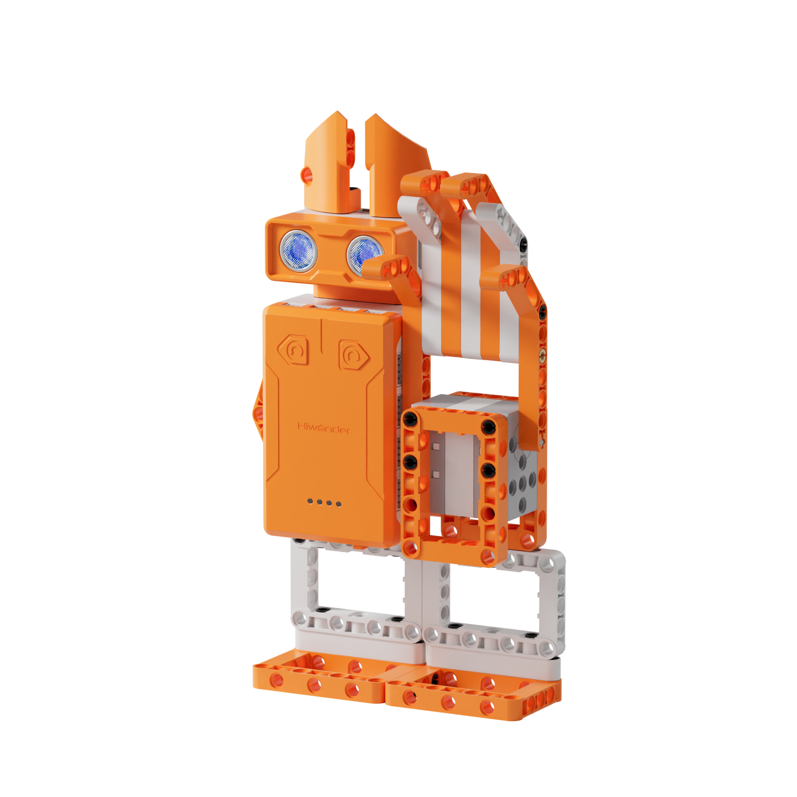
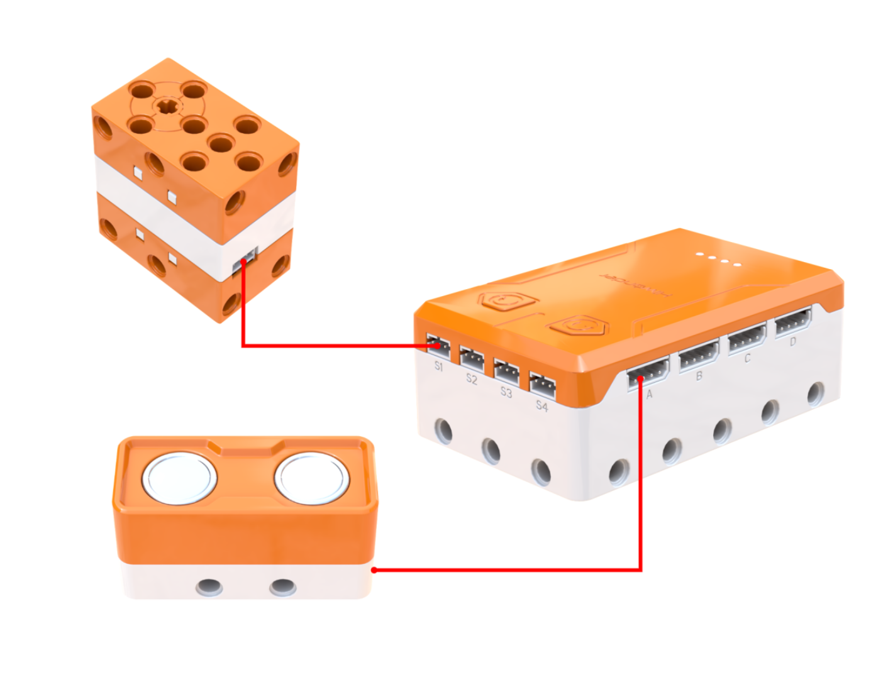
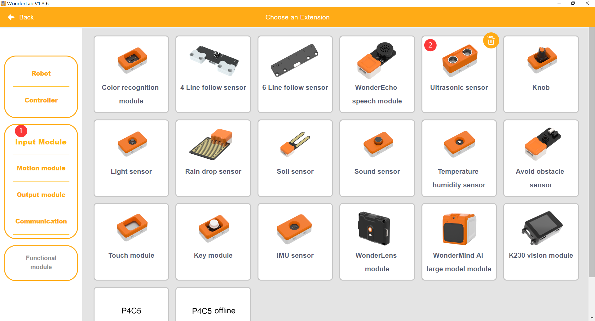
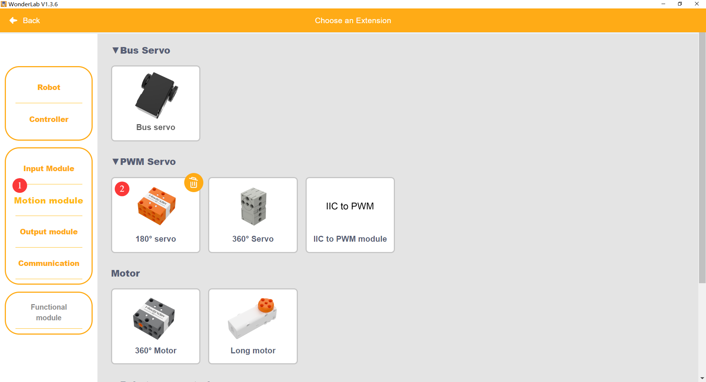
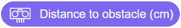
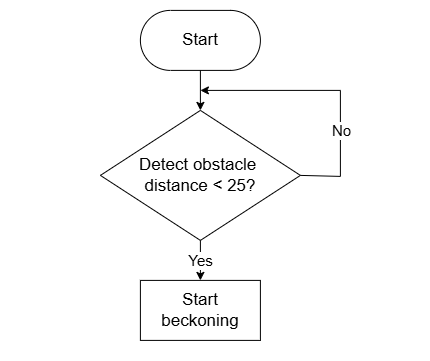
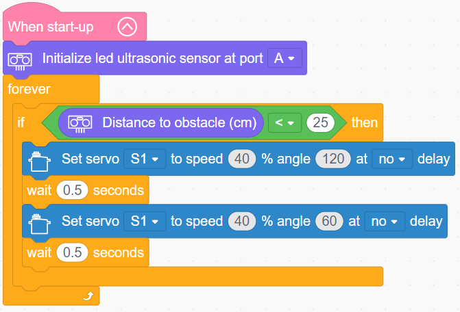

# 3.4 Beckoning Cat Arm

## 3.4.1 Lesson Introduction

This lesson takes inspiration from the traditional beckoning cat to construct an interactive waving robotic arm. It explores the three fundamental programming structures: sequence, loop, and branch. Learners master servo angle control and ultrasonic distance measurement principles, completing two-stage tasks covering basic waving and automatic waving upon approach. Integrating servos with ultrasonic sensing organizes program architecture, establishes distance-sensing control logic, and prepares for advanced mechanical programming.

## 3.4.2 Learning Objectives

1. **Knowledge Objectives**: Distinguish between sequence, loop, and branch program structures. Master servo control across 0° to 180°. Understand ultrasonic ranging principles. Grasp basic variable arithmetic operations.

2. **Skill Objectives**: Wire the servo and ultrasonic sensor properly. Complete mounting and mechanical zero-point calibration for the arm. Program cyclical waving motions. Read ultrasonic detection distances accurately.

3. **Thinking Objectives**: Build structured programming thinking. Combine three core control structures flexibly. Form closed-loop thinking for sensor-based control. Cultivate engineering habits of parameter calibration and iterative debugging.

4. **Application Objectives**: Connect ultrasonic technology with real-world applications like automatic doors and sensor faucets. Understand distance sensing in daily life to inspire creative ideas for smart sensor systems.

## 3.4.3 Preparation

### (1) Hardware Preparation

- AiBlock controller

- 180° block servo

- Ultrasonic sensor

- Building block parts pack

- Type-C data cable

- Assembly manual

- Computer

### (2) Software Preparation

- WonderLab Graphical Programming Platform

## 3.4.4 Hands-On Project

### (1) Project Analysis

The core project for this lesson is an intelligent beckoning cat arm, realizing an interactive response that waves when someone approaches and stops when they leave. The ultrasonic sensor detects distance as the perception layer, while the servo oscillates the arm between 60° and 120° to create a waving motion as the execution layer. The program adopts a nested "loop and branch" structure: the loop continuously samples distance, and the branch checks whether the distance is under 25 cm to trigger waving, while keeping the arm stationary otherwise. This project also demonstrates the three fundamental programming structures: sequence within the waving cycle, loop for continuous execution, and branch for distance evaluation.

### (2) Assembly Guide

<Pdf src="../../_static/shared/pdf/chapter_3/4.pdf" />

### (3) Hardware Wiring

- Connect the 180° block servo to port **S1** of the controller using a 3-pin servo cable.

- Connect the ultrasonic sensor to port **A** of the controller using a 4-pin module cable.

### (4) Adding Extensions

- Select **Ultrasonic sensor** under the **Input Module** category.

- Select **180° servo** under the **Motion module** category.

### (5) Core Blocks

| Block | Category | Description |
| :---: | :---: | :--- |
|  |  | Compares two values and returns a true or false result |
|  |  | Rotates the specified servo to a target angle at a set speed |
|  |  | Obtains the obstacle distance detected by the ultrasonic sensor |

### (6) Program Description and Upload

- Program Schematic

- Complete Program

  After powering on, the program initializes the ultrasonic sensor on port A, then runs in a continuous loop. Inside the loop, it monitors obstacle distance in real time: when the measured distance is less than 25 cm, servo S1 rotates without delay to 120° at 40% speed, waits 0.5 s, then rotates without delay back to 60° at 40% speed, waits another 0.5 s, and returns to the loop for repeated monitoring.

- Program Upload

  Following the animation, click **Connect device**, select the serial port, then click the upload button to upload the program to the controller and test the execution results.

> [!NOTE]
>
> **The source files are available for download under [Program Files](https://drive.google.com/drive/folders/1xyD_-3msc3KcaGQHLqkcPOZNSNXFIirT?usp=sharing).**

## 3.4.5 Expansion and Challenge

**Project 1: Distance-Responsive Interactive Beckoning Cat**

Design multi-tiered proximity reactions: stay still when objects are far away at distances greater than 50 cm, wave slowly at medium range between 25 cm and 50 cm, and wave rapidly while illuminating RGB lights at close range under 25 cm. Implement multi-branch conditional logic to match different reactions to different distances, simulating an authentic greeting experience where closer visitors receive warmer welcomes. Practice multi-branch programming and parameter linkage.

**Project 2: Audiovisual Welcoming Cat Arm**

Incorporate buzzer sound effects and lighting: upon detecting an approaching visitor, the arm waves while playing a welcoming chime and flashing ultrasonic RGB lights. Designing a "ding-dong" doorbell melody coupled with waving motion creates a comprehensive smart greeter build. Practice multi-actuator coordination programming to understand system design where a single trigger initiates multiple responses.

## 3.4.6 Q&A

**Question 1: Which sensor detects approaching objects? How does it determine distance?**

Answer: An ultrasonic sensor measures object distance. Its principle mirrors bat echolocation: the transmitter emits high-frequency sound waves inaudible to human ears. These waves travel forward, bounce off obstacles, and reflect back to the receiver. The sensor calculates distance by multiplying half the elapsed transit time by the speed of sound, approximately 340 m/s. Objects closer return echoes faster, while objects farther away return echoes slower. Ultrasonic ranging operates independently of ambient light, functioning reliably in complete darkness, and sees widespread use in automatic doors, reversing radar, and obstacle-avoidance robots.

**Question 2: What are the three fundamental structures of a program? What are their characteristics?**

Answer: Programs consist of three core structures, which combine to construct complex software. First is the **sequence structure**, where instructions execute strictly top-to-bottom one after another, serving as the simplest linear pattern like following step-by-step assembly instructions. Second is the **loop structure**, which repeats code segments continuously using repeat blocks, suited for persistent tasks like polling sensor values. Third is the **branch structure**, which directs execution along alternative paths based on conditional criteria using if-then blocks, providing decision-making capabilities. Combining these three structures enables developing versatile intelligent programs.

## 3.4.7 Technical Support and Product Discussion

To share creative ideas and projects after exploring this kit, visit the [Hiwonder Community](http://forum.hiwonder.com): forum.hiwonder.com

