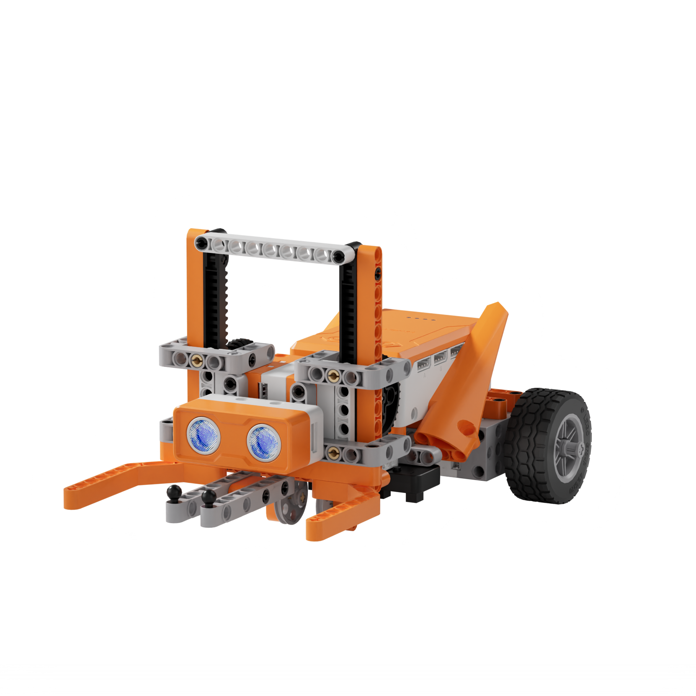
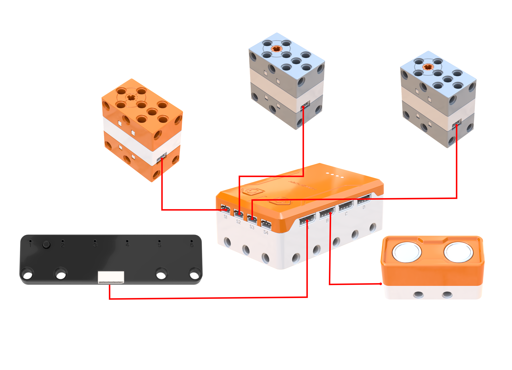
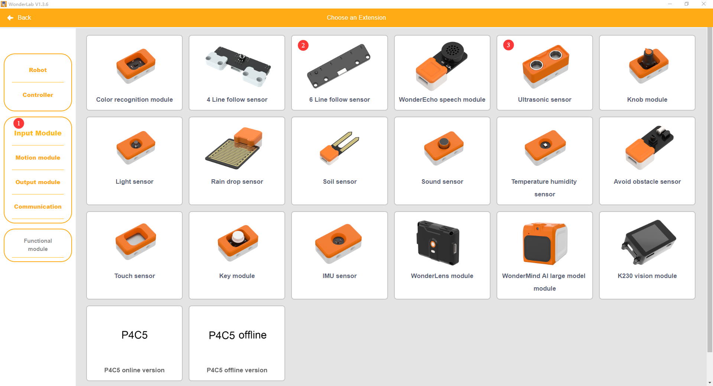
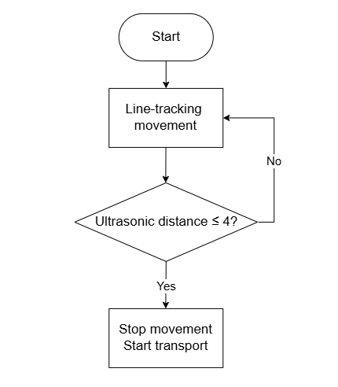
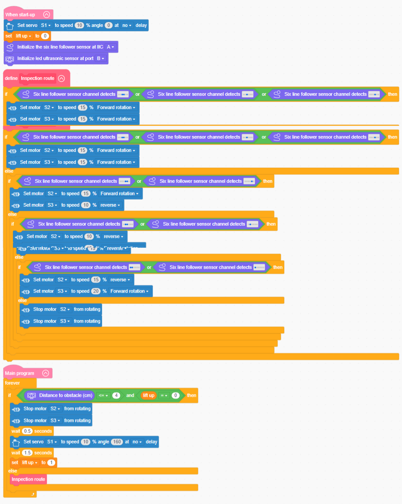

# 3.42 Transport Forklift

## 3.42.1 Lesson Introduction

Focusing on a smart transport forklift model, this lesson explores the coordinated programming pattern among dual motors, an ultrasonic sensor, and an elevating mechanism. It implements a comprehensive material handling workflow featuring line-tracking locomotion, cargo detection stopping, and automated lifting. The content illustrates rack-and-pinion transmission principles and differential line-following control methods. It applies sensory triggering alongside state variable logging logic to manage task progression. Additionally, it examines core engineering concepts behind industrial automated operations.

## 3.42.2 Learning Objectives

1. **Knowledge Objectives**: Understand rack-and-pinion transmission mechanisms, converting rotational motion into linear motion. Master dual-motor differential steering and trajectory-following control using the 6-channel line follower sensor. Understand ultrasonic distance sensing principles for cargo detection. Comprehend programming methodologies using state variables to log task progress.

2. **Skill Objectives**: Assemble the mechanical structure of the transport forklift independently, mastering servo calibration and rack-and-pinion alignment during installation. Construct dual-motor line-following routines with the 6-channel line follower sensor and encapsulate them into custom functions. Implement a complete handling workflow comprising ultrasonic cargo detection, halting, fork elevation, and resumed travel.

3. **Thinking Objectives**: Build mechanical transmission thinking that transforms rotational motion into linear displacement, understanding conversions between physical motion formats. Cultivate multi-system engineering integration awareness. Reinforce finite state machine programming logic, utilizing variables to track execution stages.

4. **Application Objectives**: Connect concepts to practical applications including factory forklifts, automated guided vehicles in logistics, elevator hoisting systems, and automotive steering gears. Appreciate the significance of automated logistics across modern industrial environments. Inspire exploration into industrial automation, logistics robotics, and mechanical power transmission.

## 3.42.3 Preparation

### (1) Hardware Preparation

- AiBlock controller

- 180° block servo

- 360° block motor

- 6-channel line follower sensor

- Ultrasonic sensor

- Building block parts pack

- Type-C data cable

- Assembly manual

- Black line-following map

- Simulated cargo block

- Computer

### (2) Software Preparation

- WonderLab graphical programming platform

## 3.42.4 Hands-On Project

### (1) Project Analysis

The core project of this lesson is the Transport Forklift, executing a fully automated operational workflow featuring line-following transit, automatic target identification, and elevated material handling. The system adopts a three-tier architecture combining line tracking, ultrasonic detection, and lifting transport. Dual motors differential-drive the vehicle forward along a black line, while a servo controls fork elevation through a rack-and-pinion transmission. The ultrasonic sensor detects cargo ahead. While unloaded, the vehicle maintains line-following locomotion. Upon detecting cargo, it halts and raises the fork, resuming line tracking once the lifting action completes. State machine logic manages task progression, modeling industrial automated guided vehicles, or AGVs, in a compact educational format.

### (2) Assembly Guide

<Pdf src="../../_static/shared/pdf/chapter_3/42.pdf" />

### (3) Hardware Wiring

- Connect the 180° block servo to port **S1** of the controller using a 3-pin servo cable.

- Connect the left 360° block motor to port **S2** of the controller using a 3-pin servo cable.

- Connect the right 360° block motor to port **S3** of the controller using a 3-pin servo cable.

- Connect the 6-channel line follower sensor to port **A** of the controller using a 4-pin module cable.

- Connect the ultrasonic sensor to port **B** of the controller using a 4-pin module cable.

### (4) Adding Extensions

- Select **6 Line follow sensor** and **Ultrasonic sensor** under the **Input Module** category.

- Select **180° servo** and **360° Motor** under the **Motion module** category.

### (5) Core Blocks

| Block | Category | Description |
| :---: | :---: | :--- |
|  |  | Create a custom function without parameters to encapsulate reusable program logic. |
|  |  | Call a defined parameterless function to execute all encapsulated program statements. |
|  |  | Serve as the main program loop container, continuously executing internal code after power-on initialization. |
|  |  | Execute only once after startup to initialize hardware configurations and system parameters. |
|  |  | Initialize the hardware connection port for the 6-channel line follower sensor. |
|  |  | Read the detection status across all six channels of the 6-channel line follower sensor to determine whether each channel identifies a black line or white surface, returning a Boolean value for line tracking. |
|  |  | Initialize the hardware connection port for the ultrasonic sensor. |
|  |  | Retrieve obstacle distance data measured by the ultrasonic sensor in centimeters (cm). |
|  |  | Drive the 360° block motor at a designated port to rotate continuously at a customized speed in the forward or reverse direction. |
|  |  | Stop power output to the 360° block motor at the designated port, immediately halting motor rotation. |
|  |  | Control the 180° block servo at the designated port to rotate for a specified duration at a customized speed. In non-blocking mode, the program proceeds immediately to subsequent blocks without waiting for motion completion. |

### (6) Program Description and Upload

- Program Schematic

- Complete Program

  Upon startup, the program initializes hardware ports for the 6-channel line follower sensor and ultrasonic sensor, setting the variable `lifted` to 0 to establish the initial forklift state. The main program executes continuously in a loop: if the ultrasonic sensor measures a forward distance of 4 cm or less while `lifted` equals 0, motors S2 and S3 stop. After a 0.5 s delay, servo S1 rotates to 180°. The program then pauses for 1.5 s and sets `lifted` to 1. When these conditions are not met, the program calls the custom line-tracking function. The line-tracking module utilizes the 6-channel line follower sensor to monitor the trajectory, controlling motors S2 and S3 to rotate forward or reverse at corresponding speeds to execute corrective steering based on channel detection results. Motors halt if no line signal is recognized.

- Program Upload

  Following the animation, click **Connect device**, select the serial port, then click the upload button to complete the program transfer and test the execution results.

> [!NOTE]
>
> **The source files are available for download under [Program Files](https://drive.google.com/drive/folders/1adJTOnyve2MmEehrB9YFSW8echTWwoF2?usp=sharing).**

## 3.42.5 Expansion and Challenge

**Project 1: Automated Unloading Smart Forklift**

Halt upon recognizing an unloading marker, lower the servo to deposit cargo, and reverse away to complete a full cycle of loading, transit, and unloading. Practice multi-state transitions and location identification while understanding sequential motion choreography across comprehensive operational workflows. Extend discussions to unmanned automated guided vehicle forklifts, smart warehouse logistics, and automated production lines.

**Project 2: Tiered Elevation Handling Forklift**

Utilize ultrasonic distance measurements to gauge cargo size, implementing lower elevation for small items and higher elevation for large items. Practice mathematical mapping between measured distance values and elevation heights while understanding parametric control concepts. Extend discussions to industrial robotic sorting operations and adaptive control systems.

## 3.42.6 Q&A

**Question 1: How does the rack-and-pinion mechanism lift the cargo fork straight up when the servo only rotates in circles?**

Answer: The mechanism relies on **interlocking teeth between the pinion gear and the gear rack to convert rotational motion into linear motion**. A servo shaft produces purely rotational movement. Mounting a circular toothed pinion gear directly onto the servo shaft meshes its teeth with a vertical straight bar lined with matching teeth, known as a gear rack. When the servo rotates the pinion gear, each advancing gear tooth sequentially engages and drives the matching teeth of the rack. Because the rack is restricted to a vertical guide track and cannot rotate, it can only slide upward or downward. This constraint converts the rotational motion of the pinion into the linear vertical displacement of the rack. With the fork rigidly affixed to the rack, raising the rack lifts the fork straight upward. Known as a rack-and-pinion transmission, this mechanism delivers smooth vertical travel and precise positional repeatability, serving widely across elevator hoistways, automotive steering linkages, and industrial machine tool stages. Because rack travel distance correlates directly with servo rotation angles, modulating servo angular positions achieves precise control over fork elevation height.

**Question 2: Why does the program require a state variable named "lifted", rather than lifting immediately whenever an obstacle is detected?**

Answer: Incorporating a state variable serves to **prevent repeated triggering and allow the system to track its active operating phase**. Without a state variable, the system would trigger the lifting routine continuously whenever the ultrasonic sensor detects a short distance. Once cargo is lifted, it remains directly ahead of the sensor. The sensor would continue reading a close distance and repeatedly issue lifting commands, causing software conflicts. Utilizing the variable `lifted` resolves this issue. When first detecting cargo, `lifted` equals 0, indicating that lifting has not yet occurred. The program executes the elevation sequence and subsequently updates `lifted` to 1. In subsequent loop iterations, even though the ultrasonic sensor still detects cargo in close proximity, the conditional evaluation recognizes that `lifted` already equals 1. The system recognizes that the cargo has been secured and bypasses repeated lifting, maintaining normal driving locomotion. In computer science, this mechanism represents a status flag or state marker, functioning like an automated logbook recording progress through operational steps. Multi-stage programs universally rely on variables to track operational states, such as elevators logging current floor levels, games recording stage completions, and e-commerce systems tracking payment statuses.

## 3.42.7 Technical Support and Product Discussion

To share creative ideas and projects after exploring this kit, visit the [Hiwonder Community](http://forum.hiwonder.com): forum.hiwonder.com

