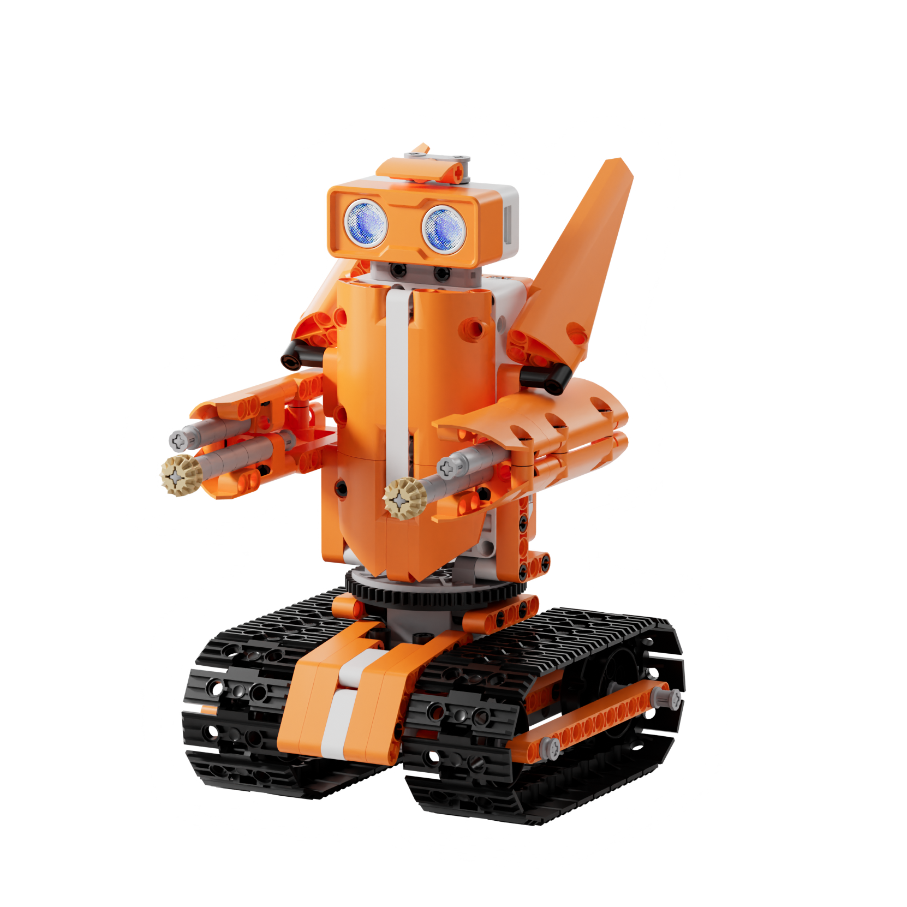
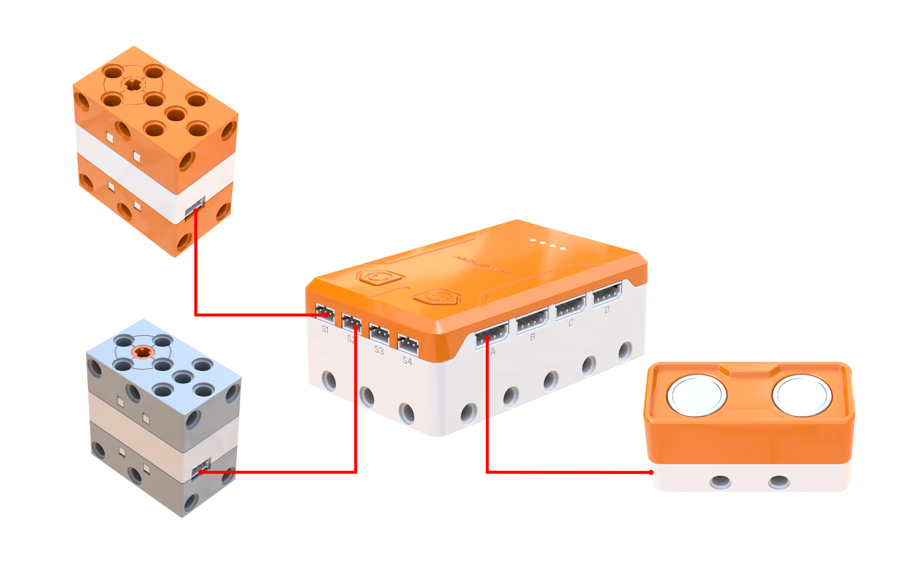
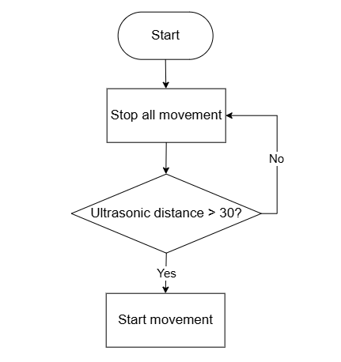
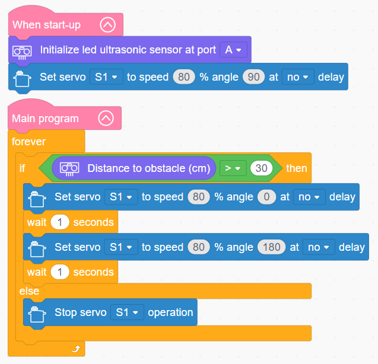

# 3.43 Tracked Tank

## 3.43.1 Lesson Introduction

Focusing on a smart tracked tank model, this lesson explores coordinated programming among a motor, a servo, and an ultrasonic sensor. It implements an autonomous patrol routine featuring scanning locomotion alongside emergency stopping when encountering barriers. The content illustrates continuous track off-road transmission mechanics and single-motor dual-track drivetrain structures. It applies oscillating turret sweeps alongside sensor-linked obstacle negotiation logic. Furthermore, it examines core robotics design principles integrating mobile platforms with dynamic perception scanning.

## 3.43.2 Learning Objectives

1. **Knowledge Objectives**: Understand structural characteristics and rough-terrain advantages of continuous track transmissions, analyzing relationships between ground pressure and contact surface area. Consolidate control logic combining reciprocal servo scanning with ultrasonic target detection. Understand system architectures uniting mobile drive chassis with rotating turret platforms.

2. **Skill Objectives**: Assemble the mechanical structure of the tracked tank independently, mastering servo zero-point calibration and turret alignment during installation. Construct basic routines to drive reciprocal left-to-right turret scanning. Implement an integrated functional routine combining continuous track drive, turret scanning, and obstacle-triggered stopping.

3. **Thinking Objectives**: Build dual-tier system thinking integrating mobile locomotion with rotational perception, understanding concurrent execution models for driving and scanning. Develop engineering analysis capabilities for tracked locomotion mechanisms. Reinforce comprehensive programming methodologies coordinating sensors with dynamic actuation systems.

4. **Application Objectives**: Connect concepts to practical applications including construction excavators, explosive ordnance disposal robots, planetary rovers, and specialized rough-terrain vehicles. Appreciate the engineering value of tracked mobile chassis in hazardous, irregular terrains. Inspire interest in specialized heavy machinery, exploration robotics, and advanced engineering equipment.

## 3.43.3 Preparation

### (1) Hardware Preparation

- AiBlock controller

- 360° block motor

- 180° block servo

- Ultrasonic sensor

- Building block parts pack

- Type-C data cable

- Assembly manual

- Computer

### (2) Software Preparation

- WonderLab graphical programming platform

## 3.43.4 Hands-On Project

### (1) Project Analysis

The core project of this lesson is the Tracked Tank, delivering an autonomous patrol system that scans the environment while advancing and halts immediately upon encountering barriers. The system employs a dual-tier coordinated architecture combining tracked locomotion with a rotating turret. Motor S2 drives both continuous tracks forward, while servo S1 sweeps the turret reciprocally between 0° and 180°, allowing the mounted ultrasonic sensor to scan synchronously across the field of view. The decision layer evaluates measured clearance: when distances exceed 30 cm, the vehicle maintains forward locomotion and scanning sweeps. When clearance drops to 30 cm or less, both the motor and servo halt immediately, simulating target acquisition and emergency position locking during reconnaissance patrol.

### (2) Assembly Guide

<Pdf src="../../_static/shared/pdf/chapter_3/43.pdf" />

### (3) Hardware Wiring

- Connect the 180° block servo to port **S1** of the controller using a 3-pin servo cable.

- Connect the 360° block motor to port **S2** of the controller using a 3-pin servo cable.

- Connect the ultrasonic sensor to port **A** of the controller using a 4-pin module cable.

### (4) Adding Extensions

- Select **Ultrasonic sensor** under the **Input Module** category.

- Select **180° servo** and **360° Motor** under the **Motion module** category.

### (5) Core Blocks

| Block | Category | Description |
| :---: | :---: | :--- |
|  |  | Serve as the main program loop container, continuously executing internal code after power-on initialization. |
|  |  | Execute only once after startup to initialize hardware configurations and system parameters. |
|  |  | Initialize the hardware connection port for the ultrasonic sensor. |
|  |  | Retrieve obstacle distance data measured by the ultrasonic sensor in centimeters (cm). |
|  |  | Drive the 360° block motor at a designated port to rotate continuously at a customized speed in the forward or reverse direction. |
|  |  | Stop power output to the 360° block motor at the designated port, immediately halting motor rotation. |
|  |  | Control the 180° block servo at the designated port to rotate for a specified duration at a customized speed. In non-blocking mode, the program proceeds immediately to subsequent blocks without waiting for motion completion. |
|  |  | Cut off power output to the 180° block servo at the designated port, halting servo movement immediately. |

### (6) Program Description and Upload

- Program Schematic

- Complete Program

  Upon startup, the program initializes the hardware port for the ultrasonic sensor. When no obstacle is detected ahead and obstacle clearance exceeds 30 cm, the tracked tank drives forward continuously while sweeping laterally to monitor the surrounding environment. If an obstacle is detected within 30 cm, forward travel halts immediately and the turret locks in its current leftward or rightward orientation.

- Program Upload

  Following the animation, click **Connect device**, select the serial port, then click the upload button to complete the program transfer and test the execution results.

> [!NOTE]
>
> **The source files are available for download under [Program Files](https://drive.google.com/drive/folders/1adJTOnyve2MmEehrB9YFSW8echTWwoF2?usp=sharing).**

## 3.43.5 Expansion and Challenge

**Project 1: Automated Target Alignment and Alert Tank**

Fine-tune turret alignment to center upon detected targets, flashing an RGB red LED and sounding a buzzer alert before resuming patrol after several seconds. Practice an operational workflow of target acquisition, precision centering, and alert signaling while understanding target tracking and sequential timing control. Extend discussions to tracking gimbals, automated alignment systems, and surveillance camera mechanisms.

**Project 2: Dual-Motor Differential Steering Tank**

Drive the left and right continuous tracks using independent motors to execute a differential right turn around obstacles, resuming patrol once clear. Practice dual-motor differential steering control and understand tracked chassis maneuverability. Extend discussions to zero-radius pivoting in tracked loaders, excavator steering mechanics, and heavy machinery power distribution.

## 3.43.6 Q&A

**Question 1: Why do tanks and heavy vehicles employ continuous tracks instead of wheels, and what are their primary advantages?**

Answer: Continuous tracks offer three fundamental advantages. First, **lower ground pressure prevents sinking**. The surface contact area of a continuous track is vastly larger than that of conventional tires. Distributing vehicle mass across this broad contact area substantially lowers pressure exerted upon the ground, preventing the vehicle from bogging down in mud, sand, or snow where wheeled vehicles quickly become immobilized. Second, **tracks deliver superior terrain-crossing capability**. A continuous track spans across trenches, climbs over ledges, and negotiates rocks without getting trapped in crevices. Third, **tracks provide high traction without slipping**. Molded grousers and cleats on tracks generate strong frictional engagement with loose terrain, ensuring dependable grip when climbing steep inclines or launching under heavy loads. Consequently, heavy equipment such as excavators, bulldozers, and planetary exploration rovers utilize continuous tracks when operating across challenging environments. In summary, wheels excel at high-speed transit on paved roads, whereas continuous tracks provide stable traction across unstructured terrain.

**Question 2: How does the software concurrently drive the continuous tracks forward while oscillating the turret from side to side?**

Answer: The motor and servo function as **independent physical actuators**, each executing received instructions autonomously without mutual interference. When the program commands the drive motor to rotate forward, the motor maintains continuous forward drive. Concurrently, when the program directs the servo to rotate toward a specific target angle, the servo drives to that position independently. Operating both actuators simultaneously achieves simultaneous driving and lateral scanning. Sequential execution mechanics govern the underlying routine. Within the else branch, the program directs the servo to rotate to 0° and pause for 1 s, then rotate to 180° and pause for 1 s. Throughout this scanning duration, the motor continues running in its previously commanded forward state because no halting command has been issued. Although software blocks execute line by line, once activated, the motor maintains its drive state while the servo oscillates between its limits, generating the combined effect of forward transit with dynamic scanning. This represents a key characteristic of multi-actuator robotics, where each hardware module preserves its internal operating state without demanding continuous software polling.

## 3.43.7 Technical Support and Product Discussion

To share creative ideas and projects after exploring this kit, visit the [Hiwonder Community](http://forum.hiwonder.com): forum.hiwonder.com

