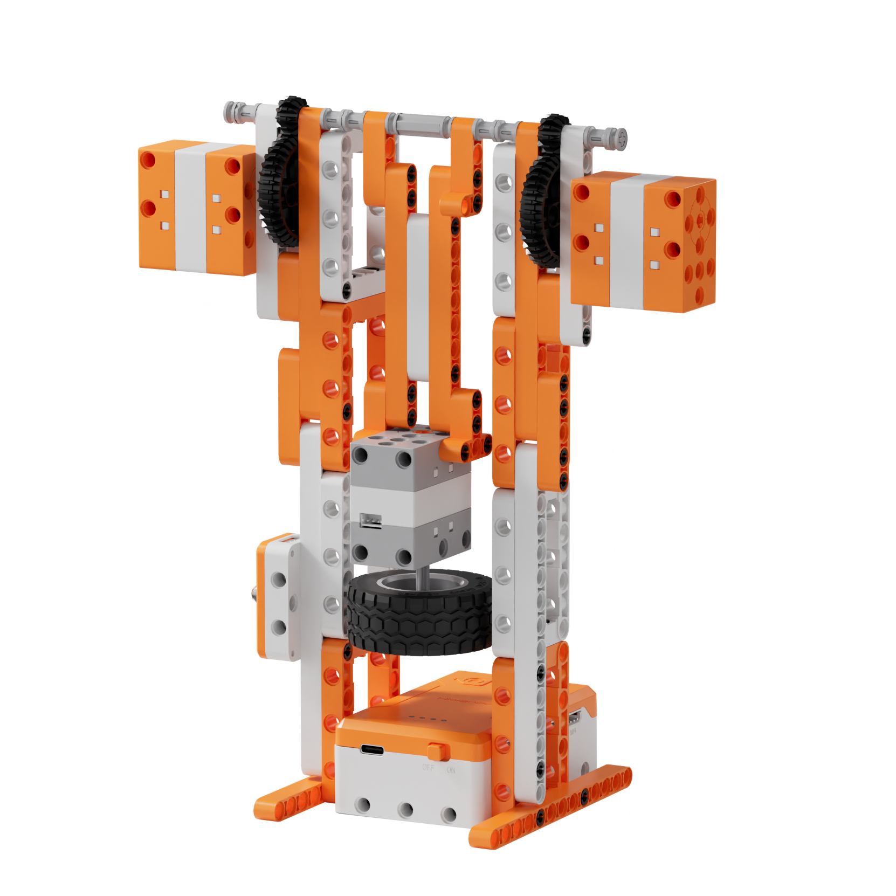
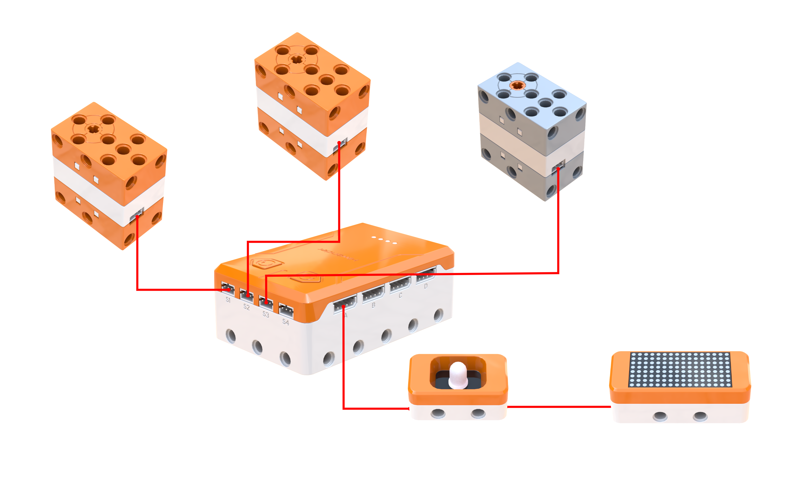
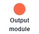
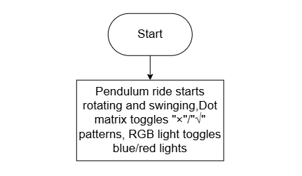
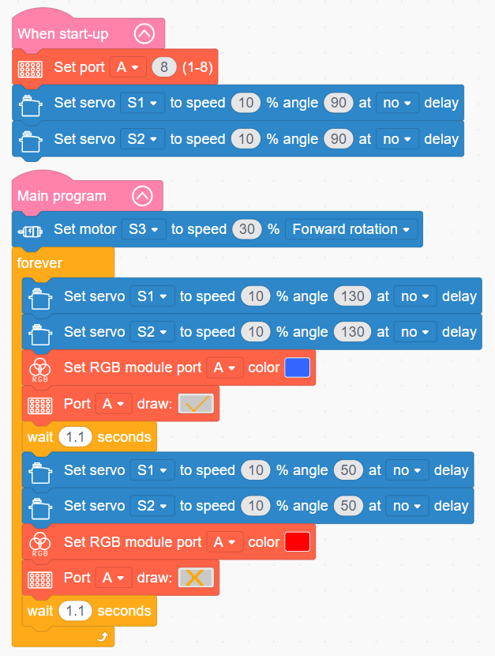

# 3.46 Thrill Pendulum Ride

## 3.46.1 Lesson Introduction

Focusing on a compound-motion giant pendulum ride model, this lesson explores coordinated programming among dual servos, a motor, and audiovisual modules. It achieves an immersive amusement park attraction featuring concurrent swinging and self-rotation, complemented by alternating lighting effects. The content illustrates compound gear transmission mechanics alongside dual-servo synchronized control methods. It applies mechanical regulation logic for composite motion. Furthermore, it examines core engineering design concepts combining multi-degree-of-freedom kinematics with atmospheric sensory feedback in amusement rides.

## 3.46.2 Learning Objectives

1. **Knowledge Objectives**: Understand power transmission mechanics in compound gear trains, superimposing concurrent swinging and rotational motion. Master collaborative control methods for dual-servo synchronized oscillation. Understand correlations between motor speed settings and actual rotational velocity. Explore design logic using alternating RGB lighting to build thematic atmospheric tension.

2. **Skill Objectives**: Assemble the complex mechanical structure of the thrill pendulum ride independently, mastering dual-servo zero-point calibration during installation. Construct basic compound-motion routines coordinating dual-servo synchronized swinging with motor rotation. Implement an integrated routine combining swinging, spinning, alternating red and blue RGB illumination, and dot matrix graphic displays.

3. **Thinking Objectives**: Build system thinking for multi-degree-of-freedom composite motion, understanding kinematic superposition of rotation and oscillation. Develop programming methodologies for dual-actuator synchronized control. Strengthen creative design capabilities for multi-sensory thematic environments.

4. **Application Objectives**: Connect concepts to amusement park attractions including pendulum rides, Ferris wheels, and spinning swing rides. Understand the engineering applications of multi-degree-of-freedom mechanisms in amusement ride design. Inspire exploration into theme park engineering, ride attraction design, and creative mechanical automation.

## 3.46.3 Preparation

### (1) Hardware Preparation

- AiBlock controller

- 180° block servo

- 360° block motor

- RGB light module

- Dot matrix module

- Building block parts pack

- Type-C data cable

- Assembly manual

- Computer

### (2) Software Preparation

- WonderLab graphical programming platform

## 3.46.4 Hands-On Project

### (1) Project Analysis

The core project of this lesson is the Thrill Pendulum Ride, delivering a dynamic amusement experience that superimposes rotation, oscillation, and chromatic lighting. The system adopts an architecture combining dual-servo swinging, motor rotation, and atmospheric audiovisual effects. Dual servos oscillate synchronously between 50° and 130°, while a motor drives the entire assembly to spin continuously, superimposing their motion into a complex spiral trajectory. The RGB module flashes between red and blue while the dot matrix module renders thematic graphics, reinforcing an atmospheric environment. Once activated, rotation and swinging operate concurrently while audiovisual elements synchronize with the rhythm, authentically recreating the dynamic thrill of a giant pendulum ride.

### (2) Assembly Guide

<Pdf src="../../_static/shared/pdf/chapter_3/46.pdf" />

### (3) Hardware Wiring

- Connect the left 180° block servo to port **S1** of the controller using a 3-pin servo cable.

- Connect the right 180° block servo to port **S2** of the controller using a 3-pin servo cable.

- Connect the 360° block motor to port **S3** of the controller using a 3-pin servo cable.

- Connect the dot matrix module to the RGB light module using a 4-pin module cable, then connect the assembly to port **A** of the controller using another 4-pin module cable.

### (4) Adding Extensions

- Select **180° servo** and **360° Motor** under the **Motion module** category.

- Select **Dot matrix module** and **RGB module** under the **Output module** category.

### (5) Core Blocks

| Block | Category | Description |
| :---: | :---: | :--- |
|  |  | Serve as the main program loop container, continuously executing internal code after power-on initialization. |
|  |  | Execute only once after startup to initialize hardware configurations and system parameters. |
|  |  | Drive the 360° block motor at a designated port to rotate continuously at a customized speed in the forward or reverse direction. |
|  |  | Control the 180° block servo at the designated port to rotate for a specified duration at a customized speed. In non-blocking mode, the program proceeds immediately to subsequent blocks without waiting for motion completion. |
|  |  | Adjust the backlight brightness of the dot matrix screen at the designated port across a range of 1 to 8, with higher values providing brighter illumination. |
|  |  | Control the dot matrix module at the designated port to load and display preset graphic patterns. |
|  |  | Control the RGB light module at the designated port to illuminate in preset colors. |

### (6) Program Description and Upload

- Program Schematic

- Complete Program

  Upon startup, the program initializes the brightness of the dot matrix screen, establishing the initial state of the ride. In the main loop, motor S3 rotates forward at 30% speed to spin the ride structure, and servos S1 and S2 oscillate repeatedly between 130° and 50° at 10% speed to swing the pendulum arm. Concurrently, the RGB light module alternates synchronously between red and blue, and the dot matrix module displays alternating checkmark and cross patterns.

- Program Upload

  Following the animation, click **Connect device**, select the serial port, then click the upload button to complete the program transfer and test the execution results.

> [!NOTE]
>
> **The source files are available for download under [Program Files](https://drive.google.com/drive/folders/1adJTOnyve2MmEehrB9YFSW8echTWwoF2?usp=sharing).**

## 3.46.5 Expansion and Challenge

**Project 1: Progressive Acceleration Pendulum Ride**

Increment motor rotation speed and expand servo swinging angles upon each completed oscillation, gradually ramping up to full-speed, maximum-amplitude operation. Practice dual-parameter dynamic modulation and progressive attraction profiling while understanding safety considerations in ride acceleration. Extend discussions to roller coaster lift hill mechanics and gradual acceleration staging in large-scale park attractions.

**Project 2: Audio-Enhanced Thematic Pendulum Ride**

Integrate a buzzer to play low-pitch ambient tones, raising the audio pitch when the pendulum reaches peak elevation to heighten dramatic tension alongside synchronized lighting and pattern shifts. Practice audio-kinetic synchronization and multi-sensory immersive attraction design. Extend discussions to themed dark rides, four-dimensional theater effects, and virtual reality amusement simulations.

## 3.46.6 Q&A

**Question 1: Why does the thrill pendulum ride require two servos rather than a single servo to drive oscillation?**

Answer: Dual servos provide **structural force balance and smooth swinging locomotion**. The pendulum arm spans horizontally across two side supports. If only a single servo powers one side while the opposite side remains unpowered, force applies unevenly across the structural span. This torque asymmetry causes mechanical binding, wobbling, and excessive torsional strain on the drive shaft. Installing independent servos on both sides to drive the arm synchronously distributes structural loads evenly across both pivot points. This arrangement delivers smooth, balanced oscillation without jamming, while providing combined torque capable of swinging heavier payloads. Both servos must maintain precise synchronization, matching identical rotation angles and velocities. In mechanical engineering, this concept is known as dual-drive synchronization. It serves widely in high-load and wide-span applications, including industrial overhead gates, scissor lifts, and movable bridge spans, ensuring balanced operational stability.

**Question 2: How does the thrill pendulum ride execute concurrent rotation and swinging smoothly without mechanical interference?**

Answer: The system relies on **two independent transmission drivetrains operating concurrently without mutual interference**. Rotation represents one drivetrain: motor S3 drives the entire support assembly and pendulum arm through gears, producing collective revolution around the central vertical axis. Swinging represents an independent drivetrain: dual servos directly oscillate the crossbeam, producing localized angular swing. These two drivetrains remain mechanically decoupled: the motor rotates the primary structure while the servos oscillate the pendulum arm, combining seamlessly through a compound gear assembly without cross-torque interference. Software routines also manage these operations independently. Once commanded to start, the continuous motor runs uninterrupted, while the servo routine executes an ongoing oscillation loop. Operating both routines concurrently produces a composite kinematic motion. The physical superposition of circular rotation and vertical swinging generates a complex three-dimensional helical trajectory, delivering an engaging multi-axis experience that surpasses simple single-axis swinging.

## 3.46.7 Technical Support and Product Discussion

To share creative ideas and projects after exploring this kit, visit the [Hiwonder Community](http://forum.hiwonder.com): forum.hiwonder.com

