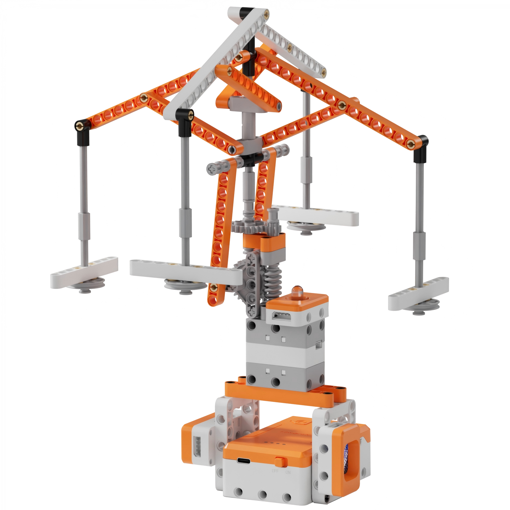
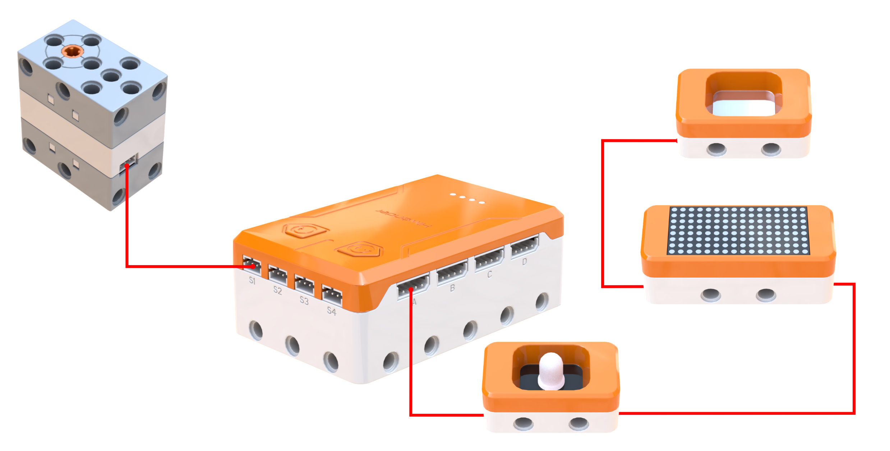
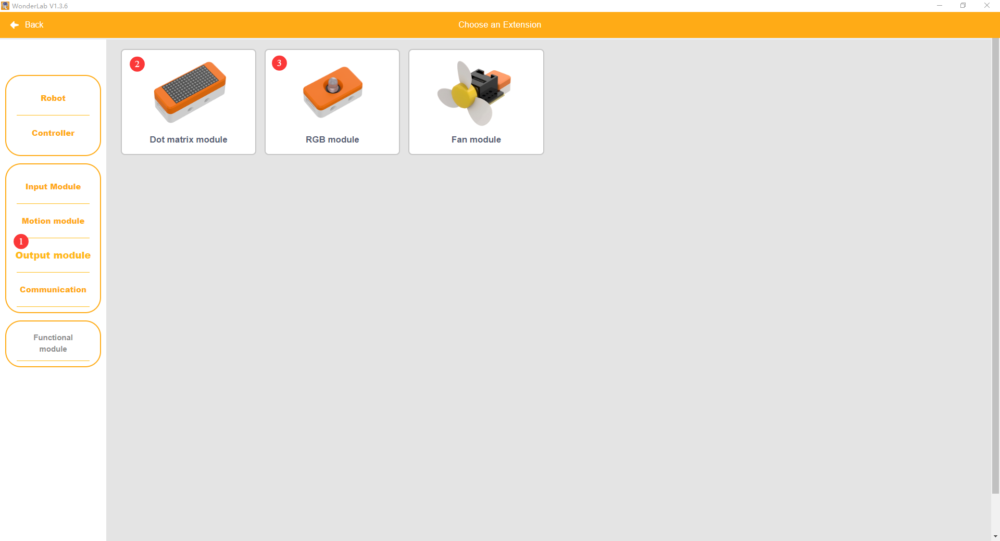
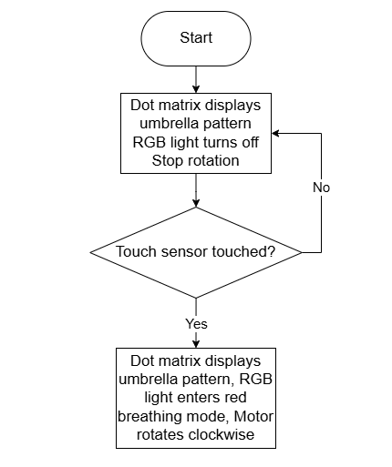
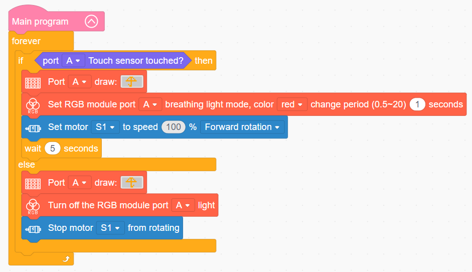

# 3.47 Spinning Swing Ride

## 3.47.1 Lesson Introduction

Focusing on a spinning swing ride model, this lesson explores coordinated programming among a motor, a touch sensor, and audiovisual modules. It implements an interactive amusement park routine featuring touch activation, centrifugal chair expansion, and synchronized lighting. The content illustrates worm gear transmission mechanics alongside physical properties of centrifugal force. It covers touch-activated start-stop control methods alongside multi-module coordinated logic. Furthermore, it examines core design principles uniting mechanical structures, physical phenomena, and responsive user interaction.

## 3.47.2 Learning Objectives

1. **Knowledge Objectives**: Understand transmission mechanics of worm gear mechanisms, focusing on speed reduction and torque multiplication. Master the physics of centrifugal force, analyzing relationships between rotational velocity and flare angles. Understand operating principles and triggering mechanisms of the touch sensor. Learn daisy-chain wiring methods where multiple modules share an interface port.

2. **Skill Objectives**: Assemble the mechanical structure of the spinning swing ride independently, mastering worm gear assembly techniques. Construct basic motor routines to drive smooth ride rotation. Implement a complete interactive sequence comprising touch activation, 5 s rotation, automated stopping, RGB illumination, and dot matrix graphics.

3. **Thinking Objectives**: Build transmission system thinking by tracing power input, torque multiplication, and motion output, and understand the engineering significance of speed reduction mechanisms. Cultivate observation and analytical skills regarding centrifugal physical phenomena. Strengthen product design thinking centered on tactile touch interactions.

4. **Application Objectives**: Connect concepts to centrifugal force applications including spinning swing rides, washing machine spin cycles, laboratory centrifuges, and rotating umbrellas. Understand widespread uses of worm gears across elevators, roll-up shutter doors, and industrial speed reducers. Inspire exploration into amusement engineering, physical phenomena, and mechanical power transmission.

## 3.47.3 Preparation

### (1) Hardware Preparation

- AiBlock controller

- 360° block motor

- RGB light module

- Dot matrix module

- Touch sensor

- Building block parts pack

- Type-C data cable

- Assembly manual

- Computer

### (2) Software Preparation

- WonderLab graphical programming platform

## 3.47.4 Hands-On Project

### (1) Project Analysis

The core project of this lesson is the Spinning Swing Ride, delivering an interactive attraction featuring touch-to-start activation, centrifugal chair expansion, and timed automatic stopping. The system adopts an architecture combining worm gear speed reduction, centrifugal chair flaring, and touch-activated control. After speed reduction and torque multiplication through a worm gear, the motor smoothly rotates the central column. Under centrifugal force, four hanging swing chairs flare outward automatically. Higher rotational velocities produce wider flare angles, shaping an umbrella-like canopy. Touching the sensor triggers operation, while an RGB red breathing light and an umbrella-themed dot matrix display establish an engaging atmosphere. The ride halts automatically after 5 s, combining physical phenomena with mechanical engineering.

### (2) Assembly Guide

<Pdf src="../../_static/shared/pdf/chapter_3/47.pdf" />

### (3) Hardware Wiring

- Connect the 360° block motor to port **S1** of the controller using a 3-pin servo cable.

- Connect the touch sensor to the dot matrix module using a 4-pin module cable, connect the dot matrix module to the RGB light module using another 4-pin module cable, then connect the combined modules to port **A** of the controller using a third 4-pin module cable.

### (4) Adding Extensions

- Select **Touch sensor** under the **Input Module** category.

- Select **360° Motor** under the **Motion module** category.

- Select **Dot matrix module** and **RGB module** under the **Output module** category.

### (5) Core Blocks

| Block | Category | Description |
| :---: | :---: | :--- |
|  |  | Serve as the main program loop container, continuously executing internal code after power-on initialization. |
|  |  | Read the detection status of the touch sensor at the designated port, returning a Boolean value to determine whether human touch is detected. |
|  |  | Drive the 360° block motor at a designated port to rotate continuously at a customized speed in the forward or reverse direction. |
|  |  | Stop power output to the 360° block motor at the designated port, immediately halting motor rotation. |
|  |  | Control the dot matrix module at the designated port to load and display preset graphic patterns. |
|  |  | Control the RGB light module at the designated port to activate a breathing color cycle, with customizable transition periods. |
|  |  | Turn off the RGB light module at the designated port, cutting off light output. |

### (6) Program Description and Upload

- Program Schematic

- Complete Program

  When the touch sensor is touched, the motor rotates at 100% speed to spin the ride, the RGB light module pulses red with a 1 s breathing cycle, and the dot matrix module displays an open umbrella pattern. Otherwise, rotation stops, the RGB light module turns off, and the dot matrix module switches to an alternative umbrella graphic pattern.

- Program Upload

  Following the animation, click **Connect device**, select the serial port, then click the upload button to complete the program transfer and test the execution results.

> [!NOTE]
>
> **The source files are available for download under [Program Files](https://drive.google.com/drive/folders/1adJTOnyve2MmEehrB9YFSW8echTWwoF2?usp=sharing).**

## 3.47.5 Expansion and Challenge

**Project 1: Variable-Speed Spinning Swing Ride**

Ramp motor speed gradually from low velocity to 100% upon startup, maintain maximum speed briefly, and decelerate smoothly to a complete stop, shifting RGB colors from blue to green to red to indicate acceleration phases. Practice progressive velocity choreography while understanding soft-start safety engineering in amusement attractions. Extend discussions to smooth acceleration profiles in carousels and observation Ferris wheels.

**Project 2: Musical Spinning Swing Ride**

Program a buzzer to play carnival melodies while rotating, synchronizing musical tempo with RGB light flashes throughout the entire operational cycle. Practice matching musical duration with mechanical runtimes while understanding how background audio enhances immersive visitor experiences. Extend discussions to theme park soundscapes and carousel music box mechanisms.

## 3.47.6 Q&A

**Question 1: Why do the swing chairs flare outward when the ride spins, and what physical force causes this expansion?**

Answer: The chairs flare outward due to **centrifugal force**. When an object moves in a circular path, inertia creates a tendency to move outward along a tangential straight line, generating an apparent outward force known as centrifugal force. As the central column spins, each swing chair tends to travel outward in a straight line, but is constrained by its suspending arm and link pin. Consequently, the chair tilts and expands outward as if pulled by an invisible outward tension. Faster rotational speeds generate greater centrifugal force, producing a wider flare angle that lifts the chairs higher into a flatter horizontal plane. When rotation halts, centrifugal force ceases, and gravitational force pulls the chairs vertically downward into rest. Real-world applications of centrifugal force are widespread: washing machines spin rapidly to extract water droplets from clothes, twirling a wet umbrella flings water droplets away from the canopy rim, and passengers experience an outward pull during roller coaster turns. The spinning swing ride in this lesson embodies this foundational physical phenomenon within an interactive mechanical model.

**Question 2: Why does the ride utilize a worm gear mechanism rather than driving the column directly with a motor?**

Answer: A worm gear mechanism delivers two vital engineering benefits: **speed reduction with torque multiplication, and reverse self-locking**. In terms of speed reduction and torque multiplication, standard motors rotate at high velocities but produce limited rotational torque. Driving the heavy swing structure directly would overload the motor, and excessive speeds would compromise operational safety. The worm gear functions as a high-ratio speed reducer where numerous revolutions of the worm screw advance the worm gear by only a fraction of a turn. This reduction lowers output speed while multiplying mechanical torque, enabling a compact motor to spin multiple chairs smoothly. In terms of reverse self-locking, motion transmits solely from the worm screw to the worm gear. External manual forces applied to the chairs cannot backdrive the worm screw, preventing uncontrolled freewheeling or reverse spin when power cuts off. These dual properties make worm gear transmissions essential across elevators, roll-up gates, hoists, and amusement rides that demand high torque alongside reliable fail-safe operation.

## 3.47.7 Technical Support and Product Discussion

To share creative ideas and projects after exploring this kit, visit the [Hiwonder Community](http://forum.hiwonder.com): forum.hiwonder.com

