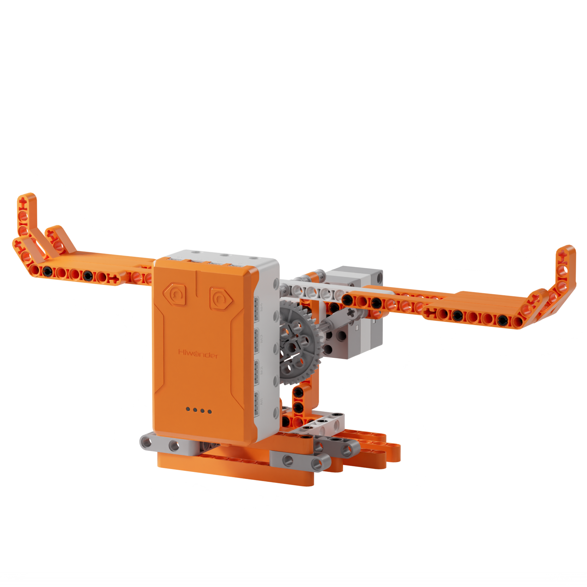
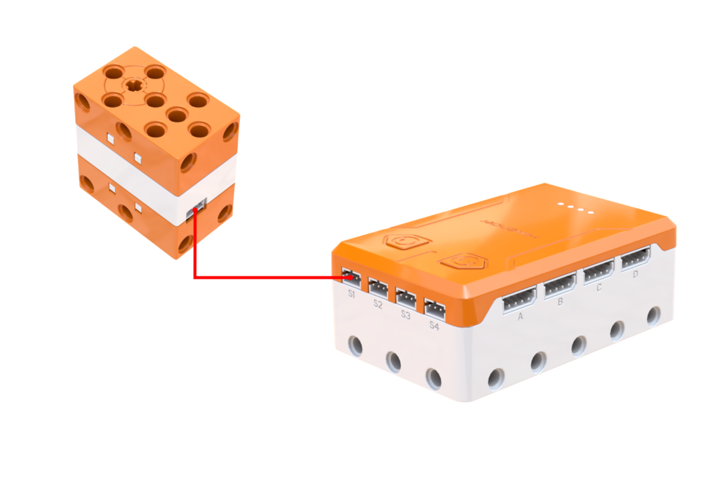
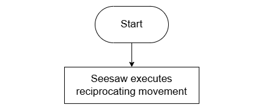
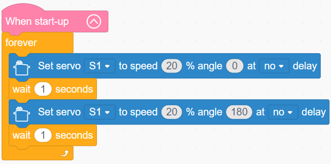

# 3.5 Lever Seesaw

## 3.5.1 Lesson Introduction

Taking inspiration from playground seesaws, this lesson guides the assembly of a servo-driven automated seesaw. The lesson explains the three elements of a lever, center-of-gravity balance, and structural stabilization techniques. Combining servo operation with loop programming, adjusting parameters alters the swinging rhythm. Integrating mechanical physics with coding, it demonstrates lever equilibrium patterns visually and establishes a solid foundation in structural assembly and servo control.

## 3.5.2 Learning Objectives

1. **Knowledge Objectives**: Master the three elements of a lever: fulcrum, effort point, and load point. Understand center-of-gravity balance and structural stability principles. Reinforce servo control and loop programming knowledge.

2. **Skill Objectives**: Complete building block assembly of the seesaw independently. Mount and calibrate the servo properly. Program reciprocating swing routines. Adjust parameters to modify swinging speed.

3. **Thinking Objectives**: Build mechanical awareness of levers. Understand force amplification along lever arms. Cultivate structural design awareness. Form engineering thinking oriented toward iterative parameter tuning.

4. **Application Objectives**: Identify diverse lever tools in daily life. Recognize the practical utility of levers in everyday tools and machinery. Stimulate curiosity in exploring basic physical mechanics.

## 3.5.3 Preparation

### (1) Hardware Preparation

- AiBlock controller

- 180° block servo

- Building block parts pack

- Type-C data cable

- Assembly manual

- Computer

### (2) Software Preparation

- WonderLab Graphical Programming Platform

## 3.5.4 Hands-On Project

### (1) Project Analysis

The core project for this lesson is the motorized lever seesaw, where a servo drives a long beam to pivot around a fulcrum via a connecting rod. The mechanism applies lever principles, with the servo oscillating between 0° and 180° to convert rotational motion into vertical see-saw swinging. The program uses a loop to rotate the servo to 0°, hold for 1 s, rotate to 180°, hold for 1 s, and repeat for sustained motion. Assembly requires ensuring a wide base and a sturdy pivot. Modifying angles alters swinging amplitude, while changing wait times adjusts cycle speed, visually illustrating how parameters govern mechanical movement.

### (2) Assembly Guide

<Pdf src="../../_static/shared/pdf/chapter_3/5.pdf" />

### (3) Hardware Wiring

- Connect the 180° block servo to port **S1** of the controller using a 3-pin servo cable.

### (4) Adding Extensions

- Select **180° servo** under the **Motion module** category.

### (5) Core Blocks

| Block | Category | Description |
| :---: | :---: | :--- |
|  |  | Rotates the specified servo to a target angle at a set speed |

### (6) Program Description and Upload

- Program Schematic

- Complete Program

  After powering on, the program enters an infinite loop. Within the loop, it first commands servo S1 to rotate without delay to 0° at 20% speed, waits 1 s, then commands servo S1 to rotate without delay to 180° at 20% speed, waits another 1 s, and repeats this rotation cycle continuously.

- Program Upload

  Following the animation, click **Connect device**, select the serial port, then click the upload button to upload the program to the controller and test the execution results.

> [!NOTE]
>
> **The source files are available for download under [Program Files](https://drive.google.com/drive/folders/1xyD_-3msc3KcaGQHLqkcPOZNSNXFIirT?usp=sharing).**

## 3.5.5 Expansion and Challenge

**Project 1: Dual-Speed Switchable Seesaw**

Add button control: pressing the left button switches to a gentle swing mode featuring smaller angles and longer waits, while pressing the right button switches to a brisk swing mode featuring larger angles and shorter waits. Use a variable to track the active mode, update the variable upon button presses, and execute corresponding swing parameters. This exercises variable-driven state switching and multi-mode programming, providing different operating modes like real amusement rides.

**Project 2: Self-Balancing Scale**

Reconfigure the seesaw into a scale balance with small trays at both ends. Add an ultrasonic sensor to detect when the beam tilts excessively toward either extreme. When one side dips too low, the servo adjusts position automatically to restore balance. This simulates automated balancing systems, introduces feedback control concepts, and practices closed-loop regulation through sensor feedback and servo fine-tuning.

## 3.5.6 Q&A

**Question 1: What are the three elements of a lever? Where are they located on the seesaw?**

Answer: A lever consists of three basic elements: the fulcrum, the effort point, and the load point. The **fulcrum** is the fixed pivot around which the lever rotates, represented by the central axle on the seesaw where the entire plank pivots. The **effort point** is where the driving force is applied, represented by the connection point where the servo linkage pushes the seesaw arm. The **load point** is where resistance or weight acts, represented by the ends where riders sit or loads rest. These three elements jointly determine how the lever operates. Varying their relative positions allows a lever to save effort, save distance, or change the direction of force.

**Question 2: How can the seesaw be made to swing faster or slower? Which parameters can be adjusted?**

Answer: Three parameters regulate the swinging rhythm. First is **servo speed**: higher speed percentages cause the servo to turn faster, producing sharper swinging motions, whereas lower speeds yield a gentle sway. Second is **wait duration**: longer pauses at each end increase total cycle time for a slower cadence, whereas shorter pauses accelerate transitions. Third is **swing angle**: a wide angle span, such as 0° to 180°, covers a larger travel distance and takes more time per cycle, whereas a narrower span moves faster. Slow swinging combines low speed, long waits, and small angles, whereas rapid swinging combines high speed, short waits, and large angles, enabling diverse rhythm configurations.

## 3.5.7 Technical Support and Product Discussion

To share creative ideas and projects after exploring this kit, visit the [Hiwonder Community](http://forum.hiwonder.com): forum.hiwonder.com

