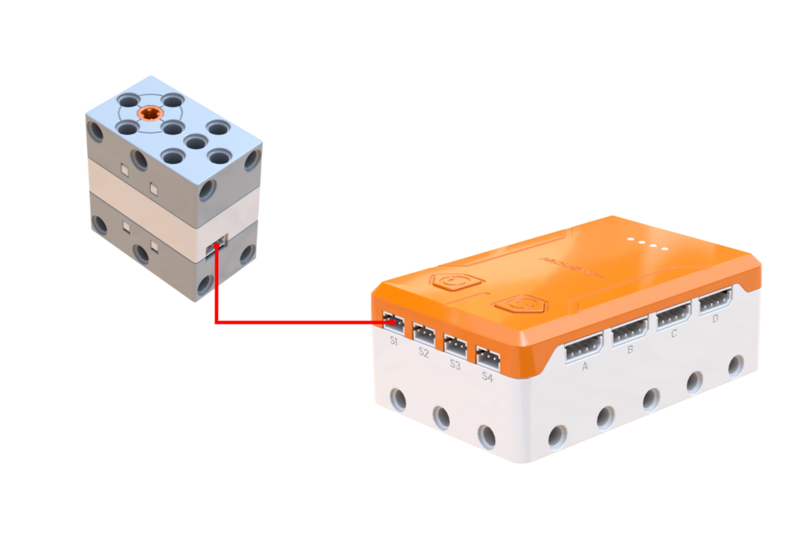
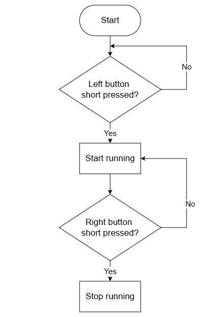
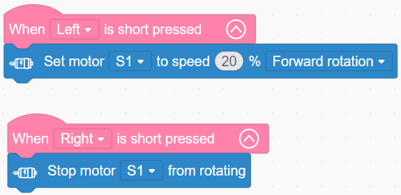

# 3.7 Rotating Swing Ride

## 3.7.1 Lesson Introduction

Inspired by amusement park swing rides, this lesson guides the assembly of a miniature motorized rotating swing ride. The lesson introduces physical principles related to centrifugal force, covers multi-speed motor programming, and teaches structural balance assembly techniques. Hands-on testing demonstrates the relationship between rotational speed and swing flare angle, establishing a cause-and-effect understanding between speed, force, and physical form while solidifying the foundation for dynamic mechanical builds.

## 3.7.2 Learning Objectives

1. **Knowledge Objectives**: Understand the concept and generation of centrifugal force. Master the laws of force equilibrium. Recognize the positive correlation between rotational speed and centrifugal force. Consolidate motor speed control programming.

2. **Skill Objectives**: Assemble the complete rotating swing ride independently. Program multi-speed motor regulation proficiently. Adjust rotational speeds to observe and verify changes in swing flare angles.

3. **Thinking Objectives**: Establish physical thinking regarding circular motion and centrifugal force. Understand force equilibrium logic. Cultivate causal reasoning and engineering awareness of structural balance.

4. **Application Objectives**: Identify diverse applications of centrifugal force in everyday life and industry. Understand the practical utility of rotary motion to stimulate curiosity about physical phenomena.

## 3.7.3 Preparation

### (1) Hardware Preparation

- AiBlock controller

- 360° block motor

- Building block parts pack

- Type-C data cable

- Assembly manual

- Computer

### (2) Software Preparation

- WonderLab Graphical Programming Platform

## 3.7.4 Hands-On Project

### (1) Project Analysis

The core project for this lesson is an electric rotating swing ride, where a motor drives a turntable to rotate, causing the suspended chairs to flare outward due to centrifugal force. The underlying physics involves force equilibrium: each chair experiences gravity, tension, and centrifugal force, stabilizing at a specific angle when the three forces reach balance. Rotational speed dictates the flare angle: higher speeds generate greater centrifugal force, causing chairs to swing out farther. The program uses button inputs to start, stop, and regulate motor speed. Stepping through progressive speeds verifies the relationship between speed and centrifugal force while providing hands-on practice in multi-speed motor programming.

### (2) Assembly Guide

<Pdf src="../../_static/shared/pdf/chapter_3/7.pdf" />

### (3) Hardware Wiring

- Connect the 360° block motor to port **S1** of the controller using a 3-pin servo cable.

### (4) Adding Extensions

- Select **360° Motor** under the **Motion module** category.

### (5) Core Blocks

| Block | Category | Description |
| :---: | :---: | :--- |
|  |  | Triggers corresponding blocks when the button is short-pressed |
|  |  | Sets the operating speed and rotation direction of the designated motor |
|  |  | Stops the motor connected to the selected port |

### (6) Program Description and Upload

- Program Schematic

- Complete Program

  After powering on, short-pressing the left and right buttons acts as dual trigger conditions: short-pressing the left button sets motor S1 to rotate forward at 20% speed, while short-pressing the right button stops motor S1.

- Program Upload

  Following the animation, click **Connect device**, select the serial port, then click the upload button to upload the program to the controller and test the execution results.

> [!NOTE]
>
> **The source files are available for download under [Program Files](https://drive.google.com/drive/folders/1xyD_-3msc3KcaGQHLqkcPOZNSNXFIirT?usp=sharing).**

## 3.7.5 Expansion and Challenge

**Project 1: Three-Speed Selectable Swing Ride**

Design three speed settings: pressing the left button cycles sequentially through low speed at 10%, medium speed at 20%, and high speed at 30%, while pressing the right button stops the motor. Use a variable to track the current speed tier, incrementing the value with each left button press and adjusting motor speed accordingly. This exercises variable counting and multi-branch logic, providing button-driven speed regulation that mirrors real amusement park rides.

**Project 2: Illuminated Musical Carousel**

Attach colored streamers or small LEDs to the swing ride, creating a vibrant halo of light during rotation. Incorporate an ultrasonic sensor to start spinning and flash lights automatically when someone approaches, then stop when no one is present. Practice multi-actuator coordination and sensor-driven triggers to construct an interactive greeting swing ride.

## 3.7.6 Q&A

**Question 1: Why does the swing chair flare outward at a larger angle as the ride spins faster?**

Answer: Rotation produces centrifugal force. As the swing chair orbits the center, it experiences an outward-directed inertia known as centrifugal force. Centrifugal force correlates with rotational speed: slower rotation generates minimal force so chairs hang nearly vertical, whereas faster rotation generates substantial force pulling chairs outward vigorously. The suspended linkage exerts an inward tension to hold the chair in place. When outward centrifugal force, inward tension, and downward gravitational force achieve balance, the chair settles into a tilted rotating equilibrium. Faster speeds require a greater tilt angle so the horizontal component of tension balances the stronger centrifugal force, widening the flare angle.

**Question 2: How is motor speed controlled? Why does changing a number alter rotation speed?**

Answer: Motor speed relies on pulse width modulation, also known as PWM, which modulates effective output power by varying the ratio of powered-on time. Percentage figures in the program, such as 10% or 20%, represent the PWM duty cycle, reflecting the proportion of time power is supplied within each signal cycle. Higher percentages increase the energized duration per unit time, resulting in higher rotation speeds under a constant load. In contrast, lower percentages decrease powered duration, yielding slower speeds. The graphical software packages this underlying PWM circuitry into intuitive speed percentage blocks, allowing speed adjustments simply by modifying numerical values without dealing with low-level circuit design.

## 3.7.7 Technical Support and Product Discussion

To share creative ideas and projects after exploring this kit, visit the [Hiwonder Community](http://forum.hiwonder.com): forum.hiwonder.com

