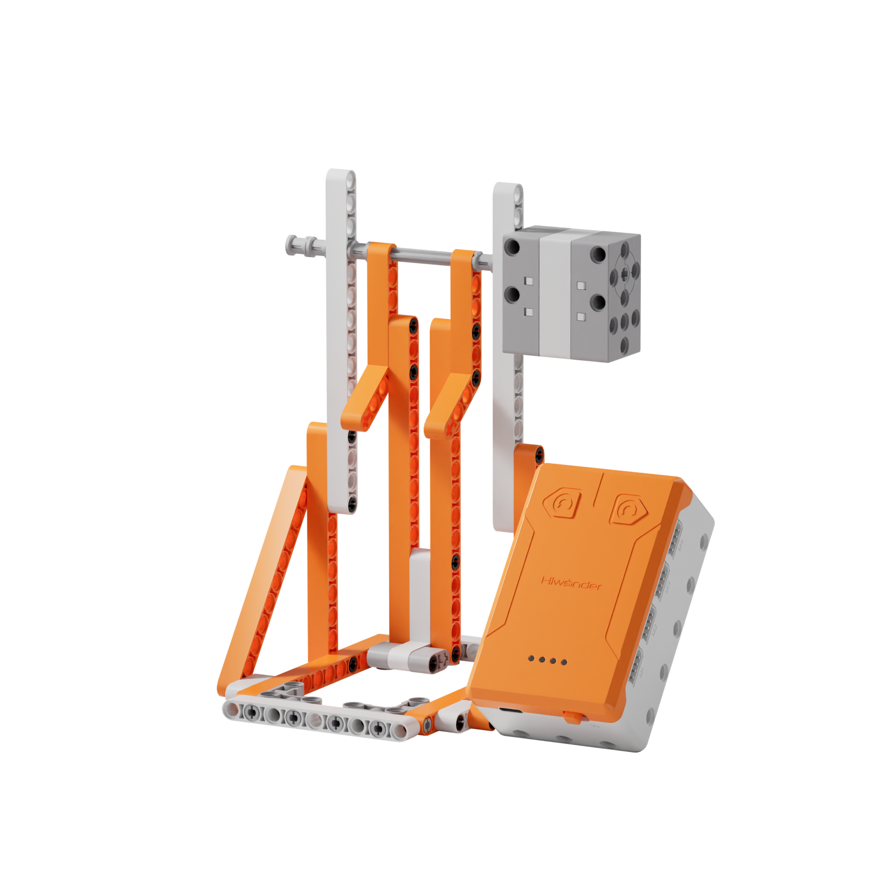
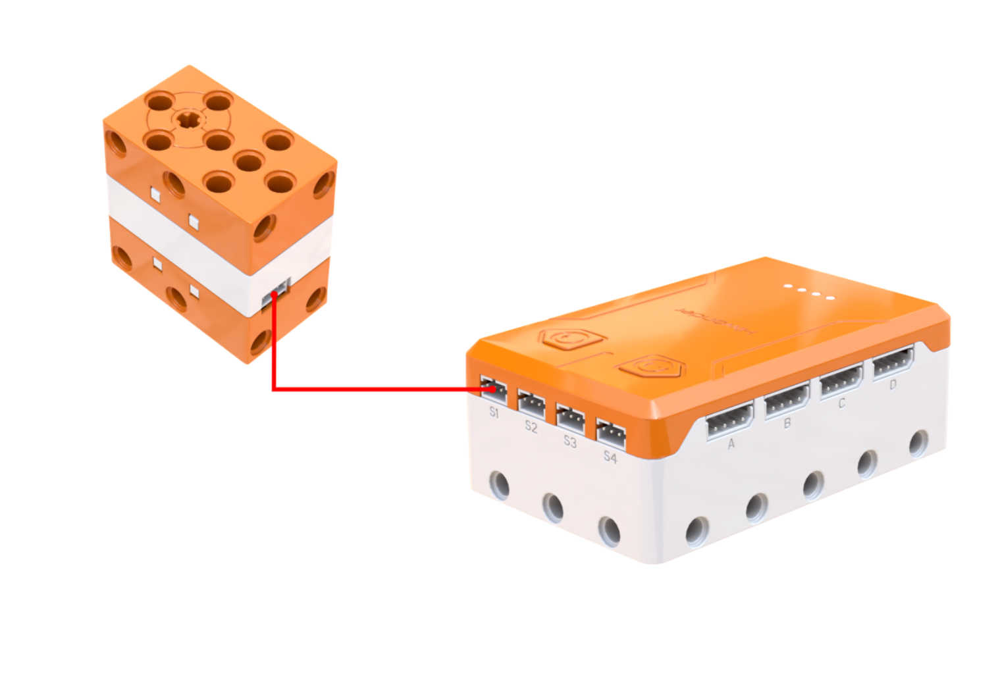
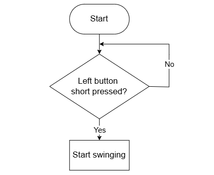
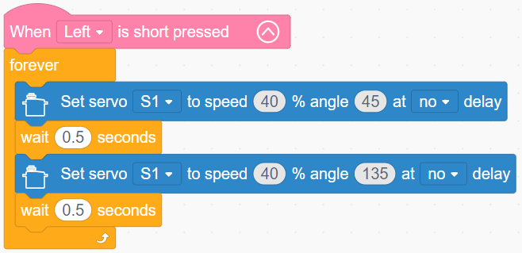

# 3.8 Joyful Swing

## 3.8.1 Lesson Introduction

Taking park swings as inspiration, this lesson guides the assembly of a servo-driven motorized swing. The lesson explains the principle of triangular structural stability, covers precision reciprocating servo control, and teaches gravity balancing alongside amplitude regulation techniques. Through programming, it achieves steady swing oscillations. Combining structural mechanics with coding, this lesson establishes the foundational engineering concept of structural stability and prepares for building complex mechanical assemblies.

## 3.8.2 Learning Objectives

1. **Knowledge Objectives**: Master triangular stability principles and geometric characteristics. Understand the safe operational range of swing amplitudes. Reinforce servo angle control and loop programming knowledge.

2. **Skill Objectives**: Complete assembly of the motorized swing and proper servo mounting independently. Write cyclical swinging routines. Tune parameters proficiently to control swinging amplitude and speed.

3. **Thinking Objectives**: Form engineering thinking focused on structural stability. Understand how geometric configurations influence mechanics. Establish safety design concepts to recognize that structure determines function.

4. **Application Objectives**: Identify triangular stable structures in daily life and architecture. Understand their engineering value to stimulate curiosity about structural engineering.

## 3.8.3 Preparation

### (1) Hardware Preparation

- AiBlock controller

- 180° block servo

- Building block parts pack

- Type-C data cable

- Assembly manual

- Computer

### (2) Software Preparation

- WonderLab Graphical Programming Platform

## 3.8.4 Hands-On Project

### (1) Project Analysis

The core project for this lesson is a servo-driven motorized swing, where the servo swings the frame back and forth while a triangular support structure ensures overall stability. The system comprises two main aspects: the triangular support utilizes structural stability to prevent framework distortion, while the servo oscillates between 45° and 135° centered around 90°, ensuring safe and engaging movement. The program uses a combined "loop and sequence" structure for continuous swinging. Adjusting angle ranges alters swing amplitude, while changing speed settings modifies swing velocity, providing clear insight into how parameters govern motion.

### (2) Assembly Guide

<Pdf src="../../_static/shared/pdf/chapter_3/8.pdf" />

### (3) Hardware Wiring

- Connect the 180° block servo to port **S1** of the controller using a 3-pin servo cable.

### (4) Adding Extensions

- Select **180° servo** under the **Motion module** category.

### (5) Core Blocks

| Block | Category | Description |
| :---: | :---: | :--- |
|  |  | Triggers corresponding blocks when the button is short-pressed |
|  |  | Rotates the specified servo to a target angle at a set speed |

### (6) Program Description and Upload

- Program Schematic

- Complete Program

  After powering on, short-pressing the left button serves as the startup trigger condition. Once triggered, the program enters an infinite loop: inside the loop, it first rotates servo S1 without delay to 45° at 40% speed, waits 0.5 s, then rotates servo S1 without delay to 135° at 40% speed, waits another 0.5 s, and repeats this sequence continuously.

- Program Upload

  Following the animation, click **Connect device**, select the serial port, then click the upload button to upload the program to the controller and test the execution results.

> [!NOTE]
>
> **The source files are available for download under [Program Files](https://drive.google.com/drive/folders/1xyD_-3msc3KcaGQHLqkcPOZNSNXFIirT?usp=sharing).**

## 3.8.5 Expansion and Challenge

**Project 1: Dual-Speed Switchable Swing**

Design dual-mode operation: pressing the left button initiates gentle, slow swinging with small angles and low speed, while pressing the right button switches to dynamic swinging with large angles and high speed. Use a variable to track the active mode, toggle the mode upon button presses, and execute corresponding parameters accordingly. This exercises mode switching and variable state management, simulating different swinging styles of real park swings.

**Project 2: Sound-Activated Interactive Swing**

Add a sound sensor to create a clap-activated swing that swings upon detecting sound and stops in quiet environments. Clapping once starts swinging for 10 s before stopping automatically, or continuous sound monitoring keeps the swing moving as long as ambient sound is present. Combining prior knowledge of the sound sensor reinforces multi-sensor applications and builds a responsive interactive swing.

## 3.8.6 Q&A

**Question 1: Why is the swing frame designed as a triangle? Why is a triangle the most stable geometry?**

Answer: A triangle represents the most stable geometric structure. Stability indicates that once side lengths are determined, the shape remains fixed and cannot distort. A triangle features three sides where three vertices constrain one another: pushing or pulling against any single side causes the remaining two sides to oppose the force, preserving the shape. A quadrilateral behaves differently: even with fixed side lengths, it can compress or stretch into various parallelograms and distorts easily. As the swing oscillates, the frame withstands back-and-forth shock forces. A quadrilateral frame would shake apart quickly, whereas a triangular frame absorbs swing forces steadily without deformation or tipping. Real-world applications like triangular bicycle frames, roof trusses, camera tripods, and tower diagonal braces all harness triangular stability.

**Question 2: Why does the swing program restrict angles between 45° and 135° instead of using 0° to 180°?**

Answer: This restriction ensures safety and structural longevity. Angles of 0° and 180° represent mechanical extremes for the servo, producing an excessively wide swing arc that reaches nearly horizontal positions. At those limits, centrifugal and impact forces escalate significantly, increasing the risk of dislodging payload items while subjecting components to peak mechanical stress that can degrade parts over time. Restricting motion from 45° to 135° sweeps 45° forward and backward around the central 90° vertical orientation, delivering enjoyable swinging action while staying safely within structural tolerance limits. Just as playground swings do not swing completely flat, every mechanical design operates within a defined safety envelope, making boundary protection an essential programming consideration.

## 3.8.7 Technical Support and Product Discussion

To share creative ideas and projects after exploring this kit, visit the [Hiwonder Community](http://forum.hiwonder.com): forum.hiwonder.com

