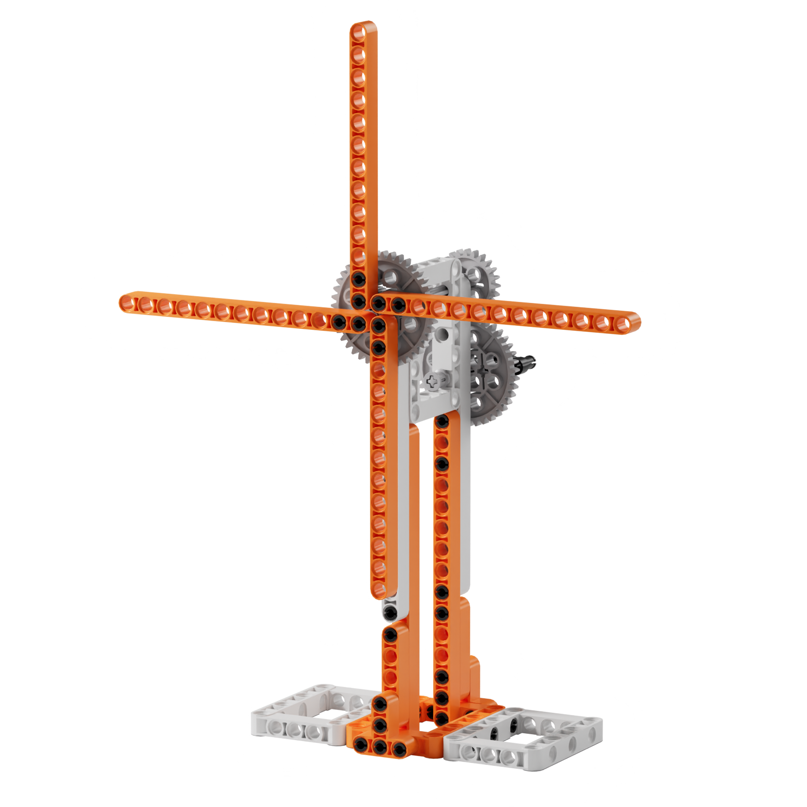
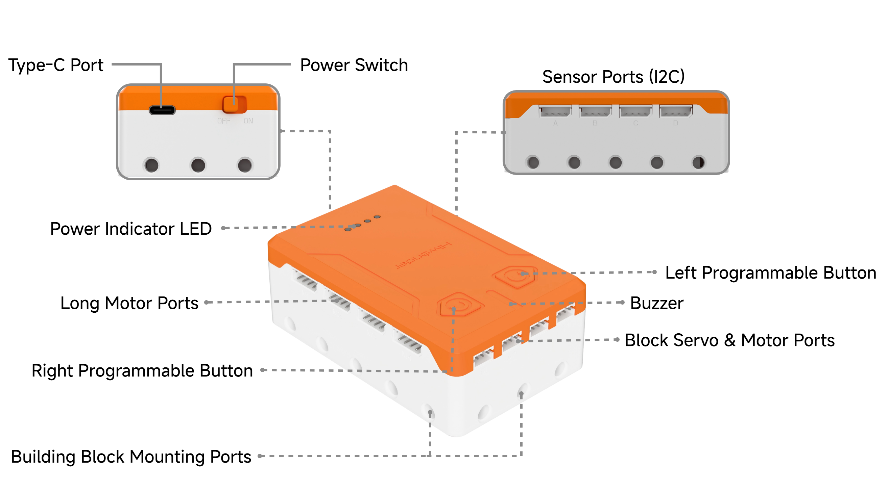

# 3.1 Hand-Cranked Fan

## 3.1.1 Lesson Introduction

This lesson introduces the physical structure and port functions of the controller. Hands-on building of the hand-cranked fan helps master building block assembly and gear transmission principles. As an introductory lesson, it focuses on hardware recognition, stimulates interest in technological innovation, and lays a foundation for subsequent mechanical assembly and programming learning.

## 3.1.2 Learning Objectives

1. **Knowledge Objectives**: Understand all port functions of the controller, and master the basic principles of gear transmission.

2. **Skill Objectives**: Identify controller ports and explain their functions clearly. Assemble building blocks proficiently to construct the hand-cranked fan independently. Observe and describe the movement patterns of gear transmission.

3. **Thinking Objectives**: Establish the systemic logic of robot "controller-actuator" architecture. Form engineering thinking that emphasizes structural stability during assembly.

4. **Application Objectives**: Relate to automated devices in daily life, recognizing how gears function in fans and clocks, which stimulates curiosity in mechanical creation.

## 3.1.3 Preparation

### Hardware Preparation

- AiBlock controller

- Building block parts pack

- Assembly manual

## 3.1.4 Controller Port Description

<table style="text-align: center;vertical-align: middle;">
    <tr><th>Port / Component</th><td>Description</td></tr>
    <tr><th>Type-C port</th><td>Program downloading and power supply</td></tr>
    <tr><th>Power switch</th><td>Toggles between <strong>OFF</strong> and <strong>ON</strong></td></tr>
    <tr><th>Power indicator</th><td>Displays power supply status</td></tr>
    <tr><th>Ports A to D, I2C ports</th><td>Sensor ports</td></tr>
    <tr><th>Ports M1 to M4</th><td>Long motor ports</td></tr>
    <tr><th>Ports S1 to S4</th><td>Block servo and block motor ports</td></tr>
    <tr><th>2 programmable buttons</th><td>Customizable trigger functions</td></tr>
    <tr><th>Buzzer</th><td>Plays musical tones and prompt sounds</td></tr>
    <tr><th>Block ports</th><td>Compatible with standard building blocks for assembly</td></tr>
</table>

## 3.1.5 Hands-On Project

### (1) Project Analysis

The hands-on project for this lesson is the hand-cranked fan, which is a purely mechanical transmission device. The core principle is gear transmission: manually turning the driving gear engages the gear train, driving the fan blades to rotate at high speed. This project covers two main points: first, constructing a stable frame using building block beams, pins, and axles, and second, combining large and small gears to achieve speed changes. During assembly, the mechanical chain of "power input, transmission mechanism, and power output" becomes clear. The lesson concludes by exploring how adding a motor and programming transforms the build into a true "fan robot", laying the groundwork for subsequent lessons.

### (2) Assembly Guide

<Pdf src="../../_static/shared/pdf/chapter_3/1.pdf"/>

## 3.1.6 Expansion and Challenge

**Project 1: Variable Speed Gear Exploration Experiment**

Try combining gears of different sizes to build fans with various gear ratios. When a large gear drives a small gear, the fan blades rotate faster, achieving acceleration. When a small gear drives a large gear, the blades rotate slower but deliver more torque, achieving deceleration. Count how many revolutions the blades complete for each full crank rotation, calculate the speed ratio of different gear combinations, and record the results for comparison. This process demonstrates the speed variation principle of gear transmission and explores the trade-off between speed and torque in mechanical design.

**Project 2: Two-Person Hand-Cranked Generator Station**

Design a dual-crank mechanism using gear sets where two people turn separate cranks simultaneously, merging through gears to drive the same fan blade. Observe what happens when turning in the same direction versus opposite directions to understand directional changes in gear transmission. Add additional gears to reverse the blade rotation, investigating how many idler gears are required to change rotation direction.

## 3.1.7 Q&A

**Question 1: What is a robot? Does the hand-cranked fan count as a robot?**

Answer: A robot is defined as a mechanical device that operates according to pre-programmed instructions. It consists of three core elements: a brain, known as a controller, environmental perception, achieved through sensors, and automated execution, carried out by actuators. The hand-cranked fan does not qualify as a true robot because it lacks a controller and cannot move autonomously, relying entirely on manual cranking. Adding a motor for power, a controller as a brain, and programming for autonomous rotation transforms the build into a genuine fan robot.

**Question 2: What ports are on the AiBlock controller, and what are their functions?**

Answer: The left side of the controller houses four motor and servo ports, labeled S1 to S4, used to connect moving parts such as motors and servos. The right side features four sensor ports, labeled A to D, used to connect sensors for sound, light, and ultrasound. The top includes a Type-C port for downloading programs and supplying power, situated next to the power switch. The front contains two programmable buttons, one on the left and one on the right, which execute custom actions through code. An onboard buzzer produces sounds and melodies. The bottom contains block ports, allowing secure mounting to building block structures.

## 3.1.8 Technical Support and Product Discussion

To share creative ideas and projects after exploring this kit, visit the Hiwonder Community:

