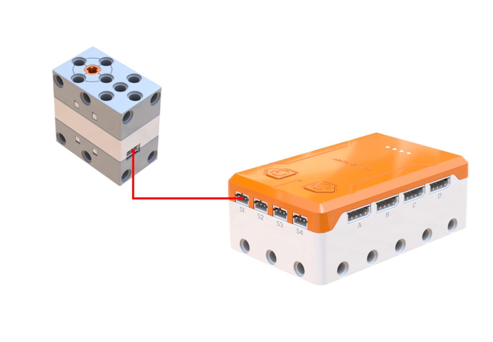
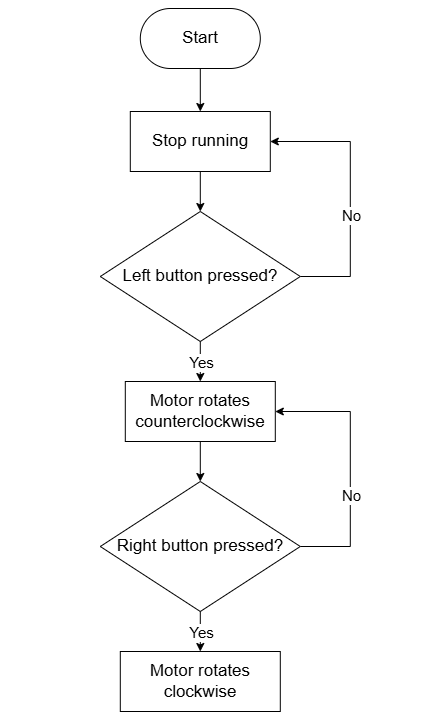
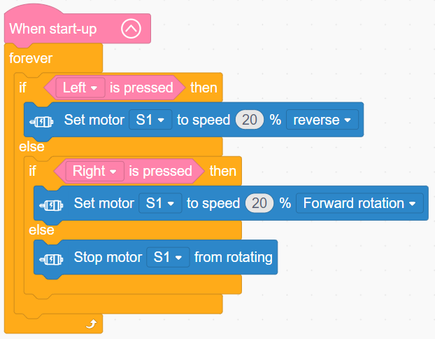

# 3.10 Elevating Weightlifter

## 3.10.1 Lesson Introduction

Taking construction site cranes as a real-world scenario, this lesson guides the assembly of a motor-driven fixed pulley elevator. The lesson explains the structure and function of fixed pulleys, teaches inching control programming logic via buttons, and achieves smooth lifting and lowering of payloads by combining forward and reverse motor rotation with a fixed pulley mechanism. This lesson introduces fundamental simple machine physics, reinforces real-time button polling skills, and establishes a foundation across hardware assembly and software logic for lifting mechanisms.

## 3.10.2 Learning Objectives

1. **Knowledge Objectives**: Understand pulley structures and functional distinctions among the three pulley classes. Distinguish fundamental differences between fixed and movable pulleys. Consolidate motor forward-reverse control and real-time button polling programming.

2. **Skill Objectives**: Complete elevator assembly and string routing independently. Program motor forward and reverse rotation routines proficiently. Implement button inching control. Adjust string tension independently.

3. **Thinking Objectives**: Build foundational engineering thinking regarding simple machines. Understand the utility of fixed pulleys in redirecting applied force. Develop real-time loop polling programming thinking. Strengthen hardware-software collaborative assembly and program debugging capabilities.

4. **Application Objectives**: Understand practical applications of fixed pulleys in cranes, clothes drying racks, and elevators. Recognize the practical utility of simple machines to stimulate curiosity about engineering machinery and intelligent automation.

## 3.10.3 Preparation

### (1) Hardware Preparation

- AiBlock controller

- 360° block motor

- Ultrasonic sensor

- Building block parts pack

- Type-C data cable

- Assembly manual

- Computer

### (2) Software Preparation

- WonderLab Graphical Programming Platform

## 3.10.4 Hands-On Project

### (1) Project Analysis

The core project for this lesson is the fixed pulley Elevating Weightlifter, which utilizes a fixed pulley structure combined with motor drive to achieve smooth vertical payload transport. The primary role of a fixed pulley is to redirect the line of force without providing force magnification or distance reduction, making lifting operations more ergonomic and convenient. Controlling forward and reverse motor rotation winds and unwinds string on the spool shaft, raising and lowering the hook. The program uses a structure of "continuous repeat loop with nested conditional branching" to poll button states in real time, delivering responsive inching action while teaching string threading methods and real-time button polling techniques.

### (2) Assembly Guide

<Pdf src="../../_static/shared/pdf/chapter_3/10.pdf" />

### (3) Hardware Wiring

- Connect the 360° block motor to port **S1** of the controller using a 3-pin servo cable.

### (4) Adding Extensions

- Select **360° Motor** under the **Motion module** category.

### (5) Core Blocks

| Block | Category | Description |
| :---: | :---: | :--- |
|  |  | Triggers corresponding blocks when the button is short-pressed |
|  |  | Sets the operating speed and rotation direction of the designated motor |
|  |  | Stops the motor connected to the selected port |

### (6) Program Description and Upload

- Program Schematic

- Complete Program

  After powering on, the program runs in a continuous loop, checking button states in real time. When the left button is held down, motor S1 rotates in reverse at 20% speed. When the left button is released and the right button is held down, motor S1 rotates forward at 20% speed. When neither button is pressed, motor S1 stops rotating.

- Program Upload

  Following the animation, click **Connect device**, select the serial port, then click the upload button to upload the program to the controller and test the execution results.

> [!NOTE]
>
> **The source files are available for download under [Program Files](https://drive.google.com/drive/folders/1xyD_-3msc3KcaGQHLqkcPOZNSNXFIirT?usp=sharing).**

## 3.10.5 Expansion and Challenge

**Project 1: Automated Limit-Switching Crane**

Add an ultrasonic sensor or light sensor to detect travel limits, halting the motor automatically when the hook reaches the top or bottom to prevent overrun and structural collisions. Alternatively, incorporate timed duration control: pressing the lift button raises the hook for 2 s before stopping automatically, providing fixed-distance travel. Practice automatic limit protection and timed control to make the elevator smarter and safer.

**Project 2: Overload-Sensing Smart Crane**

Design an overload safety feature: incorporate pressure or angle sensing near the hook mechanism so that when the payload exceeds a rated weight limit, the motor will not engage and the buzzer sounds an alarm, simulating overload protection on commercial construction cranes. Practice safety interlock logic and multi-condition evaluation, understanding the critical importance of safety protections in engineering systems.

## 3.10.6 Q&A

**Question 1: What are the characteristics and functions of fixed pulleys, movable pulleys, and pulley systems? Which type does this elevator use?**

Answer: The axle of a fixed pulley remains stationary. It neither saves effort nor multiplies force, and its primary purpose is to redirect the applied force to make lifting more convenient, as seen in flagpoles and simple hoists. The axle of a movable pulley moves together with the load, cutting the required effort in half, though it cannot redirect force and it doubles the required rope travel distance. A pulley system combines fixed and movable pulleys, delivering both force multiplication and directional change for heavy industrial cranes. The elevator in this lesson exclusively uses a fixed pulley mechanism, serving only to redirect string tension without reducing the required lifting force.

**Question 2: Why does inching control use "repeat loop with button is pressed" instead of "when button is short-pressed"?**

Answer: These two blocks operate on fundamentally different mechanisms. The block "when button is short-pressed" is an event trigger that executes once upon a press event and continues running without stopping automatically, making it suited for toggle actions. The condition "button is pressed" evaluates instantaneous hardware state. Placed inside a continuous repeat loop, it polls the button state every cycle: rotating the motor while held and stopping as soon as released to deliver responsive inching motion. Inching control requires uninterrupted polling of button states, necessitating a continuous loop wrapping the state evaluation block to re-evaluate conditions millisecond by millisecond for instantaneous cutoff upon release. Devices demanding pinpoint positioning, such as cranes and motorized blinds, universally employ inching control for safety.

## 3.10.7 Technical Support and Product Discussion

To share creative ideas and projects after exploring this kit, visit the Hiwonder Community:

