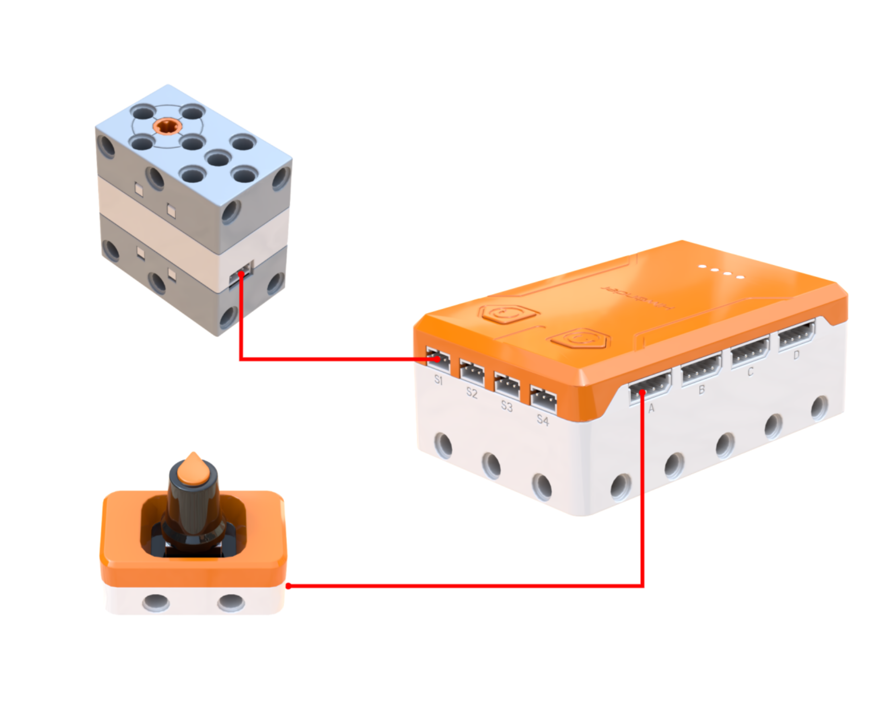
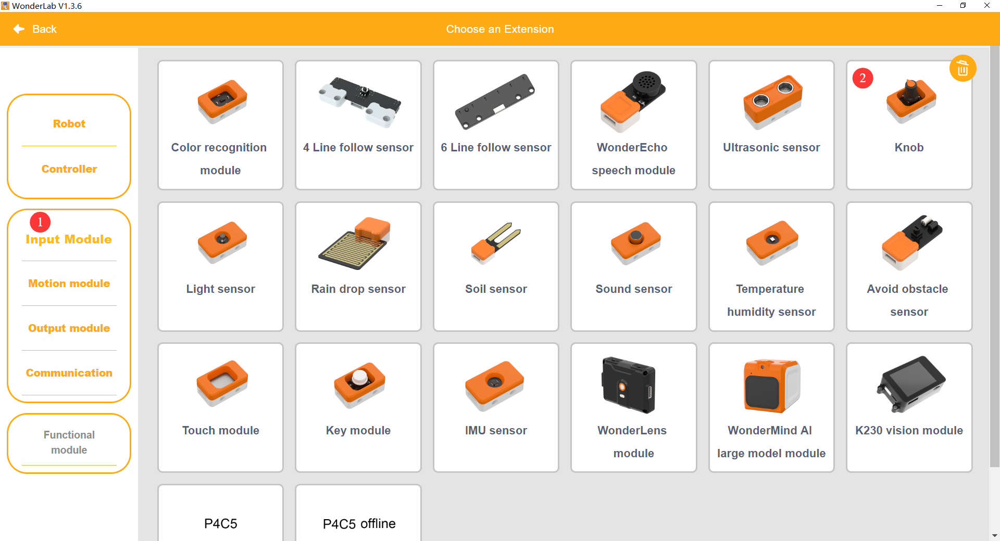
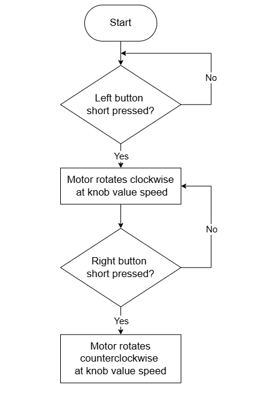
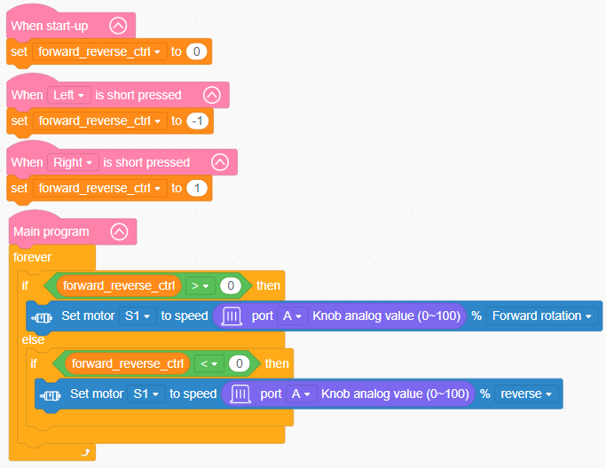

# 3.11 Geared Mixer

## 3.11.1 Lesson Introduction

Taking inspiration from everyday kitchen appliances, this lesson guides the assembly of a motor-driven geared mixer. The lesson introduces the structure and transmission characteristics of vertical bevel gears, teaches variable programming alongside dual-input control logic using a knob and buttons, and achieves versatile mixing actions through motor forward and reverse speed control. This lesson advances gear transmission knowledge, reinforces variable-based state control, and builds a solid foundation across mechanical engineering and software programming for sophisticated robotics projects.

## 3.11.2 Learning Objectives

1. **Knowledge Objectives**: Understand the structural characteristics and direction-changing principles of perpendicular bevel gear meshing. Master methods for defining, assigning, and retrieving variables. Consolidate programming concepts for motor control and sensor data acquisition.

2. **Skill Objectives**: Assemble the geared mixer and properly align the gear meshing independently. Add the knob module extension library. Create variables to manage program states. Implement integrated programming that combines knob-based speed regulation with button-controlled direction switching.

3. **Thinking Objectives**: Cultivate mechanical engineering thinking regarding mechanical power redirection. Develop programming thinking centered on variable-based state control. Understand analog control logic where sensor data directly drives actuators. Strengthen multi-input decision-making capabilities.

4. **Application Objectives**: Connect concepts to everyday appliances such as egg beaters, meat grinders, and automotive differentials. Recognize the universal importance of variables in computer programming. Stimulate enduring curiosity toward mechanical transmission and software design.

## 3.11.3 Preparation

### (1) Hardware Preparation

- AiBlock controller

- 360бу block motor

- Knob module

- Building block parts pack

- Type-C data cable

- Assembly manual

- Computer

### (2) Software Preparation

- WonderLab Graphical Programming Platform

## 3.11.4 Hands-On Project

### (1) Project Analysis

The core project of this lesson is the variable-speed geared mixer, which utilizes perpendicular bevel gears to redirect horizontal motor rotation into vertical motion, replicating the mechanism of an electric egg beater. On the programming side, a variable is introduced to store direction states, where 0 indicates stop, positive values represent forward rotation, and negative values designate reverse rotation. Short-pressing the left or right buttons assigns the variable to -1 or 1 respectively. The main loop reads this variable to direct motor rotation, while analog values from the knob, ranging from 0 to 100, directly set the motor speed percentage. This architecture coordinates dual inputs for knob speed regulation and button direction switching. The variable acts as a status messenger, passing button trigger states into the continuous main execution loop.

### (2) Assembly Guide

<Pdf src="../../_static/shared/pdf/chapter_3/11.pdf" />

### (3) Hardware Wiring

- Connect the 360бу block motor to port **S1** of the controller using a 3-pin servo cable.

- Connect the knob module to port **A** of the controller using a 4-pin module cable.

### (4) Adding Extensions

- Select **Knob** under the **Input Module** category.

- Select **360бу Motor** under the **Motion module** category.

### (5) Core Blocks

| Block | Category | Description |
| :---: | :---: | :--- |
|  |  | Compares two values and returns a true or false result |
|  |  | Retrieves the numerical value stored in the specified variable |
|  |  | Assigns the specified variable to a designated numerical value |
|  |  | Triggers corresponding blocks when the button is short-pressed |
|  |  | Sets the operating speed and rotation direction of the designated motor |
|  |  | Reads the analog value of the knob module on the specified port |

### (6) Program Description and Upload

- Program Schematic

- Complete Program

  1. Upon power-on, the variable direction control is initialized to 0. Short-pressing the left button sets direction control to -1, and short-pressing the right button sets direction control to 1.

  2. The main program executes a continuous loop to evaluate the variable value:
     - When direction control is greater than 0, motor S1 rotates forward at a speed matching the analog value of the knob on port A.

     - When direction control is less than 0, motor S1 rotates in reverse at a speed matching the analog value of the knob on port A.
     
     - When the variable is 0, the motor remains stationary.

- Program Upload

  Following the animation, click **Connect device**, select the serial port, then click the upload button to upload the program to the controller and test the execution results.

> [!NOTE]
>
> **The source files are available for download under [Program Files](https://drive.google.com/drive/folders/1xyD_-3msc3KcaGQHLqkcPOZNSNXFIirT?usp=sharing).**

## 3.11.5 Expansion and Challenge

**Project 1: Timed Automated Mixer**

Integrate a timer routine: pressing the start button initiates automated mixing for 30 s before shutting down, simulating commercial food mixer timer functions. Utilize a variable to track remaining time, decrementing the value by 1 each second, and setting the direction variable to 0 when the countdown reaches zero. Practice variable countdown logic and timed execution control to create a smarter, realistic appliance model.

**Project 2: Multi-Speed Preset Mixer**

Implement three fixed speed presets: low speed at 30%, medium speed at 60%, and high speed at 100%. Use button presses to cycle sequentially through presets while updating RGB light colors to indicate the active tier, such as green for low, yellow for medium, and red for high. Practice variable-driven state recording, cyclic toggle logic, and multi-actuator coordination to build a versatile multi-speed mixer.

## 3.11.6 Q&A

**Question 1: What is a variable, and why are variables essential in programming?**

Answer: A variable functions like a labeled storage container that holds numerical data, allowing values to be retrieved, updated, and re-evaluated dynamically during runtime. Utilizing variables provides three core engineering advantages. First, it enables **state retention**: for instance, the direction control variable designates 1 for forward rotation and -1 for reverse rotation, allowing different routines to share and maintain direction states across execution loops. Second, it facilitates **data communication**: button event handlers modify the variable value, which the continuous main loop reads to command motor motion, transferring data across independent routines. Third, it ensures **maintainability**: storing shared parameters in variables allows system-wide values to update instantly from a single assignment point. Variables serve as fundamental building blocks in software design, underpinning nearly all complex robotics logic.

**Question 2: How does the knob module regulate motor speed, and why can its output value be applied directly to the motor speed parameter?**

Answer: The knob module outputs an analog reading ranging precisely from 0 to 100, which aligns perfectly with the motor speed input parameter of 0% to 100%. Because these numeric ranges correspond identically, the block representing the analog value of the knob on port A can be placed directly into the motor speed input slot. Turning the knob adjusts a numerical value from 0 to 100, which translates proportionally to the motor duty cycle percentage. This technique represents direct analog mapping control, where raw sensor output feeds directly into an actuator parameter. When sensor ranges and actuator parameters diverge, mathematical scaling or mapping functions become necessary, but identical ranges allow direct assignment without intermediate calculations.

## 3.11.7 Technical Support and Product Discussion

To share creative ideas and projects after exploring this kit, visit the Hiwonder Community:

