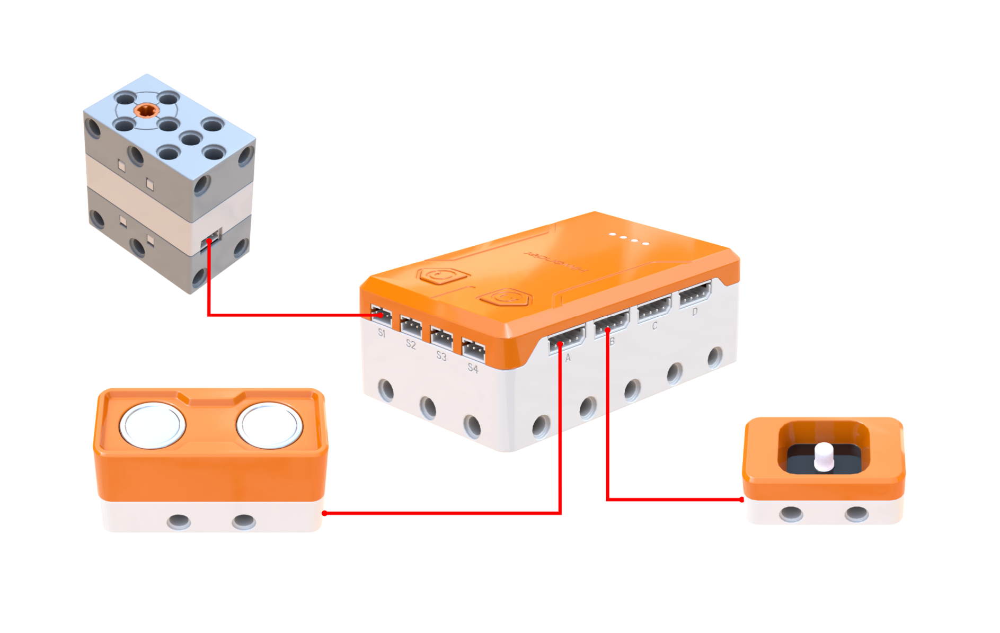
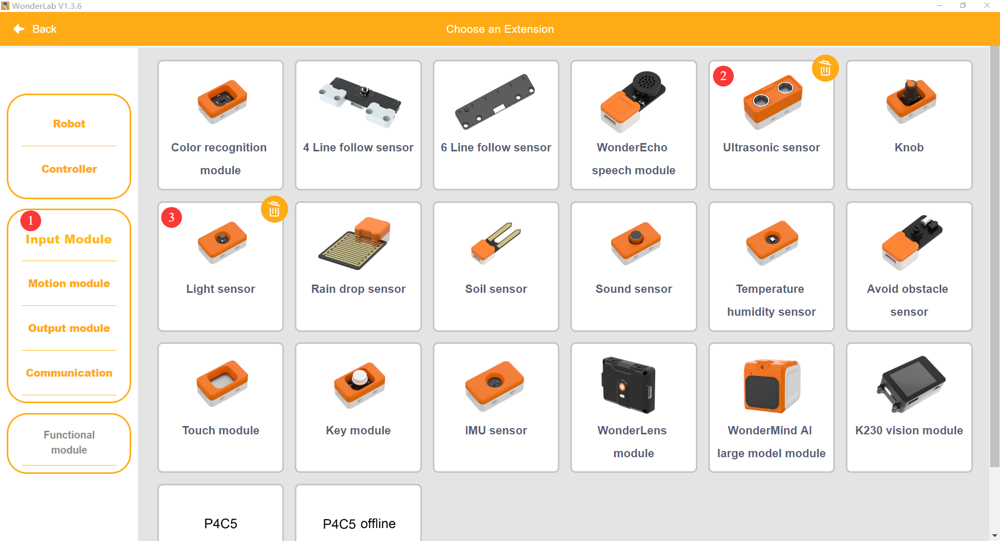
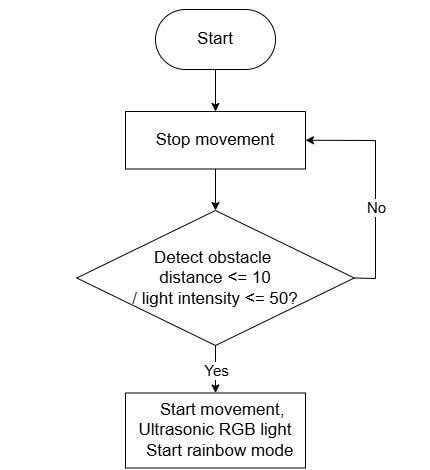
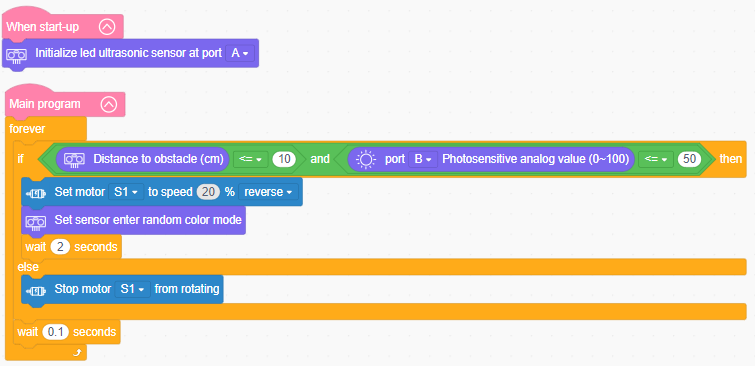

# 3.15 Patrol Guard Bot

## 3.15.1 Lesson Introduction

Taking inspiration from security patrol robots, this lesson guides the assembly of an autonomous patrol vehicle controlled by dual conditions from a light sensor and an ultrasonic sensor. The lesson explains AND-logic programming, where patrol routines engage only when both ambient darkness and human proximity occur simultaneously. It explores multi-sensor decision-making along with software debouncing. This lesson consolidates dual-sensor integration, masters multi-condition evaluation logic, and establishes an engineering foundation for complex robotic security systems.

## 3.15.2 Learning Objectives

1. **Knowledge Objectives**: Consolidate operating principles of the light sensor and ultrasonic sensor. Master dual-sensor AND-logic cooperative control. Understand multi-condition decision-making mechanisms. Learn delay debouncing and state stabilization techniques.

2. **Skill Objectives**: Assemble the patrol guard bot and install both sensors independently. Add extension libraries and execute proper hardware wiring. Program dual-condition AND-logic evaluation routines. Master multi-threshold calibration and anti-interference techniques.

3. **Thinking Objectives**: Build system-level thinking regarding multi-sensor data fusion. Cultivate rigorous logic requiring concurrent conditions before triggering action. Understand day-night differentiation design in security engineering. Strengthen parameter tuning and system stability awareness.

4. **Application Objectives**: Connect concepts to commercial security robots, automated sliding doors, nighttime surveillance cameras, and smart corridor lighting. Recognize the societal value of automated patrol robots. Stimulate interest in intelligent security and robotics.

## 3.15.3 Preparation

### (1) Hardware Preparation

- AiBlock controller

- 360° block motor

- Ultrasonic sensor

- Light sensor

- Building block parts pack

- Type-C data cable

- Assembly manual

- Computer

### (2) Software Preparation

- WonderLab Graphical Programming Platform

## 3.15.4 Hands-On Project

### (1) Project Analysis

The core project of this lesson is the dual-sensor night Patrol Guard Bot, which activates patrol locomotion only when darkness and nearby human presence occur simultaneously. The control logic relies on a dual-condition AND evaluation: the light sensor monitors ambient illumination, classifying readings below 50 as darkness, while the ultrasonic sensor measures obstacle distance, identifying obstacles within 10 cm as human proximity. The drive motor activates only when both criteria are met. Otherwise, the vehicle halts. The program continuously reads both sensors in a loop, incorporating delay debouncing to filter out transient lighting flickers. Dynamic RGB illumination adds futuristic aesthetics. This project demonstrates practical multi-sensor AND-logic decision-making in real-world environments.

### (2) Assembly Guide

<Pdf src="../../_static/shared/pdf/chapter_3/15.pdf" />

### (3) Hardware Wiring

- Connect the 360° block motor to port **S1** of the controller using a 3-pin servo cable.

- Connect the ultrasonic sensor to port **A** of the controller using a 4-pin module cable.

- Connect the light sensor to port **B** of the controller using a 4-pin module cable.

### (4) Adding Extensions

- Select **Ultrasonic sensor** and **Light sensor** under the **Input Module** category.

- Select **360° Motor** under the **Motion module** category.

### (5) Core Blocks

| Block | Category | Description |
| :---: | :---: | :--- |
|  |  | Compares two values and returns a true or false result |
|  |  | Returns true when multiple conditions are satisfied simultaneously |
|  |  | Sets the operating speed and rotation direction of the designated motor |
|  |  | Stops the motor connected to the selected port |
|  |  | Retrieves the distance to an obstacle measured by the ultrasonic sensor |
|  |  | Switches the onboard RGB lights of the ultrasonic sensor to dazzling color mode |
|  |  | Reads the analog light intensity value from the light sensor on the selected port |

### (6) Program Description and Upload

- Program Schematic

- Complete Program

  1. Upon power-on, the program initializes the ultrasonic sensor on port A.

  2. The main program enters a continuous loop to monitor sensor telemetry. Only when both criteria are met simultaneously, with obstacle distance less than or equal to 10 cm and light intensity on port B less than or equal to 50, motor S1 rotates in reverse at 20% speed, the ultrasonic sensor lights switch to dazzling mode, and this operating state persists for 2 s. If either condition fails to be satisfied, motor S1 stops rotating, followed by a 0.1 s delay before re-entering loop evaluation.

- Program Upload

  Following the animation, click **Connect device**, select the serial port, then click the upload button to upload the program to the controller and test the execution results.

> [!NOTE]
>
> **The source files are available for download under [Program Files](https://drive.google.com/drive/folders/1xyD_-3msc3KcaGQHLqkcPOZNSNXFIirT?usp=sharing).**

## 3.15.5 Expansion and Challenge

**Project 1: Obstacle-Steering Patrol Robot**

Upgrade the patrol logic: after detecting a target and initiating forward movement, if a forward barrier approaches too closely, such as within 5 cm, the robot steers automatically to bypass it before resuming patrol. Practice nested conditional branching and dynamic obstacle-avoidance logic, transforming linear patrols into adaptive navigation mimicking commercial robotic guards.

**Project 2: Three-Tier Illumination Patrol Vehicle**

Design three distinct illumination levels: pitch darkness with light intensity less than or equal to 20 for high-speed patrolling, dim lighting between 20 and 50 for slow-speed patrolling, and bright lighting greater than 50 where the robot remains stationary. Assign distinct travel speeds and behaviors to each tier using multi-branch conditionals, practicing refined environmental perception and multi-tiered response logic.

## 3.15.6 Q&A

**Question 1: Why does the Patrol Guard Bot require two sensors instead of a single sensor?**

Answer: The Patrol Guard Bot must verify two independent environmental criteria: ambient darkness and nearby human presence. The light sensor detects ambient illumination, while the ultrasonic sensor measures physical distance. Because they gauge fundamentally different physical quantities, a single sensor cannot fulfill both requirements. Relying solely on ultrasonic sensing causes the vehicle to engage during bright daytime, violating the nighttime security premise. Relying solely on light sensing causes the vehicle to run continuously throughout the night regardless of whether intruders are present, squandering battery power. Combining both sensors through an AND logic gate achieves precise, energy-efficient security behavior. Real-world autonomous systems universally rely on multi-sensor data fusion, progressing from primitive single-input reactions to nuanced, intelligent decision-making.

**Question 2: Why does the program include delay intervals, and what does debouncing accomplish?**

Answer: Environmental sensors regularly experience momentary transient interference, such as brief vehicle headlight flashes altering light levels or insects darting past ultrasonic transducers shifting distance readings. Reacting instantaneously to every minor spike causes the bot to start and stop erratically, creating jerky movement and accelerating motor wear. Incorporating delay intervals ensures that the system maintains an active state briefly after triggering, allowing momentary spikes to dissipate before evaluating again. This design, known as software debouncing or filter delay, prevents false triggering caused by signal jitter. Debouncing constitutes an essential optimization in sensor programming, ensuring autonomous systems operate reliably and smoothly in turbulent environments.

## 3.15.7 Technical Support and Product Discussion

To share creative ideas and projects after exploring this kit, visit the Hiwonder Community:

