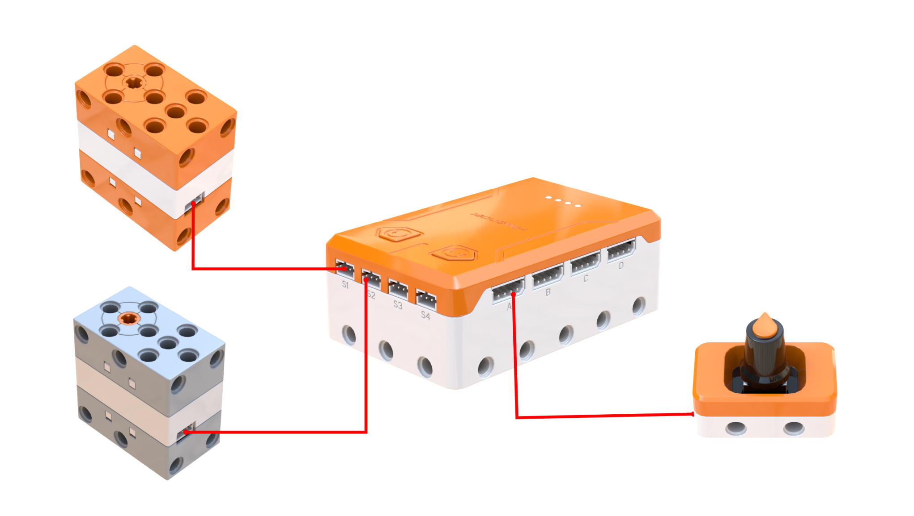
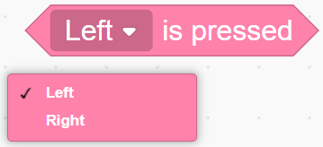
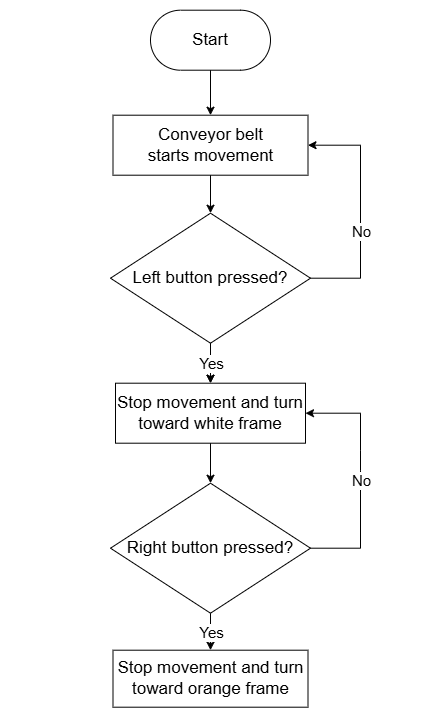
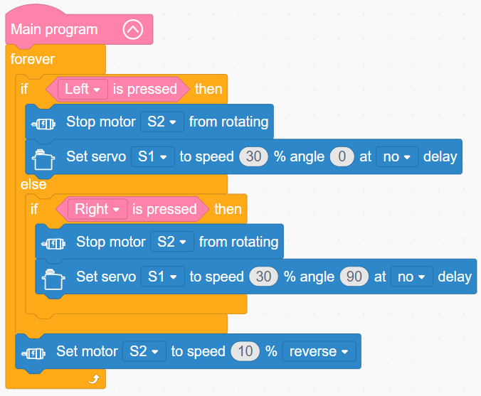
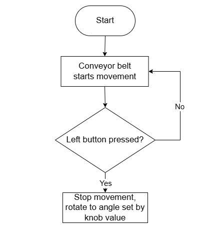
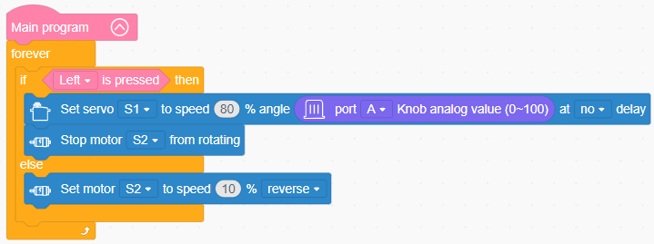

# 3.16 Rotary Conveyor

## 3.16.1 Lesson Introduction

Taking inspiration from industrial assembly lines, this lesson guides the assembly of an automated conveyor and sorting system combining continuous track transmission with servo-driven chute sorting. The lesson explains track transmission mechanics alongside cooperative control across three components, dividing roles such that the motor powers the conveyor, the servo directs the sorting chute, and the knob provides stepless position adjustments. This lesson provides an introduction to track drives and wraps up starter builds, establishing system-level conveyance-and-sorting thinking for sophisticated automation engineering.

## 3.16.2 Learning Objectives

1. **Knowledge Objectives**: Understand continuous track drive principles and positive gear engagement. Master the decoupled design between conveyance and sorting mechanisms. Consolidate programming techniques for knob analog values. Strengthen cooperative programming across multiple actuators.

2. **Skill Objectives**: Assemble the continuous track conveyor and directional sorting chute independently. Execute accurate hardware wiring and servo centering calibration. Program coordinated conveyance and sorting routines. Master stepless angle tuning techniques using the knob module.

3. **Thinking Objectives**: Build systems engineering thinking integrating conveyance with automated sorting. Cultivate awareness of multi-mechanism task allocation. Understand the functional distinction between stepless adjustment and discrete preset stepped switching. Strengthen multi-device coordinated programming logic.

4. **Application Objectives**: Connect concepts to industrial manufacturing lines, supermarket checkout belts, parcel sorting hubs, and tank treads. Recognize the engineering significance of automated assembly lines. Stimulate curiosity regarding industrial automation and mechanical powertrains.

## 3.16.3 Preparation

### (1) Hardware Preparation

- AiBlock controller

- 360° block motor

- 180° block servo

- Knob module

- Building block parts pack

- Type-C data cable

- Assembly manual

- Computer

### (2) Software Preparation

- WonderLab Graphical Programming Platform

## 3.16.4 Hands-On Project

### (1) Project Analysis

The core project of this lesson is the knob-controlled sorting Rotary Conveyor, simulating a modern manufacturing conveyor where a continuous track transports items and an exit guide chute sorts them into left and right collection bins. The conveyance assembly uses a motor driving geared tracks for steady transport, while the sorting assembly employs a servo to orient the guide chute. The foundational version implements two-position stepped sorting via buttons, setting 0° for the left bin on a left button press and 90° for the right bin on a right button press. The optimized version incorporates the knob for stepless angle adjustment, allowing flexible aiming. The software halts conveyance momentarily while steering the chute to prevent parcels from veering off-track, resuming belt motion once aligned. This project synthesizes structural mechanics and nested conditional logic across multiple actuators.

### (2) Assembly Guide

<Pdf src="../../_static/shared/pdf/chapter_3/16.pdf" />

### (3) Hardware Wiring

- Connect the 180° block servo to port **S1** of the controller using a 3-pin servo cable.

- Connect the 360° block motor to port **S2** of the controller using a 3-pin servo cable.

- Connect the knob module to port **A** of the controller using a 4-pin module cable.

### (4) Adding Extensions

- Select **Knob** under the **Input Module** category.

- Select **180° servo** and **360° Motor** under the **Motion module** category.

### (5) Core Blocks

| Block | Category | Description |
| :---: | :---: | :--- |
|  |  | Checks whether the left or right button on the controller is pressed |
|  |  | Sets the operating speed and rotation direction of the designated motor |
|  |  | Stops the motor connected to the selected port |
|  |  | Controls the designated servo to rotate to a target angle at a specified speed |
|  |  | Reads the numerical value of the knob module on the specified port, ranging from 0 to 100 |

### (6) Program Description and Upload

* Case 1: Button-Triggered Discrete Servo Control

  * Program Schematic

  

  * Complete Program

    Executing the main program initiates a continuous loop that polls button states:

    - When the left button is pressed, motor S2 stops rotating and servo S1 rotates to 0° at 30% speed without delay.

    - When the left button is released and the right button is pressed, motor S2 stops rotating and servo S1 rotates to 90° at 30% speed without delay.
    
    - When neither button is pressed, motor S2 rotates in reverse at 10% speed.
    
  

* Case 2: Knob-Regulated Continuous Servo Adjustment

  * Program Schematic

  

  * Complete Program

  

* Program Upload

  Following the animation, click **Connect device**, select the serial port, then click the upload button to upload the program to the controller and test the execution results.

> [!NOTE]
>
> **The source files are available for download under [Program Files](https://drive.google.com/drive/folders/1xyD_-3msc3KcaGQHLqkcPOZNSNXFIirT?usp=sharing).**

## 3.16.5 Expansion and Challenge

**Project 1: Three-Way Intelligent Sorting System**

Add a center collection bin to implement left, center, and right three-way sorting. Pressing the left button routes items to the left, pressing the right button routes items to the right, and leaving buttons untouched routes items to the center by default. Practice three-branch conditional evaluation and multi-position control, upgrading two-way sorting into a multi-port industrial sorter.

**Project 2: Automated Counting Conveyor Line**

Incorporate an ultrasonic or light sensor to detect passing items, incrementing a count by 1 each time an object passes. Use a variable to track the total count and sound the buzzer upon each detection. Practice variable counting and sensor-driven tallying to transform a simple conveyor into an automated assembly line with production statistics.

## 3.16.6 Q&A

**Question 1: Why does the motor halt before the servo turns the chute, rather than rotating the chute while the conveyor runs?**

Answer: Halting the motor prevents transported items from misaligning or falling off the belt. If the conveyor track continues moving while the chute swings abruptly, items risk tumbling outward due to momentum or snagging on the chute rims, degrading sorting precision. Halting the track before redirecting the chute ensures items slide securely into the proper collection bin once re-engaged. In industrial parcel sorters, items are similarly registered and aligned before mechanical diverters engage. In engineering design, pause-before-switching routines prioritize physical stability and operational repeatability.

**Question 2: What is the distinction between knob control and button control for steering, and what are their respective benefits?**

Answer: Button control is **stepped or discrete**, offering a limited set of fixed presets, such as 0° and 90°. Pressing a button toggles between predetermined positions, making operation simple and fast, though restricted to preset targets. Knob control is **stepless or continuous**, covering any angle between 0° and 100°. Rotating the knob positions the chute precisely to any orientation, providing fine-grained alignment with variously positioned collection bins. Discrete stepped control offers effortless single-press operation suited for standardized, fixed-pattern sorting. Stepless control delivers adaptable precision required for custom, dynamic alignments. Industrial machinery frequently employs both modalities based on operational demands.

## 3.16.7 Technical Support and Product Discussion

To share creative ideas and projects after exploring this kit, visit the Hiwonder Community:

