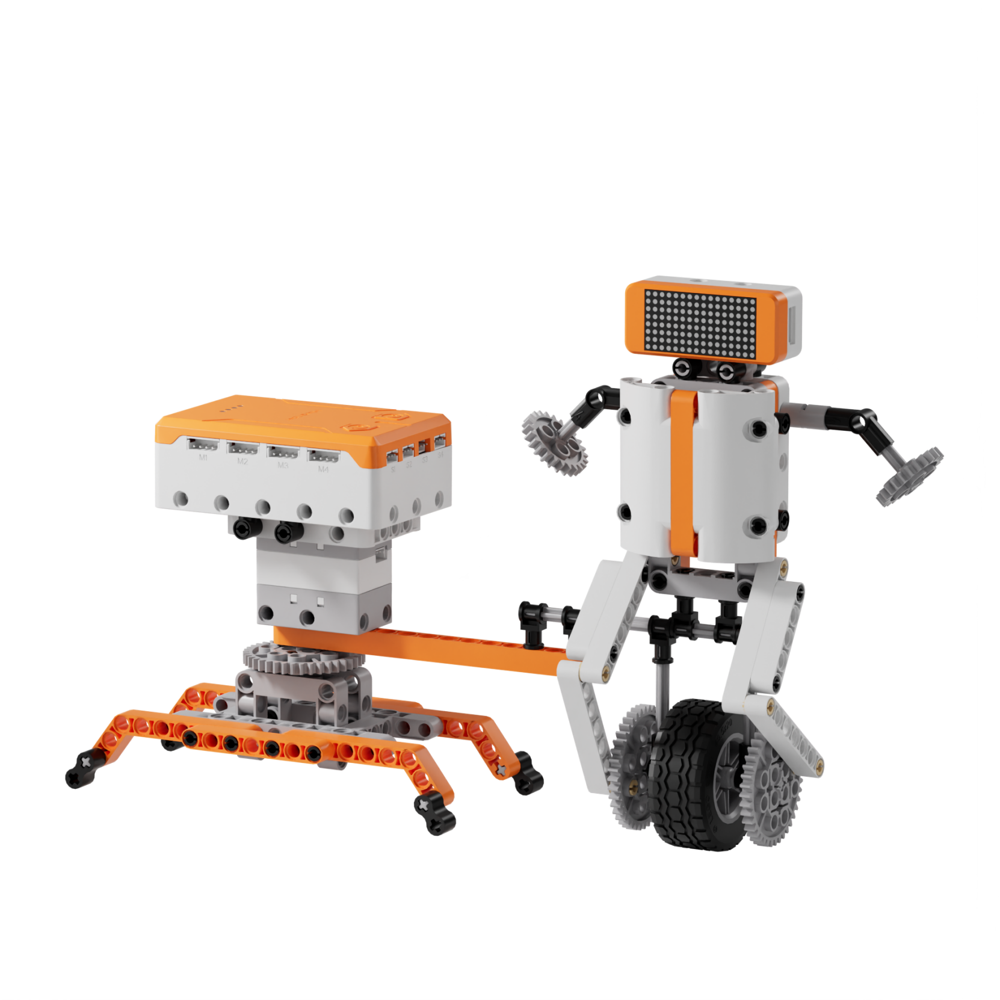
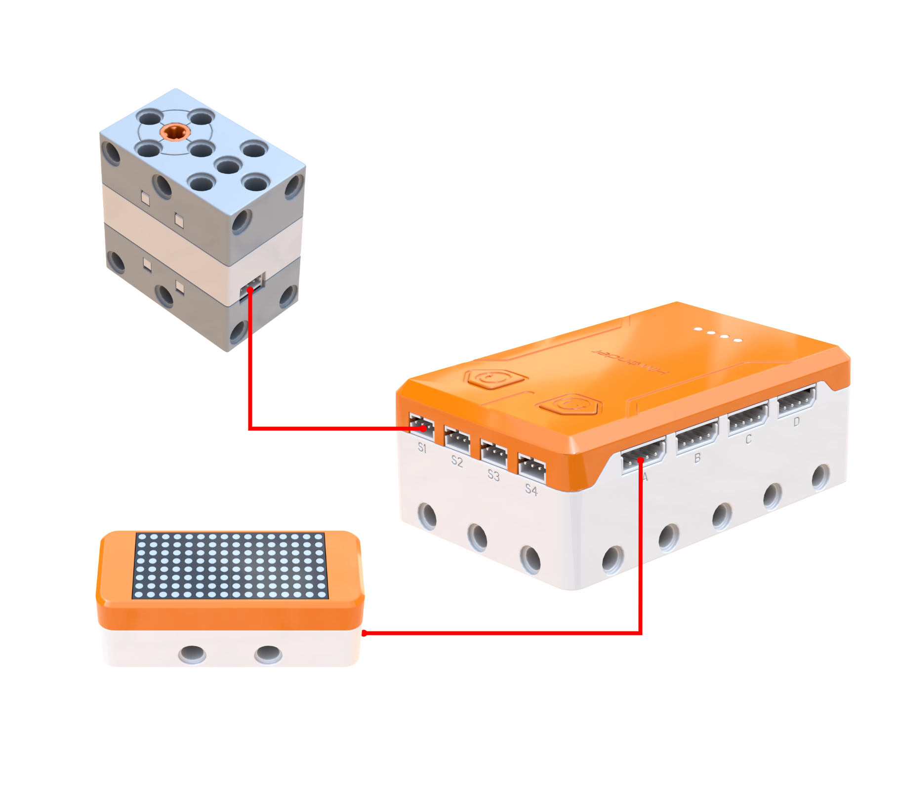
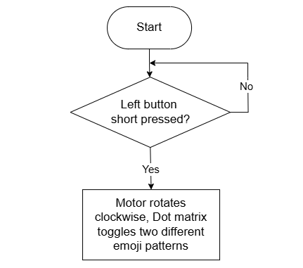
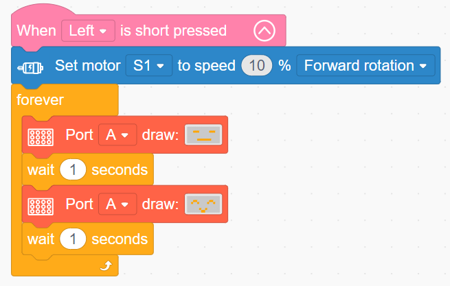

# 3.20 Rotary Flywheel Hero

## 3.20.1 Lesson Introduction

Centering on the unicycle robot project, this lesson explores the mechanical principles of dynamic balance, examines how the flywheel gyroscopic effect and center-of-gravity distribution enhance chassis stability, and introduces dot matrix expression animations. It covers motor speed regulation routines to govern vehicular locomotion.

## 3.20.2 Learning Objectives

1. **Knowledge Objectives**: Understand the fundamental concepts of dynamic balance and recognize the stabilizing role of flywheel gyroscopic effects. Comprehend how center-of-gravity height and track width influence equilibrium. Consolidate programming principles for dot matrix frame animations.

2. **Skill Objectives**: Assemble the unicycle chassis and flywheel transmission structure independently, mastering gear mesh alignment. Program motor drive routines to control travel speed. Design dot matrix facial expressions and synchronize animations with robot locomotion.

3. **Thinking Objectives**: Establish unified systems thinking that integrates structural stability, motion control, and visual expression. Cultivate engineering awareness of equilibrium design, understanding how multi-factor interactions dictate mechanical balance. Strengthen frame animation timing control logic.

4. **Application Objectives**: Connect concepts to unicycles, self-balancing scooters, mechanical gyroscopes, and spacecraft attitude control thrusters. Recognize the critical value of dynamic equilibrium in mobile robotics and aerospace engineering. Stimulate enthusiasm for balancing robotics and control engineering.

## 3.20.3 Preparation

### (1) Hardware Preparation

- AiBlock controller

- 360бу block motor

- Dot matrix module

- Building block parts pack

- Type-C data cable

- Assembly manual

- Computer

### (2) Software Preparation

- WonderLab Graphical Programming Platform

## 3.20.4 Hands-On Project

### (1) Project Analysis

The core project of this lesson is the Rotary Flywheel Hero, producing an autonomous unicycle robot that combines low-speed driving with animated facial expressions. The system uses a parallel architecture uniting mechanical driving with visual feedback: the motor rotates forward at approximately 10% speed, powering a reduction gear train to drive the wheel forward smoothly while the low speed and weighted flywheel maintain dynamic balance. Concurrently, the dot matrix screen toggles facial expressions every 1 s in an independent loop to produce blinking animations. Operating simultaneously without interference, physical locomotion and animated expressions combine to form an engaging robotic personality.

### (2) Assembly Guide

<Pdf src="../../_static/shared/pdf/chapter_3/20.pdf" />

### (3) Hardware Wiring

- Connect the 360бу block motor to port **S1** of the controller using a 3-pin servo cable.

- Connect the dot matrix module to port **A** of the controller using a 4-pin module cable.

### (4) Adding Extensions

- Select **360бу Motor** under the **Motion module** category.

- Select **Dot matrix module** under the **Output module** category.

### (5) Core Blocks

| Block | Category | Description |
| :---: | :---: | :--- |
|  |  | Triggers internal code blocks when a short press is detected on the designated button |
|  |  | Directs the 360бу block motor on the designated port to rotate continuously forward or in reverse at a custom speed |
|  |  | Directs the dot matrix screen on the designated port to load and display preset graphic patterns |

### (6) Program Description and Upload

- Program Schematic

- Complete Program

  When the left button is pressed, motor S1 rotates forward at 10% speed while the Rotary Flywheel Hero repeatedly cycles expressions on the dot matrix screen.

- Program Upload

  Following the animation, click **Connect device**, select the serial port, then click the upload button to upload the program to the controller and test the execution results.

> [!NOTE]
>
> **The source files are available for download under [Program Files](https://drive.google.com/drive/folders/1KQ-KBn3OmxCo6xKJkb7ZQZAuPW9brr5t?usp=sharing).**

## 3.20.5 Expansion and Challenge

**Project 1: Sound-Responsive Variable-Speed Flywheel Bot**

Incorporate a sound sensor to detect ambient volume: noise exceeding the threshold starts the motor, with louder sounds commanding faster travel speeds while the dot matrix screen indicates the corresponding speed tier. This project explores direct analog mapping for motor parameters to build continuous variable control thinking, relating concepts to acoustic toys and interactive robotics.

**Project 2: Structural Equilibrium Challenge**

Systematically alter physical parameters such as counterweight positions, stabilizer wheel width, or flywheel mass to evaluate balancing performance, programming the dot matrix screen to report challenge success or tipping events. Cultivate controlled-variable scientific methodology by modifying a single parameter per trial, connecting experiments to self-balancing transporters and humanoid balancing algorithms.

## 3.20.6 Q&A

**Question 1: Why does the unicycle robot resist tipping over, and what role does the rotating flywheel serve?**

Answer: The unicycle maintains balance primarily through the **gyroscopic effect and conservation of angular momentum**. A high-speed rotating flywheel acts like a mechanical gyroscope: rotating masses naturally resist changes to their spin axis orientation, with higher angular velocities generating stronger stabilizing torque that prevents the robot from toppling left or right. Additionally, the structural design lowers the center of gravity and widens the base support area, enhancing static and dynamic stability on the same principle as a weighted roly-poly tumbler toy. While human unicycle riders actively shift body weight to sustain balance, the robot relies on the spinning flywheel for passive dynamic stabilization.

**Question 2: Why must the motor speed of the Rotary Flywheel Hero remain relatively low, and what occurs at excessive speeds?**

Answer: Because the unicycle configuration possesses a narrower stability margin than four-wheeled or two-wheeled chassis, higher speeds amplify destabilizing forces. At excessive speeds, slight surface irregularities or minor steering deflections trigger violent chassis oscillations, overwhelming balancing forces and causing the robot to topple. Low-speed travel affords the physical system adequate reaction time to absorb minor tilts. Unlike conventional bicycles, which become more stable at higher forward speeds due to caster angles and momentum, passive unicycles require moderate velocities to preserve balance. Furthermore, because this robot relies on passive mechanical stabilization without active sensor-based feedback correction, strict speed regulation is essential to prevent tipping. Active self-balancing transporters such as Segways incorporate high-speed IMU gyroscopes and brushless motors to apply dynamic real-time corrections, enabling stable high-speed transit.

## 3.20.7 Technical Support and Product Discussion

To share creative ideas and projects after exploring this kit, visit the Hiwonder Community:

