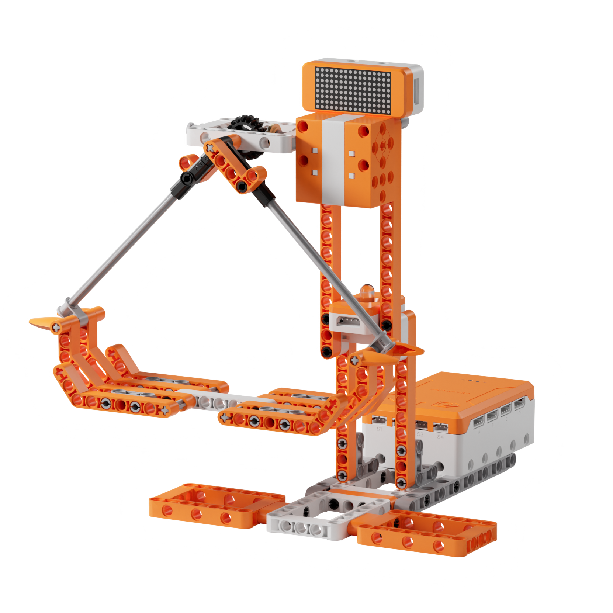
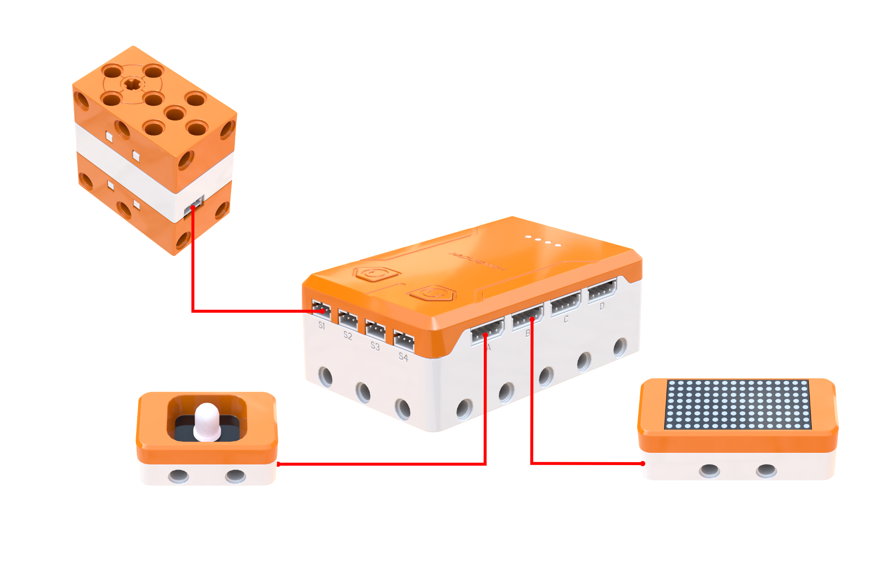
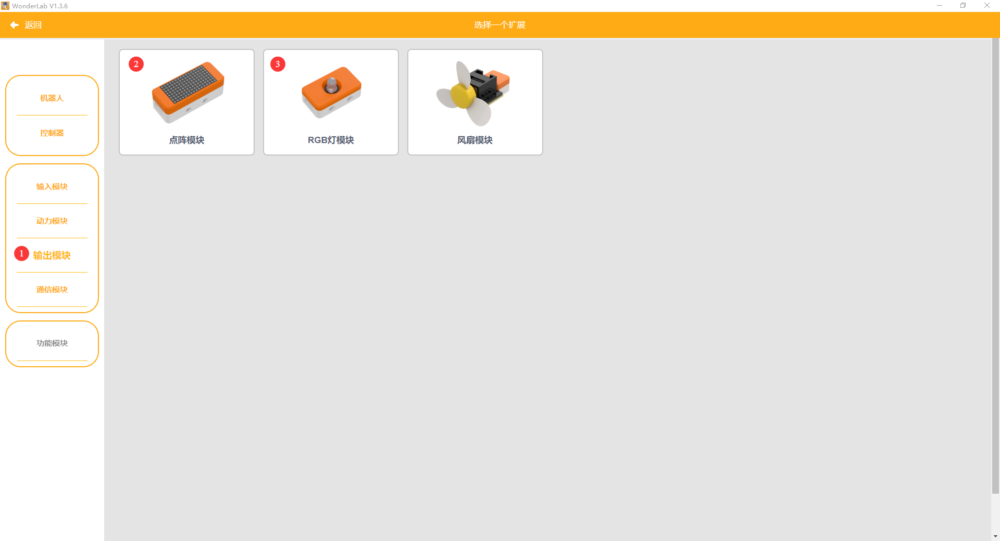
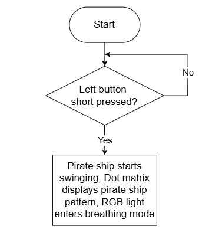
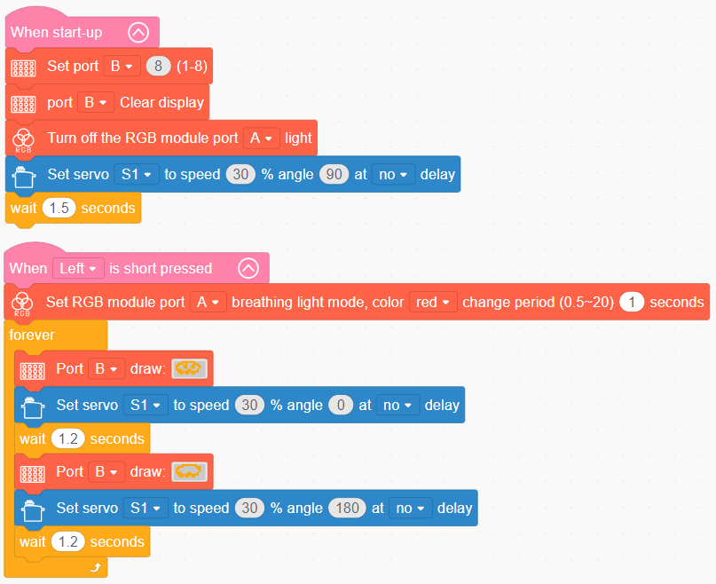

# 3.21 Crazy Pirate Ship

## 3.21.1 Lesson Introduction

Centering on the swinging pirate ship model, this lesson explores coordinated programming across the servo, RGB light module, and dot matrix screen. It delivers an immersive amusement park experience featuring reciprocating ship swinging, dynamic light color transitions, and animated graphic displays. The content examines the transmission principles of oscillating gear mechanisms, covers servo angle regulation methods, and applies synchronization logic uniting visual, lighting, and mechanical motions to illuminate how sensory atmosphere and mechanical structures integrate in ride engineering.

## 3.21.2 Learning Objectives

1. **Knowledge Objectives**: Understand the transmission principles of oscillating gear mechanisms that convert rotational motion into reciprocating swings. Master the relationship between servo rotation angles and ship swinging amplitudes. Recognize atmospheric design methods that synchronize RGB lighting with mechanical movement. Comprehend the fundamentals of dot matrix graphic displays.

2. **Skill Objectives**: Assemble the mechanical structure of the Crazy Pirate Ship independently, mastering the 90° center calibration procedure for the servo. Program basic reciprocating servo swings. Implement a complete amusement park experience combining swinging motion, RGB breathing lights, and dot matrix patterns.

3. **Thinking Objectives**: Build an experiential design mindset that unites mechanical motion with audiovisual atmosphere, understanding the sensory logic behind amusement rides. Develop sequential timing control logic for reciprocating motion. Enhance comprehensive design capabilities for multi-module synchronization.

4. **Application Objectives**: Connect concepts to amusement park pirate ships, clock pendulums, carnival rides, and infant cradles. Understand how amusement ride engineering combines physical locomotion with atmospheric immersion. Stimulate enthusiasm for ride engineering, theme park design, and creative mechanisms.

## 3.21.3 Preparation

### (1) Hardware Preparation

- AiBlock controller

- 180° block servo

- RGB light module

- Dot matrix module

- Building block parts pack

- Type-C data cable

- Assembly manual

- Computer

### (2) Software Preparation

- WonderLab Graphical Programming Platform

## 3.21.4 Hands-On Project

### (1) Project Analysis

The core project of this lesson is the Crazy Pirate Ship, delivering an amusement park experience characterized by wide-angle swinging and dynamic lighting effects. The system adopts an integrated architecture that unites servo-driven swinging, smooth gear transmission, and synchronized audiovisual atmosphere: the servo drives an oscillating gear train to convert rotation into pendulum-style swinging, and the gears ensure smooth and stable motion. An RGB red breathing light and a pirate-themed dot matrix display operate simultaneously to build atmosphere. Upon startup, the servo swings reciprocally between 0° and 180°, pausing for 1.2 s at each endpoint while synchronizing with lighting and display effects. Both swing speed and dwell duration can be adjusted, simulating the thrilling sensation of a real pirate ship ride.

### (2) Assembly Guide

<Pdf src="../../_static/shared/pdf/chapter_3/21.pdf" />

### (3) Hardware Wiring

- Connect the 180° block servo to port **S1** of the controller using a 3-pin servo cable.

- Connect the RGB light module to port **A** of the controller using a 4-pin module cable.

- Connect the dot matrix module to port **B** of the controller using a 4-pin module cable.

### (4) Adding Extensions

- Select **180° servo** under the **Motion module** category.

- Select **Dot matrix module** and **RGB module** under the **Output module** category.

### (5) Core Blocks

| Block | Category | Description |
| :---: | :---: | :--- |
|  |  | Executes only once after the device powers on, used to place startup logic such as hardware initialization and parameter configuration |
|  |  | Triggers internal code blocks when a short press is detected on the designated button |
|  |  | Controls the 180° block servo on the designated port to rotate at a custom speed for a specified duration, continuing immediately to subsequent blocks without waiting if non-delay mode is selected |
|  |  | Adjusts the backlight brightness of the dot matrix screen on the designated port across a range of 1 to 8, where higher values yield brighter displays |
|  |  | Directs the dot matrix screen on the designated port to load and display preset graphic patterns |
|  |  | Clears all graphic content from the dot matrix screen on the designated port, restoring a blank display |
|  |  | Directs the RGB light module on the designated port to activate a breathing fade effect in a selected color, with a customizable transition period |
|  |  | Extinguishes the RGB light module on the designated port to cut off light output |

### (6) Program Description and Upload

- Program Schematic

- Complete Program

  Upon startup, the system sets the dot matrix screen brightness, clears the display, and turns off the RGB light module, placing the pirate ship in its initialized standby state. When the left button is pressed, servo S1 rotates between 0° and 180° at 30% speed, driving the Crazy Pirate Ship into a swinging state while the dot matrix screen presents the pirate graphic and the RGB light module enters breathing mode.

- Program Upload

  Following the animation, click **Connect device**, select the serial port, then click the upload button to upload the program to the controller and test the execution results.

> [!NOTE]
>
> **The source files are available for download under [Program Files](https://drive.google.com/drive/folders/1KQ-KBn3OmxCo6xKJkb7ZQZAuPW9brr5t?usp=sharing).**

## 3.21.5 Expansion and Challenge

**Project 1: Progressive Acceleration Pirate Ship**

Execute initial swings using restricted angles from 45° to 135° and longer pause intervals, then progressively expand the angular sweep and shorten delays until reaching full-range rapid swings from 0° to 180°. Practice variable incrementation and dynamic parameter adjustment, analyze the experiential design of progressive acceleration, and extend discussions to launch sequences on roller coasters and giant pendulum rides.

**Project 2: Rhythmic Musical Pirate Ship**

Program the buzzer to play a pirate-themed melody, synchronizing mechanical swings to musical beats and transitioning light colors across musical phrases to craft an integrated audiovisual experience. Practice synchronizing musical rhythm with mechanical motion, explore multi-sensory design principles, and extend discussions to multimedia attractions such as theme park parade floats, 4D theaters, and synchronized light shows.

## 3.21.6 Q&A

**Question 1: Why does the pirate ship swing back and forth, and how does servo rotation convert into swinging motion?**

Answer: The motion relies on an **oscillating gear mechanism that transforms rotational input into reciprocating swings**. Although the servo rotates across angular sweeps, it is not coupled directly to the ship hull. Instead, an intermediate gear transmission transfers the power. The servo drives an active driving gear, which engages the suspension linkage of the ship hull. Through this mechanical configuration, angular servo rotation is converted into pendulum-like swinging. Gear transmission also provides exceptionally smooth operation without stuttering, allowing the ship to swing naturally like an authentic amusement ride. The swinging amplitude is determined by the angular range of the servo: swinging across the full 0° to 180° range produces high, thrilling arcs, whereas narrowing the angular range yields gentler motion. Dwell periods at each endpoint govern how long the ship hovers at peak elevation, which together with servo speed defines the rhythmic pacing of the ride. Mechanical transmissions demonstrate how gears and linkages can redirect and transform one type of motion into another.

**Question 2: Why incorporate the RGB light module and dot matrix screen rather than relying solely on mechanical swinging?**

Answer: The essence of amusement ride engineering centers on **immersive experiential design rather than mere mechanical motion**. An isolated framework swinging back and forth functions merely as a bare mechanism. Incorporating lighting, graphics, and acoustic cues transforms the machine into a themed attraction rich in atmosphere. A red breathing light generates an intense, thrilling ambiance that evokes excitement, while the pirate icon reinforces the theme, creating an immediate narrative identity. When visual elements combine with physical swings, dual sensory stimulation elevates the overall experience. Authentic theme parks apply this exact principle: surrounding rides with environmental scenery, soundtrack audio, dynamic lighting effects, and costumed staff to foster deep immersion. In successful attraction engineering, mechanical systems provide the structural foundation, while narrative themes and atmospheric effects supply the character.

## 3.21.7 Technical Support and Product Discussion

To share creative ideas and projects after exploring this kit, visit the Hiwonder Community:

