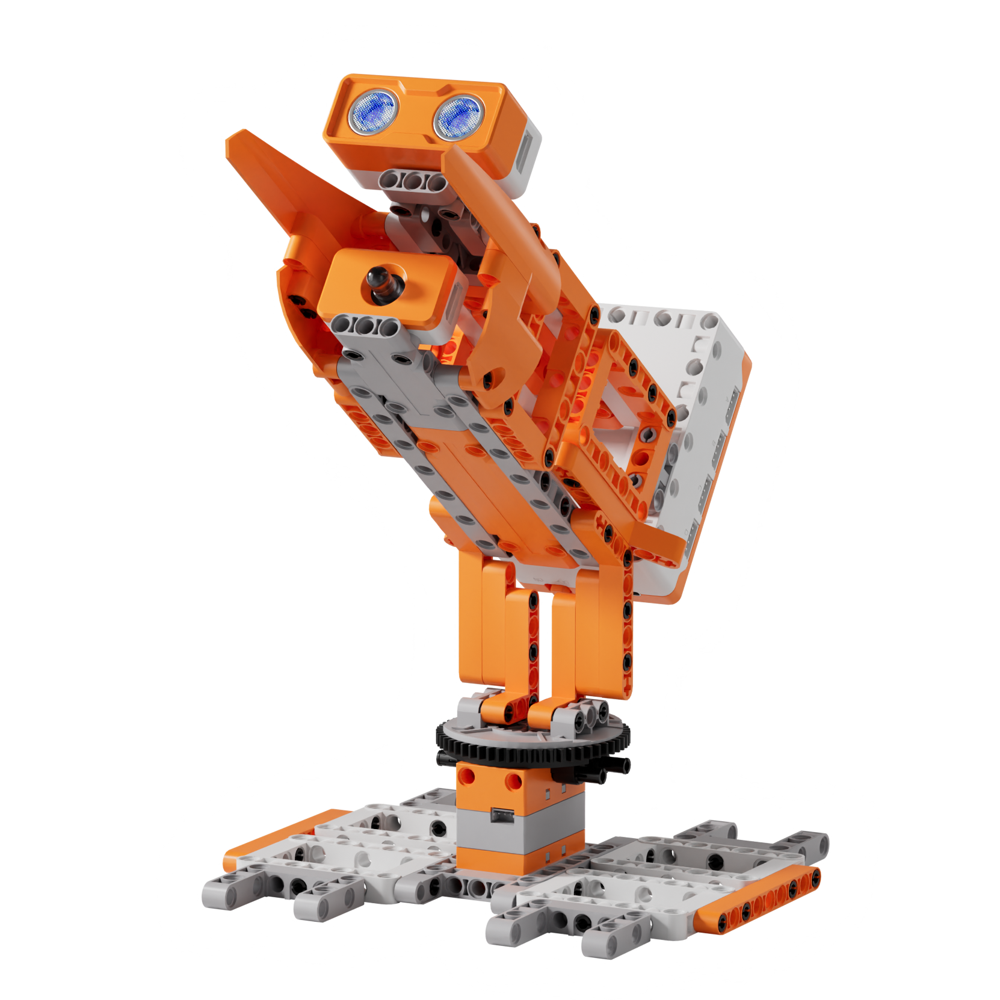
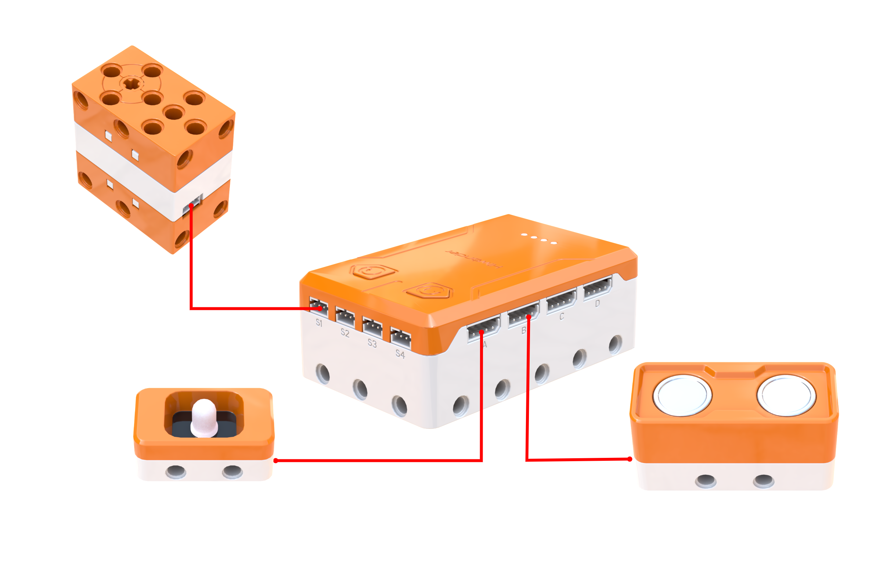
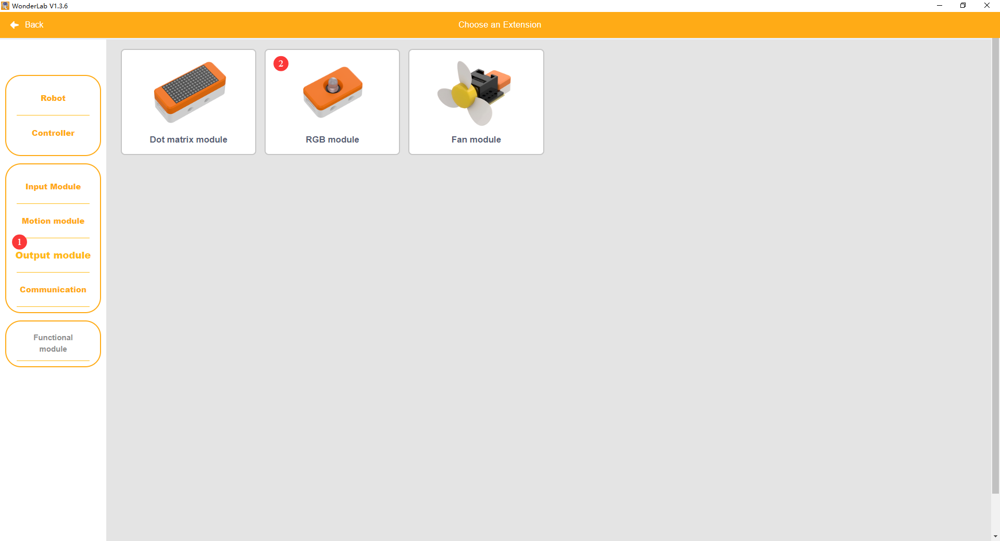
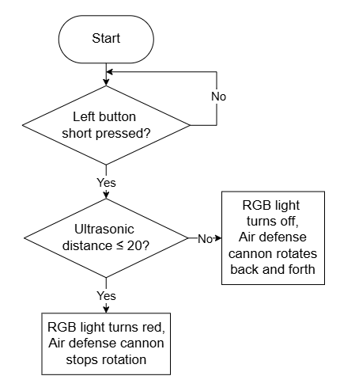
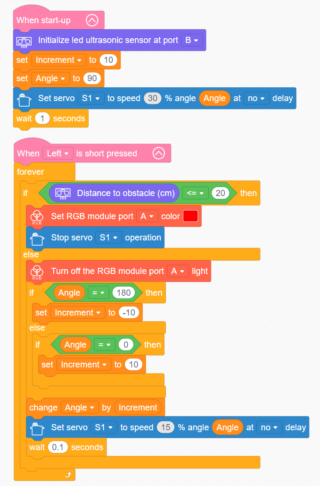

# 3.22 Air Defense Cannon

## 3.22.1 Lesson Introduction

Centering on the intelligent air defense cannon model, this lesson explores coordinated programming across the servo, ultrasonic sensor, and RGB light module. It implements automated defense functions featuring reciprocating scanning and target detection followed by simulated firing. The content examines turret transmission principles, covers variable-driven stepping scan routines, and applies sensor-triggered lighting logic to illustrate how variables govern continuous mechanical motion.

## 3.22.2 Learning Objectives

1. **Knowledge Objectives**: Understand the mechanical transmission principles of rotational turret aiming. Master programming methods using variables to govern incremental servo scanning. Comprehend target capture trigger logic combining ultrasonic sensing with RGB lighting effects.

2. **Skill Objectives**: Assemble the mechanical structure of the air defense cannon independently, mastering servo zero-point calibration and alignment procedures. Program basic reciprocating servo scanning routines. Implement complete system functionality uniting variable-controlled stepping scans, ultrasonic distance detection, and simulated RGB laser firing.

3. **Thinking Objectives**: Establish programming concepts centered on incremental variable control for continuous motion, appreciating how dynamic variables replace static values to provide flexible control. Cultivate scan-detect-trigger target acquisition systems thinking. Strengthen understanding of integrated electromechanical design combining mechanical gearboxes with electronic feedback.

4. **Application Objectives**: Connect concepts to radar tracking installations, security pan-tilt gimbals, and automated tracking cameras. Understand sensing and automated control technologies deployed in defense and security systems. Stimulate enthusiasm for defense technology, military engineering, and autonomous robotics.

## 3.22.3 Preparation

### (1) Hardware Preparation

- AiBlock controller

- 180бу block servo

- RGB light module

- Ultrasonic sensor

- Building block parts pack

- Type-C data cable

- Assembly manual

- Computer

### (2) Software Preparation

- WonderLab Graphical Programming Platform

## 3.22.4 Hands-On Project

### (1) Project Analysis

The core project of this lesson is the Air Defense Cannon, delivering a simulated defense system that autonomously scans airspace, acquires targets, and engages them with simulated fire. The system adopts a three-stage scan-detect-fire architecture: the servo drives the turret through reciprocating stepping scans between 0бу and 180бу in increments of 10бу, while the ultrasonic sensor swivels synchronously to gauge distances across every angle. When detecting an obstacle at a distance of 20 cm or less, the servo halts scanning and the RGB light module illuminates red to simulate laser fire. Once the target clears the detection zone, the turret automatically resumes scanning. The overall workflow replicates standard search, track, and engagement protocols used in air defense systems.

### (2) Assembly Guide

<Pdf src="../../_static/shared/pdf/chapter_3/22.pdf" />

### (3) Hardware Wiring

- Connect the 180бу block servo to port **S1** of the controller using a 3-pin servo cable.

- Connect the RGB light module to port **A** of the controller using a 4-pin module cable.

- Connect the ultrasonic sensor to port **B** of the controller using a 4-pin module cable.

### (4) Adding Extensions

- Select **Ultrasonic sensor** under the **Input Module** category.

- Select **180бу servo** under the **Motion module** category.

- Select **RGB module** under the **Output module** category.

### (5) Core Blocks

| Block | Category | Description |
| :---: | :---: | :--- |
|  |  | Serves as the main loop container, continuously executing internal code after power-on initialization |
|  |  | Triggers internal code blocks when a short press is detected on the designated button |
|  |  | Initializes the port connection for the ultrasonic sensor |
|  |  | Reads the obstacle distance measured by the ultrasonic sensor on the designated port, in centimeters (cm) |
|  |  | Controls the 180бу block servo on the designated port to rotate at a custom speed for a specified duration, continuing immediately to subsequent blocks without waiting if non-delay mode is selected |
|  |  | Disables output to the 180бу block servo on the designated port, halting rotation immediately |
|  |  | Controls the RGB light module on the designated port to illuminate using a preset color |
|  |  | Extinguishes the RGB light module on the designated port to cut off light output |

### (6) Program Description and Upload

- Program Schematic

- Complete Program

  Upon startup, the program initializes the ultrasonic sensor interface and sets the variables increment to 10 and angle to 90, positioning the turret in its default ready state. When an obstacle is detected within 20 cm, the system stops servo S1, bringing the turret to a stationary hold while engaging targets. When no obstacle is detected within 20 cm, servo S1 rotates between 0бу and 180бу at 30% speed, driving the cannon in a continuous back-and-forth scanning motion.

- Program Upload

  Following the animation, click **Connect device**, select the serial port, then click the upload button to upload the program to the controller and test the execution results.

> [!NOTE]
>
> **The source files are available for download under [Program Files](https://drive.google.com/drive/folders/1KQ-KBn3OmxCo6xKJkb7ZQZAuPW9brr5t?usp=sharing).**

## 3.22.5 Expansion and Challenge

**Project 1: Precision Closed-Loop Tracking System**

Once a target is detected, continuously compute the angular deviation and adjust the servo orientation to maintain alignment. Incorporating a second servo enables pitch elevation control, establishing a two-axis tracking turret. This project illustrates the closed-loop feedback principle of detecting errors and correcting direction, extending discussions to radar tracking, missile guidance systems, and automated security gimbals.

**Project 2: Multi-Weapon Mode-Switching Turret**

Configure button inputs to toggle between three combat profiles: Machine Gun Mode featuring flashing red RGB bursts and barrel vibration, Laser Mode featuring solid red illumination and stabilized aiming, and Missile Mode featuring blue-white gradient fades with delayed launch sequences. Practice multi-state transitions and mode-specific programming to understand modular architecture, extending discussions to combat systems in video games and multi-role defense platforms.

## 3.22.6 Q&A

**Question 1: Why use a variable to regulate barrel elevation and azimuth rather than commanding fixed rotations directly between 0бу and 180бу?**

Answer: Utilizing variables for stepping scans ensures that **the system samples each discrete angle along the scanning arc**. If the servo simply sweeps between 0бу and 180бу without intermediate steps, the ultrasonic sensor cannot register distance measurements during transit and only samples at the extreme endpoints. This leaves intermediate sectors unmonitored, much like a surveillance radar checking only peripheral boundaries while ignoring the center. Incrementing by 10бу per step allows the sensor to pause and measure distance at 0бу, 10бу, 20бу, and onward up to 180бу, ensuring comprehensive spatial coverage without blind spots. Furthermore, variable-based control offers high flexibility: accelerating the scan requires merely increasing the step value, refining angular resolution requires decreasing it, and restricting scans to a narrower sector requires adjusting boundary parameters. Replacing static constants with dynamic variables makes the codebase flexible and adaptable.

**Question 2: What principle governs toggling the increment variable to -10 upon reaching 180бу and returning to 10 at 0бу?**

Answer: This technique uses **algebraic signs to control kinematic direction**. The increment variable functions as both step magnitude and directional indicator: positive values increase the angle toward the right, while negative values decrease the angle toward the left. Starting from 90бу, adding 10бу during each iteration rotates the turret progressively rightward. Upon reaching 180бу, the mechanism attains its mechanical limit. Inverting the increment value to -10 causes subsequent additions to reduce the angle by 10бу, reversing turret travel leftward. Once the angle decreases to 0бу at the opposite boundary, the increment returns to +10 to resume rightward motion. Toggling between positive and negative increments causes the angle to cycle smoothly between 0бу and 180бу, producing reciprocating scans. This reflects the standard boundary bounce pattern in game loops, commonly used for patrolling autonomous agents and bouncing projectiles.

## 3.22.7 Technical Support and Product Discussion

To share creative ideas and projects after exploring this kit, visit the Hiwonder Community:

