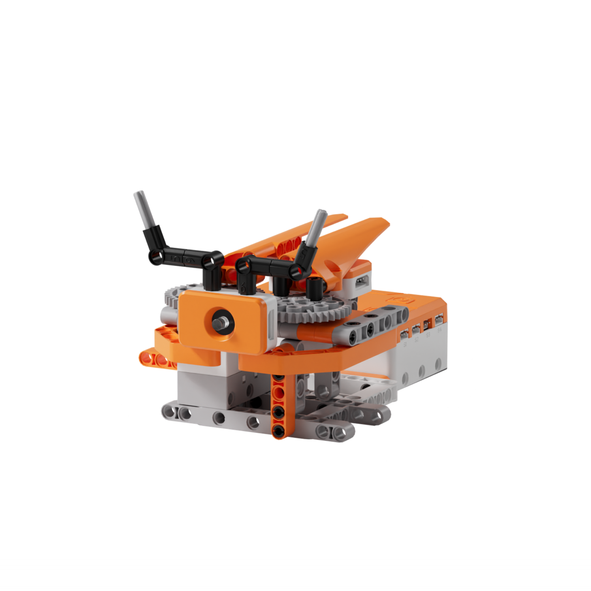
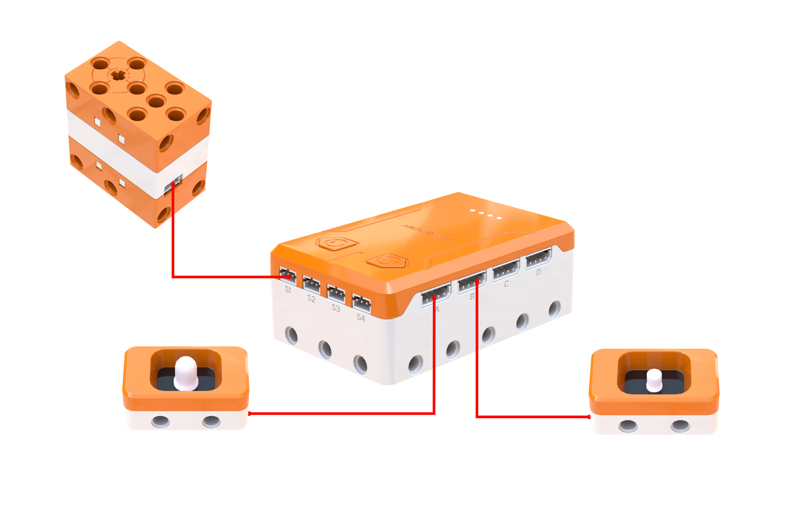
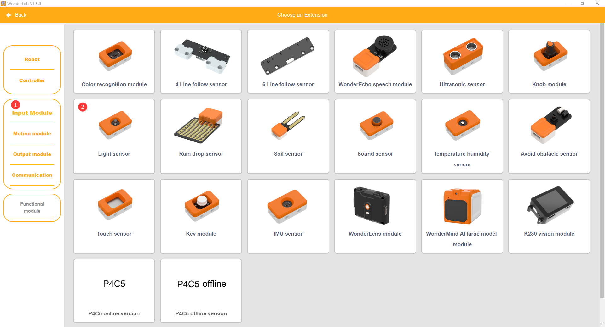
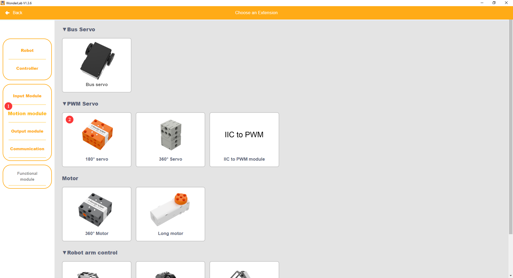
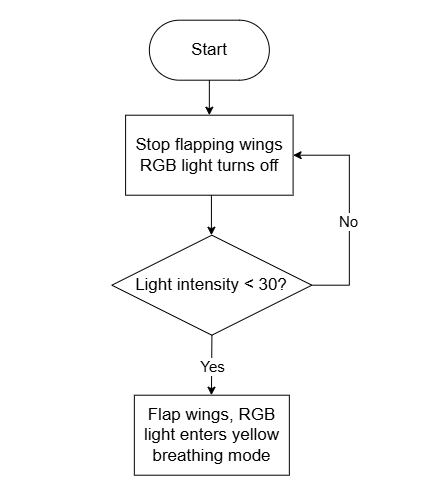
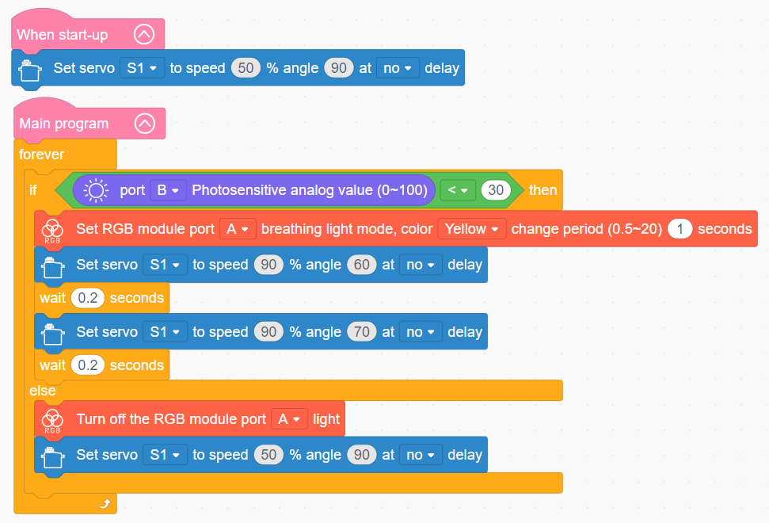

# 3.23 Firefly

## 3.23.1 Lesson Introduction

Centering on the bionic firefly robot project, this lesson explores coordinated programming across the light sensor, servo, and RGB light module. It delivers bionic behaviors where darkness triggers automatic wing flapping and lighting while daylight halts all operations. The content covers precision servo angle regulation and breathing light routines, applies ambient light threshold evaluation structures, and examines multi-device synchronization in bio-inspired robotics.

## 3.23.2 Learning Objectives

1. **Knowledge Objectives**: Understand the operating principles of servos, distinguishing angular positioning from continuous motor rotation. Learn the biological mechanisms of insect bioluminescence. Consolidate threshold evaluation logic for light sensors.

2. **Skill Objectives**: Connect the servo, RGB light module, and light sensor accurately. Program reciprocating servo sweeps to control wing flapping. Implement automated bionic behavior where ambient light thresholds trigger synchronized wing flapping and breathing lights.

3. **Thinking Objectives**: Build an integrated systems control mindset uniting ambient sensing with synchronized multi-actuator responses. Develop precision awareness in position control versus speed control. Strengthen understanding of environmental adaptive intelligence.

4. **Application Objectives**: Connect concepts to robotic joint servos, smart nightlights, and ambient mood lighting. Understand the educational and demonstrative value of bionic robotics. Stimulate enthusiasm for bioluminescence and light-controlled intelligent systems.

## 3.23.3 Preparation

### (1) Hardware Preparation

- AiBlock controller

- 180бу block servo

- RGB light module

- Light sensor

- Building block parts pack

- Type-C data cable

- Assembly manual

- Computer

### (2) Software Preparation

- WonderLab Graphical Programming Platform

## 3.23.4 Hands-On Project

### (1) Project Analysis

The core project of this lesson is the Firefly, delivering a bionic robot that automatically flaps its wings and illuminates in darkness while remaining dormant in daylight. The system adopts an architecture uniting light sensing with synchronized dual-actuator responses: the light sensor continuously samples ambient illumination, and when the value falls below a defined threshold, the controller triggers two synchronized outputs. The servo drives a linkage mechanism to flap the wings through small angular sweeps, while the RGB light module emits a yellow breathing fade to mimic rhythmic glowing. Both outputs start and stop in unison. When the ambient environment brightens, the system halts both actuators, replicating nocturnal insect behaviors.

### (2) Assembly Guide

<Pdf src="../../_static/shared/pdf/chapter_3/23.pdf" />

### (3) Hardware Wiring

- Connect the 180бу block servo to port **S1** of the controller using a 3-pin servo cable.

- Connect the RGB light module to port **A** of the controller using a 4-pin module cable.

- Connect the light sensor to port **B** of the controller using a 4-pin module cable.

### (4) Adding Extensions

- Select **Light sensor** under the **Input Module** category.

- Select **180бу servo** under the **Motion module** category.

- Select **RGB module** under the **Output module** category.

### (5) Core Blocks

| Block | Category | Description |
| :---: | :---: | :--- |
|  |  | Serves as the main loop container, continuously executing internal code after power-on initialization |
|  |  | Executes only once after the device powers on, used to place startup logic such as hardware initialization and parameter configuration |
|  |  | Reads the light intensity value from the light sensor on the designated port across a range of 0 to 100, where higher values indicate brighter illumination |
|  |  | Controls the 180бу block servo on the designated port to rotate at a custom speed for a specified duration, continuing immediately to subsequent blocks without waiting if non-delay mode is selected |
|  |  | Directs the RGB light module on the designated port to activate a breathing fade effect in a selected color, with a customizable transition period |
|  |  | Extinguishes the RGB light module on the designated port to cut off light output |

### (6) Program Description and Upload

- Program Schematic

- Complete Program

  Upon startup, the Firefly enters its initialized standby state. In the main loop, the controller continuously evaluates ambient conditions: when light intensity drops below 30 under dark conditions, the servo begins flapping the wings while the RGB light module activates breathing mode. Otherwise, all outputs stop.

- Program Upload

  Following the animation, click **Connect device**, select the serial port, then click the upload button to upload the program to the controller and test the execution results.

> [!NOTE]
>
> **The source files are available for download under [Program Files](https://drive.google.com/drive/folders/1KQ-KBn3OmxCo6xKJkb7ZQZAuPW9brr5t?usp=sharing).**

## 3.23.5 Expansion and Challenge

**Project 1: Multi-Colored Firefly Customization**

Use the left and right buttons to toggle RGB colors between green on the left button, blue on the right button, and default yellow, pairing each palette with unique breathing periods. Use a variable to track the active color state and update the variable upon button presses. Practice using state variables within multi-branch conditional statements to understand parametric control, extending discussions to color variations in bioluminescent species and the underlying biochemistry.

**Project 2: Sound-Activated Interactive Firefly**

Maintain gentle breathing fades and slow wing flapping under normal conditions, and program clapping sounds to trigger rapid flashing and agitated wing flapping to simulate a biological startle response. Have the robot automatically return to steady state after several seconds. Practice transitioning between normal and triggered states alongside timed recovery routines, extending discussions to biological reflex arcs and emotional expression in interactive robotics.

## 3.23.6 Q&A

**Question 1: Why does the Firefly program evaluate ambient light intensity, and why not keep the lights active during daylight?**

Answer: This mechanism replicates the **nocturnal behavioral patterns** of real fireflies, which stay dormant during daylight hours and become active only after dusk. Incorporating a light sensor to detect darkness conserves power while producing authentic biological simulations. In engineering, this approach represents **environment-adaptive control**, allowing devices to operate autonomously according to ambient conditions without manual switching. Common real-world applications including automated streetlights, smartphone ambient display brightness adjustment, and solar path lights rely on identical sensing principles to save energy and enhance operational convenience.

**Question 2: How does a breathing light gradually brighten and dim rather than switching abruptly between on and off?**

Answer: The breathing light operates via **pulse width modulation, also known as PWM**. Rather than altering the continuous supply voltage, the controller rapidly pulses the light on and off at speeds imperceptible to human vision. When the duration of the on state exceeds the off state within each cycle, the LED appears bright. Conversely, shortening the on duration causes the LED to appear dim. By progressively adjusting this duty cycle ratio from 0 to peak brightness and then lowering it back to 0, the program generates a smooth breathing curve. Unlike harsh instant on-and-off switching, smooth transitions provide a gentle visual experience, making PWM breathing indicators standard across smartphone notifications, sleep indicators, and automotive ambient lighting.

## 3.23.7 Technical Support and Product Discussion

To share creative ideas and projects after exploring this kit, visit the Hiwonder Community:

