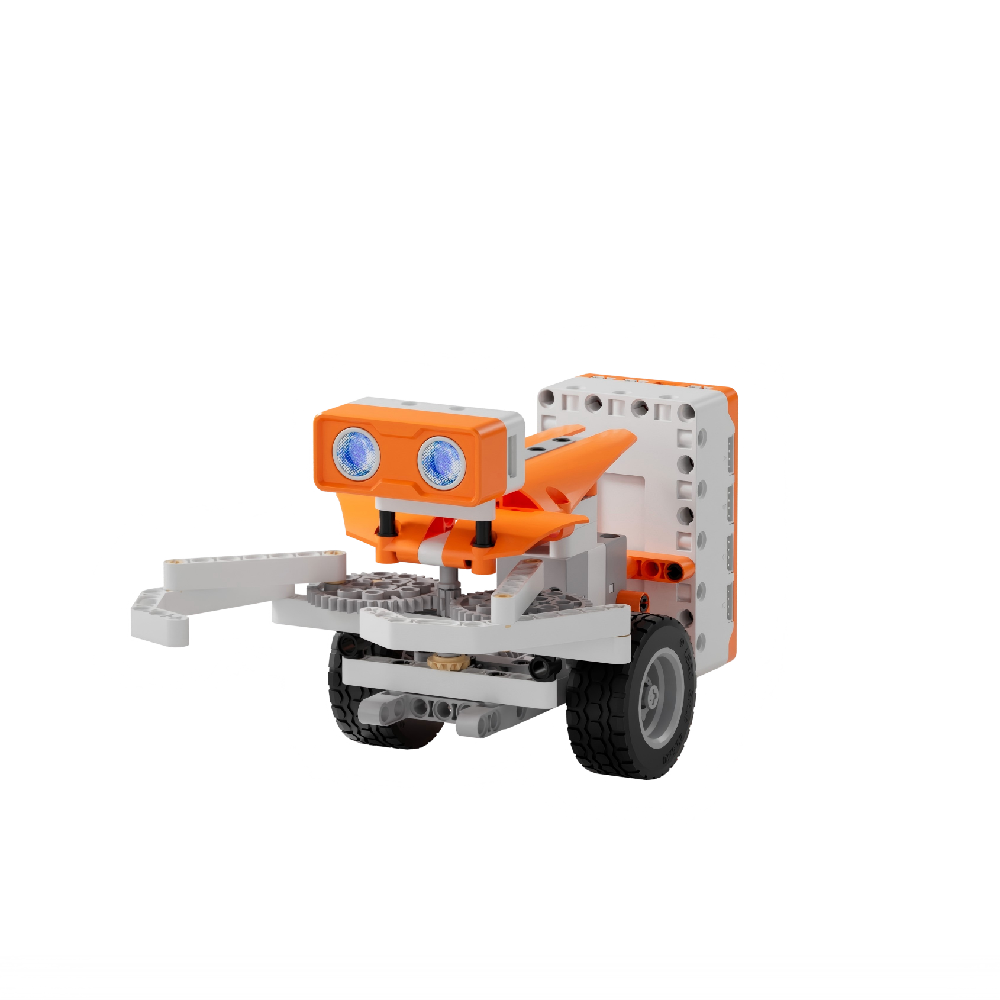
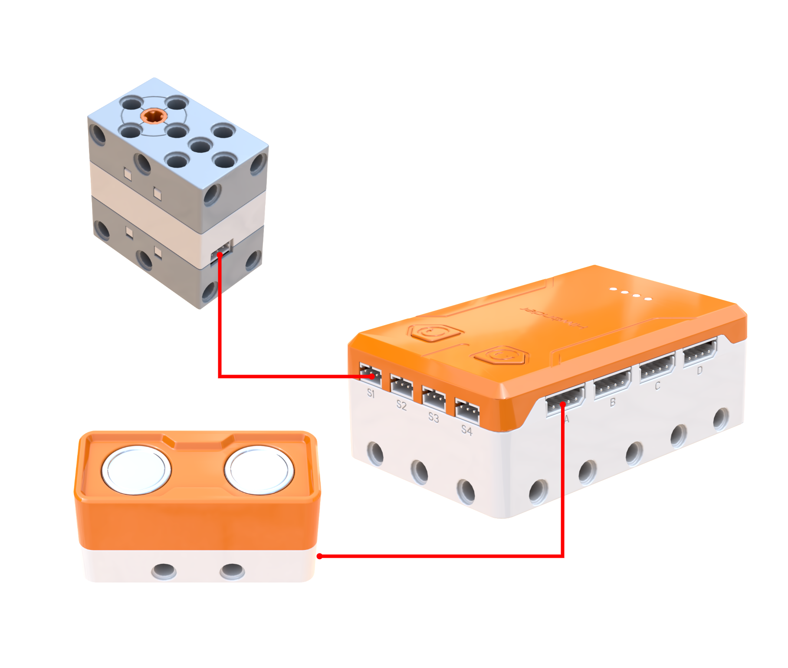
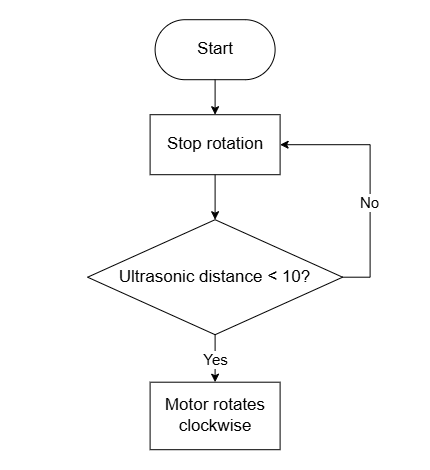
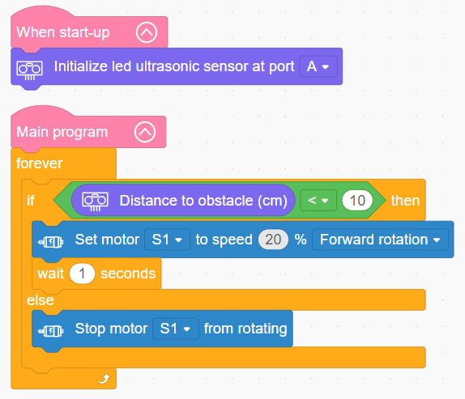

# 3.24 Claw Beetle

## 3.24.1 Lesson Introduction

Centering on the robotic claw beetle model, this lesson explores coordinated control between the ultrasonic sensor and a motorized gripper mechanism. By combining ultrasonic distance sensing with a worm-and-gear gripper transmission, it implements automated bionic foraging where target detection triggers forward locomotion and grasping. The content covers ultrasonic sensor initialization and distance reading routines, reinforces mechanical characteristics including torque amplification and worm-drive self-locking, and illustrates event-triggered actuation based on distance thresholds.

## 3.24.2 Learning Objectives

1. **Knowledge Objectives**: Understand the operating principles of ultrasonic distance measurement, connecting acoustic wave reflection with time-of-flight calculations. Comprehend how worm gears provide torque amplification, speed reduction, and self-locking within gripper mechanisms. Recognize the operational necessity of sensor port initialization.

2. **Skill Objectives**: Connect the motor and ultrasonic sensor properly to construct the mechanical chassis and gripper of the Claw Beetle. Program sensor initialization and distance measurement routines. Implement automated grasping behaviors triggered by distance threshold evaluations.

3. **Thinking Objectives**: Build an interactive sensing-to-action mindset that links distance perception with automated physical response. Cultivate engineering discipline regarding sensor calibration and initialization routines. Appreciate multi-functional mechanical design principles where a single motor concurrently drives locomotion and gripper articulation.

4. **Application Objectives**: Connect concepts to automotive reverse parking sensors, automated sliding doors, industrial robotic arms, and obstacle-avoidance drones. Understand the wide deployment of ultrasonic sensing across industrial automation and mobile robotics. Stimulate enthusiasm for intelligent robotics and automated control engineering.

## 3.24.3 Preparation

### (1) Hardware Preparation

- AiBlock controller

- 360бу block motor

- Ultrasonic sensor

- Building block parts pack

- Type-C data cable

- Assembly manual

- Computer

### (2) Software Preparation

- WonderLab Graphical Programming Platform

## 3.24.4 Hands-On Project

### (1) Project Analysis

The core project of this lesson is the Claw Beetle, delivering an autonomous bionic foraging robot that detects prey, charges forward, and exerts a firm mechanical grasp. The system adopts an integrated architecture combining ultrasonic detection, threshold evaluation, and split-gear actuation: the ultrasonic sensor continuously measures obstacle distances ahead, triggering the drive system whenever an object is detected within 10 cm. A single motor distributes mechanical power through a split gear train to execute dual actions simultaneously: driving the wheels to approach the target while rotating a worm gear to articulate the gripper jaws. The torque-multiplying and self-locking properties of the worm drive ensure a tight and reliable grasp without slipping. In the absence of nearby targets, the robot pauses in standby, replicating predatory insect behavior.

### (2) Assembly Guide

<Pdf src="../../_static/shared/pdf/chapter_3/24.pdf" />

### (3) Hardware Wiring

- Connect the 360бу block motor to port **S1** of the controller using a 3-pin servo cable.

- Connect the ultrasonic sensor to port **A** of the controller using a 4-pin module cable.

### (4) Adding Extensions

- Select **Ultrasonic sensor** under the **Input Module** category.

- Select **360бу Motor** under the **Motion module** category.

### (5) Core Blocks

| Block | Category | Description |
| :---: | :---: | :--- |
|  |  | Serves as the main loop container, continuously executing internal code after power-on initialization |
|  |  | Executes only once after the device powers on, used to place startup logic such as hardware initialization and parameter configuration |
|  |  | Initializes the port connection for the ultrasonic sensor |
|  |  | Reads the obstacle distance measured by the ultrasonic sensor on the designated port, in centimeters |
|  |  | Directs the 360бу block motor on the designated port to rotate continuously forward or in reverse at a custom speed |
|  |  | Disables output to the 360бу block motor on the designated port, halting rotation immediately |

### (6) Program Description and Upload

- Program Schematic

- Complete Program

  Upon startup, the program initializes the ultrasonic sensor interface. In the main loop, the controller executes continuously: when the ultrasonic sensor detects an obstacle within 10 cm ahead, the motor activates, driving the Claw Beetle forward while simultaneously swinging the gripper jaws into a grasping motion. Otherwise, the motor stops.

- Program Upload

  Following the animation, click **Connect device**, select the serial port, then click the upload button to upload the program to the controller and test the execution results.

> [!NOTE]
>
> **The source files are available for download under [Program Files](https://drive.google.com/drive/folders/1KQ-KBn3OmxCo6xKJkb7ZQZAuPW9brr5t?usp=sharing).**

## 3.24.5 Expansion and Challenge

**Project 1: Multi-Tier Distance Response System**

Implement multi-branch conditional logic based on distance ranges: halt when distance exceeds 20 cm, approach at slow speed between 10 cm and 20 cm, and engage high-speed grasping when within 10 cm, pairing each tier with green, yellow, or red RGB indicators. Understand continuous measurement discretization, practice multi-threshold evaluation logic, and extend discussions to radar speed measurement tiers and adaptive cruise control in autonomous vehicles.

**Project 2: Obstacle-Avoiding Walking Beetle**

With dual motors installed, configure the beetle to stop advancing when an obstacle is detected, turn through an angle, and resume travel, using timed delays to control turn angles. Practice steering logic and cyclic roaming strategies to understand basic autonomous navigation, extending discussions to pathfinding technologies used in robotic vacuums and automated guided vehicles.

## 3.24.6 Q&A

**Question 1: How does the ultrasonic sensor calculate distance, and why is it referred to as "ultrasonic"?**

Answer: The ultrasonic sensor operates based on the principle of **acoustic echo ranging**. It emits high-frequency sound waves exceeding 20,000 Hz, which lie beyond human hearing limits. When these waves encounter an obstacle, they reflect back as an echo. By measuring the elapsed time between emission and reception, the controller calculates distance using the formula of elapsed time multiplied by the speed of sound and divided by two, identical to echolocation in bats and marine mammals. It is designated ultrasonic because its operational frequency exceeds the upper limit of the human audible spectrum, which spans 20 Hz to 20,000 Hz. Ultrasonic technology provides safe and reliable measurement, finding extensive applications across automotive backup sensors, automated faucets, and medical diagnostic sonography.

**Question 2: How can the Claw Beetle drive forward and articulate its gripper using only a single motor?**

Answer: This mechanism achieves multi-functional actuation through **split gear power distribution**. Mechanical output from the motor divides into two distinct transmission paths via an arrangement of gears: one path drives the drive wheels forward, while the other drives a worm gear to oscillate the gripper jaws. A single power source thus commands two simultaneous movements. This design minimizes mechanical complexity, saves components, and reduces manufacturing costs. Furthermore, the worm drive provides substantial torque multiplication and speed reduction for the gripper: high motor speed reduces to slow, forceful jaw motion capable of securing heavier objects, while the inherent self-locking property of worm drives prevents the jaws from loosening under load. Industrial machinery frequently employs similar single-source multi-mechanism drivetrains as a foundational engineering strategy.

## 3.24.7 Technical Support and Product Discussion

To share creative ideas and projects after exploring this kit, visit the Hiwonder Community:

