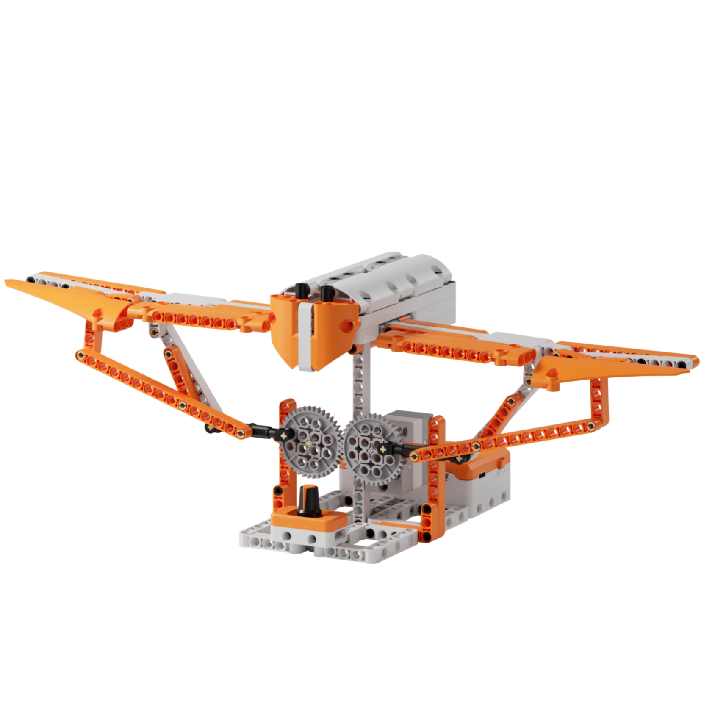
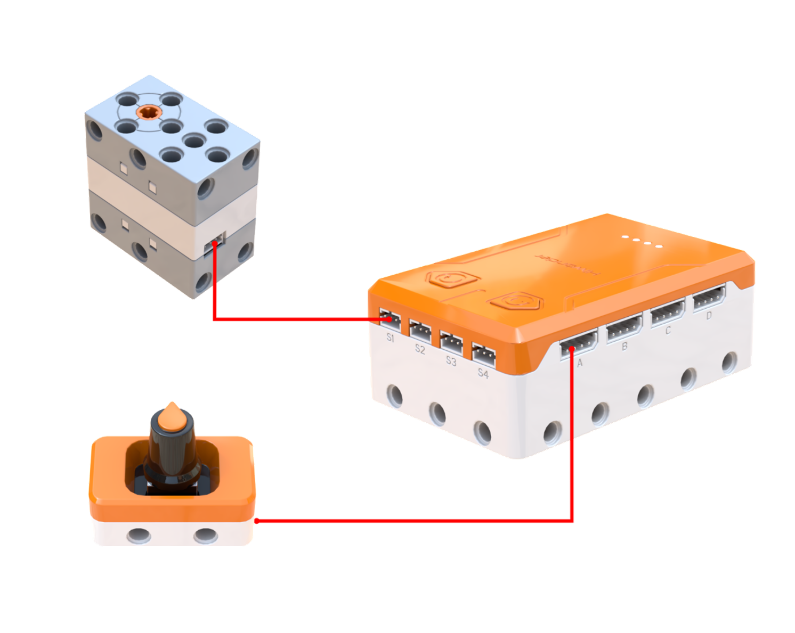
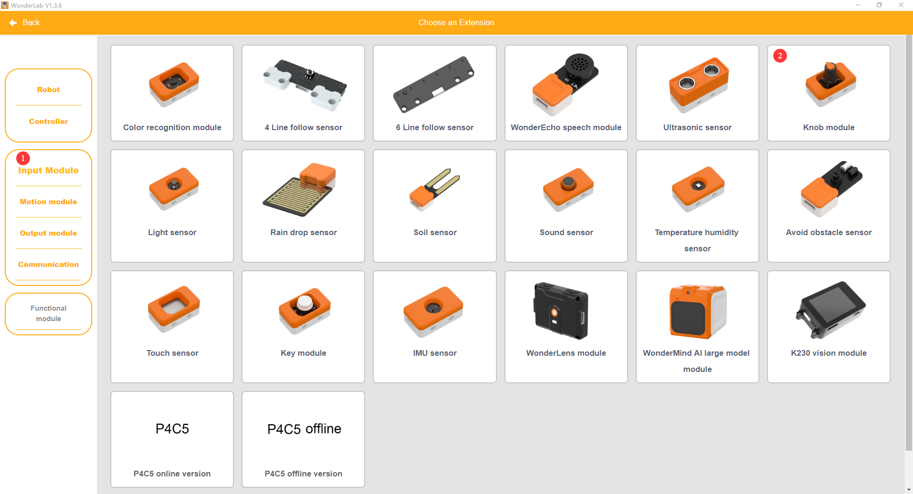
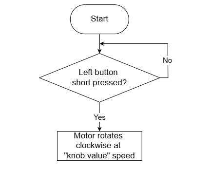
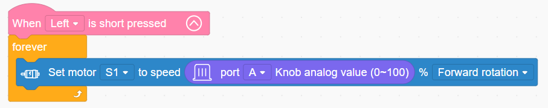

# 3.25 Flapping Bird

## 3.25.1 Lesson Introduction

Centering on avian flapping-wing flight as a bionic prototype, this lesson explores the construction of a robotic bird that simulates natural wing flapping. Building upon earlier concepts of motor drives and linkage mechanics, it investigates how crankshaft-connecting rod mechanisms transform rotational motion into reciprocating flapping strokes. The content examines aerodynamic lift generation in birds, covers crankshaft transmission design, and applies analog potentiometer readings from a knob module to regulate motor speed continuously.

## 3.25.2 Learning Objectives

1. **Knowledge Objectives**: Understand motion conversion in crankshaft-connecting rod mechanisms, grasping how circular rotation transforms into reciprocating oscillation. Explore how flapping wings generate aerodynamic lift in avian flight. Recognize the potentiometer operating principles and analog output characteristics of the knob module.

2. **Skill Objectives**: Assemble the wing frame and transmission mechanism of the Flapping Bird independently, mastering the alignment of the crankshaft and connecting rods. Read analog values from the knob module. Program stepless speed regulation routines where potentiometer input directly governs motor velocity.

3. **Thinking Objectives**: Establish direct mapping control logic from analog sensor inputs to actuator parameters. Cultivate bionic engineering design thinking by deriving mechanical solutions from biological structures. Contrast stepless regulation with discrete gear-shifting logic.

4. **Application Objectives**: Connect concepts to flapping-wing drones, biomimetic robotics, and variable-speed cooling fans. Appreciate the engineering value of biomimicry in aerodynamic and mechanical design. Stimulate enthusiasm for aerospace engineering and biomechanics.

## 3.25.3 Preparation

### (1) Hardware Preparation

- AiBlock controller

- 360° block motor

- Knob module

- Building block parts pack

- Type-C data cable

- Assembly manual

- Computer

### (2) Software Preparation

- WonderLab Graphical Programming Platform

## 3.25.4 Hands-On Project

### (1) Project Analysis

The core project of this lesson is the Flapping Bird, delivering an interactive bionic mechanism that provides stepless control over wing-flapping frequency via a rotary knob. The system adopts a three-tier input-processing-actuation architecture: the knob module returns a continuous analog reading between 0 and 100, which the program maps directly to motor speed percentages to achieve stepless regulation. In the actuation stage, the motor drives a crankshaft-connecting rod mechanism to articulate both wings in synchrony, converting rotational drive into up-and-down flapping strokes. Higher motor speeds produce faster flapping frequencies, faithfully emulating natural wing variations in birds.

### (2) Assembly Guide

<Pdf src="../../_static/shared/pdf/chapter_3/25.pdf" />

### (3) Hardware Wiring

- Connect the 360° block motor to port **S1** of the controller using a 3-pin servo cable.

- Connect the knob module to port **A** of the controller using a 4-pin module cable.

### (4) Adding Extensions

- Select **Knob** under the **Input Module** category.

- Select **360° Motor** under the **Motion module** category.

### (5) Core Blocks

| Block | Category | Description |
| :---: | :---: | :--- |
|  |  | Triggers internal code blocks when a short press is detected on the designated button |
|  |  | Reads the rotational position value of the potentiometer knob on the designated port across a range of 0 to 100, commonly used for parameter adjustment |
|  |  | Directs the 360° block motor on the designated port to rotate continuously forward or in reverse at a custom speed |

### (6) Program Description and Upload

- Program Schematic

- Complete Program

  When the left button is pressed, motor S1 repeatedly runs forward at the speed set by the knob value, controlling the wing flapping frequency of the bird via the rotary knob.

- Program Upload

  Following the animation, click **Connect device**, select the serial port, then click the upload button to upload the program to the controller and test the execution results.

> [!NOTE]
>
> **The source files are available for download under [Program Files](https://drive.google.com/drive/folders/1KQ-KBn3OmxCo6xKJkb7ZQZAuPW9brr5t?usp=sharing).**

## 3.25.5 Expansion and Challenge

**Project 1: Light-Responsive Automated Flapping System**

Replace the knob module with a light sensor to control motor speed directly through ambient light intensity, accelerating flapping under strong light and stopping below a preset threshold to emulate avian diurnal rhythms. Analyze how environmental sensing parameters map directly into kinematic control variables, extending discussions to phototropism in plants, solar tracking arrays, and dusk-to-dawn lighting.

**Project 2: Bidirectional Aerobatic Flapping Regimes**

Utilize bidirectional motor rotation to establish dual flapping regimes: turning the knob counterclockwise below the midpoint commands slow reverse flapping, turning clockwise past the midpoint drives fast forward flapping, and centering the knob halts motion. Practice zero-point thresholding and piecewise analog mapping, extending discussions to comparisons between fixed-wing and ornithopter aircraft as well as advanced bio-inspired drone research.

## 3.25.6 Q&A

**Question 1: Why do the bird wings flap up and down rather than rotating continuously with the motor, and what mechanism converts this motion?**

Answer: A **crankshaft-connecting rod mechanism** converts continuous rotational motion into reciprocating up-and-down oscillation. The motor shaft mounts an eccentric crankshaft whose driving pin is positioned offset from the rotational center, tracing a circle as the motor spins. A connecting rod mounts to this offset pin at one end and couples to the wing root at the other. As the crankshaft revolves, the rod pushes and pulls alternately, driving the wings to oscillate up and down around their pivot axis. This mechanical principle mirrors the rowing motion in the Dragon Boat Warrior, the needle drive in sewing machines, and the piston drives in automotive engines, converting continuous rotation into linear or angular reciprocating strokes. In biological systems, avian pectoral muscles produce reciprocating wing beats, which this mechanism accurately replicates in hardware.

**Question 2: What distinguishes knob-controlled speed regulation from button-toggled stepped speed settings, and what defines stepless regulation?**

Answer: Stepped button control offers only a few discrete speed tiers, producing abrupt jumps between settings, whereas knob control delivers **stepless speed regulation** with an infinite spectrum of smooth adjustments across the entire range. Stepless control allows arbitrary fine-tuning to any desired velocity rather than being confined to rigid presets. In this software implementation, the analog 0 to 100 reading from the knob maps directly to the motor speed parameter, making velocity proportional to rotary displacement. In everyday applications, household fan buttons use discrete mechanical steps, whereas variable-frequency air conditioners, dimmable desk lamps, and vehicle accelerator pedals use stepless modulation for smoother and more refined control.

## 3.25.7 Technical Support and Product Discussion

To share creative ideas and projects after exploring this kit, visit the Hiwonder Community:

