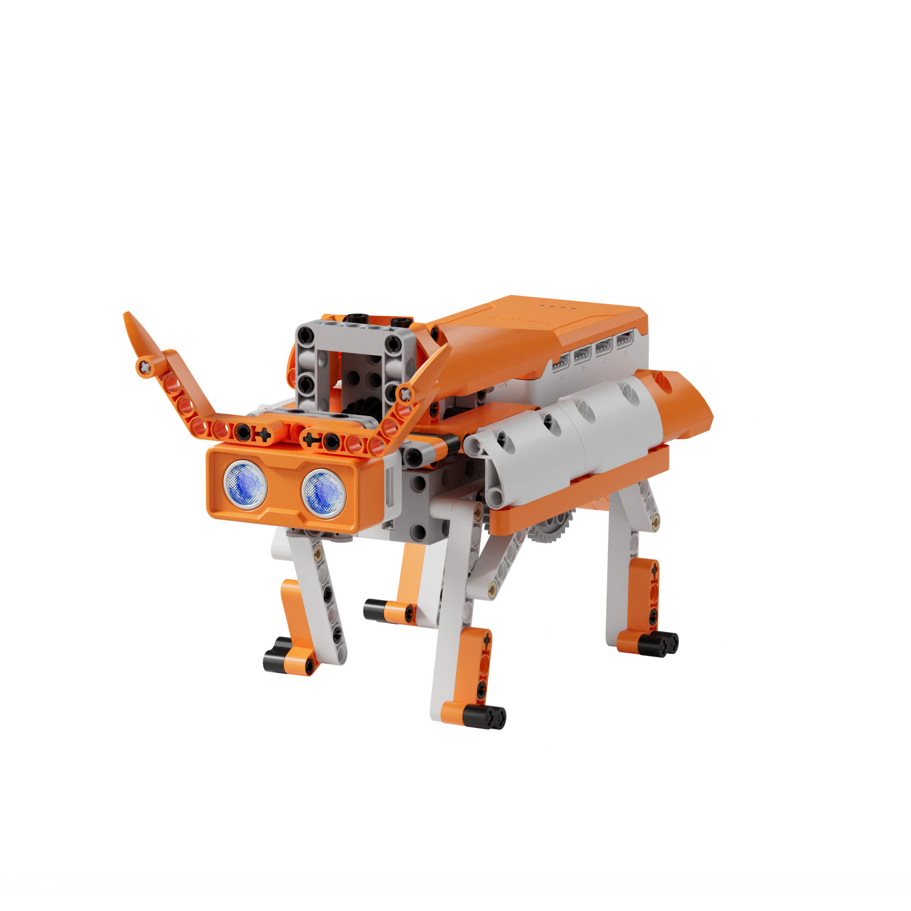
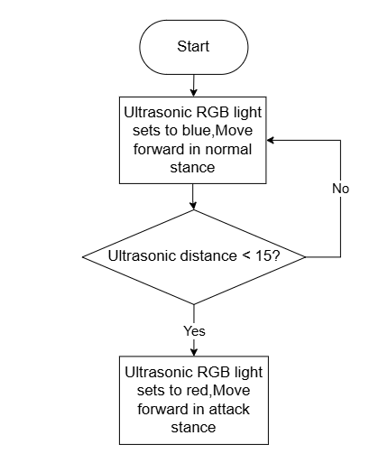
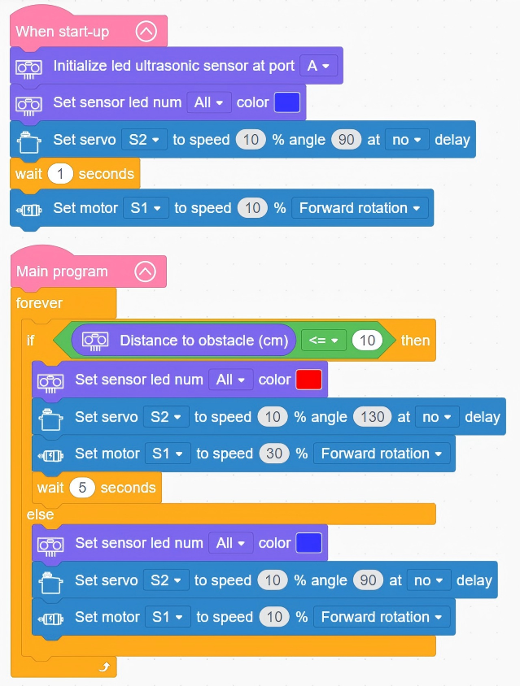

# 3.26 Mecha Bull

## 3.26.1 Lesson Introduction

Centering on the mecha bull robot project, this lesson explores coordinated programming across the drive motor, servo, and ultrasonic sensor. It implements an intelligent state transition between normal walking and aggressive charging upon target detection. The content examines four-legged gait stability and servo angle control, applies sensor-triggered state switching routines, and reinforces multi-actuator behavioral regulation.

## 3.26.2 Learning Objectives

1. **Knowledge Objectives**: Understand the three-point contact stability principle in quadrupedal locomotion, recognizing the balance advantages of four-legged over two-legged gaits. Master state-switching control logic triggered by ultrasonic distance thresholds. Consolidate servo angle positioning and motor speed regulation routines.

2. **Skill Objectives**: Assemble the mechanical chassis of the quadrupedal Mecha Bull independently, mastering servo calibration and neutral position alignment. Program walking locomotion and head posture adjustments. Implement automated mode switching from default cruising to combat charging upon detecting obstacles with the ultrasonic sensor.

3. **Thinking Objectives**: Establish state-machine thinking for switching between normal and triggered operating states. Develop engineering analysis skills regarding gait stability, understanding how base-of-support geometry dictates balance. Strengthen systemic reasoning for multi-actuator coordination.

4. **Application Objectives**: Connect concepts to quadrupedal robots, all-terrain robotic dogs, and search-and-rescue robots. Understand the operational value of biomimetic quadrupeds across rugged terrain. Stimulate creative interest in mecha design and biomimetic mechanical engineering.

## 3.26.3 Preparation

### (1) Hardware Preparation

- AiBlock controller

- 360° block motor

- 180° block servo

- Ultrasonic sensor

- Building block parts pack

- Type-C data cable

- Assembly manual

- Computer

### (2) Software Preparation

- WonderLab Graphical Programming Platform

## 3.26.4 Hands-On Project

### (1) Project Analysis

The core project of this lesson is the Mecha Bull, delivering a bionic quadruped that autonomously transitions between steady cruising and charging attack postures. The system adopts an ultrasonic perception and dual-state switching architecture: the ultrasonic sensor continuously scans ahead, maintaining a slow walking pace when clearance exceeds 10 cm and switching to a high-speed charge whenever an obstacle is detected within 10 cm. The drive motor powers the quadrupedal walking linkage, accelerating during charges. Concurrently, the servo adjusts the head posture, keeping it level during standard cruising and lowering the horns forward in a charging stance. Integrated LEDs on the ultrasonic sensor shift color to indicate active modes, vividly recreating the charging behavior of a bull spotting a target.

### (2) Assembly Guide

<Pdf src="../../_static/shared/pdf/chapter_3/26.pdf" />

### (3) Hardware Wiring

- Connect the 360° block motor to port **S1** of the controller using a 3-pin servo cable.

- Connect the 180° block servo to port **S2** of the controller using a 3-pin servo cable.

- Connect the ultrasonic sensor to port **A** of the controller using a 4-pin module cable.

### (4) Adding Extensions

- Select **Ultrasonic sensor** under the **Input Module** category.

- Select **180° servo** and **360° Motor** under the **Motion module** category.

### (5) Core Blocks

| Block | Category | Description |
| :---: | :---: | :--- |
|  |  | Serves as the main loop container, continuously executing internal code after power-on initialization |
|  |  | Executes only once after the device powers on, used to place startup logic such as hardware initialization and parameter configuration |
|  |  | Initializes the port connection for the ultrasonic sensor |
|  |  | Reads the obstacle distance measured by the ultrasonic sensor on the designated port, in centimeters |
|  |  | Controls the built-in RGB LEDs on the ultrasonic sensor to illuminate using preset colors, supporting control over one, two, or all LEDs |
|  |  | Directs the 360° block motor on the designated port to rotate continuously forward or in reverse at a custom speed |
|  |  | Controls the 180° block servo on the designated port to rotate at a custom speed for a specified duration, continuing immediately to subsequent blocks without waiting if non-delay mode is selected |

### (6) Program Description and Upload

- Program Schematic

- Complete Program

  Upon startup, the program initializes the ultrasonic sensor interface, sets the sensor LEDs to blue, and commands servo S2 to 90° to level the head. The Mecha Bull marches forward until detecting an obstacle within 10 cm, whereupon the LEDs turn red, servo S2 rotates to 130° at 30% speed to lower the horns into a charging posture, and the drive motor accelerates. Once the obstacle clears, the LEDs revert to blue, and the actuators return to their standard forward cruising posture.

- Program Upload

  Following the animation, click **Connect device**, select the serial port, then click the upload button to upload the program to the controller and test the execution results.

> [!NOTE]
>
> **The source files are available for download under [Program Files](https://drive.google.com/drive/folders/1KQ-KBn3OmxCo6xKJkb7ZQZAuPW9brr5t?usp=sharing).**

## 3.26.5 Expansion and Challenge

**Project 1: Multi-Tier Threat Escalation System**

Map three distance ranges to distinct behavioral profiles: leisurely walking with green illumination beyond 20 cm, alert head-raising with yellow illumination between 10 cm and 20 cm, and high-speed charging with flashing red lights within 10 cm. Practice multi-threshold conditional partitioning and synchronized multi-state outputs to understand progressive response logic, extending discussions to tiered security perimeters and animal threat-assessment behaviors.

**Project 2: Sound-Activated Roaring Bull**

Configure clapping sounds to trigger head lifting, roaring audio clips, and flashing light sequences to simulate an agitated bull, automatically resuming standard walking after several seconds. Practice audio trigger detection and timed state recovery to explore multi-sensory expression uniting motion, sound, and lighting, extending discussions to interactive animatronics and emotional expressions in theme park robotics.

## 3.26.6 Q&A

**Question 1: Why does quadrupedal walking provide greater stability than bipedal locomotion, and what physical principle governs this difference?**

Answer: Quadrupedal locomotion achieves superior stability through the **three-point support principle**. While walking, a four-legged animal lifts its legs alternately while ensuring that at least three feet maintain ground contact at any given instant. These three support points define a triangular base of support: as long as the center of gravity projects within this triangle, the body remains statically stable, exactly like a three-legged stool. In contrast, bipedal locomotion provides only two contact points, reducing the base of support to a narrow line. The center of gravity easily strays outside this line, requiring continuous active shifts to preserve dynamic balance. Consequently, quadrupedal platforms such as the Boston Dynamics Spot achieved commercial viability earlier than humanoids because four legs naturally navigate irregular terrain, stairs, and slopes, proving effective across search-and-rescue, exploratory, and logistics missions.

**Question 2: How does the software govern state transitions between steady cruising and charging attack modes in the Mecha Bull?**

Answer: The system relies on **distance threshold evaluation via the ultrasonic sensor** to execute automated state transitions. Within the main loop, the software continuously samples the clearance to frontal obstacles and evaluates that measurement against a preset 10 cm threshold. When clearance exceeds 10 cm, the environment is deemed clear, maintaining the default cruising state characterized by moderate speed, level head alignment, and blue illumination. When clearance drops to 10 cm or less, the system immediately switches to the charging state, accelerating forward, lowering the head, and shifting the LEDs to alert red. This illustrates conditional state transition control, a foundational paradigm across intelligent systems: triggering air conditioning when temperature exceeds limits, turning on streetlights when illumination drops, and engaging automatic braking when forward vehicles come too close.

## 3.26.7 Technical Support and Product Discussion

To share creative ideas and projects after exploring this kit, visit the Hiwonder Community:

