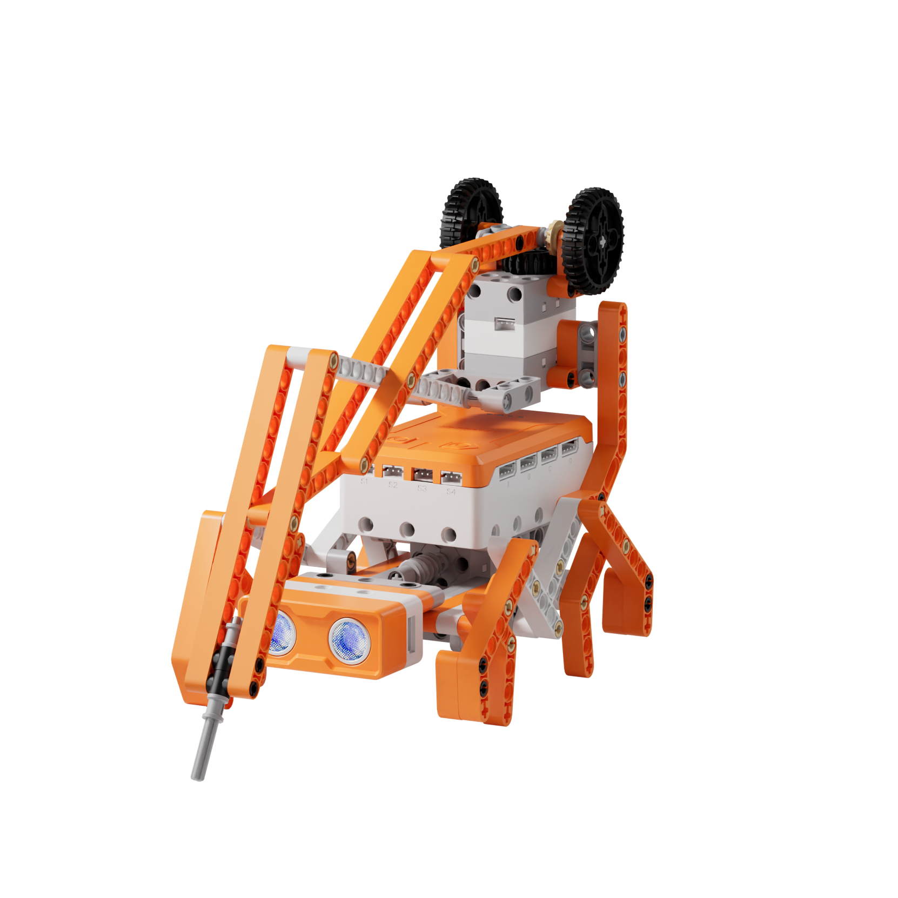
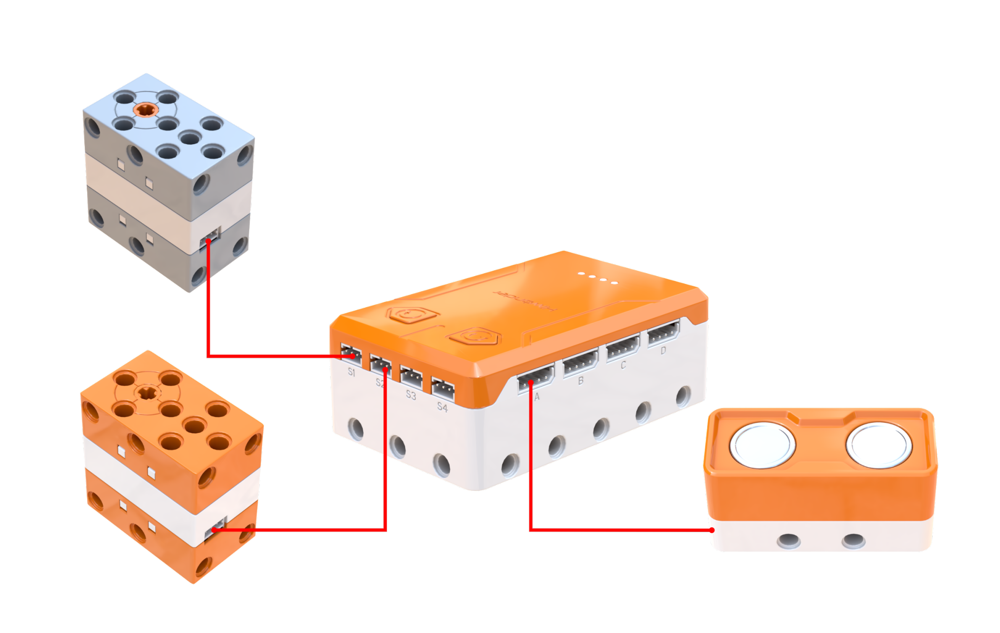
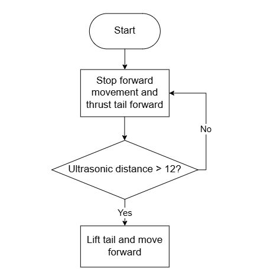
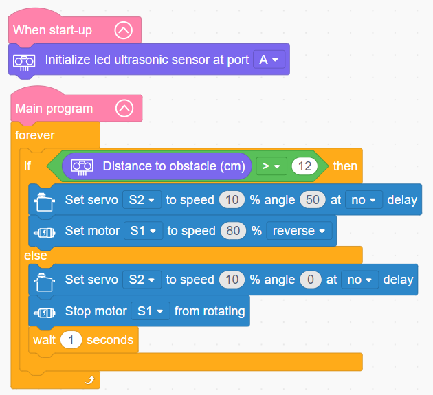

# 3.27 Scorpion Mecha Warrior

## 3.27.1 Lesson Introduction

Centering on the scorpion mecha warrior robot project, this lesson explores coordinated programming across the drive motor, servo, and ultrasonic sensor. It implements an autonomous combat routine that transitions from patrolling forward to halting and striking when encountering an obstacle. The content examines eight-legged wave gait mechanics and precise servo-driven tail articulation, applies sensor-triggered action sequences, and reinforces multi-actuator scheduling in bio-inspired robotics.

## 3.27.2 Learning Objectives

1. **Knowledge Objectives**: Understand the locomotion principles of an eight-legged wave gait, appreciating the stability advantages of multi-legged locomotion. Master control logic for triggering combat behaviors via ultrasonic obstacle detection. Consolidate coordinated programming methods uniting motor and servo actuators.

2. **Skill Objectives**: Assemble the mechanical structure of the eight-legged scorpion independently, mastering servo calibration and neutral position alignment for the tail mechanism. Program locomotion and tail-strike behaviors. Implement automated combat routines where obstacle detection triggers immediate striking sequences.

3. **Thinking Objectives**: Establish state-machine logic for switching between patrol and attack modes. Develop structural design awareness for multi-legged coordination. Reinforce reactive programming principles for rapid sensor-driven responses.

4. **Application Objectives**: Connect concepts to multi-legged search-and-rescue robots, planetary exploration rovers, and biomimetic robotic insects. Understand the unique mobility advantages of multi-legged walkers across rough terrain. Stimulate enthusiasm for combat robotics and biomimetic mechanism design.

## 3.27.3 Preparation

### (1) Hardware Preparation

- AiBlock controller

- 360° block motor

- 180° block servo

- Ultrasonic sensor

- Building block parts pack

- Type-C data cable

- Assembly manual

- Computer

### (2) Software Preparation

- WonderLab Graphical Programming Platform

## 3.27.4 Hands-On Project

### (1) Project Analysis

The core project of this lesson is the Scorpion Mecha Warrior, delivering an autonomous biomimetic robot that transitions between forward patrolling and stationary attack behaviors. The system adopts an ultrasonic perception and dual-state switching architecture: the ultrasonic sensor continuously scans ahead, commanding forward patrol travel when obstacle clearance exceeds 12 cm and switching to attack mode when clearance is 12 cm or less. The drive motor powers the eight-legged wave gait linkage, advancing during patrol and halting during attacks. Concurrently, the tail servo regulates stinger posture, keeping it raised and retracted while patrolling and thrusting it forward during an attack. The strike posture holds for 1 s before evaluating distance again, vividly simulating predatory scorpion behavior upon detecting prey.

### (2) Assembly Guide

<Pdf src="../../_static/shared/pdf/chapter_3/27.pdf" />

### (3) Hardware Wiring

- Connect the 360° block motor to port **S1** of the controller using a 3-pin servo cable.

- Connect the 180° block servo to port **S2** of the controller using a 3-pin servo cable.

- Connect the ultrasonic sensor to port **A** of the controller using a 4-pin module cable.

### (4) Adding Extensions

- Select **Ultrasonic sensor** under the **Input Module** category.

- Select **180° servo** and **360° Motor** under the **Motion module** category.

### (5) Core Blocks

| Block | Category | Description |
| :---: | :---: | :--- |
|  |  | Serves as the main loop container, continuously executing internal code after power-on initialization |
|  |  | Executes only once after the device powers on, used to place startup logic such as hardware initialization and parameter configuration |
|  |  | Initializes the port connection for the ultrasonic sensor |
|  |  | Reads the obstacle distance measured by the ultrasonic sensor on the designated port, in centimeters (cm) |
|  |  | Directs the 360° block motor on the designated port to rotate continuously forward or in reverse at a custom speed |
|  |  | Disables output to the 360° block motor on the designated port, halting rotation immediately |
|  |  | Controls the 180° block servo on the designated port to rotate at a custom speed for a specified duration, continuing immediately to subsequent blocks without waiting if non-delay mode is selected |

### (6) Program Description and Upload

- Program Schematic

- Complete Program

  Upon startup, the program initializes the ultrasonic sensor interface. In the main loop, the controller monitors clearance ahead: when no obstacle is detected within 12 cm, the Scorpion Mecha Warrior raises its tail and marches forward. When an obstacle appears within 12 cm, the walking motor halts and the tail servo strikes forward.

- Program Upload

  Following the animation, click **Connect device**, select the serial port, then click the upload button to upload the program to the controller and test the execution results.

> [!NOTE]
>
> **The source files are available for download under [Program Files](https://drive.google.com/drive/folders/1KQ-KBn3OmxCo6xKJkb7ZQZAuPW9brr5t?usp=sharing).**

## 3.27.5 Expansion and Challenge

**Project 1: Multi-Hit Combo Attack Routine**

Configure the tail servo to alternate rapidly between 0° and 30° three times during an attack sequence, delivering a continuous barrage before holding the final strike posture, paired with flashing LED effects. Practice loop-based timing control and sequential motion programming, extending discussions to combo systems in fighting robots and character attack animations in video games.

**Project 2: Audiovisual Alert Patrol System**

Program the buzzer to emit low-frequency footsteps accompanied by slow green LED pulses while patrolling, transitioning to a high-pitched alarm tone and rapid red flashes during strikes. Practice multi-module synchronization and multi-sensory feedback combining sound with light, extending discussions to security surveillance robots and theme park animatronics.

## 3.27.6 Q&A

**Question 1: Why does an eight-legged walking structure provide exceptional stability, and what advantages does it offer over bipedal and quadrupedal gaits?**

Answer: Eight-legged walking achieves high stability because of its **large support polygon and high count of simultaneous ground contacts**. Utilizing a wave-like alternating gait, the eight legs lift and plant in staggered groupings so that four to five feet maintain ground contact at any given instant. These contact points form an expansive geometric base of support that comfortably encloses the center of gravity, virtually eliminating the risk of tipping over. Decreasing the number of legs reduces stability: bipedal gaits have only two contact points forming a line, requiring active dynamic balance, quadrupeds provide three-point support for static stability, and eight-legged configurations offer the greatest stability of all while easily negotiating rugged terrain. In real-world engineering, multi-legged hexapod and eight-legged platforms are widely deployed in rubble and irregular mountainous terrain where wheeled or tracked vehicles cannot operate, with additional legs enhancing obstacle negotiation.

**Question 2: Why does the Scorpion Mecha Warrior halt before executing an attack rather than striking while walking?**

Answer: This design simulates the authentic predatory behavior of scorpions, which pause to stabilize their body before delivering a precise, concentrated sting. Striking while walking would cause chassis vibrations that deflect the stinger trajectory and reduce accuracy. In the software architecture, detecting an obstacle within 12 cm triggers attack mode, where the motor stops and the tail servo articulates in a mutually exclusive state transition. While the program could be adapted to strike on the move as a continuous charge, different behavioral profiles impart distinct character traits to the robot. Modifying control logic allows designers to shape different mechanical behaviors using identical physical hardware.

## 3.27.7 Technical Support and Product Discussion

To share creative ideas and projects after exploring this kit, visit the Hiwonder Community:

