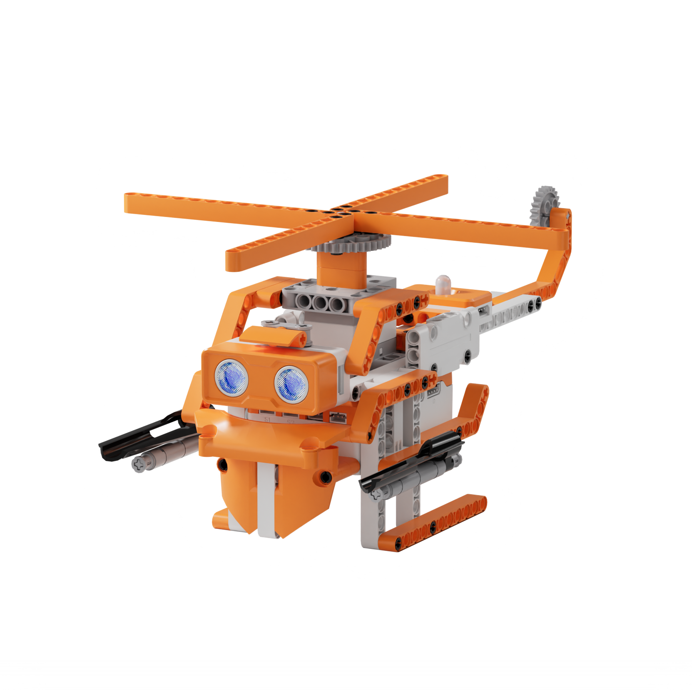
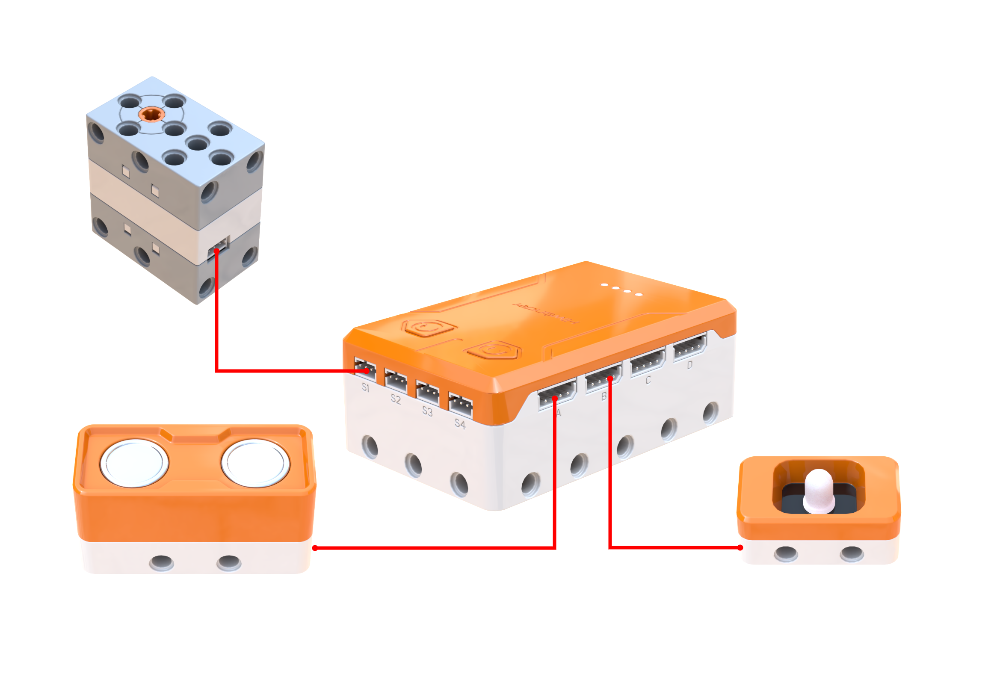
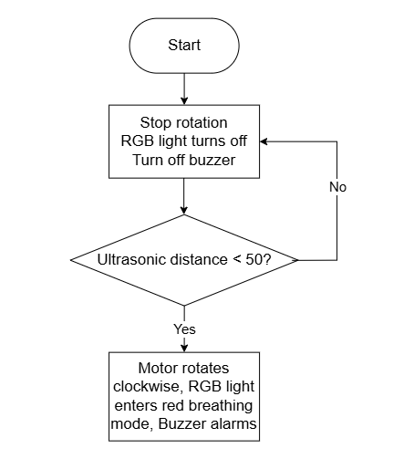
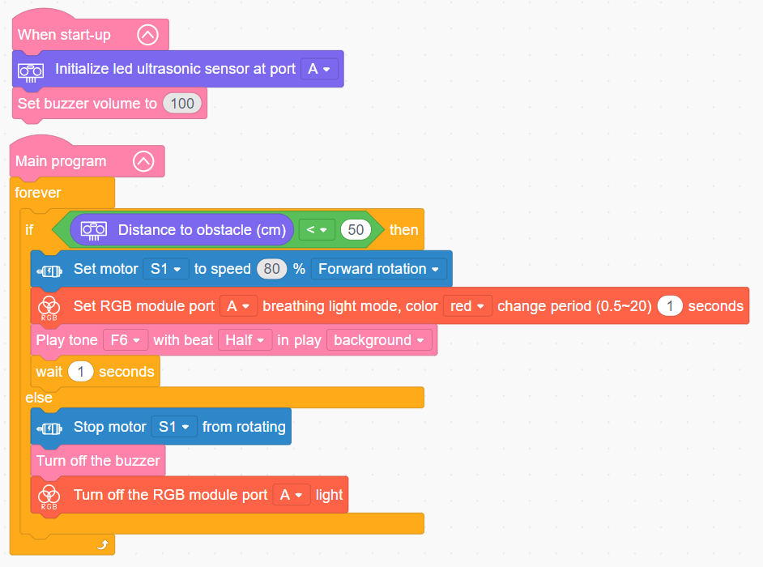

# 3.28 Patrol Helicopter

## 3.28.1 Lesson Introduction

Centering on the military patrol helicopter model, this lesson explores coordinated programming across the drive motor, ultrasonic sensor, buzzer, and RGB light module. It implements an automated security patrol routine that spins the rotor blades and sounds an audiovisual alert upon obstacle detection. The content examines aerodynamic rotor lift and propeller drivetrains, covers motor speed regulation, and applies sensor-triggered multi-actuator synchronization logic to demonstrate integrated audiovisual interaction.

## 3.28.2 Learning Objectives

1. **Knowledge Objectives**: Understand aerodynamic lift generated by rotating helicopter rotors. Master control logic for triggering audiovisual alarms via ultrasonic obstacle detection. Recognize the operating characteristics of RGB breathing modes and non-blocking background buzzer playback.

2. **Skill Objectives**: Assemble the mechanical airframe of the patrol helicopter independently. Program motor routines to drive propeller rotation. Implement complete system functionality uniting obstacle detection, rotor activation, RGB breathing lights, and buzzer alerts.

3. **Thinking Objectives**: Establish single-trigger multi-response control logic where one condition drives multiple actuators simultaneously. Cultivate interactive design awareness for integrated audiovisual systems. Strengthen understanding of aerospace mechanics combined with electronic automation.

4. **Application Objectives**: Connect concepts to surveillance drones, autonomous helicopters, and automated perimeter alarms. Understand the critical role of rotorcraft across military reconnaissance and disaster relief missions. Stimulate interest in aeronautical engineering and unmanned aerial vehicle technology.

## 3.28.3 Preparation

### (1) Hardware Preparation

- AiBlock controller

- 360° block motor

- Ultrasonic sensor

- RGB light module

- Building block parts pack

- Type-C data cable

- Assembly manual

- Computer

### (2) Software Preparation

- WonderLab Graphical Programming Platform

## 3.28.4 Hands-On Project

### (1) Project Analysis

The core project of this lesson is the Patrol Helicopter, delivering an automated surveillance aircraft that sounds a synchronized alarm upon spotting targets. The system adopts an ultrasonic detection and multi-module audiovisual alert architecture: the ultrasonic sensor continuously scans ahead, triggering an alarm whenever an obstacle is detected within 50 cm. Three subsystems respond simultaneously in the execution phase: the motor spins the main rotor at high speed to simulate an engine spool-up, the RGB light module emits a red breathing fade, and the buzzer sounds a high-pitched siren. The alert holds for 1 s to prevent rapid bouncing between states, and once the target clears, all outputs deactivate to return the helicopter to standby.

### (2) Assembly Guide

<Pdf src="../../_static/shared/pdf/chapter_3/28.pdf" />

### (3) Hardware Wiring

- Connect the 360° block motor to port **S1** of the controller using a 3-pin servo cable.

- Connect the ultrasonic sensor to port **A** of the controller using a 4-pin module cable.

- Connect the RGB light module to port **B** of the controller using a 4-pin module cable.

### (4) Adding Extensions

- Select **Ultrasonic sensor** under the **Input Module** category.

- Select **360° Motor** under the **Motion module** category.

- Select **RGB module** under the **Output module** category.

### (5) Core Blocks

| Block | Category | Description |
| :---: | :---: | :--- |
|  |  | Serves as the main loop container, continuously executing internal code after power-on initialization |
|  |  | Executes only once after the device powers on, used to place startup logic such as hardware initialization and parameter configuration |
|  |  | Drives the buzzer to play a musical note at a designated pitch and beat in the background without blocking subsequent program execution |
|  |  | Adjusts buzzer volume across a range of 0 to 100, where higher values yield louder audio output |
|  |  | Halts buzzer audio immediately, terminating active tone playback |
|  |  | Initializes the port connection for the ultrasonic sensor |
|  |  | Reads the obstacle distance measured by the ultrasonic sensor on the designated port, in centimeters (cm) |
|  |  | Directs the 360° block motor on the designated port to rotate continuously forward or in reverse at a custom speed |
|  |  | Disables output to the 360° block motor on the designated port, halting rotation immediately |
|  |  | Directs the RGB light module on the designated port to activate a breathing fade effect in a selected color, with a customizable transition period |
|  |  | Extinguishes the RGB light module on the designated port to cut off light output |

### (6) Program Description and Upload

- Program Schematic

- Complete Program

  Upon startup, the program initializes the ultrasonic sensor interface and sets the buzzer volume to 100. When an obstacle is detected within 50 cm, motor S1 rotates forward at 80% speed to spin the propeller blades, the RGB light module activates breathing mode, and the buzzer sounds note F6. Otherwise, motor S1 halts the rotor and the controller turns off both the RGB light module and the buzzer.

- Program Upload

  Following the animation, click **Connect device**, select the serial port, then click the upload button to upload the program to the controller and test the execution results.

> [!NOTE]
>
> **The source files are available for download under [Program Files](https://drive.google.com/drive/folders/1KQ-KBn3OmxCo6xKJkb7ZQZAuPW9brr5t?usp=sharing).**

## 3.28.5 Expansion and Challenge

**Project 1: Tiered Alarm Response System**

Configure a three-tier alert hierarchy: Tier 1 from 30 cm to 50 cm with slow rotor speed, yellow flashing lights, and low-frequency tones, Tier 2 from 15 cm to 30 cm with medium rotor speed, flashing orange lights, and mid-frequency tones, and Tier 3 under 15 cm with maximum rotor speed, rapid red flashing, and high-frequency alarms. Practice multi-threshold partitioning and multi-channel coordinated outputs, extending discussions to security perimeters and airborne collision avoidance systems.

**Project 2: Dual-Rotor Search and Rescue Helicopter**

Integrate a second motor to drive a rescue hoist winch: upon detecting a target, the main rotor spools up while sounding an alert, the winch motor rotates forward to lower a rescue cable, pauses, and reverses to reel it back, while a green RGB light indicates an active rescue mission. Practice controlling dual motors independently and designing sequential routines, extending discussions to search-and-rescue helicopters, heavy-lift drones, and industrial cranes.

## 3.28.6 Q&A

**Question 1: Why does the alarm program incorporate a 1 s delay, and what happens if this delay is omitted?**

Answer: The 1 s dwell interval functions as **software debouncing to prevent erratic alert flickering**. If an obstacle hovers near the 50 cm threshold, minor measurement fluctuations cause sensor readings to oscillate between 49 cm and 51 cm. Without a delay, the system rapidly alternates between triggering and clearing the alert, causing the rotor to stutter, the light to flicker erratically, and the alarm audio to chop. Introducing a 1 s hold ensures that once triggered, the alarm remains active for at least one second regardless of minor sensor fluctuations, producing a steady and cohesive alert response. This represents a standard debouncing or delay-hold technique commonly deployed whenever sensors operate near decision boundaries, exactly like sound-activated hallway lights that remain illuminated for several tens of seconds after a clap rather than switching off immediately.

**Question 2: What is background audio playback, and how does it differ from standard synchronous playback?**

Answer: **Background audio playback** allows the sound engine to play audio non-blockingly without halting subsequent code execution. In standard synchronous playback, the processor halts and waits for an audio tone to finish before advancing to the next instruction: under this mode, an RGB illumination command would have to wait until sound playback concluded, preventing simultaneous audio and lighting output. With non-blocking background playback, the buzzer starts sounding while the controller immediately executes the next RGB lighting command, achieving synchronized audiovisual alarms. This mirrors how a smartphone continues running apps while streaming music in the background. Background playback represents an accessible introduction to multitasking, which in full operating systems expands into multithreading to manage multiple simultaneous operations.

## 3.28.7 Technical Support and Product Discussion

To share creative ideas and projects after exploring this kit, visit the Hiwonder Community:

