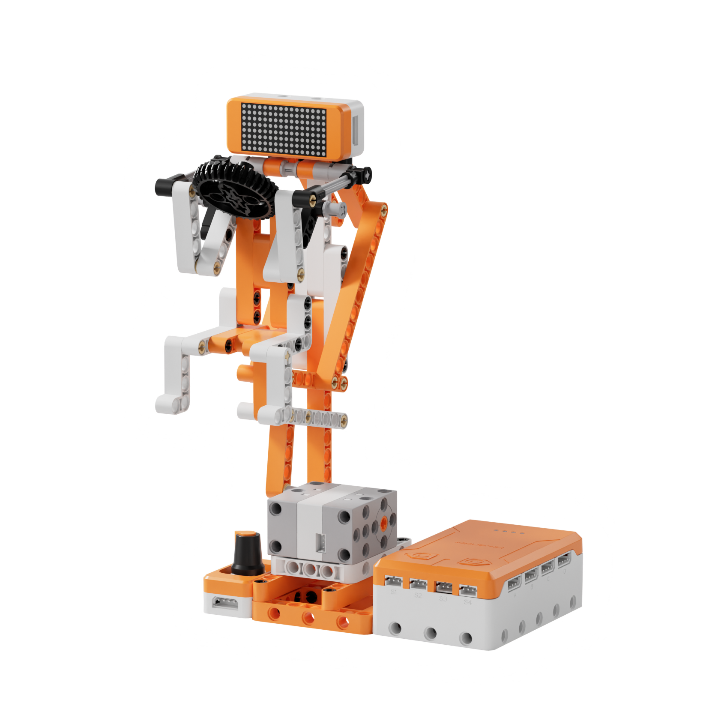
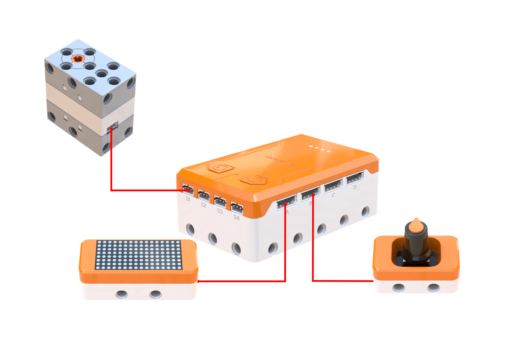
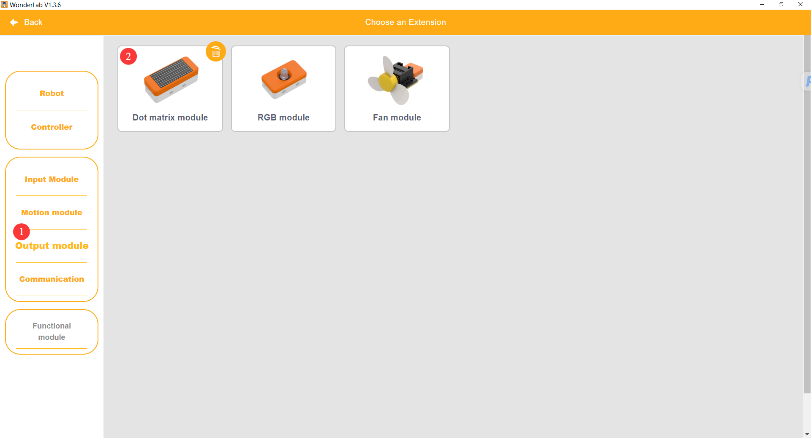
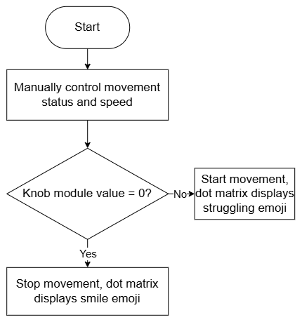
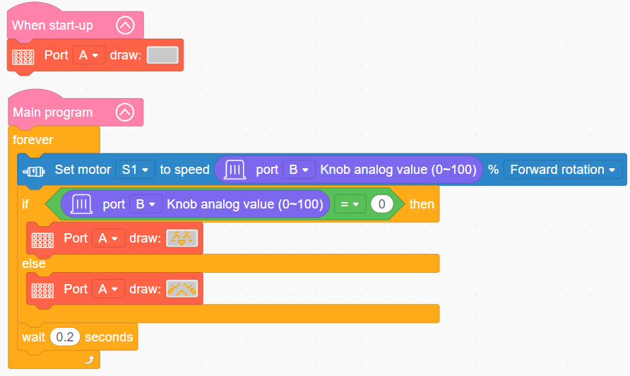

# 3.29 Seated Rowing Trainer

## 3.29.1 Lesson Introduction

Centering on the smart seated rowing trainer model, this lesson explores coordinated programming across the 360° block motor, knob module, and dot matrix module. It implements an interactive fitness mechanism where knob rotation regulates reciprocating push-pull speeds while updating facial expressions on the dot matrix display. The content examines linkage transmission principles for reciprocating motion, covers single-motor push-pull mechanisms, and applies knob analog reading routines with display feedback to illustrate how interactive exercise machines integrate real-time state monitoring.

## 3.29.2 Learning Objectives

1. **Knowledge Objectives**: Differentiate sequential, loop, and conditional branch structures in graphical programming. Master direction, braking, and speed control for the 360° block motor. Comprehend the analog readout logic of the knob module. Understand graphic calls on the dot matrix display alongside conditional evaluations of analog signals.

2. **Skill Objectives**: Wire the 360° block motor, knob module, and dot matrix module properly. Assemble the mechanical structure of the Seated Rowing Trainer and calibrate mechanical travel limits. Program reciprocating motion loops combining knob speed regulation with dynamic expression transitions.

3. **Thinking Objectives**: Build structured programming thinking through nested loop and conditional branch structures. Establish closed-loop control thinking linking knob input, logical evaluation, motor actuation, and display feedback. Cultivate engineering habits in knob range calibration, motor speed testing, and display parameter adjustment.

4. **Application Objectives**: Explore operating principles behind knob-adjusted appliances, interactive gym equipment, and variable-speed toys. Independently expand advanced creative features such as multi-tiered speed regulation, animated expressions, and audiovisual notifications.

## 3.29.3 Preparation

### (1) Hardware Preparation

- AiBlock controller

- 360° block motor

- Dot matrix module

- Knob module

- Building block parts pack

- Type-C data cable

- Assembly manual

- Computer

### (2) Software Preparation

- WonderLab Graphical Programming Platform

## 3.29.4 Hands-On Project

### (1) Project Analysis

The core project of this lesson is the Seated Rowing Trainer, delivering an interactive exercise machine where turning the knob regulates motor speed, showing a smiling face at zero speed and an exertion expression when running. The system adopts an input-logic-feedback architecture: the knob module serves as the speed regulation input, outputting an analog signal. In the decision stage, the program continuously samples the knob value and maps it to motor speed to govern machine operation. In the actuation stage, dual outputs operate in synchrony: a linkage mechanism driven by the 360° block motor pushes and pulls the handlebar for rowing exercise, while the dot matrix screen updates expressions corresponding to operational velocity. Both mechanical movement and display feedback operate in unison to provide clear visual feedback.

### (2) Assembly Guide

<Pdf src="../../_static/shared/pdf/chapter_3/29.pdf" />

### (3) Hardware Wiring

- Connect the 360° block motor to port **S1** of the controller using a 3-pin servo cable.

- Connect the dot matrix module to port **A** of the controller using a 4-pin module cable.

- Connect the knob module to port **B** of the controller using a 4-pin module cable.

### (4) Adding Extensions

- Select **Knob** under the **Input Module** category.

- Select **360° Motor** under the **Motion module** category.

- Select **Dot matrix module** under the **Output module** category.

 

### (5) Core Blocks

| Block | Category | Description |
| :---: | :---: | :--- |
|  |  | Reads the rotational position value of the potentiometer knob on the designated port across a range of 0 to 100, commonly used for parameter adjustment |
|  |  | Directs the 360° block motor on the designated port to rotate continuously forward or in reverse at a custom speed |
|  |  | Disables output to the 360° block motor on the designated port, halting rotation immediately |
|  |  | Directs the dot matrix screen on the designated port to load and display preset graphic patterns |

### (6) Program Description and Upload

- Program Schematic

- Complete Program

  * Upon powering on, the program clears the dot matrix display on port A to finish initialization.

  * The main program then enters an infinite loop, continuously reading the analog value from the knob on port B and mapping it directly to the forward speed of motor S1 so that motor velocity dynamically follows knob rotation. The loop continuously evaluates whether the knob value equals 0: when the knob returns to zero, the dot matrix screen displays a smiling stop graphic. When the knob value is greater than 0, the screen switches to an exertion running graphic, pausing for 0.2 s at the end of each iteration to maintain program stability.

- Program Upload

  Following the animation, click **Connect device**, select the serial port, then click the upload button to upload the program to the controller and test the execution results.

> [!NOTE]
>
> **The source files are available for download under [Program Files](https://drive.google.com/drive/folders/1KQ-KBn3OmxCo6xKJkb7ZQZAuPW9brr5t?usp=sharing).**

## 3.29.5 Expansion and Challenge

**Project 1: Multi-Tiered Speed Rowing Trainer**

Partition the knob range into discrete operating tiers where low knob angles command slow, gentle push-pull strokes, higher angles engage rapid reciprocating cycles, and the dot matrix display cycles through distinct facial expressions for each tier. Practice the full workflow uniting knob partitioning, speed switching, and expression mapping, exploring conditional branches and timing control while discussing gear selection in smart fitness machines.

**Project 2: Audiovisual Interactive Rowing Trainer**

Add a buzzer module: when turning the knob to initiate push-pull exercise at non-zero speeds, the buzzer plays an energetic rhythm, and when turning the knob back to zero, the motor stops and audio halts. Practice coordinating the dot matrix module, buzzer, and 360° block motor, mastering control architectures where a single knob signal directs multiple peripheral devices.

## 3.29.6 Q&A

**Question 1: What component regulates the push-pull speed of the trainer in this project, and how does it operate?**

Answer: The system uses a **knob module** to regulate push-pull speed. An internal potentiometer changes its analog voltage output in proportion to rotation angle: the controller reads this analog value and maps it to motor speed. Conditional statements in software partition the analog reading into distinct speed ranges or direct continuous mapping. Because the potentiometer is unaffected by ambient lighting, it is widely utilized across variable-speed gym equipment, dimmer switches, and interactive toys, allowing software parameter mapping to adapt easily to different control scenarios.

**Question 2: How does the software concurrently execute reciprocating push-pull mechanical motion and facial expression updates on the dot matrix screen?**

Answer: Synchronization occurs because **the 360° block motor and the dot matrix module operate as two independent actuators**, each functioning autonomously upon receiving instructions without interfering with the other. After reading the knob value and calculating motor speed, the program sets the motor to alternate between forward and reverse rotation, continuously driving the handlebar to push and pull. Simultaneously, the program issues graphic commands so the dot matrix screen updates its facial expression according to current velocity, delivering coordinated push-pull exercise alongside visual feedback. Note that the program executes sequentially: within the non-zero speed branch, the motor continuously alternates between forward and reverse rotation alongside delays while the dot matrix screen maintains the exertion graphic. When the knob returns to the zero-speed position, the program concurrently issues commands to halt the motor and switch back to the smiling expression. This reflects a key characteristic of multi-actuator systems, where each peripheral retains its active state and runs continuously without requiring the controller to retransmit repetitive instructions constantly.

## 3.29.7 Technical Support and Product Discussion

To share creative ideas and projects after exploring this kit, visit the Hiwonder Community:

