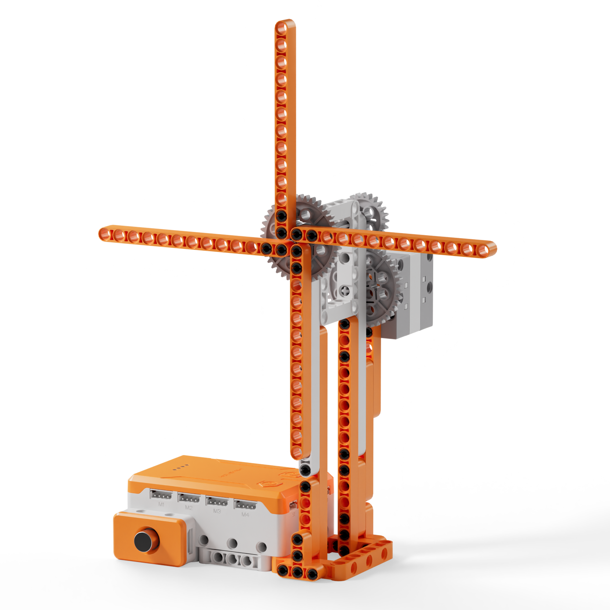
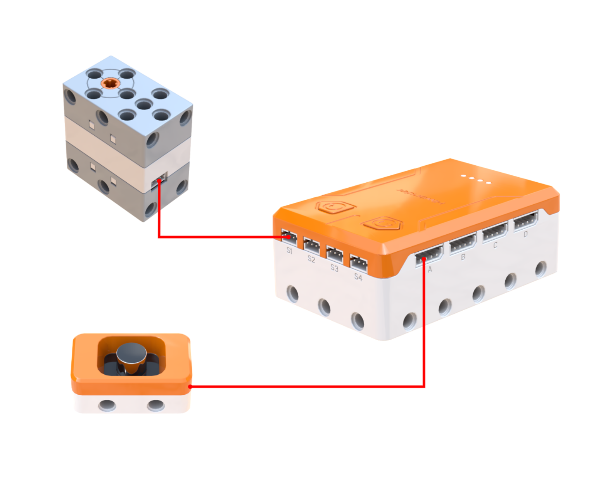
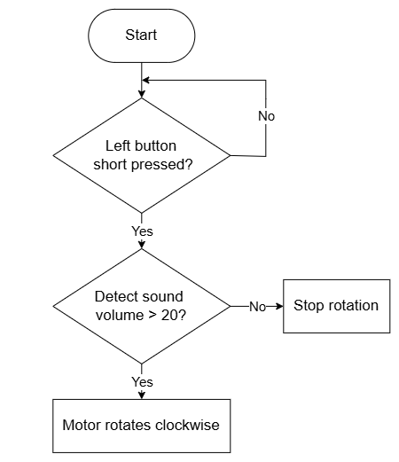
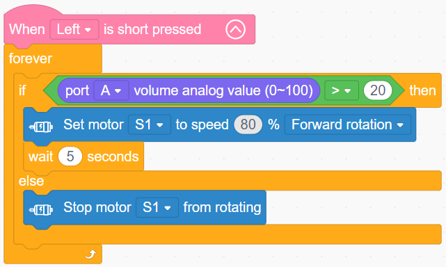

# 3.3 Sound-Activated Fan

## 3.3.1 Lesson Introduction

This lesson builds upon the mechanical hand-cranked fan by upgrading it into an intelligent programmable fan. The lesson introduces the operating principles of the sound sensor and methods for reading analog values, focusing on dual-branch conditional statements. Through tiered hands-on practice, it achieves button-controlled motors and clap-activated fan rotation, helping master intelligent closed-loop control logic and reinforcing sensor programming skills.

## 3.3.2 Learning Objectives

1. **Knowledge Objectives**: Master the working principle of the sound sensor and its analog volume values ranging from 0 to 100. Understand threshold comparison logic. Learn the structural syntax of dual-branch conditional statements.

2. **Skill Objectives**: Complete hardware wiring for the sensor and motor properly. Add corresponding device extension libraries. Program sound-controlled behaviors. Calibrate thresholds proficiently to adjust device sensitivity.

3. **Thinking Objectives**: Build intelligent closed-loop thinking spanning perception, judgment, and execution. Master comparison logic for analog values. Cultivate engineering debugging habits and systemic understanding of hardware and software.

4. **Application Objectives**: Relate sensor technology to sound-activated devices in daily life. Clarify the central role of sensors in smart hardware. Foster curiosity and innovation in technological creation.

## 3.3.3 Preparation

### (1) Hardware Preparation

- AiBlock controller

- Sound sensor

- 360° block motor

- Building block parts pack

- Type-C data cable

- Assembly manual

- Computer

### (2) Software Preparation

- WonderLab Graphical Programming Platform

## 3.3.4 Hands-On Project

### (1) Project Analysis

The core project for this lesson is an automatic sound-controlled fan, achieving the intelligent response of spinning upon detecting sound and stopping in quiet environments. The system adopts a three-tier architecture of perception, decision, and execution: the sound sensor continuously reads ambient volume values, the conditional statement compares the volume with a threshold, and if the volume exceeds the threshold, the motor rotates forward to blow air, and otherwise stops. This process operates inside a continuous loop for real-time detection. Adjusting the threshold provides practice in parameter tuning, demonstrating that the threshold serves as the core criterion in decision-making while introducing the first intelligent feedback system.

### (2) Assembly Guide

<Pdf src="../../_static/shared/pdf/chapter_3/3.pdf" />

### (3) Hardware Wiring

- Connect the 360° block motor to port **S1** of the controller using a 3-pin servo cable.

- Connect the sound sensor to port **A** of the controller using a 4-pin module cable.

### (4) Adding Extensions

- Select **Sound sensor** under the **Input Module** category.

- Select **360° Motor** under the **Motion module** category.

### (5) Core Blocks

| Block | Category | Description |
| :---: | :---: | :--- |
|  |  | Triggers corresponding blocks when the button is short-pressed |
|  |  | Sets the operating speed and rotation direction of the designated motor |
|  |  | Stops the motor connected to the selected port |
|  |  | Reads the analog value from the sound sensor on the specified port |

### (6) Program Description and Upload

- Program Schematic

- Complete Program

  After powering on, short-pressing the left button serves as the startup trigger condition. Once triggered, the program enters an infinite loop, continuously monitoring the sound analog value on port A:

  * When the sound analog value exceeds 20, motor S1 rotates forward at 80% speed for 5 s.
  
  * When the sound analog value is less than or equal to 20, motor S1 stops rotating.

- Program Upload

  Following the animation, click **Connect device**, select the serial port, then click the upload button to upload the program to the controller and test the execution results.

> [!NOTE]
>
> **The source files are available for download under [Program Files](https://drive.google.com/drive/folders/1xyD_-3msc3KcaGQHLqkcPOZNSNXFIirT?usp=sharing).**

## 3.3.5 Expansion and Challenge

**Project 1: Clap-Controlled Variable Speed Fan**

Design a multi-speed sound-activated fan: clapping once activates low speed at 30%, clapping twice in succession activates medium speed at 60%, clapping three times activates high speed at 100%, and remaining quiet for a period stops the motor automatically. Use a counter variable to record the number of claps paired with a timing window, practicing variable counting combined with multi-branch conditionals to implement tiered intelligent control.

**Project 2: Sound-Activated Light and Fan Linkage System**

Incorporate a light sensor or onboard indicators so that triggering via sound activates both the fan and synchronized lighting. Louder sounds trigger high fan speed and bright lights, while softer sounds produce low fan speed and dimmed lights, simulating an automated bathroom scenario where entering turns on ventilation and lighting. Practice coordinated programming with multiple sensors and actuators to understand multi-device coordination in smart homes.

## 3.3.6 Q&A

**Question 1: Which component acts as the "ears" of the robot in the sound-activated fan? How does it operate?**

Answer: The sound sensor serves as the ears of the robot. It contains an internal vibrating diaphragm. When external sounds reach the sensor, sound waves cause the diaphragm to vibrate, and the sensor converts this mechanical vibration into a fluctuating electrical signal sent to the controller. Louder sounds generate stronger vibrations and higher converted numerical values up to a maximum of 100, while silence yields a value of 0. The controller reads this value to determine sound presence and loudness, using the programmed threshold to decide whether to activate the fan.

**Question 2: What is a threshold? Why does threshold magnitude affect sound-control sensitivity?**

Answer: A threshold is a boundary line for making binary decisions, similar to a passing grade on a test. In this program, setting the threshold to 20 means that only sound levels exceeding 20 are recognized as sound, activating the fan. In contrast, levels below 20 are treated as silence, causing the fan to stop. Setting a lower threshold, such as 10, lowers the trigger boundary so even faint noises activate the fan, resulting in high sensitivity. Setting a higher threshold, such as 50, creates a high barrier requiring loud sounds to trigger, making the system less sensitive. In practice, adjust the threshold appropriately according to ambient background noise.

## 3.3.7 Technical Support and Product Discussion

To share creative ideas and projects after exploring this kit, visit the Hiwonder Community:

