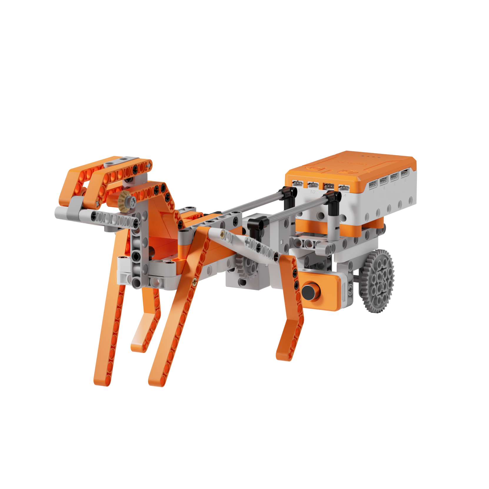
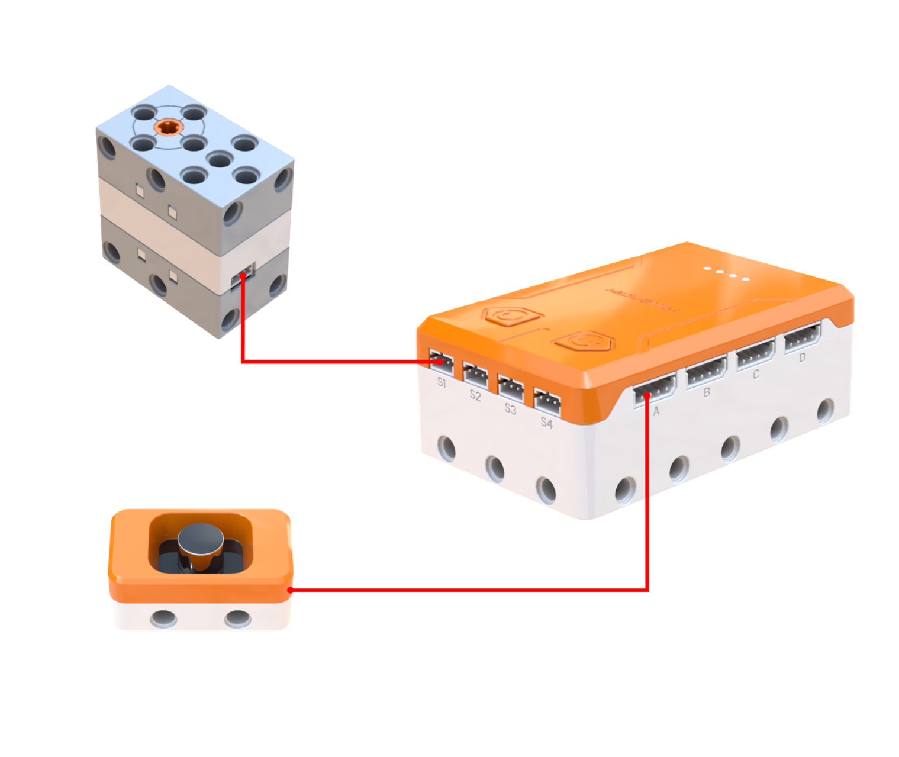
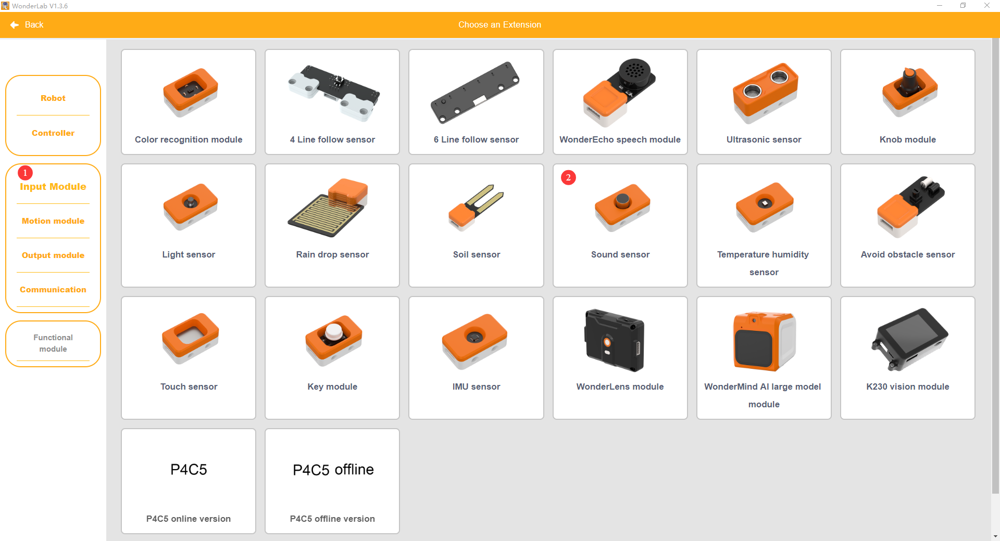
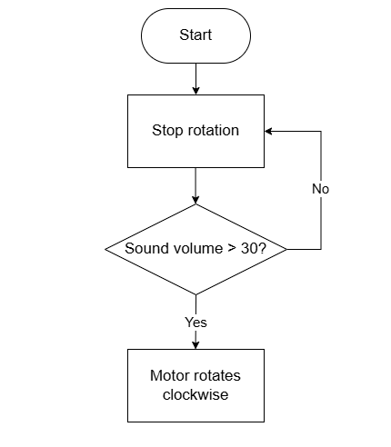
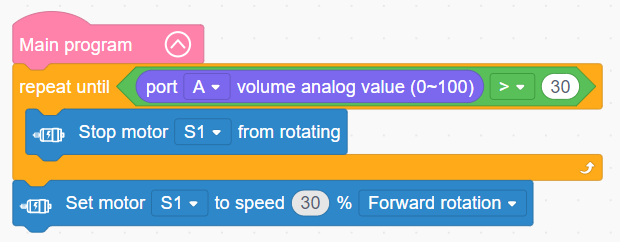

# 3.30 Two-Wheeled Carriage

## 3.30.1 Lesson Introduction

Centering on the motorized carriage model, this lesson explores coordinated programming between the drive motor and sound sensor. It implements an acoustic interaction routine where the vehicle cruises forward continuously and stops upon detecting loud sounds. The content examines single-motor drivetrains and two-wheeled balance principles, covers acoustic threshold detection, applies repeat-until loop structures, and explores how center-of-gravity placement and wheelbase geometry govern vehicular stability.

## 3.30.2 Learning Objectives

1. **Knowledge Objectives**: Understand single-motor dual-wheel drivetrains. Master acoustic threshold trigger logic using a sound sensor. Recognize how wheelbase width and center-of-gravity location influence two-wheeled equilibrium. Comprehend the characteristics of repeat-until loop structures.

2. **Skill Objectives**: Assemble the mechanical chassis of the two-wheeled carriage independently. Program basic forward motor locomotion. Implement sound-triggered stopping routines using the sound sensor.

3. **Thinking Objectives**: Build repeat-until loop thinking where execution terminates upon satisfying a specified condition, contrasting this with standard infinite loops. Develop structural design awareness regarding two-wheeled balance and center-of-gravity management. Cultivate product design concepts for voice-activated interaction.

4. **Application Objectives**: Connect concepts to acoustic-controlled toys, self-balancing scooters, and historical transport vehicles. Understand the significance of drivetrains and equilibrium engineering in automotive systems. Stimulate interest in transportation history and vehicular engineering.

## 3.30.3 Preparation

### (1) Hardware Preparation

- AiBlock controller

- 360бу block motor

- Sound sensor

- Building block parts pack

- Type-C data cable

- Assembly manual

- Computer

### (2) Software Preparation

- WonderLab Graphical Programming Platform

## 3.30.4 Hands-On Project

### (1) Project Analysis

The core project of this lesson is the Two-Wheeled Carriage, delivering an acoustic interactive vehicle that halts on voice command while cruising. The system adopts a single-drive powertrain and sound-triggered braking architecture: motor S1 drives both wheels simultaneously through a reduction gear train, operating at 30% speed to ensure smooth travel. The sound sensor continuously samples ambient volume levels, and the program uses a repeat-until loop: once the motor starts, the carriage rolls forward continuously while volume remains below the threshold. The moment ambient sound reaches or exceeds the threshold, the program exits the loop immediately and cuts motor power. The routine simulates a traditional driver calling out a vocal halt command to stop a horse-drawn carriage.

### (2) Assembly Guide

<Pdf src="../../_static/shared/pdf/chapter_3/30.pdf" />

### (3) Hardware Wiring

- Connect the 360бу block motor to port **S1** of the controller using a 3-pin servo cable.

- Connect the sound sensor to port **A** of the controller using a 4-pin module cable.

### (4) Adding Extensions

- Select **Sound sensor** under the **Input Module** category.

- Select **360бу Motor** under the **Motion module** category.

### (5) Core Blocks

| Block | Category | Description |
| :---: | :---: | :--- |
|  |  | Serves as the main loop container, continuously executing internal code after power-on initialization |
|  |  | Reads the volume level detected by the sound sensor on the designated port across a range of 0 to 100, where higher values indicate louder ambient sound |
|  |  | Directs the 360бу block motor on the designated port to rotate continuously forward or in reverse at a custom speed |
|  |  | Disables output to the 360бу block motor on the designated port, halting rotation immediately |

### (6) Program Description and Upload

- Program Schematic

- Complete Program

  In the main program, the carriage repeats forward motion until the volume detected by the sound sensor reaches or exceeds 30, whereupon the Two-Wheeled Carriage halts. Otherwise, it advances continuously.

- Program Upload

  Following the animation, click **Connect device**, select the serial port, then click the upload button to upload the program to the controller and test the execution results.

> [!NOTE]
>
> **The source files are available for download under [Program Files](https://drive.google.com/drive/folders/1KQ-KBn3OmxCo6xKJkb7ZQZAuPW9brr5t?usp=sharing).**

## 3.30.5 Expansion and Challenge

**Project 1: Acoustic-Controlled Start-Stop Shuttle Carriage**

Use a variable to record the cruising or stationary status, inverting the state and toggling the motor whenever sound is detected, paired with software delay debouncing to prevent false triggers. Practice state toggle logic and debouncing techniques to understand state machines, extending discussions to single-button push switches and voice-activated lighting.

**Project 2: Volume-Proportional Speed Regulation Carriage**

Map analog volume readings proportionally into motor speed parameters so that soft sounds produce slow motion while louder sounds trigger rapid cruising to achieve stepless modulation. Practice analog mapping and velocity range constraints to explore continuous variable actuator control, extending discussions to sound-regulated fans and voice-modulated robotic drive systems.

## 3.30.6 Q&A

**Question 1: Why does the two-wheeled carriage remain upright without tipping over, and what design principles maintain balance?**

Answer: The two-wheeled carriage maintains balance through **center-of-gravity placement and wheelbase balance**. In the longitudinal direction, the center of gravity sits directly above the central axle connecting both wheels, directing gravitational force straight downward through the wheel axle to prevent tipping forward or backward like a balanced scale. In the lateral direction, the chassis is built symmetrically with evenly distributed mass, centering gravity along the vehicle centerline to prevent sideways roll. Furthermore, widening the track width between the wheels expands the lateral stability margin. While historical horse-drawn carriages used the horse as a third point of contact to establish triangular stability, this motorized carriage operates on two wheels, making center-of-gravity positioning especially critical. In vehicular engineering, lower centers of gravity combined with broader support bases maximize physical stability.

**Question 2: What distinguishes a repeat-until loop from a standard repeat loop?**

Answer: Both structures execute repetitive code, but they differ in **how the loop terminates**. A standard repeat loop runs indefinitely without stopping unless external intervention halts the program. In contrast, a repeat-until loop evaluates a condition during each cycle: execution continues repeating until the specified condition becomes true, at which point the loop terminates immediately and execution advances to subsequent instructions. In this carriage program, the loop repeats driving forward until sound volume exceeds 30: as long as ambient sound remains quiet, the condition is false and the carriage advances, and the moment a handclap satisfies the condition, the program exits the loop and engages the motor brake. Repeat-until loops are ideal for state-dependent workflows such as waiting for a target temperature before shutting down or waiting for user arrival before opening a door.

## 3.30.7 Technical Support and Product Discussion

To share creative ideas and projects after exploring this kit, visit the Hiwonder Community:

