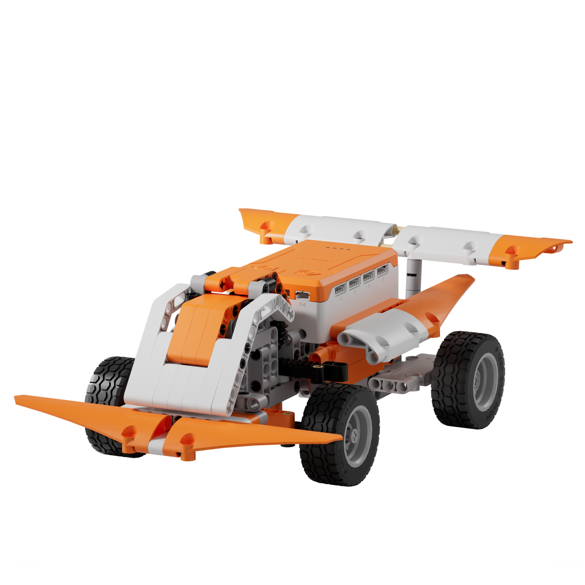
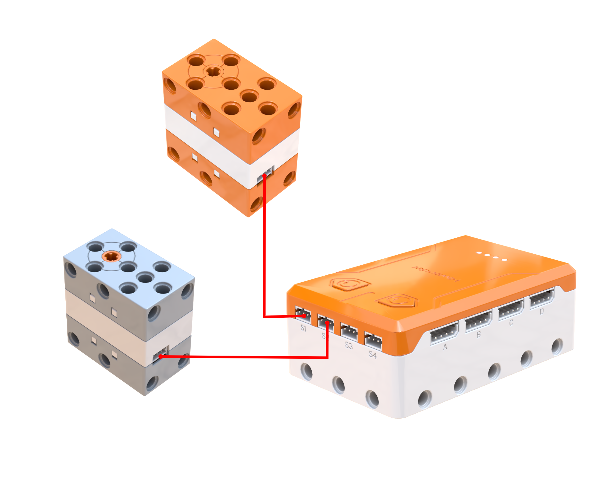
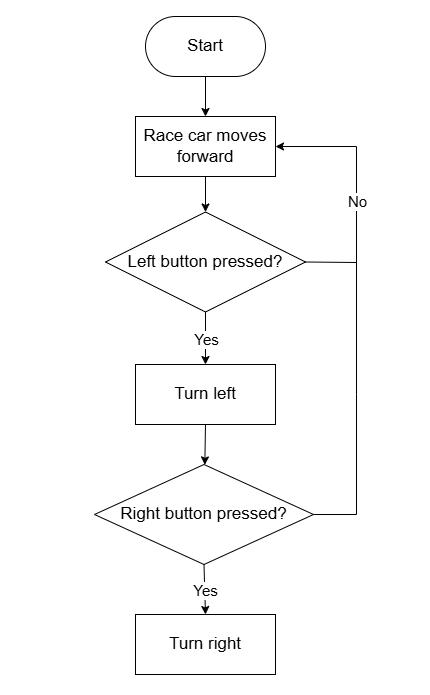
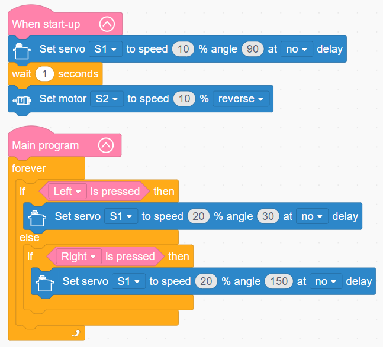

# 3.32 F1 Speed Race Car

## 3.32.1 Lesson Introduction

Centering on the high-speed racing car model, this lesson explores coordinated programming between a steering servo and a drive motor. It implements an interactive driving routine where onboard buttons control directional steering. The content examines aerodynamic principles of streamlined vehicle bodies, covers front-wheel steering servo angle calibration, and applies button-based interactive control logic. It also explores core vehicular engineering concepts of the classic front-wheel steering and rear-wheel drive architecture.

## 3.32.2 Learning Objectives

1. **Knowledge Objectives**: Understand aerodynamic principles of low-drag streamlined vehicle bodies. Master front-wheel steering mechanics and linkage principles using a servo. Recognize the classic vehicle architecture of front-wheel steering and rear-wheel drive. Understand engineering technologies and racing culture behind Formula 1 vehicles.

2. **Skill Objectives**: Assemble the mechanical chassis of the F1 speed race car independently. Master servo homing and alignment methods for steering linkage calibration. Program drive motors for forward locomotion. Implement button-controlled steering routines to manipulate servo angles for responsive cornering.

3. **Thinking Objectives**: Build vehicle architecture thinking that separates steering systems from propulsion systems. Understand the design philosophy of modular, specialized vehicular subsystems. Develop engineering optimization awareness through aerodynamic considerations. Strengthen programming capability for human-robot interactive driving logic.

4. **Application Objectives**: Connect concepts to passenger automobiles, radio-controlled cars, and autonomous vehicular steering systems. Understand the critical value of aerodynamics in racing cars, high-speed rail, and aerospace engineering. Stimulate interest in automotive engineering, aerodynamics, and motorsport technology.

## 3.32.3 Preparation

### (1) Hardware Preparation

- AiBlock controller

- 360бу block motor

- 180бу block servo

- Building block parts pack

- Type-C data cable

- Assembly manual

- Computer

### (2) Software Preparation

- WonderLab Graphical Programming Platform

## 3.32.4 Hands-On Project

### (1) Project Analysis

The core project of this lesson is the F1 Speed Race Car, delivering an interactive driving experience with continuous forward propulsion and button-controlled directional steering. The system adopts a decoupled architecture separating steering actuation from motor propulsion. Motor S2 drives the rear wheels for continuous forward motion, while servo S1 adjusts front-wheel deflection angles through a mechanical linkage: 90бу provides straight driving, 30бу turns left, and 150бу turns right, where larger angular deviations produce tighter turns. The onboard buttons provide responsive control: pressing the left button steers left, pressing the right button steers right, and releasing either button maintains the current steering angle. The streamlined body minimizes aerodynamic drag, combining with the dual-system decoupled architecture to form the foundation of speed and maneuvering control.

### (2) Assembly Guide

<Pdf src="../../_static/shared/pdf/chapter_3/32.pdf" />

### (3) Hardware Wiring

- Connect the 180бу block servo to port **S1** of the controller using a 3-pin servo cable.

- Connect the 360бу block motor to port **S2** of the controller using a 3-pin servo cable.

### (4) Adding Extensions

- Select **180бу servo** and **360бу Motor** under the **Motion module** category.

### (5) Core Blocks

| Block | Category | Description |
| :---: | :---: | :--- |
|  |  | Serves as the main loop container, continuously executing internal code after power-on initialization |
|  |  | Executes once upon power-up, used for hardware initialization and parameter configuration |
|  |  | Detects the current logic level of a designated onboard button, returning a boolean value indicating whether the button is pressed |
|  |  | Directs the 360бу block motor on the designated port to rotate continuously forward or in reverse at a custom speed |
|  |  | Directs the 180бу block servo on the designated port to rotate to a target angle at a custom speed, where selecting non-delay mode allows immediate execution of subsequent blocks |

### (6) Program Description and Upload

- Program Schematic

- Complete Program

  Upon startup, the F1 Speed Race Car advances continuously. When the left button is pressed, servo S1 rotates to 30бу at 20% speed to steer the F1 Speed Race Car left. When the right button is pressed, servo S1 rotates to 150бу at 20% speed to steer the F1 Speed Race Car right.

- Program Upload

  Following the animation, click **Connect device**, select the serial port, then click the upload button to upload the program to the controller and test the execution results.

> [!NOTE]
>
> **The source files are available for download under [Program Files](https://drive.google.com/drive/folders/1KQ-KBn3OmxCo6xKJkb7ZQZAuPW9brr5t?usp=sharing).**

## 3.32.5 Expansion and Challenge

**Project 1: Autonomous Line-Following F1 Race Car**

Integrate a line follower sensor to detect track deviations, automatically adjusting the steering servo angle instead of manual button control to achieve autonomous trajectory following. Understand proportional steering control principles, practicing continuous servo angle adjustment corresponding to sensor offset values, extending discussions to automotive lane-keeping assist and autonomous racing technologies.

**Project 2: Audio-Visual Effects Racing Car**

Add an RGB tail light that shines solid red during forward cruising and flashes red upon braking, paired with a buzzer that simulates engine acceleration sounds with pitch proportional to vehicle speed. Practice coordinating velocity with acoustic effects and dynamic lighting transitions, extending discussions to automotive audio-visual design and racing video game sound synthesis.

## 3.32.6 Q&A

**Question 1: Why are Formula 1 race cars designed with streamlined bodies, and what functions do the pointed nosecone and rear wing serve?**

Answer: Streamlined profiling is designed to **minimize aerodynamic drag and maximize vehicular speed**. Although air is invisible, aerodynamic drag escalates dramatically at high velocities. Because drag increases proportionally with speed, it consumes significant engine power and caps top speed. Shaping the vehicle with a pointed nosecone and smooth body contours allows air to flow laminar over the surfaces, preventing turbulent wake separation. This represents classic aerodynamic drag reduction design. The rear wing serves the opposite mechanical purpose: shaped like an inverted aircraft airfoil, airflow traveling over it generates downward aerodynamic force that presses the chassis toward the track. This downward force, known as downforce, enhances tire grip, preventing skidding and rollovers during high-speed cornering. Consequently, every aerodynamic surface, curve, and wing element on an F1 car is engineered through precision calculation to balance drag reduction, downforce generation, and velocity. Full-scale Formula 1 vehicles undergo extensive wind tunnel optimization, making aerodynamics one of the most critical technologies in motorsport engineering.

**Question 2: How does this race car steer, and how does servo rotation translate into front-wheel turning?**

Answer: Steering relies on a **servo and linkage transmission mechanism**. A servo motor rotates only along its central output shaft and cannot rotate the wheels directly. Therefore, a mechanical linkage sits between them. The servo output shaft connects to a rocker arm or steering horn, which couples to the steering knuckles of both front wheels through left and right tie rods. When the servo rotates counterclockwise, the rocker arm pulls the left tie rod and pushes the right tie rod, pivoting both front wheels left simultaneously. When the servo rotates clockwise, both front wheels pivot right simultaneously. In this manner, servo rotational motion translates into synchronized angular turning of the front wheels, ensuring both wheels pivot in unison. This assembly forms a steering linkage mechanism. Passenger automobiles operate on comparable principles where steering wheel rotation transmits through a steering gear and tie rods to pivot the front wheels, differing primarily in the power source, comparing manual steering input with electromechanical servo actuation. Using precise servo angles to govern front-wheel deflection allows accurate control over vehicular turn radius.

## 3.32.7 Technical Support and Product Discussion

To share creative ideas and projects after exploring this kit, visit the Hiwonder Community:

