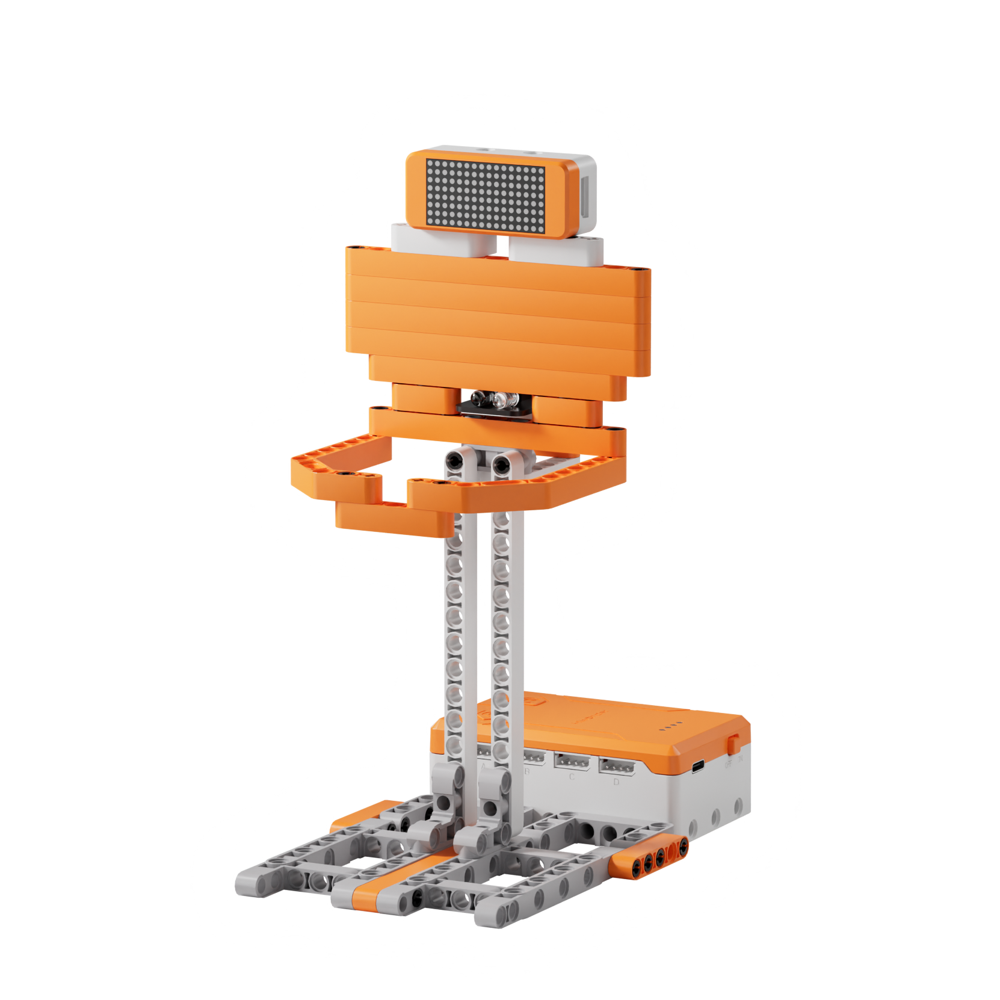
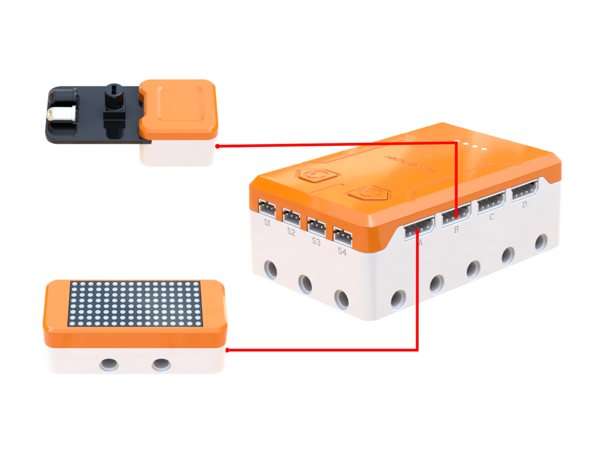
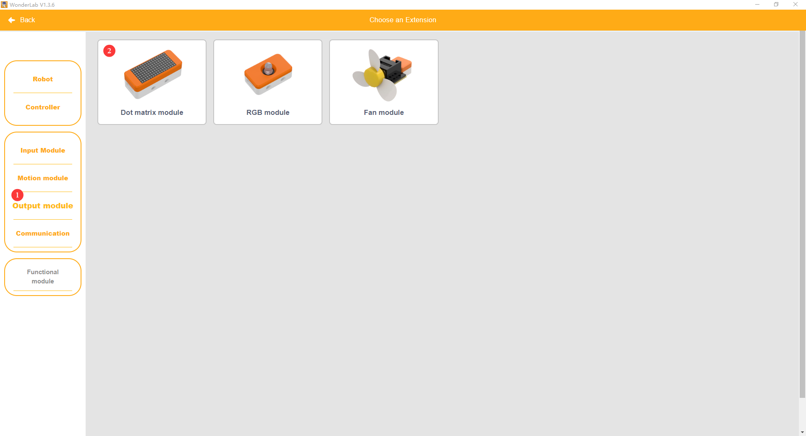
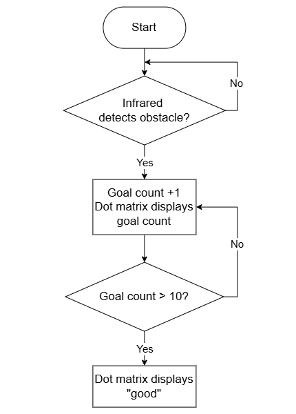
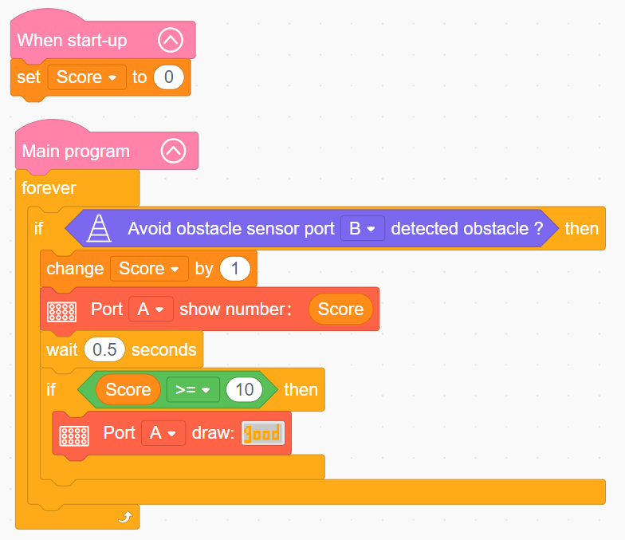

# 3.33 Hoops Bot

## 3.33.1 Lesson Introduction

Centering on the basketball shooting assistant model, this lesson explores coordinated programming combining infrared sensing with arithmetic variable operations. Pairing an Infrared obstacle avoidance sensor with a dot matrix display, it implements an automated scoring routine that tallies basketball goals in real time. The content examines infrared detection mechanisms and dot matrix information visualization, teaches variable creation, referencing, and incremental addition, and explores foundational computational thinking behind storing and updating dynamic numerical values.

## 3.33.2 Learning Objectives

1. **Knowledge Objectives**: Understand the operating principles of obstacle-avoidance sensors based on infrared beam emission and reflection reception. Grasp the concept and function of computational variables for dynamic data storage and numeric updates. Recognize the structural composition and visual feedback capabilities of dot matrix modules.

2. **Skill Objectives**: Connect the Infrared obstacle avoidance sensor and dot matrix module to designated controller ports accurately. Create variables independently, executing initialization and incremental addition operations. Program complete condition-triggered counting routines that coordinate goal detection with numeric scoring displays.

3. **Thinking Objectives**: Build closed-loop control thinking through sensing, logic evaluation, incrementing, and visual feedback. Establish software debouncing awareness, recognizing the engineering necessity of delay intervals. Strengthen data abstraction thinking by treating variables as dynamic storage containers.

4. **Application Objectives**: Connect concepts to arcade basketball machines, automated doors, elevator safety curtains, and pedestrian traffic counters. Understand the industry value of automated counting in sports training, industrial assembly lines, and demographic analytics. Stimulate interest in intelligent sensory systems and data visualization.

## 3.33.3 Preparation

### (1) Hardware Preparation

- AiBlock controller

- Infrared obstacle avoidance sensor

- Dot matrix module

- Building block parts pack

- Type-C data cable

- Assembly manual

- Computer

### (2) Software Preparation

- WonderLab Graphical Programming Platform

## 3.33.4 Hands-On Project

### (1) Project Analysis

The core project of this lesson is the Hoops Bot, delivering an intelligent scoring system featuring automated goal counting and celebratory milestone animations. The architecture follows a perception, decision, and actuation framework. The Infrared obstacle avoidance sensor monitors the hoop channel, emitting a trigger signal whenever a basketball passes through. Upon detecting this trigger, the decision layer increments the score variable by 1 and evaluates whether the tally reaches the celebration threshold. The actuation layer uses the dot matrix module to display current score values in real time, switching to a celebratory "good" graphic once the target is achieved, closing the loop from detection to numerical tracking and visual feedback.

### (2) Assembly Guide

<Pdf src="../../_static/shared/pdf/chapter_3/33.pdf" />

### (3) Hardware Wiring

- Connect the dot matrix module to port **A** of the controller using a 4-pin module cable.

- Connect the Infrared obstacle avoidance sensor to port **B** of the controller using a 4-pin module cable.

### (4) Adding Extensions

- Select **Avoid obstacle sensor** under the **Input Module** category.

- Select **Dot matrix module** under the **Output module** category.

### (5) Core Blocks

| Block | Category | Description |
| :---: | :---: | :--- |
|  |  | Serves as the main loop container, continuously executing internal code after power-on initialization |
|  |  | Executes once upon power-up, used for hardware initialization and parameter configuration |
|  |  | Reads the detection state of the Infrared obstacle avoidance sensor on the designated port, returning a boolean value indicating obstacle presence |
|  |  | Controls the dot matrix module on the designated port to refresh and display a numerical value |
|  |  | Controls the dot matrix module on the designated port to load and render a preset pattern |

### (6) Program Description and Upload

- Program Schematic

- Complete Program

  Upon startup, the program initializes the `Score` variable to 0. In the main program, the Infrared obstacle avoidance sensor repeatedly monitors for passing basketballs. When detected, the score increments by 1 and appears on the dot matrix screen. When the score reaches or exceeds 10, the dot matrix displays the "good" pattern.

- Program Upload

  Following the animation, click **Connect device**, select the serial port, then click the upload button to upload the program to the controller and test the execution results.

> [!NOTE]
>
> **The source files are available for download under [Program Files](https://drive.google.com/drive/folders/1adJTOnyve2MmEehrB9YFSW8echTWwoF2?usp=sharing).**

## 3.33.5 Expansion and Challenge

**Project 1: Multi-Tier Scoring Milestone Feedback System**

Implement multi-branch conditions to configure three-tier milestone feedback: displaying a smile face for scores reaching 5, the "good" icon for scores reaching 10, and a trophy graphic for scores reaching 20. Order condition evaluations from greatest to least to prevent logical shadowing. Display updated numbers briefly upon each goal before switching back to celebratory graphics, balancing score tracking with milestone celebrations.

**Project 2: Adjustable-Sensitivity Infrared Detection**

Rotate the sensor potentiometer knob to adjust detection range, pairing hardware adjustments with program delay parameters to compare counting accuracy across different sensitivity levels. Explore the inverse relationship between threshold settings and effective detection range, examining how hardware calibration and software debouncing cooperate to optimize sensing stability, extending discussions to industrial sensor calibration.

## 3.33.6 Q&A

**Question 1: What is the purpose of the 0.5 s wait block, and what happens if this delay is omitted?**

Answer: This delay implements **software debouncing**. When a basketball passes through the hoop, its spherical volume obstructs the infrared sensor beam continuously across a brief fraction of a second. Without a delay interval, the rapid program loop samples the same physical ball multiple times, incorrectly incrementing the score variable repeatedly during a single pass. Adding a 0.5 s delay pauses sensing briefly after each successful detection, ensuring each ball registers exactly once. Omitting this delay causes a single basketball to trigger double or triple counts, distorting tally accuracy. This technique represents a standard sensor programming practice deployed across industrial part counters and turnstile access control systems.

**Question 2: What role does a variable serve in this program, and can counting be accomplished without variables?**

Answer: A variable functions as a **dynamic data container**. In this lesson, the `Score` variable stores accumulated points, incrementing by 1 upon each detected basket before passing its updated numeric value to the dot matrix display. Without variables, implementing dynamic accumulation is practically impossible because the program lacks storage for changing values. A variable behaves like a digital scoreboard where each basket updates the displayed page: the variable identifier names the scoreboard, while the variable value represents the current displayed total. Subsequent data statistics, system state tracking, and computational operations all depend essentially on variable mechanisms.

## 3.33.7 Technical Support and Product Discussion

To share creative ideas and projects after exploring this kit, visit the Hiwonder Community:

