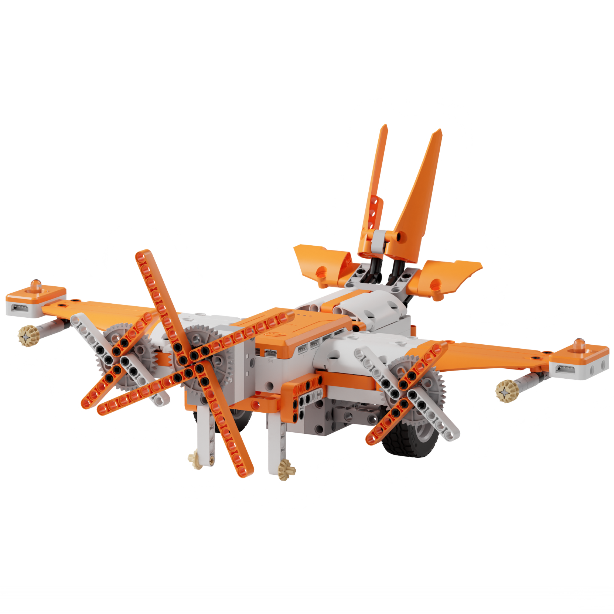
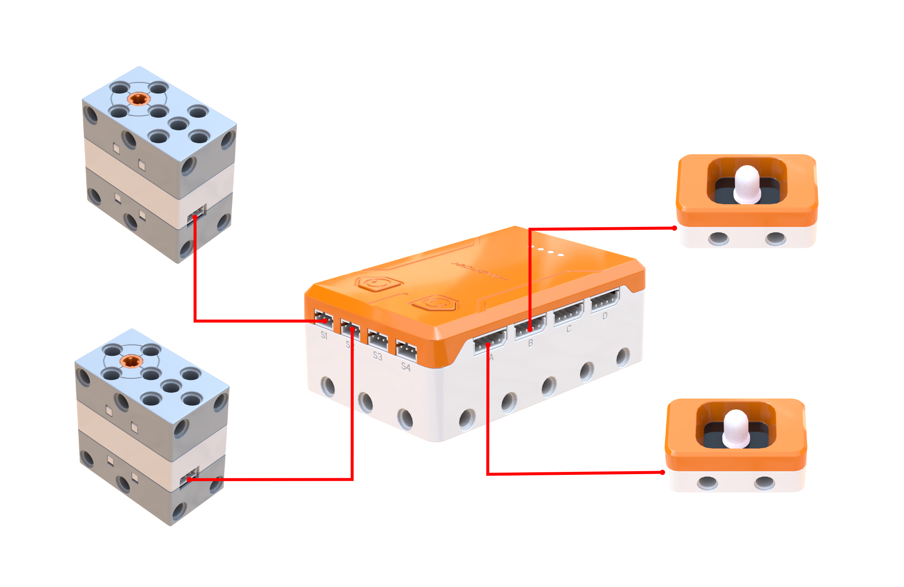
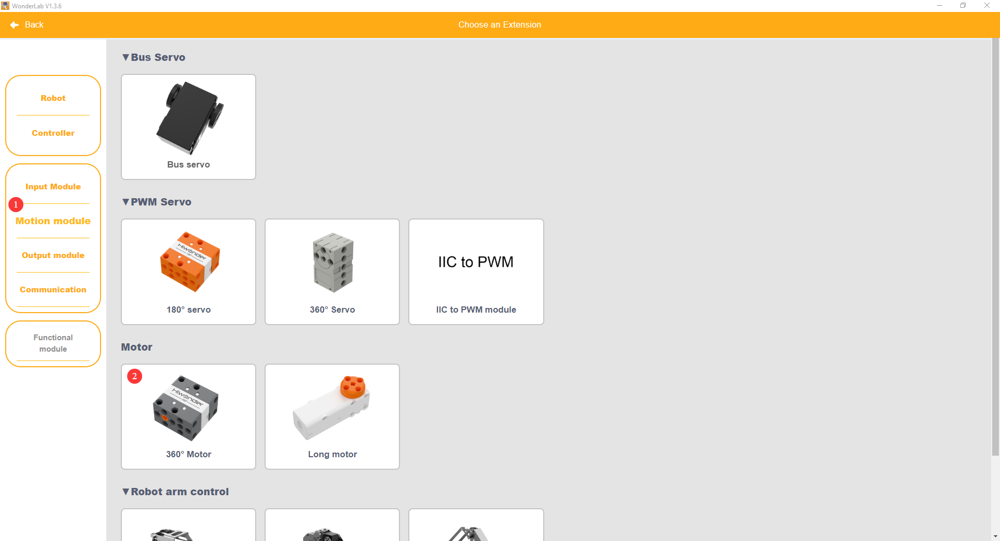
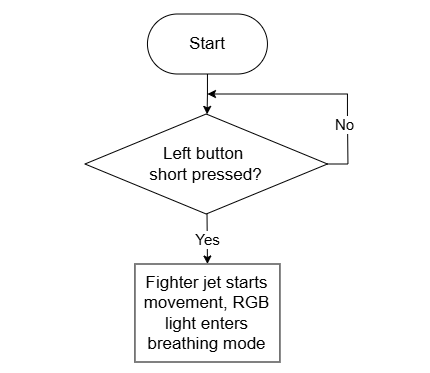
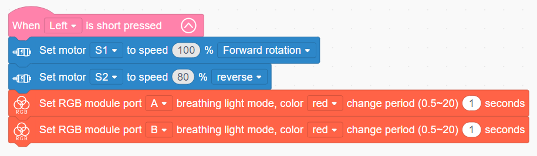

# 3.36 Fighter Jet

## 3.36.1 Lesson Introduction

Centering on the propeller aircraft model, this lesson explores coordinated programming between dual drive motors and dual RGB light modules. It implements a realistic taxiing routine where propeller rotation, landing gear forward motion, and wingtip alert lights activate synchronously. The content examines fixed-wing aerodynamic lift and propeller thrust principles, covers independent multi-channel actuator programming, and applies multi-device synchronous coordination, exploring core computational concepts behind parallel output control.

## 3.36.2 Learning Objectives

1. **Knowledge Objectives**: Understand aerodynamic lift principles in fixed-wing aircraft governed by the Bernoulli principle, recognizing how propeller thrust pairs with wing profile geometry. Master independent speed programming for dual motors alongside synchronized dual-RGB lighting control. Understand the aviation heritage and engineering evolution of propeller-driven aircraft.

2. **Skill Objectives**: Assemble the mechanical structure of the fighter jet independently, wiring four electronic peripherals accurately. Program dual 360° block motors to drive the propeller and landing gear wheels independently. Implement synchronized red breathing effects across dual RGB light modules.

3. **Thinking Objectives**: Build parallel control thinking where multiple actuators activate synchronously within unified event triggers. Develop systems engineering awareness for aeronautical structures. Strengthen practical capabilities integrating mechanical drivetrains with multi-peripheral electronic control.

4. **Application Objectives**: Connect concepts to propeller airplanes, autonomous aerial drones, and scale aviation models. Understand synergistic relationships among propulsion, aerodynamics, and avionics control in aerospace engineering. Stimulate interest in aeronautics, flight dynamics, and aerospace vehicle design.

## 3.36.3 Preparation

### (1) Hardware Preparation

- AiBlock controller

- 360° block motor

- RGB light module

- Building block parts pack

- Type-C data cable

- Assembly manual

- Computer

### (2) Software Preparation

- WonderLab Graphical Programming Platform

## 3.36.4 Hands-On Project

### (1) Project Analysis

The core project of this lesson is the Fighter Jet, delivering a synchronized pre-flight taxiing simulation that coordinates dual mechanical propulsion with dual optical signaling. The system adopts a parallel architecture coupling two motors with two RGB modules. Motor S1 drives the front propeller at full speed to generate forward airflow, while motor S2 rotates the landing gear wheels in reverse at 80% speed to propel the aircraft forward steadily, applying distinct speeds tailored to separate functional requirements. Simultaneously, RGB modules on the left and right wings pulse synchronized red breathing light effects to simulate aviation position lights. All four channels activate synchronously upon button input, presenting a vivid simulation of an aircraft accelerating down a runway.

### (2) Assembly Guide

<Pdf src="../../_static/shared/pdf/chapter_3/36.pdf" />

### (3) Hardware Wiring

- Connect the 360° block motor controlling the front propeller to port **S1** of the controller using a 3-pin servo cable.

- Connect the 360° block motor controlling the landing gear wheels to port **S2** of the controller using a 3-pin servo cable.

- Connect the RGB light module on the right wing to port **A** of the controller using a 4-pin module cable.

- Connect the RGB light module on the left wing to port **B** of the controller using a 4-pin module cable.

### (4) Adding Extensions

- Select **360° Motor** under the **Motion module** category.

- Select **RGB module** under the **Output module** category.

### (5) Core Blocks

| Block | Category | Description |
| :---: | :---: | :--- |
|  |  | Serves as an event trigger block that executes internal instructions upon detecting a short press of the designated button |
|  |  | Directs the 360° block motor on the designated port to rotate continuously forward or in reverse at a custom speed |
|  |  | Controls the RGB light module on the designated port to enable a breathing gradient effect in a selected color, supporting custom transition cycles |

### (6) Program Description and Upload

- Program Schematic

- Complete Program

  When the left button is short-pressed, motor S1 rotates forward at 100% speed to spin the propeller blades, motor S2 rotates in reverse at 80% speed to propel the fighter jet forward, and both wingtip RGB light modules pulse in red breathing mode with a 1 s cycle.

- Program Upload

  Following the animation, click **Connect device**, select the serial port, then click the upload button to upload the program to the controller and test the execution results.

> [!NOTE]
>
> **The source files are available for download under [Program Files](https://drive.google.com/drive/folders/1adJTOnyve2MmEehrB9YFSW8echTWwoF2?usp=sharing).**

## 3.36.5 Expansion and Challenge

**Project 1: Gradual Acceleration Takeoff System**

Use a variable to regulate motor velocities, beginning at 20% and incrementing by 10% each second until reaching full power to simulate realistic ground acceleration. Concurrently modulate RGB lighting from dim to bright to heighten visual realism. Practice variable incrementing and programmatic motion choreography, extending discussions to commercial aircraft takeoff procedures and variable-frequency propulsion.

**Project 2: Sound-Activated Engine Ignition Sequence**

Introduce sound detection where a handclap initiates an ignition sequence following a 0.5 s delay, spinning the propeller up progressively while wingtip lights illuminate sequentially to simulate an authentic engine start-up ritual. Practice combining acoustic sensing with timed sequential actuation, extending discussions to voice-activated aerospace control and hands-free vehicular systems.

## 3.36.6 Q&A

**Question 1: Why does the fighter jet utilize two motors operating at different speeds, and what roles do they perform?**

Answer: The two motors perform **distinct functional roles**, requiring different rotation speeds. Motor S1 couples directly to the front propeller, generating aerodynamic thrust through high-velocity rotation. Because greater airflow velocity yields higher thrust, motor S1 operates at 100% full speed. In contrast, motor S2 couples to the landing gear wheels to provide surface locomotion. Because excessive ground speed risks directional instability and veer-off, motor S2 operates at 80% speed to ensure controlled, stable taxiing. Full-scale aircraft follow identical engineering logic: main engines deliver primary flight thrust, while landing gear assemblies handle ground support and directional rolling without matching flight propulsion outputs. Delegating tasks across dedicated motors represents a foundational mechanical design principle, ensuring greater reliability and operational flexibility than attempting to drive diverse mechanisms from a single actuator.

**Question 2: Why are both wingtip RGB modules configured with identical parameters, and can they be set to different values?**

Answer: Setting identical parameters achieves **synchronized bilateral pulsing**, simulating standardized aircraft position lights for an organized aesthetic. Because the two RGB modules connect to distinct controller ports, they operate with complete electrical independence. Consequently, they can be configured with completely different behaviors, such as assigning red to one side and blue to the other, varying flash rates, or combining steady illumination with breathing gradients. Full-scale aviation navigation lights follow strict color conventions: red on the left wingtip, green on the right wingtip, and white on the empennage, allowing observers to discern aircraft flight orientation instantly from afar. Configuring left-red and right-green lighting aligns the model directly with international civil aviation navigation standards, providing extensive creative latitude for custom signaling schemes.

## 3.36.7 Technical Support and Product Discussion

To share creative ideas and projects after exploring this kit, visit the Hiwonder Community:

