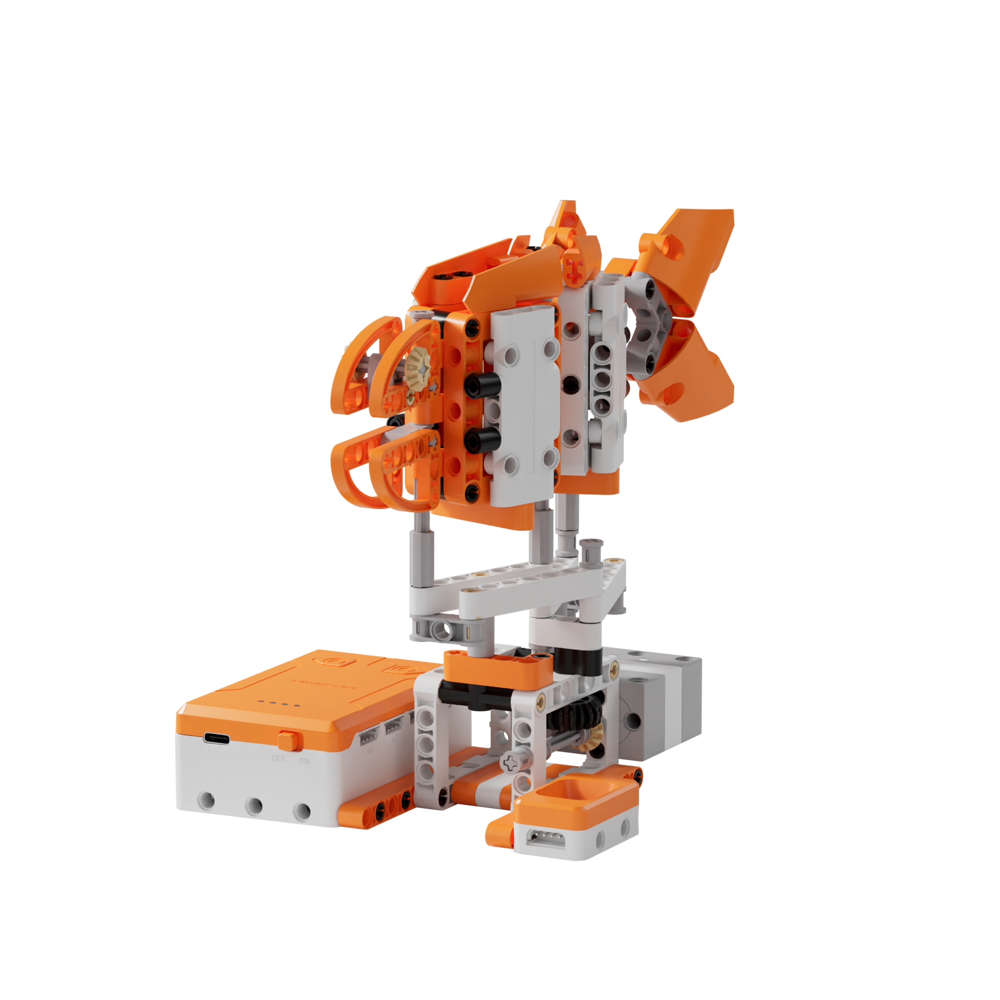
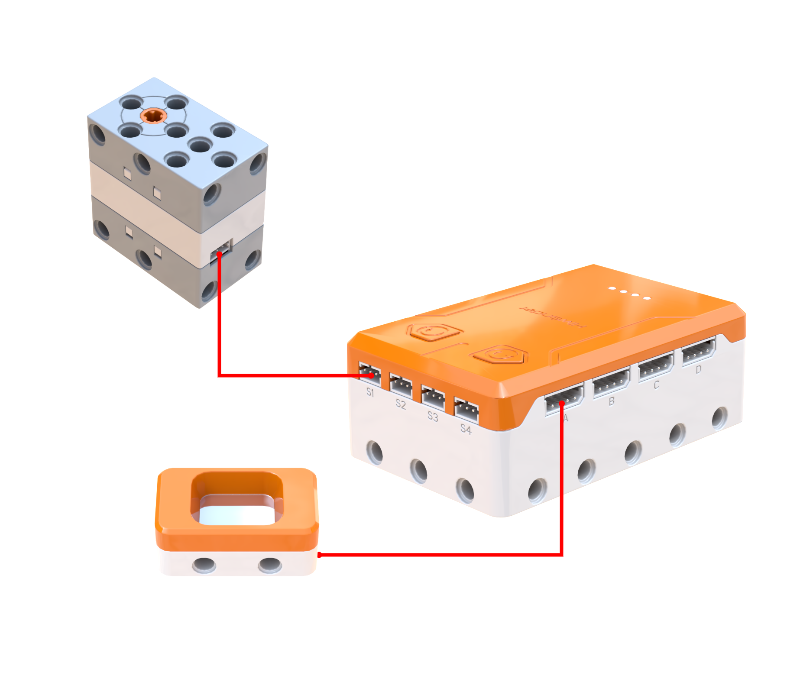
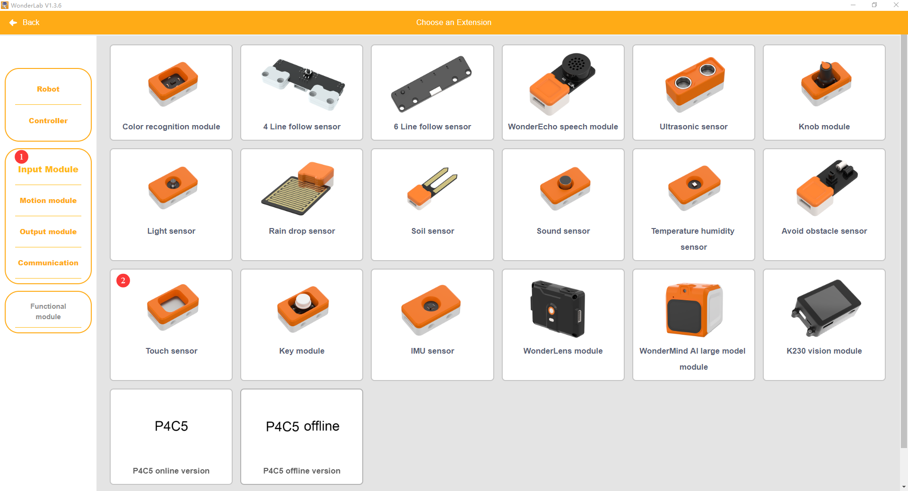
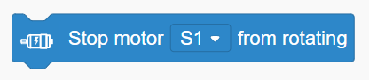
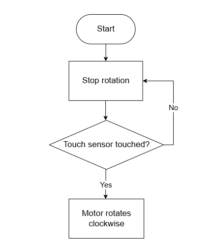
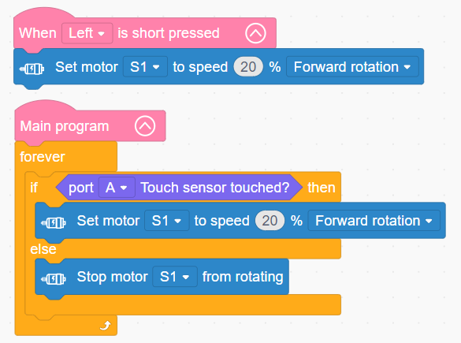

# 3.37 Wiggling Fish

## 3.37.1 Lesson Introduction

Taking inspiration from the propulsive tail oscillations of swimming fish, this lesson builds a bionic robotic fish capable of simulating natural serpentine body motion. Connecting prior mechanical linkage and capacitive touch sensing concepts, the content explores multi-joint segmented chassis kinematics. It examines how lateral body undulation generates fluid propulsion, guides the assembly of segmented articulators coupled with eccentric linkage drivetrains, and implements touch-triggered start-stop control to reinforce structured programming for interactive bionic mechanisms.

## 3.37.2 Learning Objectives

1. **Knowledge Objectives**: Understand hydrokinetic propulsion principles where lateral tail oscillation generates forward thrust. Master linkage transmission mechanisms coordinating segmented body joints. Consolidate capacitive touch detection principles for interactive sensing.

2. **Skill Objectives**: Assemble the multi-joint chassis and eccentric linkage drivetrain of the robotic fish independently, mastering joint alignment techniques. Program touch-triggered routines that initiate motion on contact and halt upon release. Adjust motor velocity parameters to optimize body oscillation cadence.

3. **Thinking Objectives**: Build systems thinking regarding multi-joint mechanical coordination driven by a centralized power source. Develop bionic engineering awareness by mapping biological anatomy to mechanical kinematic equivalents. Strengthen event-driven trigger control concepts in human-robot interaction.

4. **Application Objectives**: Connect concepts to robotic fish, underwater exploration submersibles, and biomimetic serpentine robots. Understand the engineering value of biomimetic locomotion in marine survey and search-and-rescue operations. Stimulate scientific curiosity regarding marine biology and underwater robotic exploration.

## 3.37.3 Preparation

### (1) Hardware Preparation

- AiBlock controller

- 360° block motor

- Touch sensor

- Building block parts pack

- Type-C data cable

- Assembly manual

- Computer

### (2) Software Preparation

- WonderLab Graphical Programming Platform

## 3.37.4 Hands-On Project

### (1) Project Analysis

The core project of this lesson is the Wiggling Fish, delivering an interactive biomimetic mechanism that initiates multi-joint swimming oscillations upon touch. The system adopts an architecture integrating touch interaction, motor propulsion, and multi-joint linkage kinematics. The touch sensor serves as the interactive trigger, with conditional statements sampling touch states continuously to govern motor start-stop execution. The 360° block motor transmits rotary motion through gears and eccentric linkages across segmented chassis joints, coordinating left-to-right undulations that form an S-shaped traveling wave. The caudal tail section produces the largest displacement amplitude, replicating fin strokes that displace water for forward propulsion. The streamlined architecture provides intuitive tactile interaction, highlighting the elegance of bionic robotics.

### (2) Assembly Guide

<Pdf src="../../_static/shared/pdf/chapter_3/37.pdf" />

### (3) Hardware Wiring

- Connect the 360° block motor to port **S1** of the controller using a 3-pin servo cable.

- Connect the touch sensor to port **A** of the controller using a 4-pin module cable.

### (4) Adding Extensions

- Select **Touch sensor** under the **Input Module** category.

- Select **360° Motor** under the **Motion module** category.

### (5) Core Blocks

| Block | Category | Description |
| :---: | :---: | :--- |
|  |  | Serves as the main loop container, continuously executing internal code after power-on initialization |
|  |  | Reads the state of the touch sensor on the designated port, returning a boolean value indicating contact |
|  |  | Directs the 360° block motor on the designated port to rotate continuously forward or in reverse at a custom speed |
|  |  | Disables output to the 360° block motor on the designated port, halting rotation immediately |

### (6) Program Description and Upload

- Program Schematic

- Complete Program

  In the main program loop, the controller continuously evaluates touch sensor input. When contact occurs, motor S1 rotates forward at 20% speed to drive oscillatory swimming motions. When contact ceases, motor S1 halts rotation, leaving the robotic fish stationary.

- Program Upload

  Following the animation, click **Connect device**, select the serial port, then click the upload button to upload the program to the controller and test the execution results.

> [!NOTE]
>
> **The source files are available for download under [Program Files](https://drive.google.com/drive/folders/1adJTOnyve2MmEehrB9YFSW8echTWwoF2?usp=sharing).**

## 3.37.5 Expansion and Challenge

**Project 1: Sound-Activated Bioluminescent Fish**

Incorporate an RGB light module alongside the drive motor, triggering both upon acoustic detection. Modulate tail oscillation speed and illumination brightness proportionally according to ambient sound volume, or assign distinct colors across volume tiers. Practice multi-actuator coordination and analog data mapping, extending discussions to deep-sea bioluminescence and underwater searchlight design.

**Project 2: Variable-Speed Cruising Mode**

Implement double-tap detection to switch swimming modes: configuring a slow mode with motor S1 running at 10% speed for gentle swimming, and a fast mode running at 40% speed to simulate an escape response. Use a variable to track active modes, practicing state toggle logic and double-tap detection algorithms, extending discussions to aquatic locomotion dynamics and autonomous underwater vehicle velocity control.

## 3.37.6 Q&A

**Question 1: Why is the fish body divided into multiple articulated segments rather than constructed as a single rigid piece?**

Answer: Segmented joints replicate the biological **vertebral column** of real fish, allowing the body to flex fluidly into continuous S-shaped traveling curves. If the fish chassis were constructed as a single rigid beam, it could only swing as a stiff pendulum, unable to generate undulating waveforms that propagate from head to tail, resulting in poor hydrodynamic efficiency. Biological fish, snakes, and eels rely on vertebrae linked in series, where each segment undergoes small angular deflections that accumulate into sweeping, flexible undulations. In this robotic fish, multiple articulated segments couple with mechanical linkages so that each segment rotates sequentially, replicating biological waveforms to maximize propulsive thrust.

**Question 2: What distinguishes continuous touch state detection from single-press button triggering in interactive control?**

Answer: These methods represent two distinct trigger models. **Short-press button triggering** operates as an event-driven mechanism: pressing the button initiates a routine that continues executing autonomously without sustained physical contact, making it suitable for persistent behaviors like music playback or vehicle cruising. In contrast, **continuous touch detection** functions as a state-driven mechanism: actuation persists strictly while contact is maintained, halting immediately when contact ceases. This behaves like a momentary hold switch, ideal for hands-on interactive control where direct contact governs motion. In programming, event-driven modes use dedicated event listener blocks, whereas state-driven modes utilize infinite loops paired with conditional evaluations.

## 3.37.7 Technical Support and Product Discussion

To share creative ideas and projects after exploring this kit, visit the Hiwonder Community:

