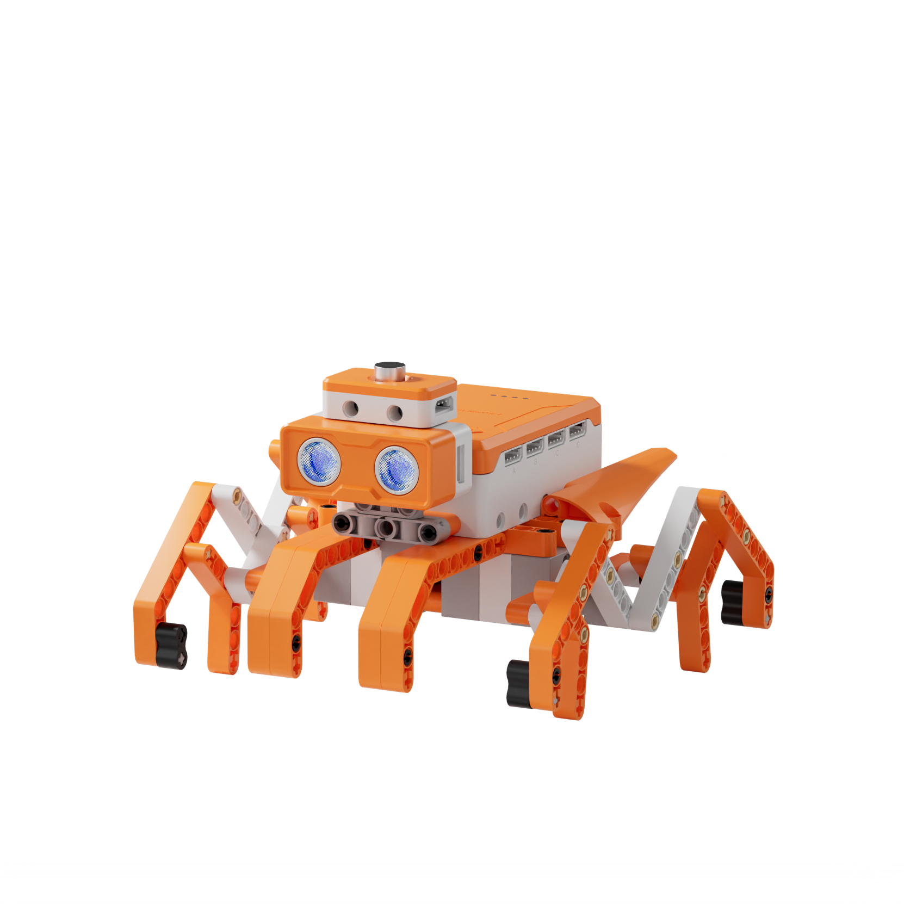
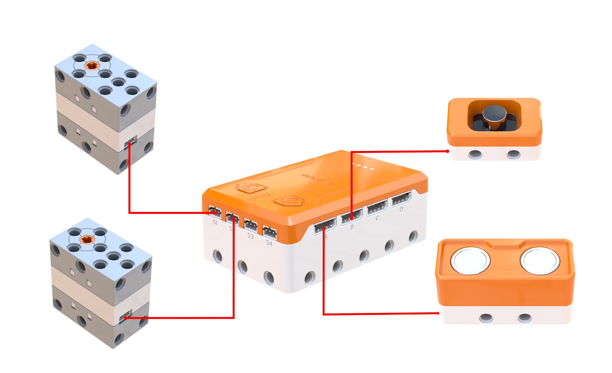
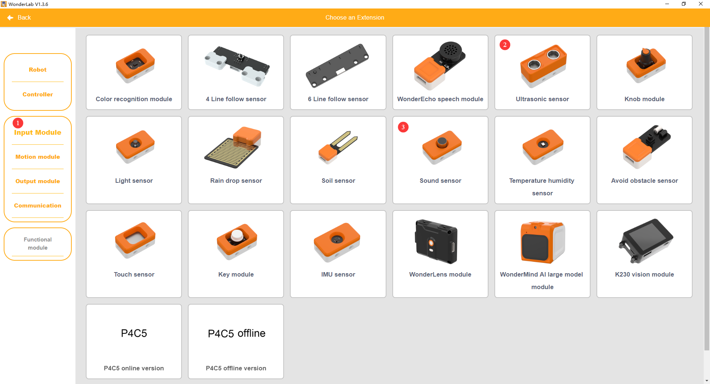
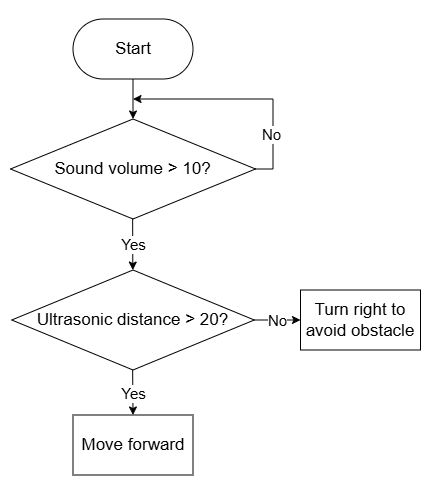
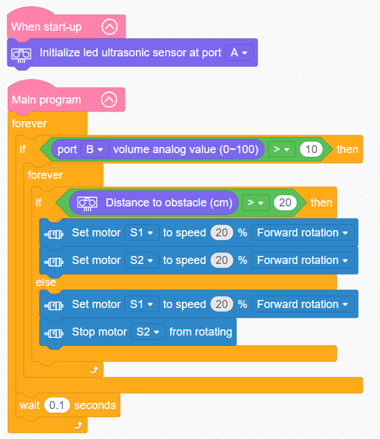

# 3.38 Sonic Mecha Spider

## 3.38.1 Lesson Introduction

Centering on the eight-legged mecha spider robot, this lesson explores coordinated programming among dual drive motors, a sound sensor, and an ultrasonic distance sensor. It implements an autonomous crawling routine that awakens upon a handclap and navigates around obstacles by executing right-hand turns. The content examines differential steering mechanics, applies nested multi-tier conditional evaluation logic, and investigates core robotics principles behind multi-sensor fusion for autonomous obstacle avoidance.

## 3.38.2 Learning Objectives

1. **Knowledge Objectives**: Understand differential steering principles where velocity differences between left and right drivetrains induce directional turning. Master analog signal acquisition and threshold triggering using the sound sensor. Consolidate ultrasonic ranging principles alongside eight-legged linkage gait kinematics.

2. **Skill Objectives**: Wire four electronic peripherals accurately, connecting dual motors, the ultrasonic sensor, and the sound sensor. Program dual motors for synchronized forward crawling and differential cornering maneuvers. Implement complete nested decision structures coordinating sound-activated wake-up triggers with ultrasonic obstacle avoidance.

3. **Thinking Objectives**: Build composite control thinking integrating multi-sensor fusion with hierarchical conditional logic. Develop coordination awareness for dual-actuator differential steering. Reinforce understanding of the perception, decision-making, and execution architecture in autonomous mobile robotics.

4. **Application Objectives**: Connect concepts to robotic vacuum cleaners, voice-activated toys, and automated guided vehicles. Appreciate the critical role of sensor fusion in intelligent mobile systems. Stimulate interest in autonomous robotics and artificial intelligence.

## 3.38.3 Preparation

### (1) Hardware Preparation

- AiBlock controller

- 360° block motor

- Ultrasonic sensor

- Sound sensor

- Building block parts pack

- Type-C data cable

- Assembly manual

- Computer

### (2) Software Preparation

- WonderLab Graphical Programming Platform

## 3.38.4 Hands-On Project

### (1) Project Analysis

The core project of this lesson is the Sonic Mecha Spider, delivering an autonomous walking robot that awakens upon sound detection, crawls forward steadily, and turns right when detecting obstacles. The system adopts an architecture combining dual sensory perception, two-tier conditional evaluations, and dual-motor execution. The sound sensor functions as the wake-up trigger, while the ultrasonic sensor measures forward clearance. The decision layer first evaluates whether detected volume exceeds the preset threshold: once activated, it checks obstacle distance, crawling straight when clearance exceeds 20 cm and turning right when obstacles are within 20 cm. Dual motors drive the eight-legged mechanical linkages: forward crawling runs both sides forward synchronously, while right-hand cornering runs the left motor while halting the right motor to generate a differential turn. Worm gear transmissions deliver torque multiplication, ensuring stable crawling traction.

### (2) Assembly Guide

<Pdf src="../../_static/shared/pdf/chapter_3/38.pdf" />

### (3) Hardware Wiring

- Connect the left 360° block motor to port **S1** of the controller using a 3-pin servo cable.

- Connect the right 360° block motor to port **S2** of the controller using a 3-pin servo cable.

- Connect the ultrasonic sensor to port **A** of the controller using a 4-pin module cable.

- Connect the sound sensor to port **B** of the controller using a 4-pin module cable.

### (4) Adding Extensions

- Select **Ultrasonic sensor** and **Sound sensor** under the **Input Module** category.

- Select **360° Motor** under the **Motion module** category.

### (5) Core Blocks

| Block | Category | Description |
| :---: | :---: | :--- |
|  |  | Serves as the main loop container, continuously executing internal code after power-on initialization |
|  |  | Executes once upon power-up, used for hardware initialization and parameter configuration |
|  |  | Initializes hardware communication parameters for the ultrasonic sensor on the designated port |
|  |  | Acquires distance measurements from the ultrasonic sensor, returning values in centimeters |
|  |  | Reads the volume level detected by the sound sensor on the designated port across a range of 0 to 100, where higher values indicate louder ambient sound |
|  |  | Directs the 360° block motor on the designated port to rotate continuously forward or in reverse at a custom speed |
|  |  | Disables output to the 360° block motor on the designated port, halting rotation immediately |

### (6) Program Description and Upload

- Program Schematic

- Complete Program

  Upon startup, the program initializes the ultrasonic sensor on port A. The main program executes continuously: when ambient volume exceeds 10 and forward obstacle distance exceeds 20 cm, motors S1 and S2 both rotate forward at 20% speed to crawl straight ahead. When an obstacle is detected within 20 cm, motor S1 rotates forward at 20% speed while motor S2 halts, executing a right-hand turn to avoid the barrier.

- Program Upload

  Following the animation, click **Connect device**, select the serial port, then click the upload button to upload the program to the controller and test the execution results.

> [!NOTE]
>
> **The source files are available for download under [Program Files](https://drive.google.com/drive/folders/1adJTOnyve2MmEehrB9YFSW8echTWwoF2?usp=sharing).**

## 3.38.5 Expansion and Challenge

**Project 1: Volume-Proportional Crawling Speed Control**

Map analog volume readings directly into motor velocity parameters so louder clapping produces faster crawling locomotion, establishing stepless speed modulation with upper boundary clamping to prevent mechanical strain. Understand direct parameter mapping principles for sensory inputs, practicing continuous variable programming relevant to voice-modulated robotic drive mechanisms.

**Project 2: Autonomous Maze Exploration Spider**

Implement a maze traversal strategy employing right-wall following logic, or evaluate distances dynamically to select between left and right escape paths, logging turn frequencies with variables to optimize traversal efficiency. Practice steering duration calibration and exploratory navigation logic, extending discussions to robotic vacuum path planning and autonomous aerial drone obstacle negotiation.

## 3.38.6 Q&A

**Question 1: Why does the robot employ two motors rather than one, and how does dual-motor differential steering work?**

Answer: Utilizing two motors enables **differential steering**. With only a single motor, the eight-legged mechanism could only advance in a fixed heading without turning capability. Providing independent motors on the left and right sides allows directional steering through velocity differentials. Running both sides at equal speeds produces straight locomotion. Running the left side faster than the right steers rightward. Conversely, running the right side faster steers leftward. Rotating one side while halting the other executes tight, agile pivot turns. This represents the differential steering principle, which alters heading through relative speed differences. Tracked vehicles, differential drive rovers, and robotic vacuums all employ identical kinematics, achieving agile cornering without complex mechanical steering linkages.

**Question 2: Why does the program nest two layers of conditional evaluations, and what role does each tier perform?**

Answer: Two evaluation tiers handle **distinct sequential decision criteria** hierarchically. The **outer tier** evaluates the sound volume threshold, acting as the master power switch that determines whether the spider should awaken from standby. The **inner tier** evaluates ultrasonic distance data, serving as the navigation system that determines whether to advance straight or pivot rightward to clear obstacles. Structuring them hierarchically ensures that sound activation criteria must be satisfied before locomotion commences, after which navigational evaluation directs path selection. Hierarchical conditional nesting allows robotic systems to manage multifaceted environments systematically, enabling sophisticated autonomous behaviors.

## 3.38.7 Technical Support and Product Discussion

To share creative ideas and projects after exploring this kit, visit the Hiwonder Community:

