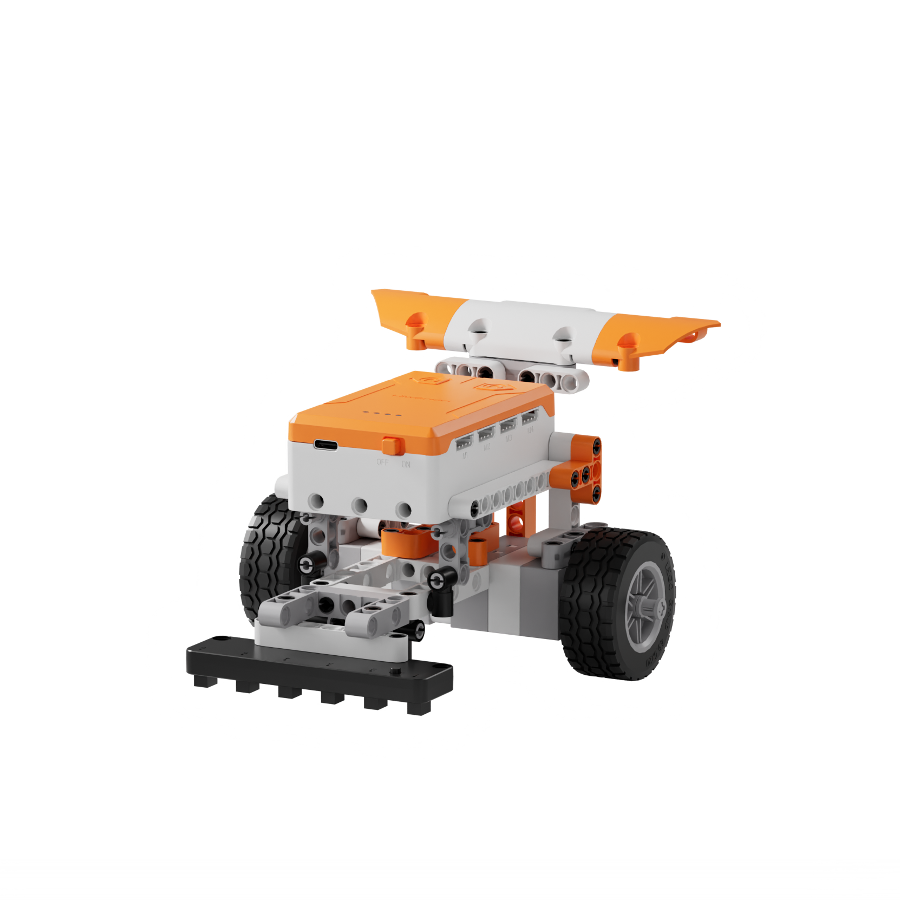
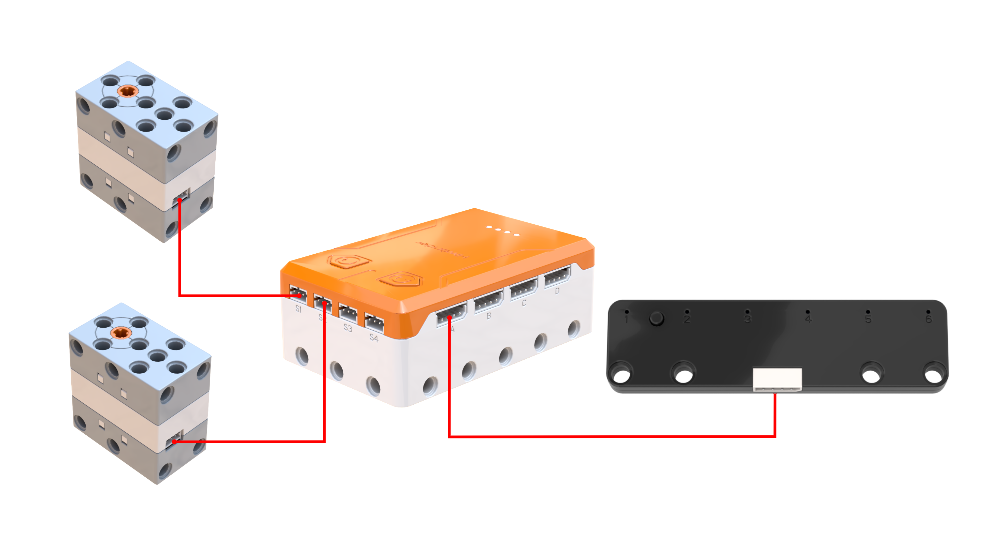
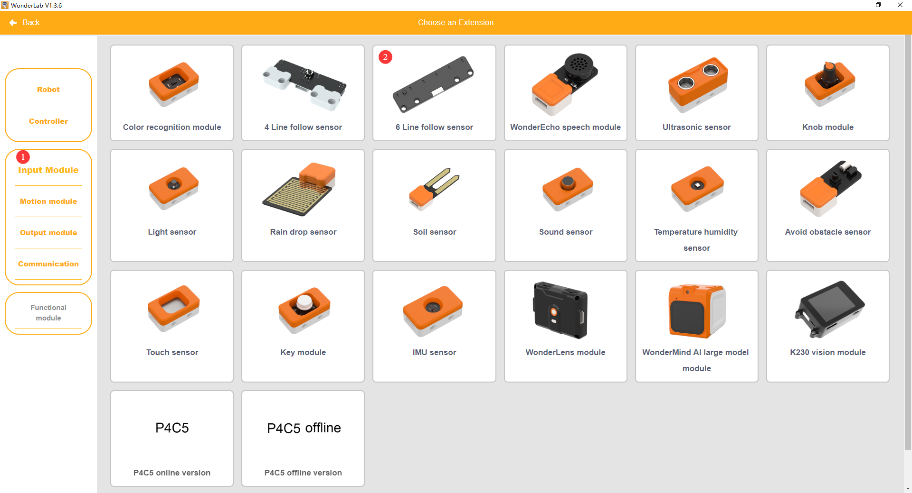
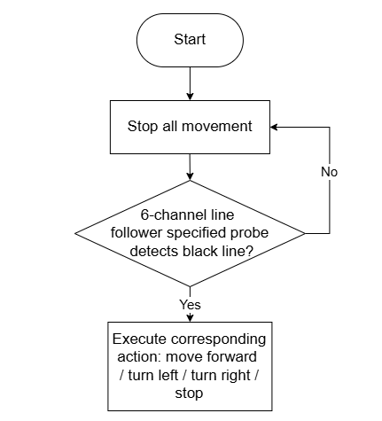
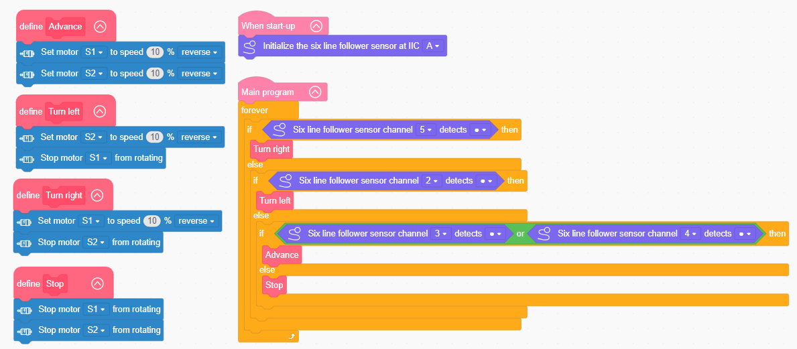

# 3.39 Differential Tricycle

## 3.39.1 Lesson Introduction

Using a three-wheeled smart rover as the project platform, this lesson explores the linked programming pattern between dual motors and a 6-channel line follower sensor to achieve autonomous line following by identifying a black line and adjusting steering angles. The project illustrates differential drive principles, clarifies independent motor control techniques, reinforces line-following detection logic, demonstrates custom function encapsulation methods, and explains modular software architecture.

## 3.39.2 Learning Objectives

1. **Knowledge Objectives**: Understand the mechanical principles of dual-motor differential drive where unbalanced traction forces generate turns. Master the trajectory detection mechanisms and channel assessment logic of the 6-channel line follower sensor. Recognize function encapsulation concepts and modular programming advantages.

2. **Skill Objectives**: Assemble the mechanical structure of the differential tricycle independently, connecting dual motors and the 6-channel line follower sensor accurately. Construct basic motion routines for forward drive, left turns, right turns, and complete stops. Encapsulate motion commands into custom functions and implement autonomous line following with the 6-channel line follower sensor.

3. **Thinking Objectives**: Build closed-loop control thinking based on sensor detection feedback and motor steering corrections. Cultivate modular programming habits by packaging repetitive program routines into reusable functions. Strengthen comprehensive signal evaluation skills when processing multi-channel sensor data.

4. **Application Objectives**: Connect differential drive principles to real-world applications including robotic vacuum cleaners, automated guided vehicles in logistics, autonomous driving systems, and industrial inspection robots. Understand the widespread adoption of differential steering across wheeled robotic platforms. Stimulate exploration into autonomous robotics and automated navigation technologies.

## 3.39.3 Preparation

### (1) Hardware Preparation

- AiBlock controller

- 360° block motor

- 6-channel line follower sensor

- Building block parts pack

- Type-C data cable

- Assembly manual

- Computer

### (2) Software Preparation

- WonderLab graphical programming platform

## 3.39.4 Project Practical Operation

### (1) Project Analysis

The core project implements an autonomous differential tricycle capable of line sensing and differential steering correction. The system adopts a closed-loop architecture combining multi-channel infrared detection and differential steering adjustments. Six infrared probes monitor the position of the black path. The decision layer evaluates the probe channels to determine deviation directions: turn left when drifting right, turn right when drifting left, travel straight when centered, and stop when fully derailed. The execution layer adjusts movement directions through dual-motor differential control, where turning right activates the right wheel while halting the left wheel, and turning left reverses this operation. Continuous loop detection and dynamic adjustments guide the rover smoothly along the black line. Encapsulating the four movement modes into dedicated functions maintains a clean and modular program architecture.

### (2) Assembly Guide

<Pdf src="../../_static/shared/pdf/chapter_3/39.pdf" />

### (3) Hardware Wiring

- Connect the left 360° block motor to port **S1** of the controller using a 3-pin servo cable.

- Connect the right 360° block motor to port **S2** of the controller using a 3-pin servo cable.

- Connect the 6-channel line follower sensor to port **A** of the controller using a 4-pin module cable.

### (4) Add Extensions

- Select **6 Line follow sensor** under the **Input Module** category.

- Select **360° Motor** under the **Motion module** category.

### (5) Core Blocks

| Block | Category | Description |
| :---: | :---: | :--- |
|  |  | Create a custom function without parameters to encapsulate reusable program logic. |
|  |  | Call a defined parameterless function to execute all encapsulated program statements. |
|  |  | Serve as the main program loop container, continuously executing internal code after power-on initialization. |
|  |  | Execute only once after startup to initialize hardware configurations and system parameters. |
|  |  | Initialize the hardware connection port for the 6-channel line follower sensor. |
|  |  | Read the detection status of a designated channel on the 6-channel line follower sensor, determine whether the channel detects a black line or white surface, and return a Boolean value for line-following logic. |
|  |  | Drive the 360° block motor at a specified port to rotate continuously at a set speed in the forward or reverse direction. |
|  |  | Stop power output to the 360° block motor at the designated port immediately. |

### (6) Program Description and Upload

- Schematic Diagram

- Complete Program Screenshot

  Upon startup, initialize the hardware port for the 6-channel line follower sensor. Next, define custom functions for forward movement, left turn, right turn, and stop. When probe 5 detects the black line, execute a right turn. When probe 2 detects the black line, execute a left turn. When probe 3 or probe 4 detects the black line, proceed forward. Stop all motion under any other detection status.

- Program Upload

  Following the animation, click **Connect**, select the serial port, then click **Upload** to transfer the program to the controller and test the execution results.

> [!NOTE]
>
> **The source files are available for download under [Program Files](https://drive.google.com/drive/folders/1adJTOnyve2MmEehrB9YFSW8echTWwoF2?usp=sharing).**

## 3.39.5 Extension and Expansion

**Project 1: Multi-Speed Tiered Line Following**

Apply gentle steering speeds for inner-channel deviations and sharper turning speeds for outer-channel deviations, accelerating on straight stretches and decelerating through turns. Understand multi-channel graded response strategies, explore the proportional adjustment concepts of proportional-integral-derivative control, and examine closed-loop stabilization applications in autonomous lane-keeping systems and drone attitude balancing.

**Project 2: Intersection Recognition Rover**

Program the rover to detect an intersection when all six sensor channels identify black, pause for 2 s, turn right, and resume line following. Practice unique pattern recognition and timed motion sequence design. Study scene evaluation and autonomous path planning, connecting these principles to automated guided vehicles in warehousing and intersection decision logic in autonomous driving.

## 3.39.6 Q&A

**Question 1: How does the differential tricycle turn without dedicated steering wheels, and what is the principle of differential steering?**

Answer: Differential drive relies on a speed difference between the left and right wheels. Traditional automobiles utilize steering wheels to pivot the front tires, whereas this three-wheeled rover features no pivoting wheels. Instead, two drive wheels are powered by independent motors. Equal motor speeds propel both wheels at identical rates, driving the vehicle straight ahead. Halting the left motor while spinning the right motor pushes the right side forward around the stationary left pivot, executing a left turn. Conversely, stopping the right motor while driving the left motor initiates a right turn. The underlying mechanism stems from unbalanced tractive forces across the vehicle chassis. Greater velocity differences produce tighter turns with smaller turning radii. Rotating one motor forward while driving the opposite motor in reverse enables zero-radius pivoting in place. This mechanism requires no complex steering linkage, making differential drive popular across robotic vacuums, electric wheelchairs, tracked tanks, and mobile inspection robots. Modern motor vehicles also incorporate mechanical differentials, though their goal is to prevent tire slippage during turns rather than active steering.

**Question 2: How does the 6-channel line follower sensor detect trajectory deviations, and why do distinct channels trigger specific turning responses?**

Answer: The 6-channel line follower sensor arranges six infrared detection probes in a straight horizontal line numbered 1 through 6 from left to right, mounted beneath the front chassis. During centered travel, the black tracking line aligns directly between probe 3 and probe 4. Detection on these middle channels confirms proper alignment, prompting forward motion. If the chassis drifts to the right, the black line shifts toward the left side of the sensor array, triggering probe 2 or probe 1. The control routine interprets this signal as a rightward drift and commands a left turn to re-center the path. Conversely, drifting to the left shifts the line toward the right side, activating probe 5 or probe 6 and triggering a compensatory right turn. Whichever probe detects the black line reveals the line location relative to the chassis, indicating that the rover has drifted toward the opposite direction. Steering toward the detected side pulls the black line back toward the center probes. This closed-loop corrective behavior mimics how human drivers observe lane markings and steer to maintain centered positioning.

## 3.39.7 Technical Support and Community Discussion

Submit questions or share project modifications in the community forum:

