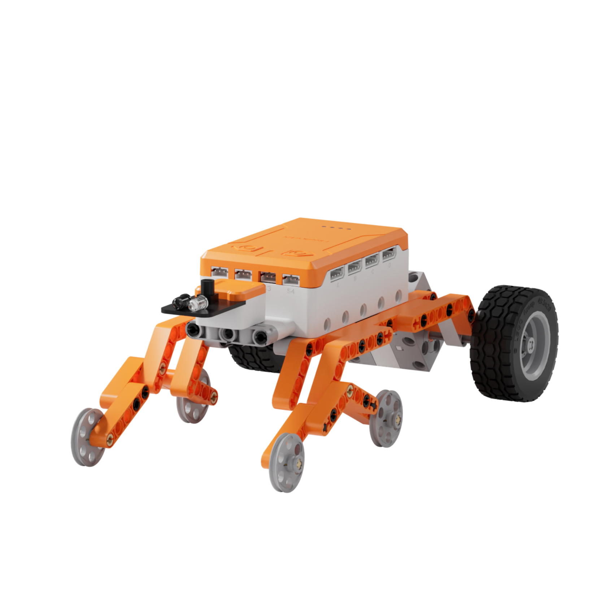
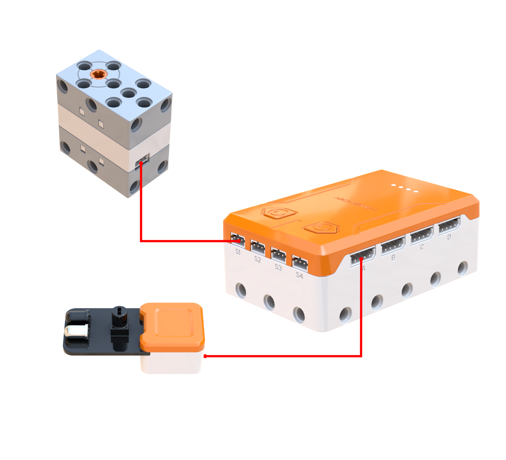
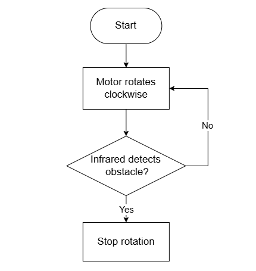
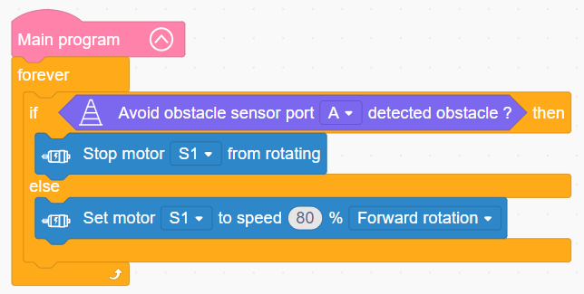

# 3.40 Terrain Rover

## 3.40.1 Lesson Introduction

Focusing on an electric off-road vehicle model, this lesson explores the coordinated programming pattern between a motor and an obstacle avoidance sensor. It implements an off-road driving routine that navigates continuously when unobstructed and halts automatically upon encountering obstacles. The content illustrates suspension shock absorption principles and six-wheel drive transmission mechanics. It reinforces infrared obstacle detection methods alongside sensor-triggered start-stop control logic. Additionally, it highlights multi-wheel drive advantages and explains how sensory modules integrate with dynamic drive systems.

## 3.40.2 Learning Objectives

1. **Knowledge Objectives**: Understand suspension shock absorption mechanisms and their role in off-road stability. Master the obstacle detection principles of the infrared obstacle avoidance sensor. Consolidate structural characteristics of single-motor multi-wheel transmissions. Comprehend infrared-triggered start-stop control logic.

2. **Skill Objectives**: Assemble the mechanical structure of the six-wheel off-road vehicle independently, installing the suspension system correctly. Construct basic motor routines to drive the vehicle forward. Utilize the infrared obstacle avoidance sensor to implement automatic stopping when detecting obstacles and resuming travel when the path clears.

3. **Thinking Objectives**: Build safety-oriented thinking rooted in continuous detection and immediate response, and understand active obstacle avoidance logic. Cultivate engineering design awareness for suspension damping structures. Reinforce understanding of basic sensor-to-actuator control architectures.

4. **Application Objectives**: Connect concepts to real-world applications including off-road vehicles, mountain bike suspension systems, and autonomous obstacle-avoidance robots. Recognize the engineering value of suspension systems in automotive design. Inspire exploration into automotive engineering, off-road racing mechanics, and robotic mobility.

## 3.40.3 Preparation

### (1) Hardware Preparation

- AiBlock controller

- 360° block motor

- Infrared obstacle avoidance sensor

- Building block parts pack

- Type-C data cable

- Assembly manual

- Computer

### (2) Software Preparation

- WonderLab graphical programming platform

## 3.40.4 Hands-On Project

### (1) Project Analysis

The core project of this lesson is the Terrain Rover, implementing an active obstacle avoidance system that stops immediately upon detecting obstacles and resumes motion once barriers are cleared. The system adopts an architecture combining infrared detection, conditional evaluation, and single-motor drive control. A motor drives six wheels synchronously through gear transmissions, running at 80% speed to deliver solid off-road propulsion while the suspension system provides terrain adaptability. The infrared obstacle avoidance sensor continuously scans for obstacles ahead. The vehicle advances while the path remains clear, and halts immediately when an obstacle appears. Once the obstacle is removed, forward travel resumes automatically. This autonomous cycle operates without manual intervention, simulating real vehicle active safety systems. Together, mechanical suspension and electronic obstacle avoidance establish the core capabilities of the terrain rover.

### (2) Assembly Guide

<Pdf src="../../_static/shared/pdf/chapter_3/40.pdf" />

### (3) Hardware Wiring

- Connect the 360° block motor to port **S1** of the controller using a 3-pin servo cable.

- Connect the Infrared obstacle avoidance sensor to port **A** of the controller using a 4-pin module cable.

### (4) Adding Extensions

- Select **Avoid obstacle sensor** under the **Input Module** category.

- Select **360° Motor** under the **Motion module** category.

### (5) Core Blocks

| Block | Category | Description |
| :---: | :---: | :--- |
|  |  | Serve as the main program loop container, continuously executing internal code after power-on initialization. |
|  |  | Read the detection status of the obstacle avoidance sensor at the designated port, returning a Boolean value to determine whether an obstacle is detected ahead. |
|  |  | Drive the 360° block motor at a designated port to rotate continuously at a customized speed in the forward or reverse direction. |
|  |  | Stop power output to the 360° block motor at the designated port, immediately halting motor rotation. |

### (6) Program Description and Upload

- Program Schematic

- Complete Program

  The main program executes repeatedly: the terrain rover stops when the obstacle avoidance sensor detects an obstacle, and continues moving forward when no obstacle is detected.

- Program Upload

  Following the animation, click **Connect device**, select the serial port, then click the upload button to complete the program transfer and test the execution results.

> [!NOTE]
>
> **The source files are available for download under [Program Files](https://drive.google.com/drive/folders/1adJTOnyve2MmEehrB9YFSW8echTWwoF2?usp=sharing).**

## 3.40.5 Expansion and Challenge

**Project 1: Sound and Light Warning Obstacle Avoidance Rover**

Configure the motor to stop while triggering an RGB module to illuminate red and sounding a buzzer tone when obstacles are detected. Keep the light green when the path remains clear. Practice synchronized multi-actuator triggering to enrich sensory feedback during obstacle avoidance. Extend discussions to active automotive safety technologies such as forward collision warning and autonomous emergency braking, also known as AEB.

**Project 2: Obstacle-Evading Turnaround Smart Rover**

Execute an autonomous detour sequence of stopping, reversing, turning around, and resuming forward motion upon encountering an obstacle. Incorporate a second motor to achieve differential steering, practicing timed motion choreography and heading control while understanding autonomous navigation logic. Extend discussions to robotic vacuum obstacle negotiation and automated guided vehicles, or AGVs, path planning applications.

## 3.40.6 Q&A

**Question 1: What purpose does the suspension structure serve on the terrain rover, and what happens without a suspension?**

Answer: The primary functions of a suspension system are **shock absorption and maintaining traction**. In terms of shock absorption, rigidly mounting wheels directly to a chassis causes the entire vehicle body to jolt when traversing bumps or potholes. Passengers experience intense vibration, and onboard cargo risks damage. With a suspension mechanism, wheels move upward and downward independently. When encountering uneven terrain, the wheels flex over obstacles while the chassis remains relatively level, absorbing vibrations much like onboard springs. In terms of maintaining traction, rigid vehicles on irregular ground often lift wheels off the surface, resulting in wheel slip and loss of propulsion. A suspension system enables each wheel to float independently, staying pressed firmly against the ground. All six wheels provide tractive grip, significantly enhancing terrain traversability. Consequently, off-road vehicles, mountain bicycles, and road automobiles rely on suspension systems. Higher-performing suspensions deliver superior off-road capability and ride comfort. The six-wheel terrain rover in this lesson implements a simple suspension using rocker arms based on this exact principle.

**Question 2: Both infrared obstacle avoidance sensors and ultrasonic sensors detect obstacles. What are the key differences between them?**

Answer: Both sensors detect obstacles, yet they differ significantly in **working principles, detection range, and measurement precision**. In terms of operating principle, ultrasonic sensors emit high-frequency acoustic waves and calculate distance by measuring echo return times, representing acoustic technology. Infrared sensors emit infrared light and determine obstacles by analyzing reflected light, representing optical technology. In terms of detection range, ultrasonic sensors measure long distances ranging from tens of centimeters to several meters, providing precise numerical distance values. Infrared sensors typically operate across short distances of several centimeters to tens of centimeters, primarily delivering binary detection indicating the presence or absence of an object rather than exact distances. In terms of precision and interference resistance, ultrasonic sensors exhibit slightly lower edge precision and can be compromised by sound-absorbing soft materials. Infrared sensors provide rapid response and high detection precision, although transparent objects and light-absorbing black surfaces can affect reliability. Their application scenarios reflect these differences. Distance measurement and long-range scanning require ultrasonic sensors. Short-range obstacle detection demanding rapid response relies on infrared sensors. In simple terms, ultrasonic sensing resembles bat echolocation, whereas infrared sensing operates like observing flashlight reflections. Each sensor serves distinct roles chosen to match specific engineering requirements.

## 3.40.7 Technical Support and Product Discussion

Submit questions or share project modifications in the community forum:

