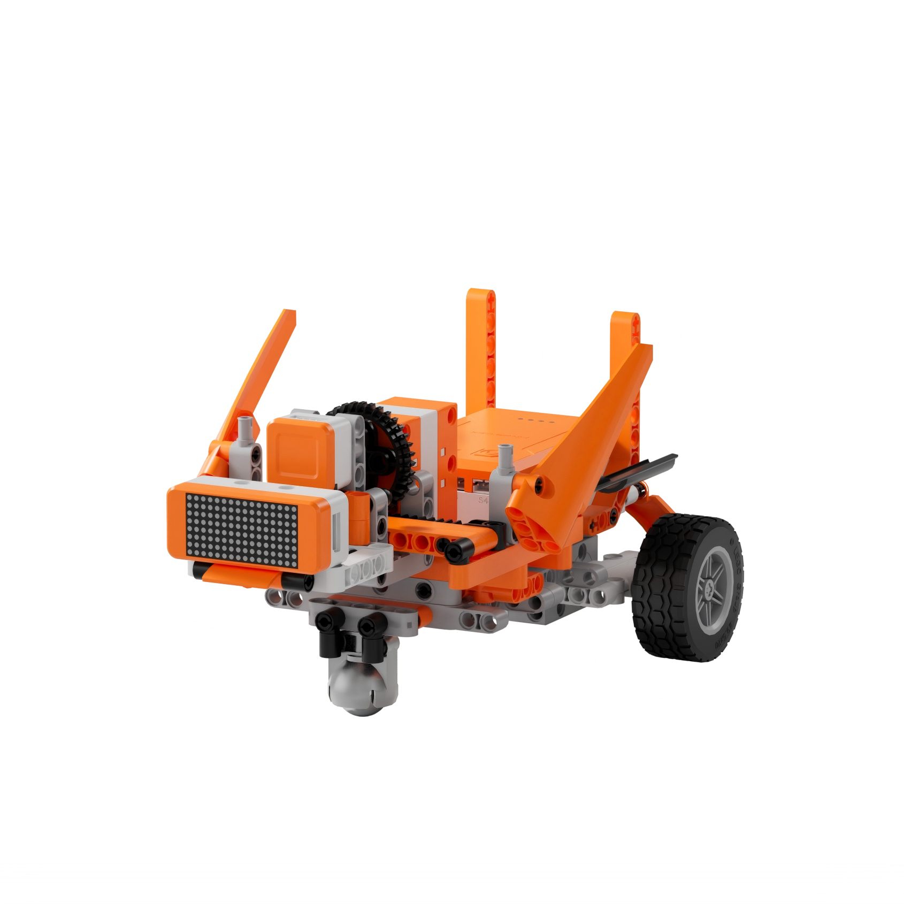
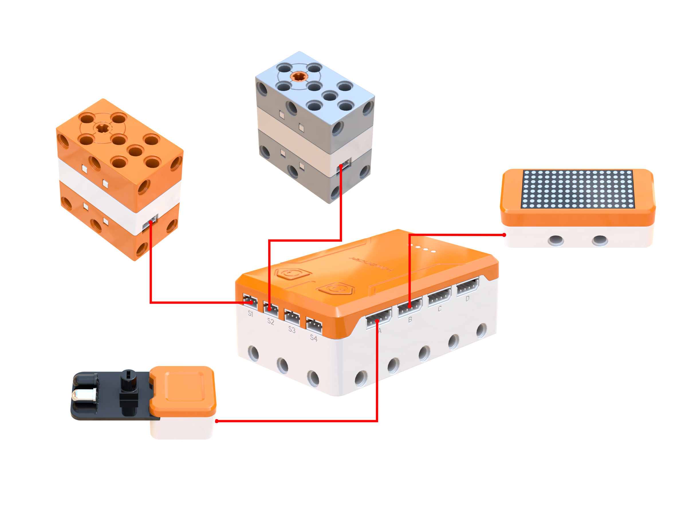
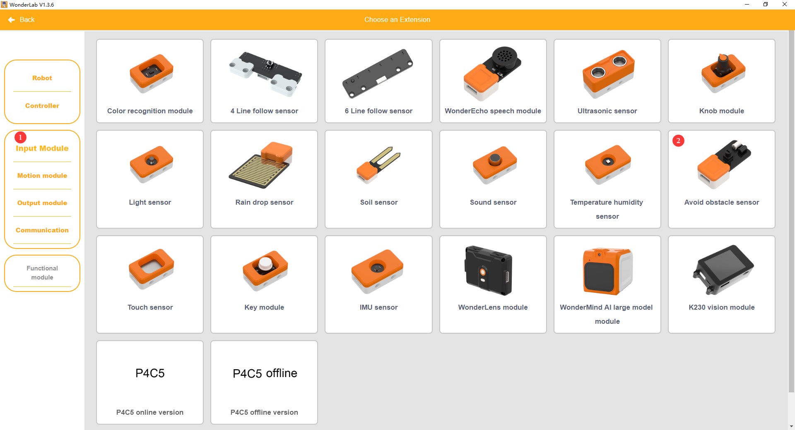
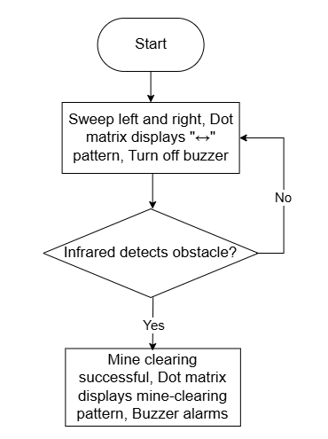
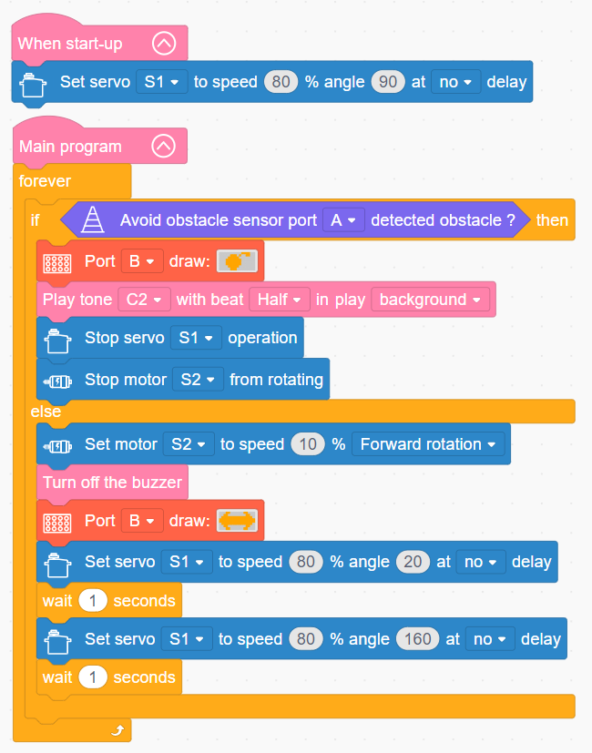

# 3.41 Minesweeper Car

## 3.41.1 Lesson Introduction

Centering on a smart minesweeper car model, this lesson explores collaborative programming among a servo, an obstacle avoidance sensor, and audiovisual modules. It achieves an automated hazard-clearing routine that scans while advancing, halting and raising alarms upon detecting targets. The project illustrates swinging-arm sweep detection mechanics and infrared target identification methods. It applies multi-device coordinated alert logic to provide synchronized warnings. Furthermore, it examines robotic detection principles combining mobile platforms with dynamic scanning mechanisms.

## 3.41.2 Learning Objectives

1. **Knowledge Objectives**: Understand the mechanical principles of sweeping-arm oscillation to expand detection coverage. Master target identification methods using the infrared obstacle avoidance sensor. Recognize multi-sensory alert designs that link dot matrix graphic displays with buzzer tones. Understand the engineering value of hazard-detection vehicles.

2. **Skill Objectives**: Assemble the mechanical structure of the minesweeper car independently, mastering servo calibration and sweep-arm alignment during installation. Program the servo to drive the sweep arm back and forth. Implement a complete functional workflow combining forward scanning, target-triggered stopping, dot matrix warning patterns, and buzzer audio alerts.

3. **Thinking Objectives**: Establish detection thinking based on dynamic sweeping to broaden sensory coverage, understanding how motion mechanisms enhance sensor capabilities. Foster design awareness for multi-sensory coordinated warning systems. Reinforce closed-loop control thinking spanning detection, decision-making, and execution.

4. **Application Objectives**: Connect concepts to practical applications including humanitarian demining robots, security screening scanners, infrared alarm systems, and industrial flaw detectors. Recognize the critical role of specialized engineering vehicles in hazardous environments. Inspire interest in field robotics, security inspection technology, and hazardous-duty equipment.

## 3.41.3 Preparation

### (1) Hardware Preparation

- AiBlock controller

- 180° block servo

- 360° block motor

- Infrared obstacle avoidance sensor

- Dot matrix module

- Building block parts pack

- Type-C data cable

- Assembly manual

- Black circular stickers for simulating hazard markers

- Computer

### (2) Software Preparation

- WonderLab graphical programming platform

## 3.41.4 Hands-On Project

### (1) Project Analysis

The core project of this lesson is the Minesweeper Car, executing a complete operational workflow that scans while driving forward and triggers immediate alarms upon detecting targets. The system employs a three-tier architecture combining oscillating sweeps, target identification, and audiovisual alerts. A rear-wheel motor drives low-speed forward movement while a servo swings the detection arm reciprocally between 20° and 160°, significantly expanding detection coverage. The infrared obstacle avoidance sensor identifies black target stickers. Under clear conditions, the vehicle continues sweeping and advancing. Upon detecting a target, the vehicle halts immediately, locks its position, switches the dot matrix display to a warning graphic, and sounds a low-pitch buzzer alert, providing synchronized audiovisual warnings of hazard presence.

### (2) Assembly Guide

<Pdf src="../../_static/shared/pdf/chapter_3/41.pdf" />

### (3) Hardware Wiring

- Connect the 180° block servo to port **S1** of the controller using a 3-pin servo cable.

- Connect the 360° block motor to port **S2** of the controller using a 3-pin servo cable.

- Connect the Infrared obstacle avoidance sensor to port **A** of the controller using a 4-pin module cable.

- Connect the dot matrix module to port **B** of the controller using a 4-pin module cable.

### (4) Adding Extensions

- Select **Avoid obstacle sensor** under the **Input Module** category.

- Select **180° servo** and **360° Motor** under the **Motion module** category.

- Select **Dot matrix module** under the **Output module** category.

### (5) Core Blocks

| Block | Category | Description |
| :---: | :---: | :--- |
|  |  | Serve as the main program loop container, continuously executing internal code after power-on initialization. |
|  |  | Execute only once after startup to initialize hardware configurations and system parameters. |
|  |  | Drive the buzzer to play musical notes of designated pitches and beats in the background without blocking subsequent code execution. |
|  |  | Stop buzzer output immediately, terminating the currently playing tone. |
|  |  | Read the detection status of the obstacle avoidance sensor at the designated port, returning a Boolean value to determine whether an obstacle is detected ahead. |
|  |  | Drive the 360° block motor at a designated port to rotate continuously at a customized speed in the forward or reverse direction. |
|  |  | Stop power output to the 360° block motor at the designated port, immediately halting motor rotation. |
|  |  | Control the 180° block servo at the designated port to rotate for a specified duration at a customized speed. In non-blocking mode, the program proceeds immediately to subsequent blocks without waiting for motion completion. |
|  |  | Cut off power output to the 180° block servo at the designated port, halting servo movement immediately. |
|  |  | Control the dot matrix module at the designated port to load and display preset graphic patterns. |

### (6) Program Description and Upload

- Program Schematic

- Complete Program

  When the Infrared obstacle avoidance sensor detects an obstacle, the buzzer sounds, and the dot matrix module displays the target-detected pattern. Otherwise, the minesweeper car continues reciprocal scanning, and the dot matrix module displays the lateral scanning pattern.

- Program Upload

  Following the animation, click **Connect device**, select the serial port, then click the upload button to complete the program transfer and test the execution results.

> [!NOTE]
>
> **The source files are available for download under [Program Files](https://drive.google.com/drive/folders/1adJTOnyve2MmEehrB9YFSW8echTWwoF2?usp=sharing).**

## 3.41.5 Expansion and Challenge

**Project 1: Marker-Equipped Detection Logging Vehicle**

Program a servo-driven marking pen to press downward upon detecting a target, pausing for several seconds to mark the location before resuming forward motion. Practice marker mechanism control and sequential motion choreography while understanding the operational workflow of detection, localization, and marking. Extend discussions to industrial defect labeling, agricultural weeding robots, and humanitarian clearing operations.

**Project 2: Dual-Sensor Array Detection Vehicle**

Install two infrared sensors side-by-side where triggering either sensor registers target acquisition, doubling scanning throughput when combined with sweep-arm oscillation. Practice multi-sensor OR-logic evaluation and understand how redundant engineering designs enhance operational reliability. Extend discussions to metal detector arrays, multi-probe security walkthrough gates, and multi-sensor industrial flaw detection.

## 3.41.6 Q&A

**Question 1: Why does the minesweeper car oscillate its sensor continuously, rather than keeping it fixed facing forward?**

Answer: Oscillating the sensor serves to **expand detection coverage and ensure thorough inspection without missed targets**. If an infrared sensor is fixed facing straight forward, it only inspects a narrow line directly along the vehicle heading. Any target slightly offset from center goes undetected, functioning like poking a needle into the ground with minimal coverage. Swings from the robotic sweep arm trace a broad fan-shaped detection swath across the terrain. This expanded width allows a single forward pass to inspect a substantially broader path, delivering higher scanning efficiency while preventing undetected gaps. This mechanism parallels robotic vacuum side brushes and manual brooms sweeping back and forth, converting localized point measurements into comprehensive area coverage through continuous motion. Real-world clearance vehicles and handheld metal detectors operate similarly, sweeping search heads from side to side to guarantee that every patch of ground is examined. Utilizing mechanical motion to compensate for limited sensor coverage is a classic design strategy in robotics engineering.

**Question 2: How does the infrared obstacle avoidance sensor recognize targets, and does it visually see the black sticker?**

Answer: The infrared sensor identifies targets based on **differences in infrared reflection intensity** rather than optical vision. The sensor emits invisible infrared light toward the surface. When light reflects off an object, the receiver measures the intensity of the returning signal. Light-colored ground surfaces reflect light strongly, returning a high-intensity signal. Black target stickers absorb light, returning a significantly weakened reflection. Internal comparator circuitry evaluates this reflection intensity. Strong reflection indicates clear ground with no obstacle, whereas a sudden drop in reflected light signals a dark target, registering target detection. The sensor does not visually identify shapes with a camera lens. Instead, it distinguishes color variations through differential optical reflectance. Consequently, the sensor distinguishes objects only when significant reflectance contrasts exist between the target and the background surface, and cannot identify objects that match ground reflectance properties. Real-world explosive detection systems employ fundamentally different technologies, including electromagnetic induction, ground-penetrating radar, and X-ray imaging, which are far more complex. Nonetheless, the foundational engineering concept of utilizing sensory contrast to detect targets remains identical.

## 3.41.7 Technical Support and Product Discussion

Submit questions or share project modifications in the community forum:

