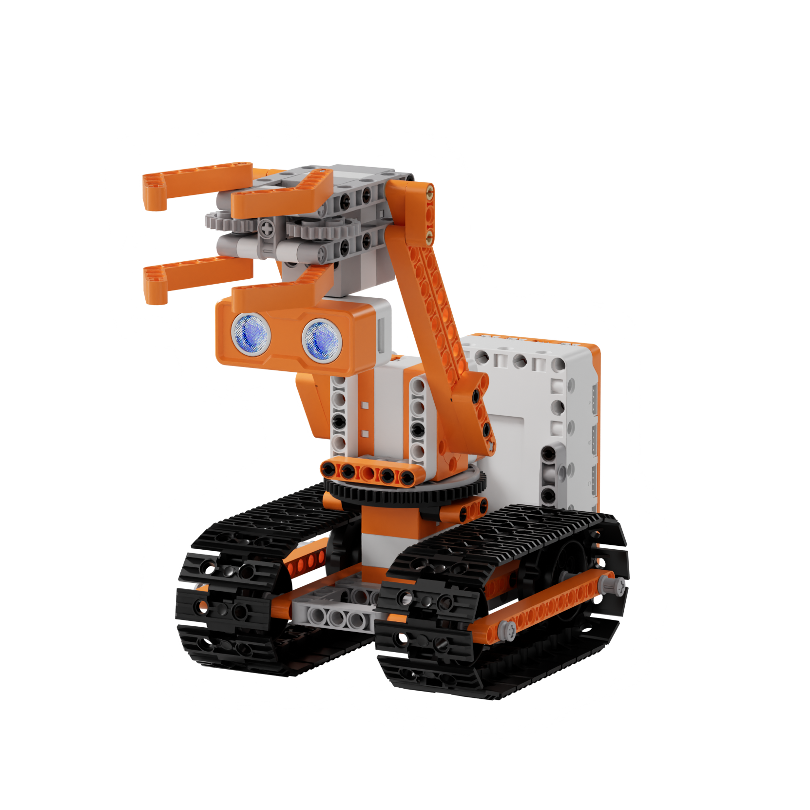
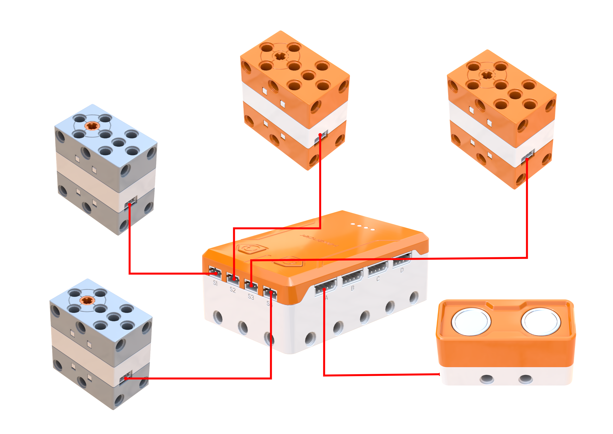
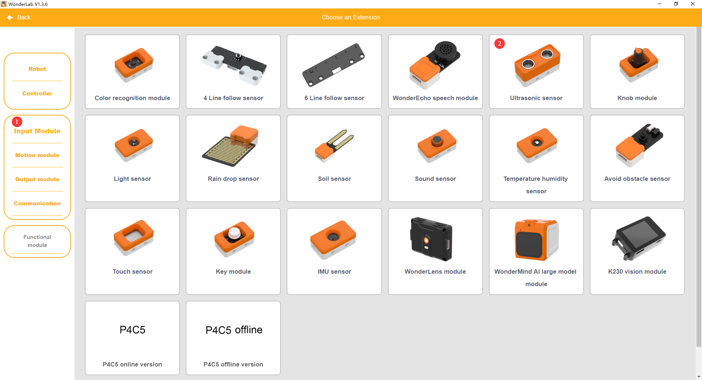
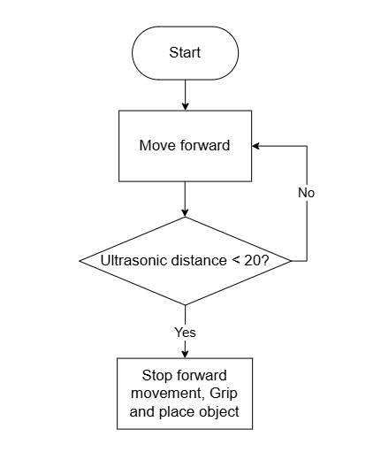
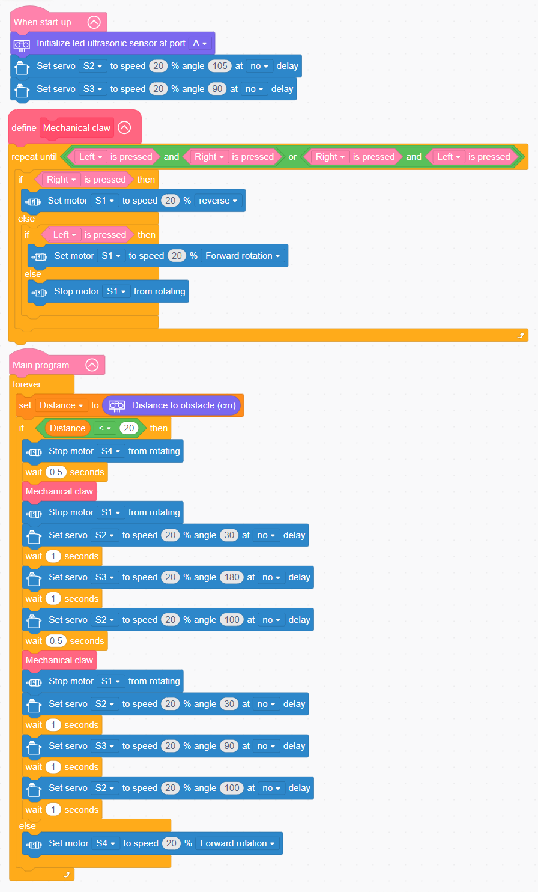

# 3.44 Tank Robotic Arm

## 3.44.1 Lesson Introduction

Focusing on a multi-functional robotic arm platform, this lesson explores coordinated programming among a tracked chassis, dual servos, and an ultrasonic sensor. It implements an automated material handling workflow featuring autonomous locomotion, object detection stopping, and robotic arm pick-and-place manipulation. The content illustrates multi-degree-of-freedom kinematics in robotic arms alongside worm gear transmission mechanics. It covers sequential timing choreography and multi-mechanism coordination logic. Furthermore, it examines core engineering design concepts behind multi-functional collaborative operations in industrial robotics.

## 3.44.2 Learning Objectives

1. **Knowledge Objectives**: Understand multi-degree-of-freedom kinematics achieved through dual-servo coordination. Master worm gear mechanical properties, including speed reduction, torque multiplication, and self-locking characteristics. Recognize tracked chassis drive methods and terrain adaptability. Understand linked control logic for ultrasonic-triggered automated grasping.

2. **Skill Objectives**: Assemble the mechanical structure of the tank robotic arm independently, mastering zero-point calibration during dual-servo installation. Construct gripper open-and-close control routines and encapsulate them into custom functions. Implement a complete sequential handling workflow combining ultrasonic detection stopping, grasping, lifting, rotating, and releasing.

3. **Thinking Objectives**: Build mechanical system thinking centered on multi-degree-of-freedom coordination, and understand sequential timing choreography among multiple actuators. Cultivate algorithmic workflow thinking for motion sequence planning. Reinforce engineering methodologies of decomposing complex systems into manageable sequential stages.

4. **Application Objectives**: Connect concepts to practical applications including articulated industrial robots, assembly line manipulators, overhead cranes, and hydraulic excavators. Appreciate the critical value of industrial robotics in automated manufacturing. Inspire exploration into robotics engineering, industrial automation, and mechanical transmission design.

## 3.44.3 Preparation

### (1) Hardware Preparation

- AiBlock controller

- 360° block motor

- 180° block servo

- Ultrasonic sensor

- Building block parts pack

- Type-C data cable

- Assembly manual

- Small building block object for grasping

- Computer

### (2) Software Preparation

- WonderLab graphical programming platform

## 3.44.4 Hands-On Project

### (1) Project Analysis

The core project of this lesson is the Tank Robotic Arm, delivering a complete industrial handling sequence that autonomously approaches, detects, and sequentially manipulates targets. The system employs an architecture combining tracked mobility, ultrasonic detection, and multi-mechanism sequential execution. The tracked chassis motor drives the robot forward until the ultrasonic sensor measures a clearance of less than 20 cm, triggering a complete stop. Four actuation units work in coordination: motor S1 drives a worm gear to actuate the gripper, servo S2 controls arm pitch, servo S3 manages base rotation, and motor S4 powers tracked locomotion. The control routine executes a precise motion sequence: lower to position, close gripper, lift cargo, rotate base, lower to deposit, and reset. Once material transfer completes, the robot resumes forward travel, modeling the operational workflow of automated industrial manipulators.

### (2) Assembly Guide

<Pdf src="../../_static/shared/pdf/chapter_3/44.pdf" />

### (3) Hardware Wiring

- Connect the gripper-drive 360° block motor to port **S1** of the controller using a 3-pin servo cable.

- Connect the arm-pitch 180° block servo to port **S2** of the controller using a 3-pin servo cable.

- Connect the base-rotation 180° block servo to port **S3** of the controller using a 3-pin servo cable.

- Connect the tracked-chassis 360° block motor to port **S4** of the controller using a 3-pin servo cable.

- Connect the ultrasonic sensor to port **A** of the controller using a 4-pin module cable.

### (4) Adding Extensions

- Select **Ultrasonic sensor** under the **Input Module** category.

- Select **180° servo** and **360° Motor** under the **Motion module** category.

### (5) Core Blocks

| Block | Category | Description |
| :---: | :---: | :--- |
|  |  | Create a custom function without parameters to encapsulate reusable program logic. |
|  |  | Call a defined parameterless function to execute all encapsulated program statements. |
|  |  | Serve as the main program loop container, continuously executing internal code after power-on initialization. |
|  |  | Execute only once after startup to initialize hardware configurations and system parameters. |
|  |  | Detect the real-time electrical state of a specified button, returning a Boolean value to determine whether the button is pressed. |
|  |  | Initialize the hardware connection port for the ultrasonic sensor. |
|  |  | Retrieve obstacle distance data measured by the ultrasonic sensor in centimeters (cm). |
|  |  | Drive the 360° block motor at a designated port to rotate continuously at a customized speed in the forward or reverse direction. |
|  |  | Stop power output to the 360° block motor at the designated port, immediately halting motor rotation. |
|  |  | Control the 180° block servo at the designated port to rotate for a specified duration at a customized speed. In non-blocking mode, the program proceeds immediately to subsequent blocks without waiting for motion completion. |

### (6) Program Description and Upload

- Program Schematic

- Complete Program

  Upon startup, the program initializes the hardware port for the ultrasonic sensor. Next, it defines a custom function to control the gripper. When Button B on the right is pressed, motor S1 reverses at 20% speed to close the gripper. When Button A on the left is pressed, motor S1 rotates forward at 20% speed to open the gripper. When neither button is pressed, motor S1 halts, repeating until both buttons are pressed simultaneously to exit the subroutine. After powering on, the tank robotic arm advances continuously until an obstacle is detected within 20 cm, prompting a complete stop. Holding the right button closes the gripper around the target. Once the object is securely clamped, pressing both buttons simultaneously initiates the arm sequence: lifting, rotating, and lowering. Pressing the left button then opens the gripper to deposit the item.

- Program Upload

  Following the animation, click **Connect device**, select the serial port, then click the upload button to complete the program transfer and test the execution results.

> [!NOTE]
>
> **The source files are available for download under [Program Files](https://drive.google.com/drive/folders/1adJTOnyve2MmEehrB9YFSW8echTWwoF2?usp=sharing).**

## 3.44.5 Expansion and Challenge

**Project 1: Fully Autonomous Unmanned Manipulation Arm**

Calibrate gripper travel duration using worm gear rotation times, applying an open-loop delay of 0.8 s to stop the motor automatically upon closing rather than relying on manual button presses. Practice timing calibration and open-loop control while appreciating mechanical self-locking reliability. Extend discussions to unmanned industrial articulated arms and automated assembly line robots.

**Project 2: Multi-Target Continuous Transfer Robotic Arm**

Utilize an integer variable to log completed transfer cycles, programming the tracked base to reverse to its starting point after each deposit to locate the next target. Practice position recovery and multi-cycle execution logic while understanding batch workflow management. Extend discussions to warehouse automated guided vehicles, logistics sorting systems, and flexible manufacturing cells.

## 3.44.6 Q&A

**Question 1: Why does the robotic arm require two servos rather than one, and what specific role does each servo perform?**

Answer: The two servos control **two distinct directional degrees of freedom**, both of which are essential for material handling. Servo S2 governs arm pitch, raising and lowering the arm vertically like an elbow joint bending and extending to adjust cargo elevation. Servo S3 governs base rotation, pivoting the entire arm horizontally like a waist turning from side to side to transfer cargo between pickup and drop-off coordinates. A system with only pitch motion can only move vertically in place. A system with only rotational motion can change headings but cannot elevate cargo. Coordinating both degrees of freedom enables the manipulator to access multiple spatial points, reaching forward to grasp an object and turning laterally to deposit it. Industrial articulated robots often feature six or seven degrees of freedom, which are vastly more complex. However, the underlying principle remains identical: each actuator manages an individual joint axis, and coordinated multi-joint motion allows the end effector to reach any spatial position and orientation. Increasing degrees of freedom enhances dexterity, but also increases kinematic control complexity.

**Question 2: Why does the gripper utilize a worm gear mechanism rather than direct servo actuation?**

Answer: A worm gear mechanism delivers two critical engineering advantages over direct servo drives. The first advantage is **speed reduction and torque multiplication**. Because the worm must make numerous revolutions to turn the worm gear a single rotation, output speed decreases while mechanical torque multiplies substantially. This mechanical advantage allows a compact motor to exert strong clamping forces capable of securing heavy objects. The second advantage is **reverse self-locking**. Motion transmits exclusively from the worm screw to the worm gear. External forces applied to the worm gear cannot backdrive the worm screw. Once the gripper clamps an object, it remains tightly locked even if motor power is completely cut off, preventing cargo from slipping loose. Direct servo actuation generates relatively low holding torque, and unpowered servos can be backdriven by external loads, risking accidental drops. Self-locking is essential across heavy engineering applications such as overhead hoists and screw jacks to guarantee load stability without continuous power consumption. Integrating a worm gear mechanism ensures that the gripper maintains powerful, secure clamping.

## 3.44.7 Technical Support and Product Discussion

Submit questions or share project modifications in the community forum:

