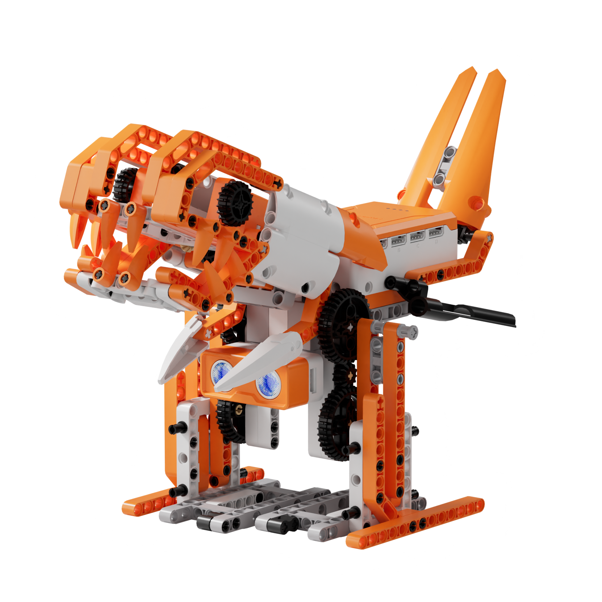
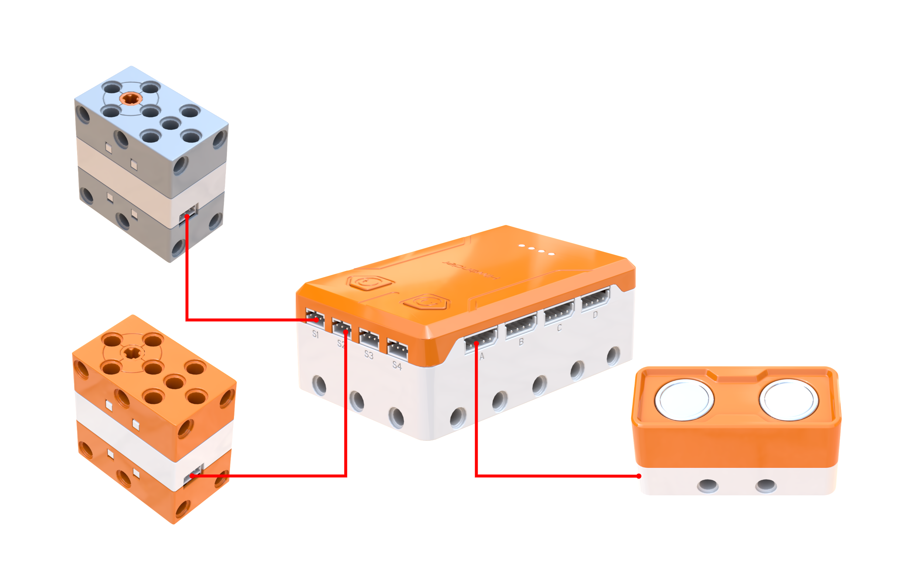
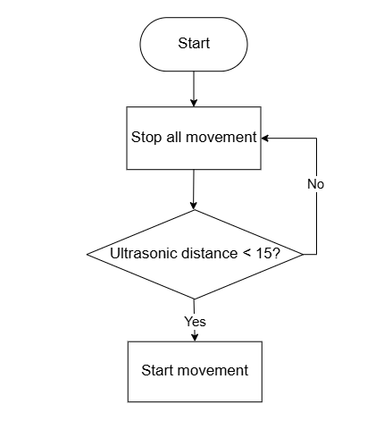
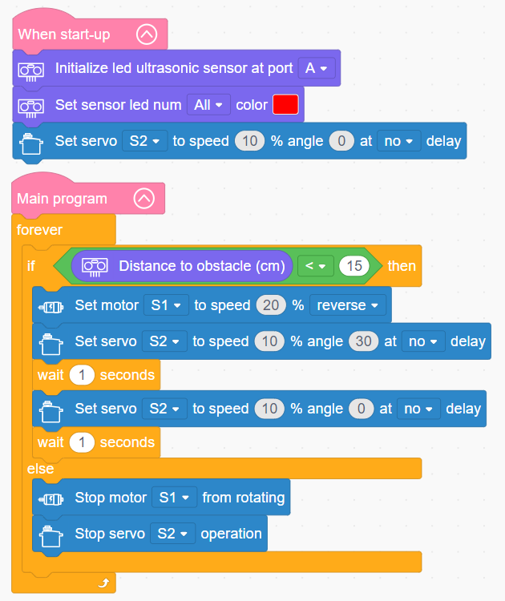

# 3.45 Mecha Dinosaur

## 3.45.1 Lesson Introduction

Focusing on a bionic mecha dinosaur robot, this lesson explores coordinated programming among a motor, a servo, and an ultrasonic sensor. It achieves a biomimetic routine that detects obstacles, advances automatically, and opens its jaws. The content illustrates bipedal walking mechanics alongside dual-actuator synchronized control. It reinforces distance threshold triggering logic. Furthermore, it examines core robotics concepts of integrating sensory modules to enable autonomous behavioral decisions.

## 3.45.2 Learning Objectives

1. **Knowledge Objectives**: Understand dynamic balance principles in bipedal locomotion, recognizing pendulum-style alternating step mechanisms. Master single-motor power distribution transmissions that drive dual legs. Consolidate ultrasonic distance measurement and threshold triggering control logic.

2. **Skill Objectives**: Assemble the mechanical structure of the bipedal dinosaur independently, mastering servo zero-point calibration during installation. Construct synchronized control routines coordinating motor rotation with servo oscillation. Implement an integrated routine where ultrasonic obstacle detection triggers autonomous walking and jaw actuation.

3. **Thinking Objectives**: Build system thinking centered on multi-actuator synchronized control, and understand coordinated multi-channel output programming. Cultivate engineering design awareness for dynamic physical balance. Reinforce intelligent control methodologies where sensory perception triggers automated behavioral responses.

4. **Application Objectives**: Connect concepts to practical applications including bipedal walkers, humanoid robots, and autonomous obstacle-avoidance systems. Appreciate the value of biomimetic robotics across educational, entertainment, and industrial sectors. Inspire interdisciplinary interest spanning paleontology, biomechanics, and robotics technology.

## 3.45.3 Preparation

### (1) Hardware Preparation

- AiBlock controller

- 360° block motor

- 180° block servo

- Ultrasonic sensor

- Building block parts pack

- Type-C data cable

- Assembly manual

- Computer

### (2) Software Preparation

- WonderLab graphical programming platform

## 3.45.4 Hands-On Project

### (1) Project Analysis

The core project of this lesson is the Mecha Dinosaur, achieving a biomimetic predation behavior where target detection triggers synchronized walking and jaw actuation. The system adopts an architecture combining ultrasonic perception with dual-actuator coordinated response. The ultrasonic sensor continuously scans ahead, triggering active behavior when obstacle distance drops below 15 cm. The actuation layer manages two outputs: a motor drives dual legs through a split gear train to execute alternating steps using dynamic balance, while a servo cycles jaw angles between 0° and 30° to simulate opening and closing. Both outputs start and halt concurrently to maintain synchronized behavior. Built-in RGB LEDs on the ultrasonic sensor illuminate red as an alert indicator, enhancing visual feedback and simulating an active predatory response.

### (2) Assembly Guide

<Pdf src="../../_static/shared/pdf/chapter_3/45.pdf" />

### (3) Hardware Wiring

- Connect the 360° block motor to port **S1** of the controller using a 3-pin servo cable.

- Connect the 180° block servo to port **S2** of the controller using a 3-pin servo cable.

- Connect the ultrasonic sensor to port **A** of the controller using a 4-pin module cable.

### (4) Adding Extensions

- Select **Ultrasonic sensor** under the **Input Module** category.

- Select **180° servo** and **360° Motor** under the **Motion module** category.

### (5) Core Blocks

| Block | Category | Description |
| :---: | :---: | :--- |
|  |  | Serve as the main program loop container, continuously executing internal code after power-on initialization. |
|  |  | Execute only once after startup to initialize hardware configurations and system parameters. |
|  |  | Initialize the hardware connection port for the ultrasonic sensor. |
|  |  | Retrieve obstacle distance data measured by the ultrasonic sensor in centimeters (cm). |
|  |  | Control onboard RGB lights of the ultrasonic module to illuminate in preset colors, with options to control 1, 2, or all LEDs. |
|  |  | Drive the 360° block motor at a designated port to rotate continuously at a customized speed in the forward or reverse direction. |
|  |  | Stop power output to the 360° block motor at the designated port, immediately halting motor rotation. |
|  |  | Control the 180° block servo at the designated port to rotate for a specified duration at a customized speed. In non-blocking mode, the program proceeds immediately to subsequent blocks without waiting for motion completion. |

### (6) Program Description and Upload

- Program Schematic

- Complete Program

  Upon startup, the program initializes the hardware port for the ultrasonic sensor and sets its onboard RGB lights to red. The main loop continuously checks whether an obstacle is detected within 15 cm. When an obstacle is detected, motor S1 reverses at 20% speed to drive forward locomotion while servo S2 cycles periodically between opening and closing the jaws. When no obstacle is detected, both the motor and servo stop operating.

- Program Upload

  Following the animation, click **Connect device**, select the serial port, then click the upload button to complete the program transfer and test the execution results.

> [!NOTE]
>
> **The source files are available for download under [Program Files](https://drive.google.com/drive/folders/1adJTOnyve2MmEehrB9YFSW8echTWwoF2?usp=sharing).**

## 3.45.5 Expansion and Challenge

**Project 1: Multi-Tier Status Indicator System**

Illuminate green LEDs during standby to indicate a clear environment, switch to solid red when distance drops below 15 cm, and flash red rapidly when obstacles are within 5 cm. Program locomotion speed and jaw cycling frequency to increase proportionally as obstacle distance decreases. Practice multi-tier threshold evaluation and multi-state synchronized outputs while exploring tiered response control strategies. Extend discussions to traffic signal management, industrial status towers, and human-robot interaction indicators.

**Project 2: Interactive Motion-Expressive Dinosaur**

Incorporate a third servo to control tail sway, triggering synchronized locomotion, jaw biting, tail wagging, and buzzer sound effects upon obstacle detection. Practice multi-servo coordination and multi-actuator synchronization while understanding coordinated programming architectures. Extend discussions to multi-joint coordination in humanoid robotics and expressive animatronics in entertainment robotics.

## 3.45.6 Q&A

**Question 1: Why does the mecha dinosaur remain upright on only two legs without falling, and what is the principle of bipedal walking balance?**

Answer: Bipedal locomotion relies on **dynamic balance**, operating similarly to an inverted pendulum. While walking, the two legs function alternately: one leg contacts the ground as a supporting pillar bearing total body weight, while the opposite leg swings forward like a pendulum to prepare for the subsequent footfall. Because leg alternation occurs in rapid succession, the center of mass continuously shifts above the shifting support polygon without tipping over. The mecha dinosaur in this lesson also features broad footpads and a low center of gravity, which further enhances structural stability. Real humans, birds, and theropod dinosaurs walk using this exact mechanism, maintaining dynamic equilibrium through continuous stepping rather than static positioning. Advanced bipedal robots incorporate internal gyroscope sensors and high-frequency algorithms to adjust center-of-mass positioning continuously. The dinosaur in this lesson achieves this behavior through a simplified, mechanically coupled bipedal linkage.

**Question 2: Why does the model employ a servo for jaw actuation but a standard motor for leg locomotion, and what are their respective characteristics?**

Answer: The two mechanisms require fundamentally different motion control profiles. **Jaw movement** demands precise angular positioning. Opening angles, closing limits, and static holding positions must be strictly controlled, which directly matches the closed-loop positional capabilities of servos. **Leg locomotion** requires continuous, uninterrupted rotational torque. Driving the leg linkage through gears requires ongoing rotation where velocity and direction matter rather than holding a specific angle, making a continuous-rotation 360° block motor the appropriate selection. In summary, applications demanding precise angular positioning rely on servos, whereas tasks requiring continuous mechanical propulsion utilize standard motors. Complex robotic systems routinely deploy diverse actuator types matched to specific kinematic needs, utilizing servos for articulated joints, standard motors for wheeled drive chassis, and high-speed motors for cooling fans.

## 3.45.7 Technical Support and Product Discussion

Submit questions or share project modifications in the community forum:

