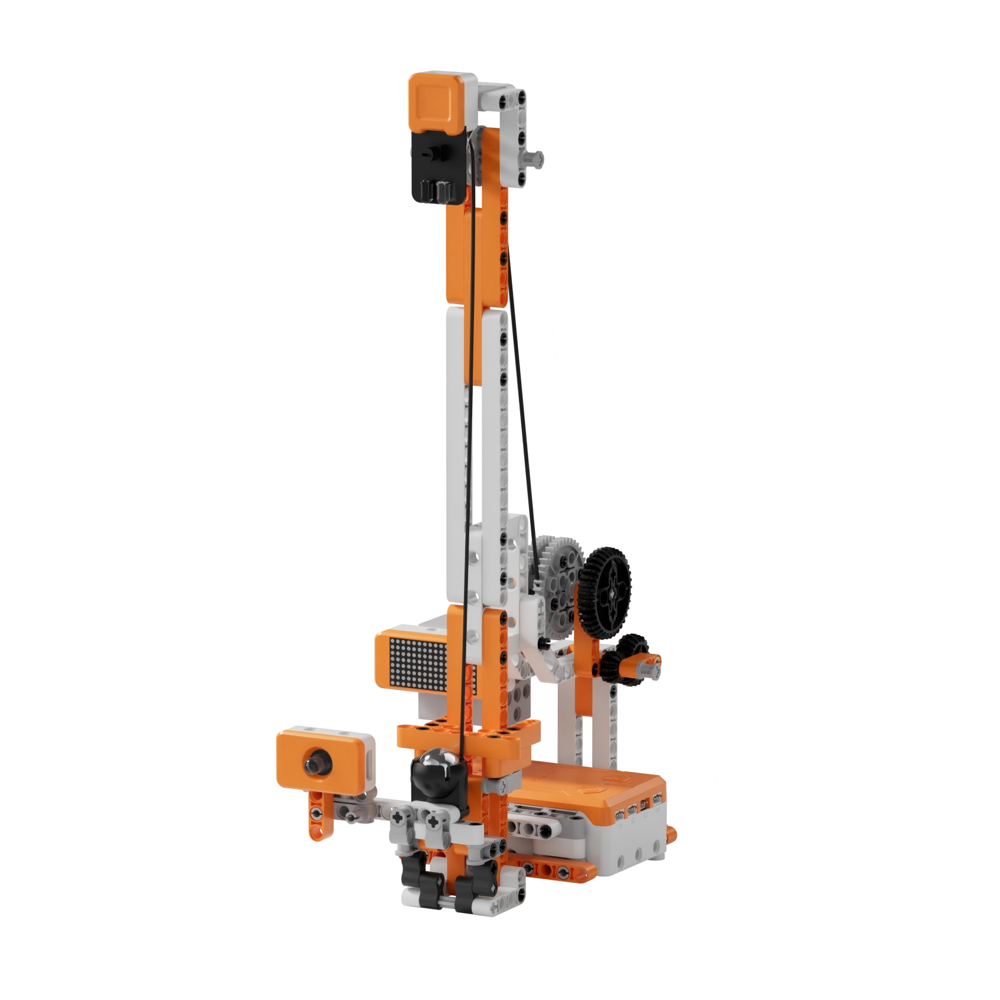
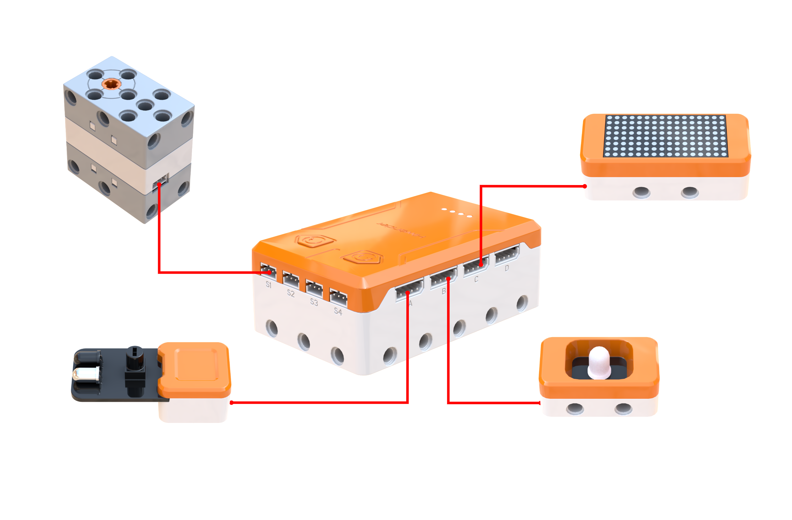
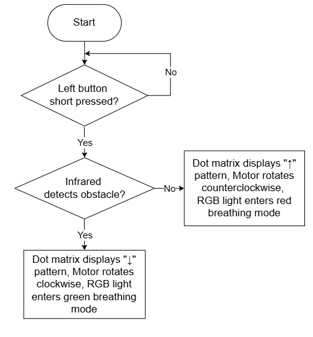
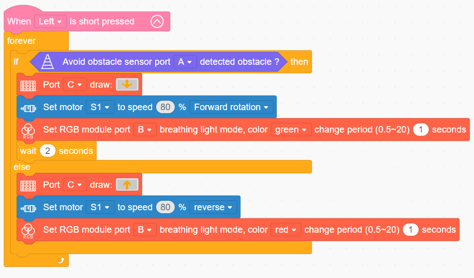

# 3.48 Zero-Gravity Drop Tower

## 3.48.1 Lesson Introduction

Focusing on a smart drop tower model, this lesson explores coordinated programming among a motor, an infrared sensor, and lighting modules. It implements an automated amusement ride routine featuring vertical hoisting, peak-triggered descent, continuous cyclic operation, and synchronized lighting cues. The content illustrates fixed pulley transmission principles and bidirectional motor rotation control methods. It applies non-contact infrared triggering logic. Furthermore, it examines core design principles of human-robot interaction in automated amusement park attractions.

## 3.48.2 Learning Objectives

1. **Knowledge Objectives**: Understand linear hoisting mechanics in fixed pulley guide-rail structures, redirecting applied force without altering mechanical advantage. Master non-contact triggering principles using the infrared obstacle avoidance sensor. Understand control logic mapping forward and reverse motor rotation to vertical ascent and descent. Explore interactive design concepts using RGB colors and dot matrix graphics as real-time status indicators.

2. **Skill Objectives**: Assemble the guide rail and fixed pulley mechanisms of the zero-gravity drop tower independently, mastering suspension cable rigging techniques. Construct basic motor control routines to manage bidirectional elevation. Implement a fully automated cyclic routine integrating infrared peak detection, automatic free-fall descent, red and green status lighting, and directional arrow graphics.

3. **Thinking Objectives**: Build automation thinking centered on non-contact detection and automated triggering, and appreciate the value of sensor-based autonomous control. Cultivate feedback-oriented interaction design thinking, learning to communicate operational states through colors and iconography. Reinforce programming logic for closed-loop, continuous cyclic automation.

4. **Application Objectives**: Connect concepts to practical applications including amusement drop towers, passenger elevators, automated sliding doors, and sensor-activated faucets. Understand widespread implementations of non-contact proximity sensing in smart appliances. Inspire exploration into amusement ride engineering, vertical transportation technology, and intelligent sensory systems.

## 3.48.3 Preparation

### (1) Hardware Preparation

- AiBlock controller

- 360° block motor

- Infrared obstacle avoidance sensor

- RGB light module

- Dot matrix module

- Building block parts pack

- Type-C data cable

- Assembly manual

- Computer

### (2) Software Preparation

- WonderLab graphical programming platform

## 3.48.4 Hands-On Project

### (1) Project Analysis

The core project of this lesson is the Zero-Gravity Drop Tower, achieving a fully automated operational cycle featuring automated hoisting, peak-triggered free fall, and synchronized audiovisual feedback. The system employs an architecture combining fixed pulley linear hoisting, infrared non-contact triggering, and real-time sensory feedback. A motor drives the passenger gondola vertically along the guide rail via a suspension cable, rotating in reverse to ascend and forward to descend. An infrared obstacle avoidance sensor mounted at the top detects gondola arrival without physical contact, triggering an automated directional reversal. During ascent, an RGB red breathing light pairs with an upward arrow display. During descent, a green light pairs with a downward arrow, providing dual visual confirmation of operating status. Triggering Button A initiates continuous cyclic execution across ascending, peak sensing, dropping, and re-ascending, authentically reproducing the thrill of a commercial amusement drop tower.

### (2) Assembly Guide

<Pdf src="../../_static/shared/pdf/chapter_3/48.pdf" />

### (3) Hardware Wiring

- Connect the 360° block motor to port **S1** of the controller using a 3-pin servo cable.

- Connect the Infrared obstacle avoidance sensor to port **A** of the controller using a 4-pin module cable.

- Connect the RGB light module to port **B** of the controller using a 4-pin module cable.

- Connect the dot matrix module to port **C** of the controller using a 4-pin module cable.

### (4) Adding Extensions

- Select **Avoid obstacle sensor** under the **Input Module** category.

- Select **360° Motor** under the **Motion module** category.

- Select **Dot matrix module** and **RGB module** under the **Output module** category.

### (5) Core Blocks

| Block | Category | Description |
| :---: | :---: | :--- |
|  |  | Serve as an event listener block that executes nested program statements when a designated button action is detected. |
|  |  | Read the detection status of the Infrared obstacle avoidance sensor at the designated port, returning a Boolean value to determine whether an obstacle is detected ahead. |
|  |  | Drive the 360° block motor at a designated port to rotate continuously at a customized speed in the forward or reverse direction. |
|  |  | Control the dot matrix module at the designated port to load and display preset graphic patterns. |
|  |  | Control the RGB light module at the designated port to activate a breathing color cycle, with customizable transition periods. |

### (6) Program Description and Upload

- Program Schematic

- Complete Program

  When Button A on the left is pressed, the main routine begins execution. If the Infrared obstacle avoidance sensor detects the gondola at the top, the dot matrix module displays a downward arrow, motor S1 rotates forward at 80% speed to drop the gondola, and the RGB light module pulses with a green breathing effect for 2 s. Otherwise, the dot matrix module displays an upward arrow, motor S1 rotates in reverse at 80% speed to hoist the gondola upward, and the RGB light module emits a red breathing effect with a 1 s period.

- Program Upload

  Following the animation, click **Connect device**, select the serial port, then click the upload button to complete the program transfer and test the execution results.

> [!NOTE]
>
> **The source files are available for download under [Program Files](https://drive.google.com/drive/folders/1adJTOnyve2MmEehrB9YFSW8echTWwoF2?usp=sharing).**

## 3.48.5 Expansion and Challenge

**Project 1: Cushion-Braking Drop Tower**

Install a secondary infrared sensor near the base of the tower. When the sensor detects the descending gondola approaching the bottom, the motor automatically throttles down from 80% to 20% speed for a gentle landing, simulating progressive cushion braking. Practice multi-sensor segmented control and gradual velocity transitions while understanding deceleration safety mechanisms. Extend discussions to elevator floor leveling, roller coaster magnetic brakes, and industrial crane hoist safety systems.

**Project 2: Multi-Stage Variable Velocity Drop Tower**

Ascend at a steady 50% velocity, drop rapidly at 80% speed from the summit to simulate free-fall weightlessness, and decelerate midway down to cushion the landing. Practice multi-stage velocity sequencing and experiential pacing design. Extend discussions to velocity profiling in roller coaster drops and the physiological sensation of weightlessness.

## 3.48.6 Q&A

**Question 1: What is non-contact triggering, and how does the infrared sensor detect an approaching object without physical contact?**

Answer: Non-contact triggering refers to **detecting the presence of an object across a distance without physical touch**. The infrared sensor emits an invisible beam of infrared light. When this light strikes an approaching object, it reflects back toward the sensor receiver. Detecting this reflected signal informs the system that an object has arrived in front of the probe. Because the interaction occurs entirely across the air gap without mechanical collision, it is designated as non-contact detection. This approach provides significant engineering advantages: it eliminates mechanical wear, prevents structural impact damage, delivers rapid response times, and ensures clean operation. Everyday applications are widespread: automatic doors open when pedestrians approach, sensor faucets release water when hands are placed beneath them, elevator door curtains prevent closure when beams are interrupted, and automatic soap dispensers dispense foam upon proximity detection. Using an infrared sensor to detect the gondola at the peak avoids collisions with mechanical limit switches, delivering quiet, precise, and wear-free triggering.

**Question 2: Why does the ride use red lighting for ascent and green lighting for descent, and what principles govern color selection?**

Answer: The color scheme represents **intuitive human-robot interaction design aligned with universal cognitive habits**. In visual signaling, red universally communicates warning, caution, and anticipation. During ascent, the ride climbs steadily against gravity, storing potential energy. Red illumination cautions observers that hoisting is underway, while building dramatic tension. Conversely, green universally signals clear passage, release, and normal operation. The free fall represents this energy release, where green confirms active, unrestricted descent. Adopting this standard color coding aligns with everyday intuition, much like traffic stoplights that everyone comprehends instantly. Inverting the colors would create cognitive dissonance because it contradicts established cultural conventions. Effective status design requires intuitive readability without training. Combining color coding with directional arrow graphics on the dot matrix display establishes dual visual confirmation, ensuring that system states communicate clearly and reliably.

## 3.48.7 Technical Support and Product Discussion

Submit questions or share project modifications in the community forum:

