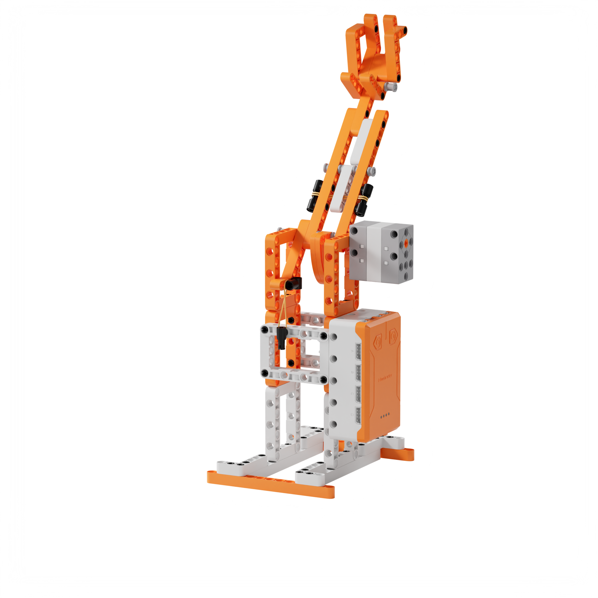
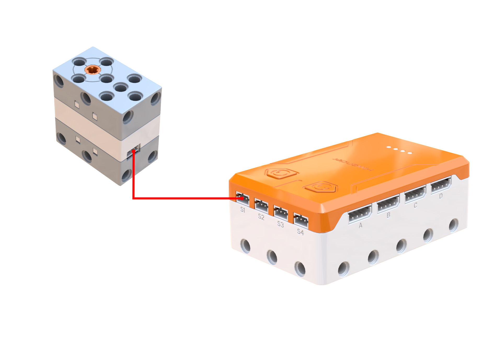
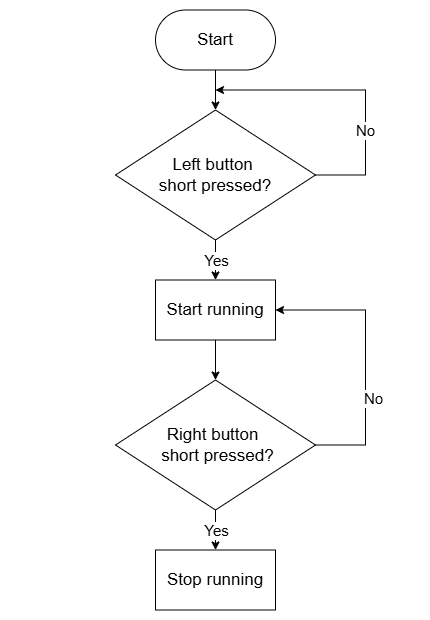
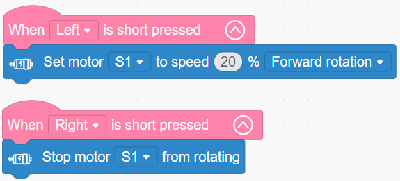

# 3.6 Motorized Catapult

## 3.6.1 Lesson Introduction

Drawing inspiration from ancient siege catapults, this lesson guides the construction of a motor-driven mechanical catapult. The lesson advances into lever principles governing effort arms and resistance arms. Driving the lever into reciprocating oscillations with a motor achieves continuous launching effects. Learners study button-controlled motor programming methods and modify motor rotation speed to adjust launch frequency. Focusing on third-class levers, also known as speed-multiplying levers, this lesson illustrates how levers magnify swinging amplitude while accumulating experience in building and debugging motorized mechanisms.

## 3.6.2 Learning Objectives

1. **Knowledge Objectives**: Master how effort arm to resistance arm ratios affect lever dynamics. Understand the amplitude magnification principle in speed-multiplying levers. Learn about kinetic and potential energy conversion. Reinforce motor programming control.

2. **Skill Objectives**: Complete the mechanical catapult assembly independently. Program motor control routines proficiently. Adjust motor speed parameters to modify launching pace and range.

3. **Thinking Objectives**: Build analytical thinking regarding lever proportions. Clarify the physical trade-off between force and motion. Develop systematic debugging habits to enhance engineering design thinking.

4. **Application Objectives**: Understand applications of speed-multiplying levers in catapults and sports equipment. Recognize practical values of lever principles to stimulate curiosity in mechanics and physics.

## 3.6.3 Preparation

### (1) Hardware Preparation

- AiBlock controller

- 360бу block motor

- Building block parts pack

- Type-C data cable

- Assembly manual

- Computer

### (2) Software Preparation

- WonderLab Graphical Programming Platform

## 3.6.4 Hands-On Project

### (1) Project Analysis

The core project for this lesson is a motor-driven mechanical catapult, which utilizes a third-class lever configuration. The motor drives the throwing arm in reciprocating swings, utilizing the motion at the lever tip to launch projectiles continuously. The program uses button inputs to start and stop the motor. Motor rotation speed dictates the oscillation frequency of the lever: higher speeds cause more frequent swings, increasing the number of launches completed per unit of time. Modifying motor speed parameters in the code demonstrates how motor speed alters operational firing frequency, providing direct insight into how program parameters control mechanical rhythm.

### (2) Assembly Guide

<Pdf src="../../_static/shared/pdf/chapter_3/6.pdf" />

### (3) Hardware Wiring

- Connect the 360бу block motor to port **S1** of the controller using a 3-pin servo cable.

### (4) Adding Extensions

- Select **360бу Motor** under the **Motion module** category.

### (5) Core Blocks

| Block | Category | Description |
| :---: | :---: | :--- |
|  |  | Triggers corresponding blocks when the button is short-pressed |
|  |  | Sets the operating speed and rotation direction of the designated motor |
|  |  | Stops the motor connected to the selected port |

### (6) Program Description and Upload

- Program Schematic

- Complete Program

  After powering on, short-pressing the left and right buttons acts as dual trigger conditions: short-pressing the left button sets motor S1 to rotate forward at 20% speed, while short-pressing the right button stops motor S1.

- Program Upload

  Following the animation, click **Connect device**, select the serial port, then click the upload button to upload the program to the controller and test the execution results.

> [!NOTE]
>
> **The source files are available for download under [Program Files](https://drive.google.com/drive/folders/1xyD_-3msc3KcaGQHLqkcPOZNSNXFIirT?usp=sharing).**

## 3.6.5 Expansion and Challenge

**Project 1: Automated Continuous Firing Catapult**

Design an automated continuous launch routine: the motor rotates forward for 2 s to prime the arm, reverses for 1 s to reset, pauses for 1 s to reload, and repeats the cycle continuously. This implements automated continuous launching with a single button press. Adding a counter variable tracks the total number of launches, reinforcing timed sequencing and automated looping concepts while simulating real multi-shot artillery.

**Project 2: Launch Frequency Comparison Experiment**

Maintaining a fixed placement distance, set various motor speeds and record the total number of launches achieved within 10 s. Compare the relationship between motor speed and launch frequency, build a "Speed vs. Launch Count" data table, and examine how programming parameters govern mechanical operating frequency.

## 3.6.6 Q&A

**Question 1: Which end is longer on the motorized catapult, the effort arm or the resistance arm? Why is it designed this way?**

Answer: The motorized catapult features a longer resistance arm and a shorter effort arm, forming a classic third-class lever. In lever mechanics, the section near the motor input is the effort arm, while the tip holding the projectile is the resistance arm. Designing a longer resistance arm magnifies the swinging amplitude at the tip, allowing the catapult arm to sweep through a wider arc for smooth and dependable launches. In this AiBlock catapult, motor speed primarily governs swinging frequency: faster speeds increase reciprocating strokes per unit of time, enabling rapid successive firing.

**Question 2: Both the catapult and the seesaw are levers, so how do they differ?**

Answer: While both employ lever physics, they differ in lever class, structural proportions, and functional intent. The seesaw is a first-class, equal-arm lever with the fulcrum in the exact center and equal arm lengths on both sides. It neither multiplies force nor speed, serving to balance loads and alternate vertical motion for interactive play. The motorized catapult is a third-class lever with its pivot situated closer to the motor input, yielding a short effort arm and a long resistance arm. It trades mechanical force advantage for magnified tip motion. Paired with continuous rotation from the 360бу block motor, the catapult sustains steady reciprocating launches with speed-regulated firing frequency, demonstrating how contrasting arm ratios accomplish distinct engineering functions.

## 3.6.7 Technical Support and Product Discussion

To share creative ideas and projects after exploring this kit, visit the Hiwonder Community:

