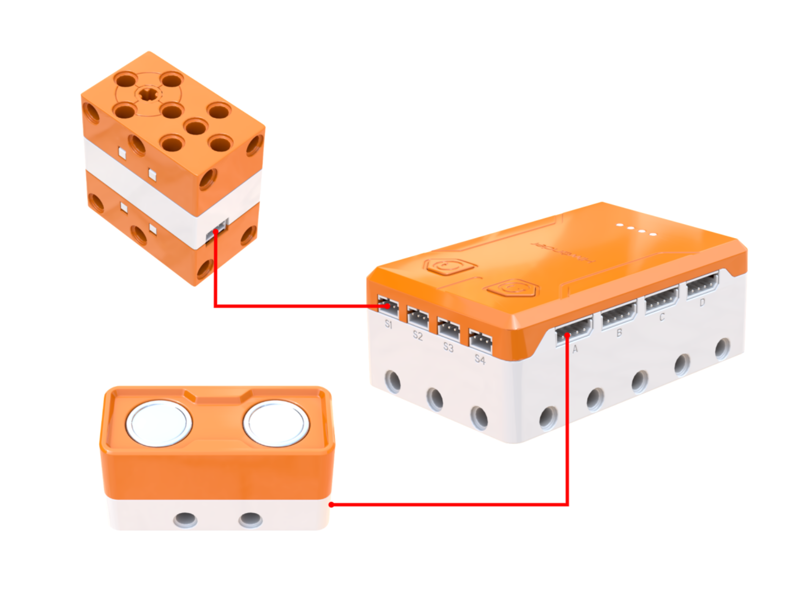
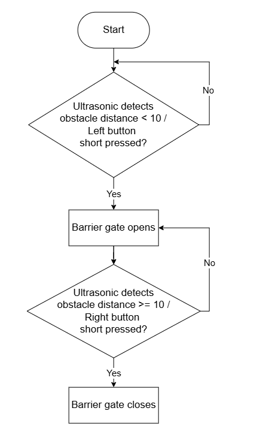
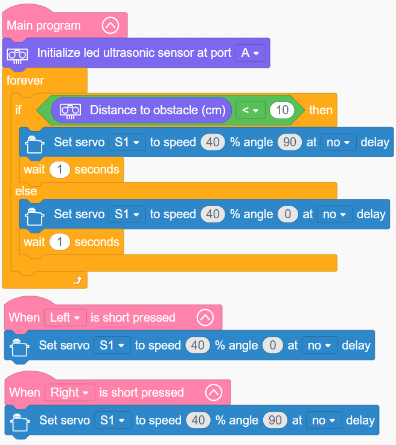

# 3.9 Gear Barrier Gate

## 3.9.1 Lesson Introduction

Modeled after residential barrier gates in daily life, this lesson guides the construction of an ultrasonic-sensing smart barrier gate. The lesson systematically explains gear transmission principles alongside the relationship between tooth count, rotational speed, and torque. Combining a servo with gear mechanisms to raise and lower the barrier arm, it covers button control and automatic proximity sensing through stepped hands-on tasks, helping learners integrate mechanical transmission with intelligent sensing.

## 3.9.2 Learning Objectives

1. **Knowledge Objectives**: Understand gear meshing transmission principles. Master how tooth count correlates with speed, torque, and rotational direction. Reinforce servo control and ultrasonic ranging programming skills.

2. **Skill Objectives**: Assemble the barrier gate structure and meshing gear train independently. Calibrate the initial home position of the mechanism. Program sensing-based opening routines. Debug gear mesh clearance properly.

3. **Thinking Objectives**: Build mechanical thinking centered on gear transmission. Understand power transmission and speed-variation logic. Strengthen intelligent closed-loop control thinking and hardware-software collaborative debugging skills.

4. **Application Objectives**: Recognize diverse gear transmission devices in daily life. Understand the essential role of gears in mechanical power transmission to stimulate curiosity about mechanical engineering.

## 3.9.3 Preparation

### (1) Hardware Preparation

- AiBlock controller

- 180бу block servo

- Ultrasonic sensor

- Building block parts pack

- Type-C data cable

- Assembly manual

- Computer

### (2) Software Preparation

- WonderLab Graphical Programming Platform

## 3.9.4 Hands-On Project

### (1) Project Analysis

The core project for this lesson is an ultrasonic smart gear barrier gate, creating an automated response that raises the arm when an object approaches and lowers it after departure. The system consists of two main parts: the mechanical subsystem transfers servo torque to the barrier arm through gear transmission, where a smaller driving gear meshes with a larger driven gear to achieve speed reduction and torque multiplication. The sensing subsystem detects distance with an ultrasonic sensor, commanding the servo to rotate to 90бу to raise the arm when the distance is under 10 cm, and returning to 0бу to lower the arm when the distance exceeds 10 cm. The program uses a combined "loop and dual-branch conditional" structure to demonstrate smart automation combining gear mechanics with sensor feedback.

### (2) Assembly Guide

<Pdf src="../../_static/shared/pdf/chapter_3/9.pdf" />

### (3) Hardware Wiring

- Connect the 180бу block servo to port **S1** of the controller using a 3-pin servo cable.

- Connect the ultrasonic sensor to port **A** of the controller using a 4-pin module cable.

### (4) Adding Extensions

- Select **Ultrasonic sensor** under the **Input Module** category.

- Select **180бу servo** under the **Motion module** category.

### (5) Core Blocks

| Block | Category | Description |
| :---: | :---: | :--- |
|  |  | Compares two values and returns a true or false result |
|  |  | Triggers corresponding blocks when the button is short-pressed |
|  |  | Rotates the specified servo to a target angle at a set speed |
|  |  | Obtains the obstacle distance detected by the ultrasonic sensor |

### (6) Program Description and Upload

- Program Schematic

- Complete Program

  1. When executing the main program after powering on, it first initializes the ultrasonic sensor on port A, then enters a continuous repeat loop to poll distance data in real time:

     * When obstacle distance is under 10 cm, servo S1 rotates without delay to 90бу at 40% speed, then waits 1 s.

     * When obstacle distance is greater than or equal to 10 cm, servo S1 rotates without delay to 0бу at 40% speed, then waits 1 s.

  2. Independent button control logic allows manually overriding the servo position:
     * Short-pressing the left button rotates servo S1 without delay to 0бу at 40% speed.
     
     * Short-pressing the right button rotates servo S1 without delay to 90бу at 40% speed.

- Program Upload

  Following the animation, click **Connect device**, select the serial port, then click the upload button to upload the program to the controller and test the execution results.

> [!NOTE]
>
> **The source files are available for download under [Program Files](https://drive.google.com/drive/folders/1xyD_-3msc3KcaGQHLqkcPOZNSNXFIirT?usp=sharing).**

## 3.9.5 Expansion and Challenge

**Project 1: Delayed Lowering Barrier Gate**

Optimize barrier logic: upon raising the gate after detecting an approaching vehicle, keep the arm open for 3 s before lowering, simulating real community barrier gates that wait for cars to clear completely before closing. Use a variable to track whether the arm has already been raised, avoiding redundant trigger cycles. Practice state retention and timed delays to make the barrier system more reliable and authentic.

**Project 2: Two-Way Counting Gate**

Add vehicle counting: increment a counter variable by 1 each time the gate opens to track total traffic volume. Utilize onboard RGB lights or the buzzer to issue audiovisual feedback upon each passage. This exercises variable arithmetic and multi-task programming, upgrading the simple barrier into an intelligent access gate with automated logging.

## 3.9.6 Q&A

**Question 1: What are the key characteristics of gear transmission? How do gears transfer mechanical power?**

Answer: Gear transmission features several defining principles. First is **positive meshing**: teeth of paired gears interlock securely, so when the driving gear rotates, its teeth push the teeth of the driven gear to transfer power directly without slipping. Second is **counter-rotation**: two meshing external gears rotate in opposite directions, with clockwise rotation on one producing counter-clockwise rotation on the other. Third is **speed and torque transformation by tooth ratio**: a small gear driving a large gear reduces speed while increasing torque, whereas a large gear driving a small gear increases speed while reducing torque. Fourth is **precise transmission ratio**: gear engagement prevents slip, maintaining exact rotational synchronization. This barrier gate uses a smaller gear to drive a larger gear, generating the mechanical torque necessary to lift the heavy barrier arm smoothly.

**Question 2: How does the automatic ultrasonic gate program operate? Why is a repeat loop required?**

Answer: The automated gate program follows a classic architecture: initialization, loop polling, conditional evaluation, and action execution. The program first initializes the ultrasonic sensor to prepare the hardware. It then enters a continuous repeat loop to evaluate conditions: if the distance is under 10 cm, indicating an approaching vehicle, the servo turns to 90бу to raise the gate. When distance exceeds 10 cm, the servo turns to 0бу to close the gate. Each movement includes a 1 s pause to prevent jitter and erratic toggling. A continuous repeat loop is essential because the gate must stand guard continuously and react at any moment. If evaluated only once, the program would terminate, missing subsequent vehicles. Running inside a loop checks sensor data multiple times every second, delivering real-time responsiveness characteristic of all automated sensing systems.

## 3.9.7 Technical Support and Product Discussion

To share creative ideas and projects after exploring this kit, visit the Hiwonder Community:

