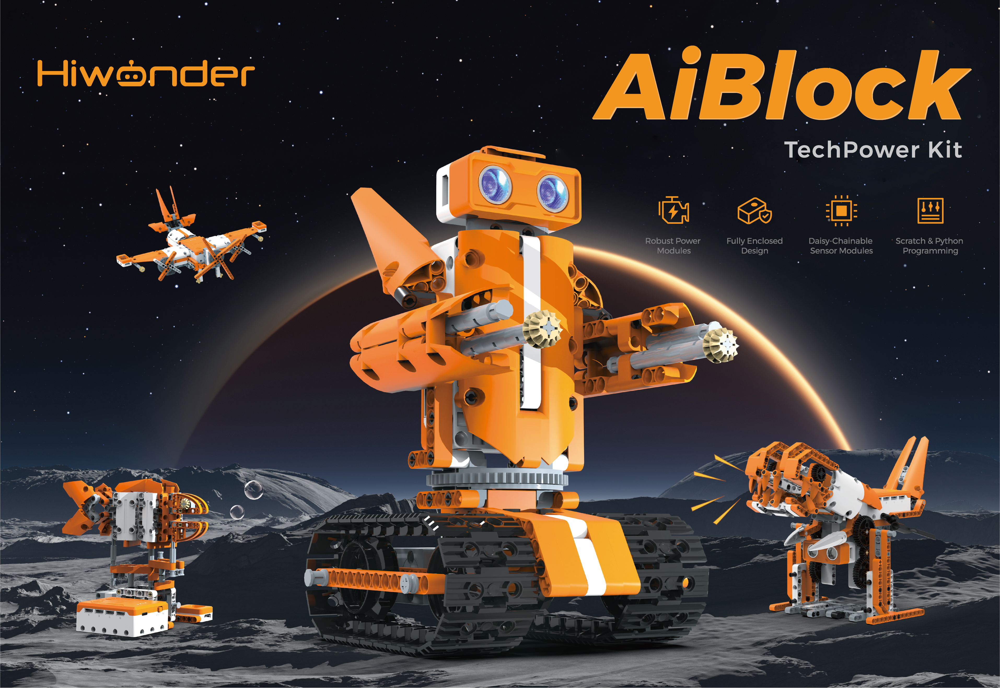
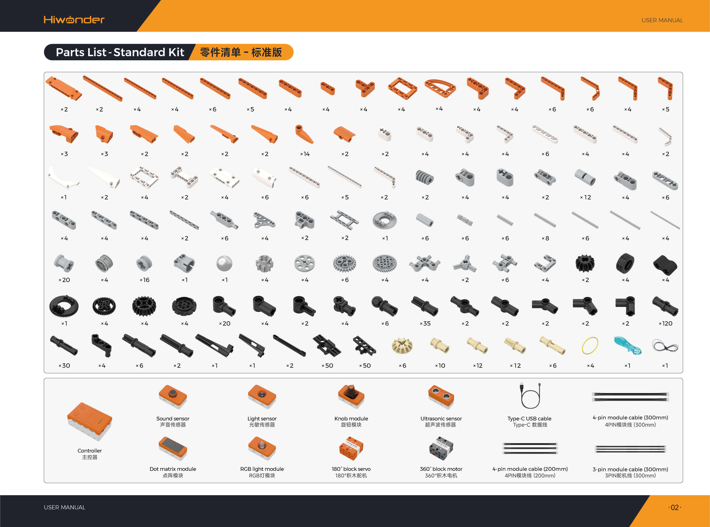

# 1. Standard Kit Introduction

## 1.1 Kit Overview

Designed specifically for elementary students aged 7 to 12, the AiBlock TechPower Standard Kit features an integrated intelligent controller as its hardware core. It comes equipped with multiple sensor modules, motorized actuators, servos, and a comprehensive set of mechanical building blocks. The kit supports dual learning modes consisting of non-controller mechanical assembly and intelligent graphical programming. It provides 32 progressive hands-on creative projects, paired with the WonderLab visual drag-and-drop programming platform. Project examples include diverse robotic builds such as the Sound-Activated Cradle, Sound & Light Desk Lamp, and Tracked Tank. Curriculum content covers gear power transmission principles, sensor detection and trigger logic, coordinated motor and servo actuation, and synchronized audiovisual feedback. Through hands-on building and program debugging, this kit cultivates spatial visualization, logical reasoning, engineering practice, and innovative thinking, delivering a systematic enlightenment in educational robotics.

## 1.2 Product Features

1. **Tiered Dual Learning Modes**: Supports non-controller mechanical assembly and controller-based intelligent programming. Beginners can first master mechanical structure assembly, and then advance to visual programming. This lowers the entry barrier to STEAM education while accommodating classroom instruction and independent home practice.

2. **Multi-Functional Integrated Controller**: The all-in-one smart controller provides isolated interface zones to connect block servos, block motors, long motors, and various sensors. Featuring an onboard buzzer and programmable buttons, the controller delivers clearly marked ports and stable power output, ensuring precise and reliable management across all external hardware peripherals.

3. **Comprehensive Mechanical Block Accessories**: Packed with an ample supply of structural and transmission building blocks, supporting classic mechanisms such as gear trains, crank linkages, track drives, and worm gears. These components allow assembling all 32 official robotic builds while encouraging open-ended custom structural design, honing hands-on skills and mechanical intuition.

4. **Dedicated Graphical Programming Software**: Employs simple drag-and-drop visual programming without requiring complex written syntax. Supporting real-time online debugging and program uploading, it includes complete pre-built programs for all 32 curriculum lessons. This lowers the barrier to coding, fostering computational thinking and algorithmic control skills through practical application.

5. **Multi-Sensor Fusion and Interaction**: Equipped with diverse sensors including ultrasonic, light, sound, and knob modules, enabling sound-triggered activation, light sensing, obstacle distance measurement, and knob-based speed modulation. The curriculum begins with single-sensor control and progressively advances to multi-sensor coordinated decision-making, helping learners grasp the complete perception-to-response logic of intelligent hardware.

6. **Multi-Actuator Coordinated Control**: Incorporates output components including DC motors, servos, RGB lights, dot matrix displays, and buzzers. It supports motor speed regulation, servo angular positioning, RGB color switching, dot matrix animations, and audio alerts. Synchronizing mechanical motion with lighting effects and sound cues enhances model expressiveness and interactive engagement.

## 1.3 Product Specifications

| Item | Specification |
| :--- | :--- |
| Brand | Hiwonder |
| Model | AiBlock TechPower Standard Kit |
| Programming software | WonderLab Graphical Programming / Hiwonder Python Editor |
| Recommended age | 6+ |
| Electronic modules | Ultrasonic sensor, light sensor, sound sensor, knob module, 180° block servo, 360° block motor, dot matrix module, RGB light module |
| Communication port | USB port |
| Block count | 750+ |
| Material | ABS |
| Weight including packaging | 2.1 kg |
| Package dimensions | 365 × 270 × 120 mm |

## 1.4 Packing List

